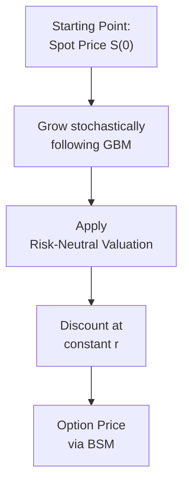

## Overview

The Black–Scholes–Merton (BSM) model changed everything in the options world. Before the model’s publication in the early 1970s, practitioners relied on a patchwork of trial-and-error, intuition, and partial equilibrium frameworks for pricing. But eventually, Fischer Black, Myron Scholes, and Robert Merton demonstrated how to systematically—and mathematically—value options under certain simplifying assumptions. Now, if you’ve ever traded options or even just thought about using them in a portfolio, you’ve probably encountered the BSM formula or some version of it.

In a nutshell, the BSM model provides a theoretical fair value for a European-style option written on a non-dividend-paying stock. Its derivation uses a clever “risk-neutral” approach, a bunch of calculus, and (surprise, surprise) a set of critical assumptions. Understanding those assumptions is a big deal. Even at a capstone CFA level, we still come back to the question: “How do these assumptions shape real-world pricing, and where do real markets deviate?”

In this section, we’ll run through the BSM assumptions, why they matter, and how acknowledging them can sharpen your sense of model applicability, hedging approaches, and exam readiness. The BSM model isn’t perfect. It can’t be, because markets are complicated beasts. But as you’ll see, it remains the cornerstone for more advanced frameworks that handle everything from stochastic volatility to jump processes.

## Key Assumptions of the BSM Model

### Frictionless Markets and Continuous Trading

The first assumption basically says, “We can trade any time with no transaction costs and no bid-ask spreads.” In other words, we can continuously rebalance our hedges and replicating portfolios without incurring fees or taxes. 

• No transaction costs: This means no brokerage fee, no market impact, and no friction associated with each buy or sell.  
• No bid-ask spreads: You always trade at the “fair price,” so to speak.  
• Unlimited continuous trading: You’re allowed to trade at all times—think high-frequency trading on perpetual autopilot, but with no slippage or liquidity constraints.  

Obviously, real markets have evolved since 1973, and transaction costs have come down a lot. Even so, they’re not exactly zero. Back in my early days (ah, the late 1990s), I once tried “rapid-fire” rebalancing in a small options account—just for the thrill of it—and found that commissions ate a surprising chunk of my gains. No model had warned me properly. So keep that in mind.

### The Underlying Follows Geometric Brownian Motion

Next, the BSM model demands that the underlying asset price (here, the stock) follows a geometric Brownian motion (GBM) with a constant drift and volatility. In more technical terms, we assume:

(1) The stock price St evolves according to  
dSt = μ St dt + σ St dWt,  
where μ is the drift (expected return of the stock), σ is the volatility, and Wt is a standard Brownian motion.

(2) Log-returns (ln(St+1 / St)) are normally distributed.  
(3) The volatility parameter (σ) is constant over the option’s entire life.  

This construction is immensely powerful because it produces lognormal price distributions. But does real life always match a lognormal path with constant σ? Probably not—“volatility clustering” and “jumps” (like on major news events) are well-documented. That’s why you sometimes see skew or smile patterns in implied vol surfaces.

### Constant Risk-Free Rate

Another assumption is that the risk-free rate r is constant over the life of the option. The BSM formula essentially uses e^(-rT) as the discount factor for the final payoff, which implies you can either borrow or lend at a stable, unvarying interest rate. We pretend that short-term T-bill yields, repo rates, or central bank rates never shift for the duration. 

In reality, the term structure of interest rates changes daily—sometimes intraday—and this can matter for longer-dated options. From a theoretical standpoint, if rates vary, you can still calibrate or adapt the model with a time-dependent discount function. But for a baseline exam question, you typically assume a single “flat” risk-free rate.

### No Dividends or Other Distributions

In its simplest form, the BSM model is built for European calls and puts on a stock that does not pay dividends. Once a stock pays a dividend, that changes the expected path of the underlying. The share price typically drops by the amount of the dividend on ex-dividend dates, so an unadjusted BSM formula would misprice calls (and puts) if it ignores that. 

Of course, there is a well-known adjustment for discrete dividends (or a continuous dividend yield, q). Many real-world references give you the BSM formula adjusted for q, basically discounting the stock price at rate q. But if a question states “no dividends,” you can forget about ex-dividend date complexities.

### Unlimited Borrowing and Lending at the Risk-Free Rate

Ever tried to borrow a large sum in real life? Yeah, banks don’t always offer unlimited lines of credit, especially not at a tiny risk-free rate. But academically, the BSM model demands that we can borrow (and lend) unlimited amounts of capital at the risk-free rate. 

This assumption is essential to constructing the “perfect hedge” or replicating portfolio that underpins the option’s fair value argument. If you can’t borrow or lend freely, or your interest rate is higher than the risk-free rate, then your replication strategy might not fully hold.

### Unlimited Short Selling with No Costs

Short selling the underlying asset is crucial for building the replicating portfolio for certain option positions. In the BSM framework, you can short shares without constraints (no margin requirements, no locate demands, no borrow costs). 

That’s obviously not how modern capital markets operate. Short locating can be tricky, fees can be high (particularly in illiquid or “hard-to-borrow” stocks), and margin regulation definitely places constraints. Nonetheless, for theoretical replication, we suppose none of these issues exists.

## Why These Assumptions Matter

In advanced option pricing, we rely on a principle called “no-arbitrage.” Essentially, if you can replicate the payoff of an option by trading the underlying asset and risk-free bonds, then the value of that option must match the cost of creating its replicating portfolio—otherwise, you can do an arbitrage. The BSM formula emerges from systematically applying that logic, but only after the above assumptions are baked into the mathematics.

The frictionless market assumption is key because if you had transaction costs, that’d erode your profits (or add cost) each time you rebalance. The entire replication argument rests on the idea that you can perfectly hedge an infinitesimal delta in the option with an offsetting position in the underlying—rebalanced continuously over the option’s life. Incidentally, “continuous rebalancing” is a theoretical ideal. In real markets, you typically can’t rebalance absolutely continuously, but you do it “frequently enough” for the strategy to approximate the model.

The assumption that volatility is constant (a direct outgrowth of the GBM approach) is the main reason the implied volatility surface is “flat” in the simplest BSM world. But in the real market, implied vol often differs by strike (smile or skew) and time to maturity (term structure). That’s partly a reflection that the BSM model’s constant volatility assumption doesn’t describe actual price dynamics of the underlying.

## Real-World Deviations and the Volatility Smirk

Given that actual markets violate many of the BSM assumptions, especially constant σ and frictionless trading, you often see price behaviors that the standard BSM formula can’t fully explain:

• Volatility Smiles and Skews. Empirical evidence shows that out-of-the-money puts on equity indexes tend to reflect higher implied volatilities, indicating bigger perceived tail risk than the lognormal assumption.  
• Transaction Costs and Bid-Ask Spreads. Traders might not be able to perfectly hedge or arbitrage small mispricings.  
• Dividend Effects. Real underlying assets often pay dividends, which can reduce call option prices (since the stock’s forward price is effectively lower once you factor in the dividend payout).  
• Interest Rate Fluctuations. Over multi-year horizons, ignoring changes in the risk-free rate can affect forward pricing and option valuations.  

Despite these snags, the BSM model still dominates as the starting point. Whether you see a hedge fund or a high-level portfolio manager at a bank, they rarely throw BSM out altogether. They just calibrate or modify it to handle reality better—via local volatility functions, jump-diffusion models, or even advanced frameworks like Heston (stochastic volatility).

## Extensions to the BSM Framework

A few well-known variations (or “next-generation” models) address the main BSM oversights:

• Black’s Model. Handles interest rate options and can incorporate forward-based references.  
• Dividend Yield Models. Adjust for continuous dividend yield or discrete dividends (like the adjustments used in equity index options).  
• Stochastic Volatility Models (e.g., Heston). Remove the assumption that σ is constant by letting volatility itself follow a stochastic process.  
• Jump-Diffusion Models (e.g., Merton’s Jump-Diffusion). Add jumps to the price process, capturing sudden, large moves.  
• Local Volatility Models (Dupire). Assume volatility is a deterministic function of time and price, capturing implied volatility smiles.  

For the CFA exam, you might only need to know that these extensions exist and that standard BSM is not set in stone when it comes to actual trading. However, exam questions often revolve around using the plain BSM formula, identifying assumptions, and explaining which assumption might break. So if you’re aiming for a top score, keep these variations in mind.

## Diagram: Simple View of BSM Dynamics

Below is a simplified flowchart illustrating the skeleton of the BSM approach—from the underlying stock’s geometric Brownian motion to the final option pricing output.



This diagram intentionally strips away real-world complexities (e.g., transaction cost frictions, short-selling constraints, etc.). But it offers a visual peek at how the model sees the world.

## Practical Example in Python

Even though the CFA exam typically doesn’t require coding, it’s helpful to see how a standard BSM call price might be computed. Below is a concise Python snippet using the common BSM formula:

```python
import math
from math import log, sqrt, exp
from scipy.stats import norm

def bsm_call_price(S, K, r, sigma, T):
    """
    Computes the Black-Scholes-Merton price of a European call.
    S: Current stock price
    K: Strike price
    r: Risk-free rate (constant)
    sigma: Volatility (constant)
    T: Time to maturity (in years)
    """
    d1 = (log(S/K) + (r + 0.5*sigma**2)*T) / (sigma*sqrt(T))
    d2 = d1 - sigma*sqrt(T)
    call_price = S*norm.cdf(d1) - K*exp(-r*T)*norm.cdf(d2)
    return call_price

if __name__ == "__main__":
    call_val = bsm_call_price(S=100, K=100, r=0.05, sigma=0.2, T=1)
    print("Example BSM Call Price:", round(call_val, 2))
```

We see several assumptions right there: a constant r, constant σ, and no mention of dividends. If you run it, you’ll get a single “fair value” for the call. In real life, implied volatility can vary with strikes and maturities, so you might “back-solve” for sigma from the option’s market price. That’s the famous “implied volatility” concept.

## Regulatory and Professional Standards Context

From a regulatory standpoint, IFRS (International Financial Reporting Standards) or US GAAP typically require that derivatives (including many types of options) be reported at fair value on the balance sheet. In IFRS 2, for instance, share-based payments might be measured using option pricing models—often a BSM variant. Organizations subject to these standards need a recognized, systematic approach to valuation, so BSM serves as a standard reference point. 

Additionally, the CFA Institute Code and Standards encourages “adequate diligence” in selecting and applying valuation methods, emphasizing the importance of clearly explaining assumptions to clients or stakeholders. Using a BSM approach without acknowledging potential limitations could lead to misaligned expectations. So best practice is to disclose model weaknesses—like ignoring dividends or transaction costs—and show possible sensitivity analyses.

## Common Pitfalls for Exam Takers

• Mixing Up Variables: Confusing discrete compounding with the continuous discount factor e^(-rT).  
• Forgetting Dividends: If a question states a dividend yield, you can’t just apply the standard BSM formula.  
• Overcomplicating “Constant” Volatility: The exam might simply say “sigma is 20%”—just proceed; no need to tweak or guess volatility skew.  
• Using American vs. European. BSM is strictly for European-style options. If the question is about American-style, watch out for potential early exercise (especially with dividends).  
• Sign Errors in d1 and d2: The formula’s sign matters. A small mistake can lead you to the wrong final number.

## Exam Tips and Tricks

1. Memorize the BSM Formula Components: Make sure you know the definitions of d1 and d2, plus how S, K, r, σ, T, and the cumulative distribution function interact. You never know when they might throw a quick “plug-and-chug” question your way.  
2. Understand the “No-Arbitrage” Story: The theoretical intuition behind BSM can be tested in essay form. Be ready to explain how a replicating portfolio is formed.  
3. Keep an Eye on Dividends: If the problem says the stock pays a dividend for sure, that’s a direct red flag that you may need an adjustment.  
4. Realize the Difference between Theoretical and Real Pricing: If a question asks “Which assumption does the BSM model violate in real-world markets?” you can pick from short-sale constraints, transaction costs, or non-constant volatility.  
5. Time Management: Don’t burn too much time on complex calculations if you can identify the concept. The exam often rewards conceptual clarity as much as numeric precision.

## Conclusion

The Black–Scholes–Merton model is a timeless beacon in the world of option pricing. Knowing its assumptions isn’t just about memorizing bullet points for the exam—it’s understanding why the model works in a frictionless, continuous environment and how real markets inevitably deviate. By studying these assumptions, you’ll gain an appreciation for both the elegance and the limitations of the BSM formula. Yes, real markets have complexities like discrete dividends, varying interest rates, and transaction costs, but BSM remains the foundation upon which advanced models are built.

In your career (and especially as you prepare for the CFA exams), you’ll likely reference BSM or an adapted form at some point. Experience from the field—trust me on this—teaches you that no model is perfect. But BSM still gives a baseline for pricing and a shared language for discussing volatility, risk, and payoff structures. As you move on, keep an eye open for ways that real world differs from theoretical markets, but also appreciate the mathematical clarity that Black, Scholes, and Merton brought to finance.

## References and Further Reading

• Black, Fischer, and Scholes, Myron. “The Pricing of Options and Corporate Liabilities.” Journal of Political Economy, 1973.  
• Merton, Robert C. “Theory of Rational Option Pricing.” The Bell Journal of Economics, 1973.  
• Hull, John C. “Options, Futures, and Other Derivatives.”  
• IFRS 2: Share-Based Payment.  
• CFA Institute Program Curriculum: Derivatives and Risk Management.

---------

## Sample Exam Questions on Black–Scholes–Merton Model Assumptions



### Which assumption is central to continuous hedging in the Black–Scholes–Merton framework?

- [ ] Market prices incorporate transaction costs 
- [x] There are no transaction costs and trading is frictionless
- [ ] The underlying asset pays discrete dividends 
- [ ] The risk-free rate is stochastic

> **Explanation:** Continuous hedging in the BSM model requires indiscriminate, frictionless trading—meaning no transaction costs and no bid-ask spreads—so the hedging portfolio can be continuously rebalanced at no cost.


### According to the standard Black–Scholes–Merton model, which of the following best describes the underlying asset price process?

- [ ] A random walk with drift and constant volatility in absolute terms
- [x] A geometric Brownian motion with constant drift and volatility
- [ ] A jump-diffusion process reflecting sudden price jumps
- [ ] A process with volatility that adapts to the VIX index

> **Explanation:** The BSM model assumes the asset price follows geometric Brownian motion, implying lognormal price distributions and constant volatility. Jump processes and dynamic volatility are outside the basic BSM scope.


### In the classic (original) BSM setting, what does the model assume about dividends?

- [ ] All stocks pay a continuous dividend yield
- [ ] Dividends are paid but not at predictable levels
- [ ] Dividends are distributed semiannually
- [x] No dividends are paid during the life of the option

> **Explanation:** The original BSM formulation applies to European-style options on non-dividend-paying stocks. Including dividends requires an adjustment to the standard formula.


### Which of the following is a direct implication of the unlimited short-sale assumption in the BSM model?

- [x] Investors can replicate certain option payoffs by going short the underlying without constraints
- [ ] Investors face margin requirements that prevent short positions
- [ ] Investors must pay a fee for borrowing the stock
- [ ] Investors can short but only up to a certain capital ratio

> **Explanation:** The BSM model assumes no constraints or additional costs on short selling, so it’s theoretically possible to replicate key payoffs by shorting the underlying asset at will.


### Which of the following is NOT an assumption underlying the risk-neutral valuation in the BSM framework?

- [ ] The risk-free rate is constant
- [ ] The stock price follows a lognormal process
- [x] Interest rates are derived from a term structure with volatility
- [ ] Trading is frictionless

> **Explanation:** Risk-neutral valuation in the basic BSM model hinges on constant risk-free rates, lognormal price processes, and frictionless markets. A volatile term structure falls outside the standard BSM assumptions.


### In which scenario is the BSM model least likely to hold perfectly?

- [ ] A short-term at-the-money European call option on a highly liquid, non-dividend-paying stock
- [x] A long-term at-the-money call on a stock with uncertain dividend policies and frequent transaction costs
- [ ] A short-term at-the-money put on a stock with constant volatility
- [ ] A short-dated currency option with stable interest rates

> **Explanation:** The BSM model degrades quickly when dividends are uncertain, transaction costs are high, or the option is long-dated and subject to significant changes in volatility or interest rates.


### Which assumption under BSM directly relates to ignoring the impact of taxes and fees on each trade?

- [ ] Unlimited ability to trade short
- [ ] Constant volatility
- [x] Frictionless markets
- [ ] No dividends

> **Explanation:** The frictionless market assumption means trading is done without transaction costs, spreads, or taxes, allowing unlimited rebalancing.


### How would lifting the “constant volatility” assumption likely change option prices under real market conditions?

- [x] It would produce a more accurate implied volatility surface and capture skew effects
- [ ] It would invalidate all forms of delta-hedging
- [ ] It has no impact on standard no-arbitrage arguments
- [ ] It is irrelevant since volatility is always observed to be constant

> **Explanation:** In practice, volatility is not truly constant. Accounting for stochastic or local volatility helps align model prices with observed market skews/smiles.


### What is a common method to adapt the BSM formula for dividend-paying stocks?

- [ ] Use a variable risk-free rate
- [ ] Add a jump term to the stochastic process
- [x] Incorporate a continuous dividend yield or discrete dividend adjustment
- [ ] Treat dividends as if they were zero and adjust the strike

> **Explanation:** A standard adaptation is to subtract the present value of expected dividends from the stock price or to use a continuous dividend yield term (q) in the BSM formula.


### True or False: Hedging an option under the BSM model in actual markets is seamless because short sales and continuous rebalancing are always feasible.

- [x] True
- [ ] False

> **Explanation:** This statement is actually “False” in reality, but the BSM assumption calls it “True” within the model’s theoretical context. Real markets rarely allow cost-free continuous rebalancing or unconstrained short selling. However, as an assumption in the idealized BSM framework, you can do so freely.


