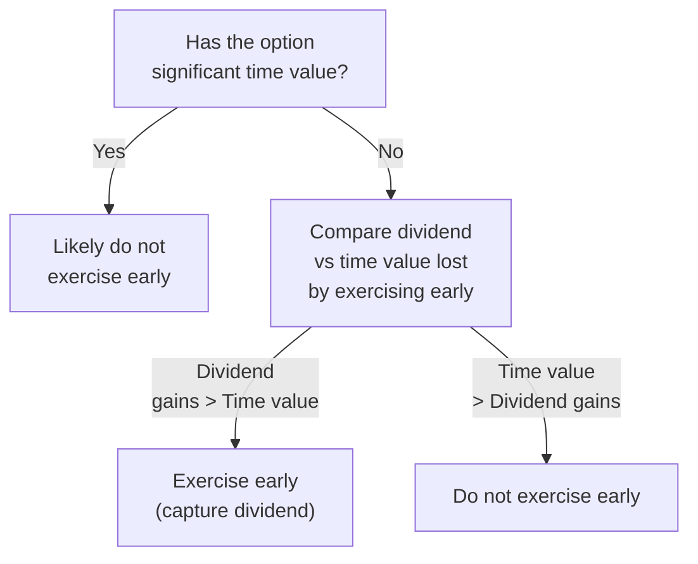

## Introduction

Let’s talk about something that, in my experience, often surprises folks when first learning about options: dividends. You might be tempted to think dividends are just a nice little bonus for stockholders, but oh man, do they have a real impact on option pricing. The presence of dividends affects both the theory and the practice of valuing calls and puts—and can even influence whether certain American call options are exercised early. We’ll look at the main concepts, from discrete-dividend adjustments all the way to continuous dividend yields. By the end, I hope you’ll see just why dividends need special attention in an option valuation framework.

## Impact of Dividends on Calls and Puts

First, a quick recap: when a company declares a dividend, shares that are purchased before the ex-dividend date come with the right to receive that dividend (known as cum-dividend). Starting on the ex-dividend date, the buyer of the stock no longer has that entitlement, meaning the stock is said to trade ex-dividend, and the share price typically drops by roughly the amount of the dividend.

For call holders, this drop in the underlying’s price is not a good thing—it often reduces the call’s value because a lower stock price makes the option less valuable. On the flip side, put options can become more attractive if the underlying’s price declines. In other words, dividends can tilt the relative advantage between calls and puts in a way that you won’t see for non-dividend-paying stocks.

Here’s a quick timeline of a stock transitioning from cum-dividend to ex-dividend status:

```mermaid
sequenceDiagram
A["Stock trades <br/> cum-dividend"] ->> B["Ex-dividend date <br/> Price drops by dividend amount"];
B->>C["Stock trades <br/> ex-dividend"];
```

## Approaches to Modeling Dividends

### Discrete Dividend Approach

In many practical settings, you’ll hear about discrete dividends—basically, a known cash payment on a specific date. For example, a firm might reliably announce a $1 per share dividend every quarter. While modeling steps vary, one intuitive approach is to adjust the underlying price by the present value of the known dividends. Another approach is to treat each expected dividend as a distinct cash flow and build that into your option valuation method.

• Stock Price Adjustment: One simplified method is to reduce S₀ (the current price) by the present value of the summation of all future expected dividend payments. This sometimes appears in a forward-pricing approach for short-dated options where you can say:

S₀* = S₀ – Present Value of All Dividends

Then use S₀* in a standard pricing formula (like the one-period Binomial approach). However, this approach usually works best if the dividends to be paid within the option’s life are small or if there’s only one known payment.

• Dividend as a Cash Flow: For more precise modeling—particularly in multi-period binomial trees—you explicitly reflect each dividend in the stock price path. Whenever the stock hits that ex-dividend date node, you reduce the stock price by the exact dividend amount, and then continue building out the tree. This way, your model captures the effect of each dividend on the stock’s subsequent possible price movements.

### Continuous Dividend Yield (q) Approach

Sometimes, especially when dealing with stocks that pay dividends more or less evenly throughout the year or for convenience in mathematical modeling, professionals assume a continuous dividend yield (q). In that scenario, the Black–Scholes–Merton (BSM) formula is adapted to:

(1) discount the stock price by a factor e<sup>–qT</sup> in the option price formula, and  
(2) adjust the drift term from r to (r – q) in the exponents.  

Under these assumptions, the call option price can be written in risk-neutral valuation as:


C = S_0 e^{-qT} \Phi(d_1) - K e^{-rT} \Phi(d_2),


where


d_1 = \frac{\ln\left(\frac{S_0}{K}\right) + \left(r - q + \frac{\sigma^2}{2}\right)T}{\sigma \sqrt{T}},
\quad
d_2 = d_1 - \sigma \sqrt{T},


• S<sub>0</sub> is the current stock price,  
• K is the strike price,  
• r is the risk-free rate,  
• q is the continuous dividend yield,  
• T is time to maturity (in years),  
• σ is volatility of the underlying stock,  
• Φ is the cumulative distribution function for a standard normal distribution.  

In practice, you might estimate q using historical dividend yields or management guidance on expected payouts for the next year. If the stock’s dividend policy is relatively stable, this can be a decent approximation.

## Early Exercise Considerations for American Calls

I can’t tell you how many times folks overlook the possibility of early exercise for American call options on dividend-paying stocks. For standard non-dividend-paying stocks, we know that early exercise of a call is rarely optimal (because the call retains time value). But once dividends enter the picture, an early exercise might become worthwhile right before the ex-dividend date—particularly if the dividend is large enough to exceed the remaining time value of the option.

In practice, an investor does a quick cost–benefit analysis: if I exercise now (before ex-dividend), I’ll get the dividend, but I’ll lose whatever time value remains. If the dividend is substantial, the investor might come out ahead by exercising early. That means calls on large-dividend stocks (like some utility companies or REITs) are more likely to be exercised early than calls on zero-dividend or low-dividend payers. This is unique to American (or sometimes Bermudan-style) options; European-style calls can’t be exercised early, so no advantage is gained in that scenario.

## Role of Dividend Forecasting

In all seriousness, the biggest headache for practitioners can be forecasting dividends accurately. For stable, blue-chip companies, it might be straightforward to project the next couple quarters of dividends. But for firms with volatile earnings and unpredictable payout ratios—say, cyclical or growth-focused firms—estimating next quarter’s dividend distribution can be tricky.

• Uncertainty in discrete dividends can cause overpriced or underpriced options if the market’s consensus differs from your dividend forecast.  
• Shifts in policy—like a management decision to raise or cut dividends—scramble the usual assumptions.  

In short, forecasting dividends well can lead to more accurate option valuations, but if these forecasts are off, you can see some mispricing or unusual market moves.

## Simplified Case Study

Think about a stock currently trading at $50. Remember, I once had a friend who said, “Wait, I get a dividend and an option payoff too?” Yes, but to see how they tie together, let’s imagine the stock is set to pay a $1 dividend in two months, and the stock’s annualized volatility is 20%. Suppose the risk-free rate is 3% p.a., and we’re considering a three-month call option at a strike of $50.

• If we treat the dividend as continuous, say q = 2% annualized, we’d plug that into the BSM formula.  
• If we treat the $1 dividend as a discrete known amount, we’d discount that $1 over two months to get around, say, $0.995. Then we might reduce the current stock price by that present value in the model.

One approach might yield a small difference from the other, but both are commonly seen in practice. The “best” method is whichever more accurately captures the true pattern of payouts for this specific issuer.

## Potential Pitfalls and Best Practices

• Overlooking Early Exercise: Don’t forget to evaluate whether or not it’s optimal to exercise an American call prior to its expiration.  
• Inconsistent Dividend Estimates: If your dividend forecasts differ from the market’s, you might systematically misprice your options. That’s not necessarily bad if you have superior information—but watch out, you might also be simply wrong.  
• Overcomplicating Continuous Yields: Continuous yield is mathematically neat, but actual dividends can be lumpy in reality. Use it when it fits an index or large, stable stock with many discrete but frequent dividends.  
• Timing Mismatch: A single ex-dividend date that occurs just before your option’s expiry can matter a lot more than a handful of small dividends scattered over the year.

## Diagram of Early Exercise Decision Factors

Below is a simple flow showing the logic an investor might apply when deciding whether to exercise an American call early right before an ex-dividend date:



## Practical Tips for Exam Situations

• When you see a question referencing a stock with an anticipated dividend, remember to either subtract the present value of that dividend from the underlying price or incorporate a dividend yield term if you’re applying the Black–Scholes approach.  
• For American calls in exam questions: if the exam vignette highlights a large dividend ex-date coming up, that’s a hint you should consider whether early exercise is beneficial.  
• Always check for consistency with put–call parity. Dividend adjustments shift put–call parity relationships in subtle ways.  

## Example Formulas

For quick reference, here’s the typical put–call parity relationship (for European options) in continuous-dividend form:


C_0 - P_0 = S_0 e^{-qT} - K e^{-rT}.


If the underlying pays discrete dividends \\( D_1, D_2, \dots, D_n \\) at times \\( t_1, t_2, \dots, t_n \\) before expiration \\(T\\), then you can write the parity as something like:


C_0 - P_0 = S_0 - \sum_{i=1}^{n} e^{-r t_i} D_i \; - K e^{-rT},


assuming all those dividend payments occur prior to expiration. Of course, for American options, the relationship becomes more nuanced because of the early exercise feature.

## Mini Python Snippet (for Quick BSM with Continuous Dividend Yield)

Here’s a short piece of code you might use if you want to do a quick risk-neutral valuation with a continuous dividend yield:

```python
import math
from math import log, sqrt, exp
from statistics import NormalDist

def bsm_call_price(S0, K, r, q, sigma, T):
    """
    Computes Black-Scholes-Merton call price with continuous dividend yield q.
    """
    d1 = (math.log(S0/K) + (r - q + 0.5*sigma**2)*T) / (sigma*math.sqrt(T))
    d2 = d1 - sigma*math.sqrt(T)
    phi = NormalDist(mu=0.0, sigma=1.0)
    C = S0 * exp(-q*T) * phi.cdf(d1) - K * exp(-r*T) * phi.cdf(d2)
    return C

call_value = bsm_call_price(S0=100, K=100, r=0.03, q=0.02, sigma=0.25, T=1)
print(f"Call Value with continuous dividend yield: {call_value:.2f}")
```

It’s obviously a simplistic, direct approach—but you get the idea.

## References

• Wilmott, Paul. “Paul Wilmott on Quantitative Finance.” Wiley.  
• Haug, Espen Gaarder. “The Complete Guide to Option Pricing Formulas.”  
• CFA Institute Publications on Dividend Adjusted Option Pricing.  

## Test Your Knowledge: Dividends in Option Pricing



### A call option is written on a stock paying a known discrete dividend during the life of the option. Which of the following is most accurate regarding early exercise of an American call?

- [ ] Early exercise is never optimal because the option retains time value.
- [x] Early exercise may be optimal just before the ex-dividend date if the dividend exceeds the call’s remaining time value.
- [ ] Early exercise always occurs to capture the dividend.
- [ ] Early exercise is irrelevant for American calls on dividend-paying stocks.

> **Explanation:** When a stock pays a dividend, it may be advantageous to exercise early if the dividend to be gained exceeds the lost time value.

### In a discrete dividend valuation approach, which statement properly reflects the standard adjustment in a single-period binomial model?

- [x] Subtract the present value of the dividend from the initial stock price before building the tree.
- [ ] Subtract the actual dividend at expiration.
- [ ] Add the present value of the dividend to the stock price at each node.
- [ ] Multiply the strike price by the dividend yield.

> **Explanation:** For a discrete dividend in a short life option, a common approach is to subtract the discounted dividend from the initial price before setting up the binomial tree.

### Under the continuous dividend yield assumption for the Black–Scholes–Merton model, how is the underlying’s price treated in the solution?

- [ ] It is not adjusted for dividends.
- [ ] It is multiplied by e^(qT).
- [x] It is discounted by the factor e^(-qT).
- [ ] It is fully replaced by the sum of discounted dividends.

> **Explanation:** When assuming a continuous dividend yield q, the stock price is effectively reduced by e^(-qT) in the formula.

### Which factor tends to boost the value of a put option relative to a call option?

- [ ] Lack of dividends.
- [ ] Low interest rates.
- [ ] High strike prices only.
- [x] Dividend payments that reduce the underlying’s price.

> **Explanation:** Dividend payments reduce the underlying’s price, favoring put holders over call holders.

### If an investor’s primary concern is capturing a large dividend, which of the following is generally true?

- [x] Early exercise could be logical for an American call if the dividend exceeds the remaining time value.
- [ ] Early exercise is logical for a European call.
- [x] Dividends do not matter if the option is deeply in or out of the money.
- [ ] Dividends make early exercise likely for puts.

> **Explanation:** Large dividends can justify early exercise for American calls, but not for European calls. However, if an option is very deep in/out of the money, the time value might be negligible, making dividends the deciding factor.

### Which of the following is a common practical issue when modeling discrete dividends?

- [x] Forecasting uncertainty may lead to mispricing if actual payouts differ from expectations.
- [ ] Continuous dividend yield is always more accurate.
- [ ] Dividends are irrelevant to the stock price path.
- [ ] Dividend policy changes never occur mid-year.

> **Explanation:** Forecasting discrete dividends is often challenging, especially if companies unexpectedly alter payouts.

### In put–call parity for a stock paying discrete dividends over the option’s life, which term appears?

- [ ] + Dividend yield term in exponent.
- [ ] + K e^(rT) in the final sum.
- [ ] – S₀ from the call side.
- [x] – Σ(PV of dividends).

> **Explanation:** The present value of all discrete dividends is subtracted from the stock price in the parity relationship.

### According to standard theory, for a non-dividend-paying stock, why is early exercise of an American call typically not optimal?

- [x] The call’s time value almost always exceeds the immediate exercise gain.
- [ ] You cannot exercise American calls early.
- [ ] Early exercise always leads to a loss.
- [ ] Risk-free rates are usually zero.

> **Explanation:** Without dividends, the cost of holding the call is lower than buying the stock outright, and the call retains time value.

### In a multi-period binomial model explicitly modeling dividends, at each dividend date:

- [x] The stock price node is reduced by the amount of the dividend.
- [ ] The option node is immediately exercised.
- [ ] The strike is increased by the dividend amount.
- [ ] The volatility is recalculated to reflect the dividend.

> **Explanation:** At an ex-dividend date in the binomial model, you adjust the stock price node downward by the dividend.

### True or False: Under the continuous dividend yield assumption, the drift term in a risk-neutral world changes to (r – q).

- [x] True
- [ ] False

> **Explanation:** The presence of a continuous dividend yield q effectively reduces the drift under risk-neutral valuation from r to (r – q).


