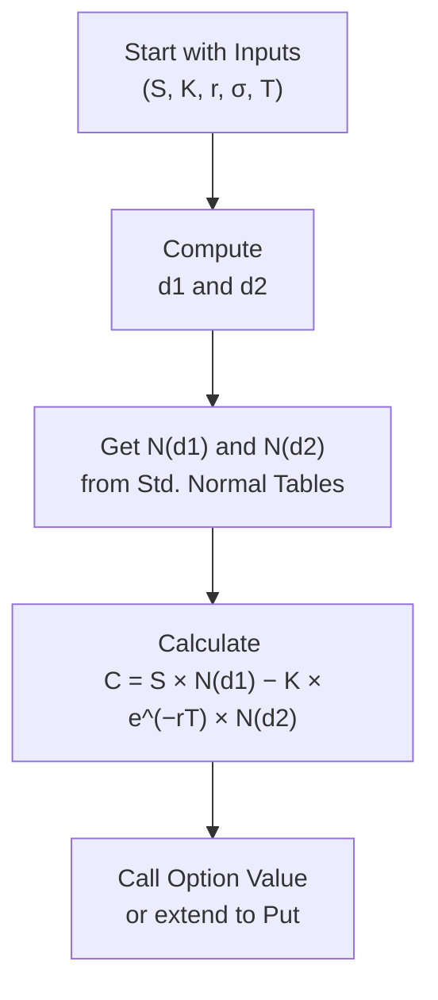

## The Roots of the Black–Scholes–Merton Model

Sometimes, when people first dive into options pricing, they see this frightening formula with all sorts of Greek letters and wonder, “Uh, do I really need to know all this?” I remember the first time I encountered the Black–Scholes–Merton (BSM) model in a classroom setting, and, let me tell you, it can feel intimidating at first. But once you see how the pieces fit together, it’s actually pretty elegant—and absolutely foundational to modern finance.

If you recall earlier sections discussing the binomial option pricing model (see Section 10.3), you might remember that the binomial approach uses discrete time steps. The BSM model, introduced by Fisher Black, Myron Scholes, and later expanded by Robert Merton, essentially takes that same idea but lets the time step go minuscule. As time intervals approach zero, continuous compounding, continuous hedging, and some clever mathematical assumptions lead us to closed-form solutions for pricing European-style options.

The critical breakthrough came when Black and Scholes figured out that by creating a specific, continuously rebalanced portfolio of the underlying stock and a bond, one could replicate the payoff of an option. Then, using this “replicating portfolio,” they argued that it must earn the risk-free rate to avoid arbitrage. Robert Merton enriched this concept by clarifying the continuous-time hedging argument and formulating the risk-neutral valuation approach. 

## The Core Formula

At the heart of it, BSM offers a neat little closed-form formula for the price of a European call option on a non-dividend-paying underlying stock:

C = S × N(d₁) – K × e^(−rT) × N(d₂),

where:

• S is the current price of the underlying stock.  
• K is the strike price of the option.  
• T is the time to expiration (in years).  
• r is the continuously compounded risk-free rate.  
• σ is the volatility (standard deviation) of the underlying’s returns, expressed on an annualized basis.  
• N(·) is the cumulative distribution function (CDF) for a standard normal distribution (that is, a normal distribution with mean 0 and variance 1).  
• d₁ and d₂ are given by:

d₁ = [ln(S/K) + (r + σ²/2) T] / (σ √T),  
d₂ = d₁ − σ √T.  

And if you prefer the put version, you can either use the put–call parity (discussed in Section 10.2) or directly plug into another BSM formula:

P = K × e^(−rT) × N(−d₂) – S × N(−d₁).

In plain English, the BSM formula says: “Take the underlying price and multiply by the probability of finishing in-the-money under a risk-neutral measure, then subtract the present value of the strike price multiplied by the probability that you end up exercising the option at maturity.” The mathematical details get quite intricate, but that’s the gist of it.

## Risk-Neutral Interpretation

Now, about those “probabilities”: we typically label these as N(d₁) and N(d₂), but they are not exactly “real-world” probabilities you’d observe in daily life. Instead, they’re probabilities in a hypothetical risk-neutral world where every asset grows at the risk-free rate. In this environment, investors don’t demand extra return for extra risk (which is obviously not how the real world works, but mathematically it simplifies the pricing puzzle).

This approach—often called “risk-neutral valuation”—is one of the cornerstones of modern derivatives pricing. The idea is that if you can replicate an option’s payoff via a continuously adjusted combination of the underlying asset and a risk-free bond, the option must also be priced in a way that yields the risk-free rate, otherwise you’d have an arbitrage opportunity. Key to that logic is the assumption that you can hedge away your risk perfectly and continuously (and that the market is liquid enough to do so, among other assumptions detailed in Section 10.5).

## Hedging with Delta

Back in the early 1970s, this continuous hedging idea was practically revolutionary. Today, you’ll hear it referred to as “Delta hedging,” which means you hold ∆ = ∂option price / ∂underlying price shares of the underlying stock for every option you write or buy, to keep your overall position neutral to small price movements in the underlying.

People typically call ∆ “the hedge ratio,” because it tells you how many units of underlying you need to hedge the option. For a European call, ∆ is N(d₁). In the real market, if you’re an option seller, you’d short N(d₁) shares for every call drafted to offset small changes in the option’s value. If the stock price moves up or down, you adjust your short position accordingly. The BSM model assumes you can do this frictionlessly at any time. In practice, of course, trading costs, bid–ask spreads, and market liquidity constraints make continuous hedging complicated. But as a theoretical construct, it’s captivatingly tidy.

## Practical Insights and Limitations

You might be asking, “So, is BSM the be-all, end-all for pricing options?” The short answer is definitely no. It’s incredibly useful for European-style options on non-dividend-paying stocks—but in real markets, stocks often pay dividends, and many options, especially equity options, can be exercised early (i.e., they are American-style). The BSM model can shift to handle dividends (see Section 10.6) with a slight adjustment: you replace r with (r – q) if the stock has a continuous dividend yield q. But for early exercise features, or certain barriers, or exotic conditions, you need additional analysis or different models.

Moreover, the concept of constant volatility σ is an oversimplification. Real-world volatility changes over time, and for each strike and maturity, the implied volatility can be different, giving rise to phenomena like the “volatility smile” or “volatility skew” (explored in Section 10.9). This mismatch means that if you attempt to replicate real market prices with a single BSM-based volatility, you’ll see systematic deviations. Yet even with its limitations, the BSM approach remains a cornerstone for building more advanced models.

If you pick up a sophisticated textbook or talk to a derivatives quant, you might see references to local volatility models, stochastic volatility (like the Heston model), or jump-diffusion frameworks. All these derivatives are expansions or modifications of BSM to capture real-world features such as price jumps, changing volatility, or more intricate discrete events. But at a fundamental level, BSM sets the stage for all of them.

## Constructing the Model: A Brief Peek Under the Hood

While we don’t want to replicate the entire derivation (it involves partial differential equations and a dash of stochastic calculus), here’s a rough blueprint that might help you understand how BSM is generally built:

• Start with the assumption that the underlying stock follows a geometric Brownian motion under the real-world measure.  
• Transition to the risk-neutral measure by adjusting the drift from the stock’s expected return (which might be something like the CAPM return) to the risk-free rate r.  
• Write down the partial differential equation (PDE) that any derivative with payoff contingent on the stock’s price must satisfy, if there’s no arbitrage and if continuous trading is possible.  
• Solve that PDE subject to the boundary condition at option maturity (i.e., at T, the option value is max(S–K, 0) for a call).  
• Arrive at the closed-form solution we call the Black–Scholes–Merton formula.

It’s a neat synergy of probability theory, finance, and PDEs, all in one neat package.

## Real-World Example

Suppose you have a non-dividend-paying stock trading at S = $100, and you’re considering a European call with a strike K = $102 that expires in T = 1 year. Let’s say the risk-free rate r is 2% per annum (continuously compounded), and implied volatility in the market for this option is σ = 20%. 

Calculate:

d₁ = [ln(100/102) + (0.02 + 0.2²/2) × 1] / (0.2 × √1)  
    = [ln(0.98039) + (0.02 + 0.02) × 1] / 0.2  
    = [−0.0198 + 0.04] / 0.2  
    = 0.0202 / 0.2  
    = 0.101

d₂ = 0.101 − 0.2 = −0.099

Then N(d₁) is approximately N(0.101) ≈ 0.540, and N(d₂) ≈ N(−0.099) ≈ 0.460. The present value of the strike is K × e^(−rT) = 102 × e^(−0.02) ≈ $100.00 (roughly). So:

C ≈ 100 × 0.540 − 100 × 0.460 = $54.00 − $46.00 = $8.00.

This is just a rough exercise. Real markets have day-count conventions, potential discrete dividends, and more nuances—for instance, short-term interest rates might differ from longer-term ones. But it gives you a sense of how straightforward the actual computation can be once you plug in the numbers.

## Mermaid Diagram: Option Pricing Flow

Below is a simple flow diagram to illustrate how the key pieces (underlying price, strike, volatility, risk-free rate, time, and normal probabilities) feed into the BSM formula. This is not the full PDE derivation, just a conceptual flow:



## A Quick Python Example

If you’re the kind of person who loves to tinker, here’s a tiny Python snippet you could use as a starting point for calculating the BSM call price. You might tweak it to suit your own preferences (like plugging in actual data or using advanced libraries).

```python
import math
from math import log, sqrt, exp
from statistics import NormalDist

def black_scholes_call(S, K, T, r, sigma):
    # S: current underlying price
    # K: strike price
    # T: time to maturity (in years)
    # r: continuous risk-free rate
    # sigma: volatility of the underlying
    # returns: call option price

    n = NormalDist(mu=0, sigma=1)
    d1 = (log(S/K) + (r + 0.5*sigma**2)*T) / (sigma*sqrt(T))
    d2 = d1 - sigma*sqrt(T)
    Nd1 = n.cdf(d1)
    Nd2 = n.cdf(d2)
    call_price = S*Nd1 - K*exp(-r*T)*Nd2
    return call_price

S = 100
K = 102
T = 1
r = 0.02
sigma = 0.20
price = black_scholes_call(S, K, T, r, sigma)
print(f"Calculated Call Price: {price:.2f}")
```

You’ll probably notice the result is roughly in line with the $8.00 we mentioned in the example above, ignoring minor rounding differences.

## Best Practices

• Always check if the option has exotic features. BSM is a simplified model for European options without exotic payoffs.  
• If dividends exist, adapt the model to reflect continuous dividend yield q, or use the discrete dividend approach if the yield is not constant.  
• Volatility is rarely static. Implied volatility changes with strike and maturity, so be prepared to adjust your assumptions if you’re pricing numerous options across a volatility surface.  
• Keep an eye on interest rates and day-count conventions. Continuous compounding is an assumption that might differ from how your real-world interest rates are quoted.  
• For American options, the standard BSM formula is not strictly correct. Use modifications (like the American binomial approach) or specialized formulas for early exercise conditions.  
• If the underlying is a futures contract or currency, you can rely on suitably adapted versions of BSM using cost of carry or foreign risk-free rates (see earlier chapters on forwards, futures, and currency derivatives).  

## Conclusion

In the grand world of derivatives, the Black–Scholes–Merton model stands as an absolute milestone. Yes, we all know markets are more complex than any single equation, and yes, BSM’s assumptions (frictionless markets, continuous hedging, constant volatility, no early exercise) can sometimes feel like a fantasy. But it serves as the bedrock upon which so many advanced models are built.

If you grasp (a) how to apply the formula, (b) the difference between real-world and risk-neutral probabilities, and (c) how volatility plays a role in this pricing mechanism, you’ll be well ahead in understanding derivative pricing at a deeper level. One of the best ways to solidify your knowledge is to run through concrete examples, try building a small spreadsheet or Python script, and observe how the results change with each parameter’s tweak.

Just like everything in finance, the key is practice and critical thinking. Anyway, if you ever felt overwhelmed, believe me, we’ve all been there. After a few practice runs, though, you’ll see there’s a certain beauty in how elegantly the BSM model ties so many moving parts into a single formula. Keep exploring—this is just the beginning!

## References and Further Study

• Black, F. and Scholes, M. (1973). “The Pricing of Options and Corporate Liabilities,” Journal of Political Economy.  
• Merton, R. C. (1973). “Theory of Rational Option Pricing,” The Bell Journal of Economics.  
• Hull, J. C. (2022). “Options, Futures, and Other Derivatives.” 10th ed. Pearson.  
• For deeper reading on continuous-time finance derivations, see specialized texts on stochastic calculus and PDEs.  
• Refer to Section 10.9 for a discussion of volatility smiles and skew, which highlight where real market data diverge from BSM assumptions.

## Test Your Knowledge: Black–Scholes–Merton Model Quiz



### Which of the following best describes the primary goal of the Black–Scholes–Merton model?

- [ ] It predicts future stock price movements for all market participants.
- [x] It calculates the fair value of European options under risk-neutral conditions.
- [ ] It provides historical volatility estimates for technical analysts.
- [ ] It ensures that American options never get exercised early.

> **Explanation:** The Black–Scholes–Merton model focuses on fair pricing of European options using risk-neutral valuation, not predicting actual or real-world probabilities.

### In the Black–Scholes–Merton formula for a call on a non-dividend-paying stock, what does the term S × N(d₁) represent?

- [x] The present value of owning the underlying stock weighted by the risk-neutral probability of exercise.
- [ ] The expected terminal payoff of the option in real-world conditions.
- [ ] The portion of the option price that reflects the time value.
- [ ] The cost of immediate exercise based on the current stock price.

> **Explanation:** S × N(d₁) is often interpreted as the risk-neutral probability–weighted value of the underlying stock. It’s not the real-world probability but the risk-neutral one.

### What is the primary reason that continuous hedging is significant in deriving the BSM model?

- [x] It allows the option’s risk to be offset instantaneously, removing the need for a risk premium.
- [ ] It guarantees profit even when the underlying stock moves erratically.
- [ ] It locks in a dividend stream for American options.
- [ ] It prevents the time value of options from decaying.

> **Explanation:** Continuous hedging ensures a riskless portfolio in theory, so the portfolio should earn the risk-free rate. This no-arbitrage argument underpins the entire model.

### Which parameter in the Black–Scholes–Merton framework is constant, but in real markets is often implied to vary with strike price and maturity?

- [x] Volatility (σ)
- [ ] Risk-free rate (r)
- [ ] Time to maturity (T)
- [ ] Spot price (S)

> **Explanation:** One of the well-documented limitations of BSM is its assumption of constant volatility, leading to observed market phenomena like volatility skew and smile.

### If a stock pays a continuous dividend yield at rate q, how is the call-option BSM formula typically adjusted?

- [x] Replace r with (r – q) in the exponential discount factor and in the expressions for d₁ and d₂.
- [ ] Add q to r so the discount rate increases from r to (r + q).
- [ ] Subtract q from σ to reduce the implied volatility.
- [ ] Divide the strike price by e^(qT).

> **Explanation:** For a continuously yielding stock, we adjust the drift in the risk-neutral world by subtracting q, effectively discounting the stock at rate (r – q).

### Which of the following best describes Delta (Δ) in the BSM context?

- [x] The sensitivity of the option’s price to small changes in the underlying price.
- [ ] The probability that the underlying will rise in value by maturity.
- [ ] The discount factor used to price the expected payoff.
- [ ] The risk-free rate used in continuous compounding.

> **Explanation:** Delta measures how much an option’s price changes when the underlying price changes slightly, forming the basis for delta-hedging strategies.

### In the context of BSM, what distinguishes d₁ from d₂?

- [x] d₁ includes a half-variance term in the numerator, while d₂ is simply d₁ minus σ√T.
- [ ] d₁ incorporates discrete dividends, while d₂ ignores them.
- [ ] d₁ is relevant for volatility calculations, while d₂ deals only with the drift term.
- [ ] d₂ is never used in call-option pricing.

> **Explanation:** d₂ = d₁ – σ√T. d₁ has the half-variance (σ²/2) included, and d₂ is offset by one standard deviation over T.

### Under the Black–Scholes–Merton assumptions, which rate of return does the option’s replicating portfolio earn?

- [x] The risk-free rate
- [ ] The underlying stock’s expected return based on CAPM
- [ ] Zero, because the hedging removes all risk
- [ ] A guaranteed arbitrage return in excess of the market rate

> **Explanation:** Because the hedged position is made riskless through continuous rebalancing, it must earn the risk-free rate in equilibrium to avoid arbitrage.

### If you wanted to price an American call on a stock that pays no dividend using BSM, which of the following is correct?

- [x] It’s the same as the European price because there’s no benefit to early exercise.
- [ ] You must apply early exercise premium formulas to adjust the BSM result.
- [ ] You replace discounting with discrete compounding.
- [ ] You cannot use BSM at all.

> **Explanation:** For a non-dividend-paying stock, it’s never optimal to exercise an American call early, so the American call has the same value as the European call in that scenario.

### For a European put, which statement is TRUE regarding the model-based price under BSM?

- [x] The put can be priced using put–call parity or the direct BSM put formula.
- [ ] The put value must be higher than any otherwise equivalent call value.
- [ ] The put’s Delta is always positive.
- [ ] The BSM formula is only valid when r < σ.

> **Explanation:** The BSM framework offers a direct formula for puts, and you can also use put–call parity to go from call pricing to put pricing.  


