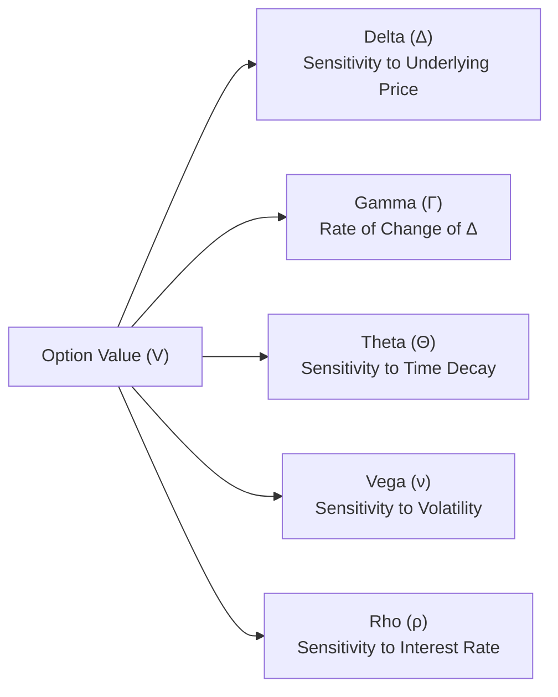

## Introduction

Options are remarkable instruments, offering a dizzying array of strategic possibilities. But, well, they can also be tricky to manage, especially when the market shifts suddenly. That’s where Greeks—like Delta, Gamma, Theta, Vega, and Rho—come to the rescue. These sensitivities quantify how much an option’s price might change if the underlying stock price moves, if time passes, if implied volatility shifts, or if interest rates fluctuate. By monitoring the Greeks, professionals can structure and rebalance their positions to align with their desired risk profile.

I remember a friend of mine—he was fairly new to options trading—who once told me, “I’m long these calls; I just need the stock to pop!” But a week later, the stock hadn’t really moved; ironically, the call option still lost quite a bit of value. It turned out his friend “Theta” was quietly nibbling at his option’s extrinsic value each day. This anecdote, or cautionary tale, highlights why a firm handle on Greeks is so critical: an option’s worth depends on more than just where the underlying heads next.

In this section, we’ll delve into measuring each Greek, talk about how they interrelate, and offer practical guidance on using them for hedging, speculation, and risk management. Think of these Greeks as the instruments on your cockpit’s dashboard—keeping them all in view will help you steer through turbulent markets more confidently.

## Fundamentals of Option Sensitivities

Option Greeks represent partial derivatives of an option’s price (often denoted as V) with respect to certain underlying parameters. In simplest terms:

- Delta (∆) → ∂V/∂S  
- Gamma (Γ) → ∂²V/∂S²  
- Theta (Θ) → ∂V/∂t  
- Vega (ν or κ) → ∂V/∂σ  
- Rho (ρ) → ∂V/∂r  

Where:
• S = Current price of the underlying  
• σ = Implied volatility  
• t = Time  
• r = Risk-free interest rate  

These metrics help portfolio managers assess how an option’s value might respond to incremental changes, facilitating a more proactive, dynamic risk-management approach.

Below is a simple conceptual diagram illustrating the main Greeks. Each Greek focuses on a different “axis” of sensitivity:

## Delta (∆)

### Definition and Interpretation
Delta (∆) measures how much an option’s price is expected to move for a small move in the underlying asset’s price, holding other variables constant. For a call option, Delta ranges from 0 to +1; for a put option, it typically ranges from −1 to 0.

- A call option with a Delta of 0.6 suggests that if the underlying increases by $1, the call gains approximately $0.60 in value, all else being equal.  
- A put option with Delta of −0.4 suggests a $0.40 move (downward) in the put’s price for a $1 upward move in the underlying.

### Delta Behavior
• Deep-in-the-money (ITM) calls tend to have Deltas near +1.  
• Deep-out-of-the-money (OTM) calls have very small Deltas near 0.  
• At-the-money (ATM) calls often have Deltas around 0.5, though the exact figure depends on implied volatility, time to maturity, and interest rates.

In a risk-management context, Delta is frequently used for creating “Delta-neutral” portfolios. A Delta-neutral approach might involve shorting or buying shares of the underlying asset to offset an option position’s net Delta. If you’re long a call with a Delta of +0.5 on 100 shares, the net Delta is +50. To hedge, you might short 50 shares (assuming each share has Delta +1). This setup aims to buffer small moves in the underlying; you would still have exposure to Gamma, Theta, and other risks.

### Practical Example (Delta Hedging)
Suppose you own 5 at-the-money call options on a stock. Each option has a Delta of 0.50, and each contract represents 100 shares. Your total Delta exposure is:

Delta_Tot = 5 contracts × 100 shares/contract × 0.50 = 250

If you wish to hedge your portfolio to near zero Delta, you could short 250 shares of the underlying. However, keep in mind that hedging with shares controls your immediate Delta exposure but does not fully address Gamma or other Greeks. If the underlying price changes significantly, your Delta will change, and you’d need to rebalance.

## Gamma (Γ)

### Rate of Change in Delta
Gamma (Γ) is the derivative of Delta with respect to changes in the underlying price—basically the “Delta of the Delta.” It tells us how quickly Delta itself shifts if the underlying price moves. A higher Gamma indicates that Delta is more sensitive and can change rapidly.

### Importance in Portfolio Management
Gamma is particularly relevant to traders who profit from large moves in the underlying, such as those who are long ATM options. Large Gamma means that if the underlying rallies or falls, the option’s Delta can quickly become more favorable for the holder. Market makers who are short options often dread high Gamma because they must rebalance their Delta hedges more frequently.

### Gamma Risk
“Gamma risk” is the risk that rebalancing a Delta-hedged position could lead to losses if the underlying moves around rapidly (whipsaws). You might, for instance, buy shares when the underlying rises to stay hedged, only for the price to come back down.

A typical pattern:
• Long call or put → Positive Gamma  
• Short call or put → Negative Gamma  

If you’re short Gamma, you generally prefer markets to remain stable so that constant rebalancing doesn’t erode profits. If you’re long Gamma, you might favor volatility.

## Theta (Θ)

### Time Decay
Theta measures the sensitivity of the option price to time passing, commonly expressed as the dollar amount an option loses in value per day (or per unit time). For a long option holder, Theta is usually negative, meaning the option steadily loses time value if all else remains constant. This effect is often more acute as expiry nears.

### Role in Strategy
- **Buyers of options** face negative Theta: Over time, the extrinsic premium erodes. You often have to be right about direction (and do it quickly!) to offset time decay.  
- **Sellers (writers) of options** enjoy positive Theta: They collect premium over time, as long as the underlying remains within expected price ranges.

### Intuitive Example
An at-the-money call might have a Theta of −$0.05, meaning that if one day passes and nothing else changes, the call loses about $0.05 in value. Sometimes, this doesn’t seem like much. But it can add up, especially over a weekend or extended holiday period.

When building hedges or income strategies, some traders rely on Theta as a major source of profit. Think covered calls or short straddles—if the market remains calm, you “harvest” time decay from your short option positions.

## Vega (ν)

### Sensitivity to Volatility
Vega measures how much the option price changes for a 1% change in implied volatility (IV). It’s sometimes denoted by κ (kappa) or σ_v, but “Vega”—despite not being a Greek letter—has become a widely accepted label.

• A Vega of 0.10 means that if implied volatility rises from 20% to 21% (i.e., by 1 volatility point), the option’s price will increase by about $0.10, all else equal.

Vega is higher for options with longer time to maturity and those near-the-money. If you’re long Vega, you benefit from rising implied volatility (e.g., in uncertain markets). If you’re short Vega, you profit if volatility subsides.

### Managing Vega Risk
Marketmakers and professional traders often run “Vega-neutral” books by netting off their exposures to different maturities and strikes. In choppy markets—think economic news, earnings announcements, or unexpected geopolitical events—implied vol can spike, causing large swings in option prices. Understanding your Vega is critical when forming a view on pending market events.

## Rho (ρ)

### Interest Rate Exposure
Rho measures the sensitivity of an option’s value to changes in the risk-free interest rate. Generally:

- Rho is larger (in absolute terms) for longer-dated options.  
- Call Rho is typically positive, while put Rho is negative.  

In many equity markets, interest rate fluctuations have historically been relatively modest, so Rho can be overshadowed by other Greeks. However, in environments with rapidly changing rates or extremely low/negative interest rates, Rho can become more relevant.

As a rule of thumb, interest rate changes can also indirectly affect implied volatility or other market factors, so changes in interest rates can potentially ripple through all the Greeks.

## Interpreting and Combining Greeks

### A Holistic View
While each Greek focuses on a specific dimension, real-world changes often involve shifts in multiple factors at once. For instance, if an underlying price jumps significantly, implied volatility might also change, and your Gamma and Vega exposures interact. Monitoring just one Greek in isolation is like watching speed while ignoring your car’s fuel gauge—helpful, but incomplete.

### Practical Portfolio Example
Imagine you’re running a small equity option portfolio. You might check your:
- Net Delta to see your directional bias.  
- Net Gamma to gauge how quickly that bias can flip if prices move.  
- Net Theta to understand daily time decay or accumulation.  
- Net Vega to see how vulnerable you are to volatility changes.  
- Net Rho to see if interest rate changes pose significant risk.

Typically, you’ll want to set boundary conditions for each Greek and rebalance whenever the net exposures exceed your threshold. Marketmakers commonly do this rebalancing multiple times a day.

## Scenario Analysis and Stress Testing

### Why Scenario Analysis?
Greeks are powerful for small, incremental changes. But real markets often experience larger shocks or dramatic bursts in volatility, especially upon unexpected news. Scenario analysis and stress testing help you see how your option positions might fare in extreme or multi-factor moves.

### Crafting Hypothetical Scenarios
You might define scenarios of underlying price moves such as ±10% or ±20% from current levels, combined with implied volatility shocks of ±5 percentage points. By applying these combined changes in a pricing model, you can approximate how the P&L of your positions will shift.

### Complementary to Greeks
Greeks excel at quick, local approximation: “What if the underlying moves a little bit?” Scenario analysis helps answer bigger “what-if” questions. Together, they offer a more robust risk management framework.

## Common Pitfalls and Best Practices

### Pitfalls
1. Ignoring Secondary Effects: “Small changes” can become not-so-small in volatile markets, making Gamma, Vega, and cross-effects crucial.  
2. Overhedging: Constantly rebalancing a Gamma-hedged position might generate friction costs, which can eat away profits.  
3. Focusing Solely on Delta: Too many novices fixate on direction alone and don’t appreciate how time decay or volatility can overshadow directional moves.  
4. Neglecting Correlation: In multi-asset portfolios, cross-correlations can complicate net Greek exposures (especially for broad index option strategies).

### Best Practices
1. Monitor Net Greeks: Summarize your total exposures daily, more often if you run a high-gamma or high-vega book.  
2. Use Scenario/Stress Tests: Evaluate “unexpected” moves to see how portfolio exposures may evolve in extreme conditions.  
3. Align with Macro and Fundamental Factors: For instance, if you anticipate a fast rate-hiking cycle, keep an eye on Rho.  
4. Evaluate Hedging Costs: Frequent rebalancing can be expensive. Evaluate slippage and transaction fees.  
5. Reassess Implied Volatility: Stay attuned to market psychology. If you believe the market is underpricing potential volatility, you might want to be long Vega.

## Role of Greeks in Professional Standards and Regulatory Environments

From a regulatory perspective under frameworks like Basel III or IFRS 9, financial institutions are often required to measure and report their derivative exposures. Greeks can aid in quantifying and bounding specific risk components for compliance. Beyond compliance, strong Greek-based risk management aligns with the CFA Institute’s emphasis on fiduciary responsibility and prudent portfolio oversight.

## Exam Relevance and Real-World Application

At the CFA Level III exam, you might encounter constructed-response questions that ask you to interpret an option’s Delta and determine how many units of the underlying to buy or sell to form a hedge. Alternatively, item sets might explore how Gamma risk impacts short-call positions during volatile markets. Often, you’ll see a scenario exploring how changes in implied volatility or interest rates affect a multi-asset portfolio, along with how you should adjust your positions accordingly.

In practice, portfolio managers, financial analysts, and risk officers apply these same tools to mitigate undesirable exposures, plan healthy risk-taking strategies, and comply with capital requirements. Understanding the Greeks is integral to forging stable strategies and, well, sleeping more soundly at night.

## Conclusion and Final Exam Tips

• Don’t Overlook Gamma: If you’re short options, Gamma can catch you off guard. Keep a watchful eye on it, and remember that rebalancing can be costly.  
• Time Decay, Time Decay: Theta can rapidly chew into a long option’s premium. Don’t assume the underlying can remain flat for long—time is working against you if you’re a buyer of options.  
• Scenario Analysis: Greeks are local approximations—always stress test for big moves and changes in implied volatility.  
• Be Comfortable with Multi-Factor Changes: The real world rarely changes one parameter at a time.  
• Practice Efficiently: In the exam setting, time is precious, so practice quick Delta-hedge calculations and ensure you can interpret Gamma, Theta, Vega, and Rho in novel scenarios.  

Though mastering Greeks takes practice, the payoff is well worth it. You’ll be able to create and maintain more precise positions, making more efficient use of capital and mitigating catastrophic drawdowns.

## References and Further Reading

- Hull, John C. “Options, Futures, and Other Derivatives.”  
- Rebonato, Riccardo. “Volatility and Correlation.” Wiley.  
- Taleb, Nassim Nicholas. “Dynamic Hedging.” Wiley.  
- CFR Title 12 (Banking) – Relevant regulators often require sensitivity analyses for large derivative positions.  
- CFA Institute. “Standards of Practice Handbook,” referencing prudent management of derivative positions.

-----

## Test Your Knowledge: Option Greeks and Their Applications



### Which Greek measures the sensitivity of an option's price to changes in the underlying’s price?

- [x] Delta
- [ ] Gamma
- [ ] Theta
- [ ] Rho

> **Explanation:** Delta measures how much an option’s price changes for a small change in the underlying’s price. Gamma measures how Delta itself changes.

### An investor is long a call option with Delta = 0.60. If the stock price rises by $1, how much will the call price change, assuming other factors remain the same?

- [ ] $0.70
- [ ] $0.50
- [x] $0.60
- [ ] $1.00

> **Explanation:** A Delta of 0.60 means the call option gains $0.60 for each $1 increase in the underlying.

### Which Greek measures the rate of change of Delta with respect to changes in the underlying’s price?

- [ ] Vega
- [ ] Theta
- [x] Gamma
- [ ] Rho

> **Explanation:** Gamma represents how Delta changes if the underlying’s price changes.

### A trader is worried about volatility spikes in the market. Which Greek should they primarily monitor to manage the impact of changes in implied volatility?

- [ ] Theta
- [x] Vega
- [ ] Delta
- [ ] Rho

> **Explanation:** Vega measures sensitivity to changes in implied volatility.

### If you are short an at-the-money option, which Greek risk are you most directly taking on?

- [x] Negative Gamma
- [ ] Positive Lambda
- [x] Negative Theta
- [ ] Positive Rho

> **Explanation:** Being short an ATM option typically corresponds to negative Gamma and positive Theta. As the option writer, you collect premium from time decay (+Theta) but are at risk from changes in the underlying price (−Gamma).

### Which of the following is a true characteristic of Theta?

- [x] It usually becomes larger in magnitude as expiration approaches for ATM options.
- [ ] It does not affect OTM options.
- [ ] It is often positive for long positions.
- [ ] It measures volatility sensitivity.

> **Explanation:** Theta is generally negative for long positions, and its magnitude often accelerates as the option gets closer to expiry, especially if it is at the money.

### Which Greek is most likely to be significant in a low-interest-rate environment?

- [x] Rho
- [ ] Delta
- [x] Vega
- [ ] Theta

> **Explanation:** Rho becomes more significant if interest rates are volatile or very low (or negative). Additionally, Vega can be impactful if uncertainty about interest rates affects implied volatility. In this question, Rho stands out in a changing interest rate environment.

### To maintain a Delta-neutral position when the underlying price rises, a trader with positive Gamma would typically need to:

- [x] Sell some of the underlying asset
- [ ] Buy more of the underlying asset
- [ ] Do nothing; Gamma neutrality means no action needed
- [ ] Purchase additional call options

> **Explanation:** With positive Gamma, Delta increases as the underlying price rises. To remain Delta-neutral, the trader would sell some of the underlying to reduce net Delta.

### Which Greek do you primarily use to gauge how the profit or loss of an option portfolio might evolve from day to day if all other market variables stay the same?

- [x] Theta
- [ ] Delta
- [ ] Gamma
- [ ] Rho

> **Explanation:** Theta measures the option’s price sensitivity to the passage of time alone.

### An option’s Vega indicates how much the option’s value changes when implied volatility changes by 1%. True or False?

- [x] True
- [ ] False

> **Explanation:** Yes, Vega tells us how many dollars the option’s price will gain or lose if implied volatility changes by one percentage point.


