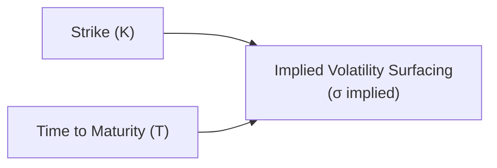

## Introduction

You know, back when I first read about the Black–Scholes–Merton (BSM) model, I had this neat picture in my head that volatility was just...constant...like a flat line for all option strikes. Boy, was I in for a surprise. Real markets almost never behave that nicely. Instead, traders observe something called the “implied volatility smile,” or variation in implied volatility (IV) across strikes and expirations. This phenomenon often shows up like a U or skewed curve—a big clue that real-world asset price distributions come with “fat tails,” jumps, and bunches of other complexities that the old textbooks don’t fully capture.

The implied volatility surface is the three-dimensional map of implied volatilities across different strikes (sometimes measured by moneyness) and maturities. You can think of it as a topographical chart, but with peaks and valleys of implied vol in place of mountains and valleys of actual terrain. Understanding why these shapes arise, and how to manage the resulting risk exposures, is a core challenge for modern derivatives professionals, especially at the portfolio level. Let’s dive a little deeper into the “why” and “how” of this very real, very practical market quirk.

## Revisiting Implied Volatility

Before we get too fancy, let’s clarify implied volatility. In a standard option pricing framework, the BSM formula for a European call option is expressed as:


C_{\text{BSM}} (S, K, r, T, \sigma) = S \Phi(d_1) - K e^{-rT} \Phi(d_2)


where:
• \\(S\\) is the current underlying asset price.  
• \\(K\\) is the strike price.  
• \\(r\\) is the risk-free rate.  
• \\(T\\) is the time to maturity.  
• \\(\sigma\\) is volatility (assumed constant in standard BSM).  
• \\(\Phi\\) is the cumulative distribution function (CDF) of the standard normal distribution.  

The implied volatility \\(\sigma_{\text{imp}}\\) is the value of \\(\sigma\\) that, when plugged into the BSM equation, ensures the theoretical option price matches the actual market-traded price. Mathematically, you might invert the BSM function to obtain:


\sigma_{\text{imp}} = f^{-1}\bigl(C_{\text{market}}, S, K, r, T \bigr).


The entire point is that \\(\sigma_{\text{imp}}\\) need not be the same across all strikes and maturities, even though the formula’s original assumption was that volatility is constant. In practice, the market reveals different implied volatilities for different strikes. This difference is at the core of the volatility smile or skew.

## Volatility Skew and Smile

### The Shape

When traders chart implied volatility against the strike price, they often see a curve that slopes downward (or upward) at the deep in-the-money or out-of-the-money tails. Picture a “U” shape for equity options: the IV is sometimes higher for low strikes (because the market is afraid of large downward moves in the underlying, ergo puts become more expensive) and also higher for high strikes, albeit more modestly, although the shape and magnitude can vary across asset classes. This phenomenon has been dubbed a volatility “smile” or “skew” (depending on how symmetrical or lopsided it looks).

### Market Realities Driving the Smile

So why do smiles exist? A few reasons that people like to point out:

• Fat Tails. Asset returns might have a greater probability of extreme moves than the lognormal distribution used in standard BSM. This means that out-of-the-money options (especially puts in equity markets) price in the possibility of big downward jumps.  
• Supply/Demand Dynamics. When there’s more demand for protection on the downside (e.g., portfolio hedgers rushing to buy puts), implied volatility for those strikes can spike.  
• Jump Risk. Some markets are subject to discrete jumps (like big earnings surprises, macro events, political headlines). Such jumps break the assumption of continuous paths.  
• Macroeconomic Uncertainty. During volatile times, short-dated options on certain indices can show extremely elevated implied vol because of imminent news (central bank announcements, GDP data, etc.) that could cause abrupt moves in the underlying.

## The Implied Volatility Surface

Now let’s bring time into the picture. Instead of a 2D chart of IV vs. strike, we get a 3D surface that also includes maturity on a second horizontal axis. At each point (strike, maturity), you have an implied volatility reading. The “surface” might slope or twist, indicating how the shape of the implied vol distribution changes with time.

Below is a conceptual diagram in Mermaid (not truly 3D, but hopefully it helps visualize some relationships). Imagine the horizontal axes representing strike (K) and time (T), and the vertical axis representing implied volatility (σ).



In practice, you often see:

- For short-dated options, the wings (deep OTM options) can have very high implied volatility: markets fear large, imminent moves.  
- For longer-dated options, the skew can flatten or take on a different shape if the market expects mean reversion or if big risks are expected to subside or intensify in the longer horizon.

### Plotting the Surface in Practice

Sometimes, quants or traders collect a grid of option quotes: for a set of maturities (e.g., 1 week, 1 month, 3 months, 6 months, 1 year) and for a range of moneyness or strikes (like 80%, 90%, 100%, 110%, etc. of current spot). From these quotes, they solve for the implied vol. Then they apply interpolation or smoothing methods to produce a continuous surface. The reliability of the surface depends on:

1. The quality and liquidity of the market quotes.  
2. The interpolation method (linear vs. spline vs. more advanced local volatility calibration).  
3. The underlying model assumptions used for final smoothing (e.g., stoch vol, local vol, or a mixture approach).

## Reasons Behind the Smile: A Bit More Detail

Fat tails are arguably the biggest culprit. The standard lognormal model is too “thin” in the tails, especially for large downside moves. If the market suspects a meltdown (or a big upside surprise, in some assets), those tail options get bid up in price. Another major factor is negative correlation between the underlying asset price and its volatility—commonly observed in equity markets. When stock prices fall, volatility tends to spike, pushing up the prices of OTM puts even more. Thus, the implied vol for those strikes ends up rising.

## Local Volatility and Stochastic Volatility Models

### Local Volatility

Local Volatility (LV) models, such as Dupire’s framework, attempt to fit the entire implied volatility surface by specifying volatility as a deterministic function of both price and time, \\(\sigma(S, t)\\). The idea is that each point on the surface is “explained” by a unique local vol, which can replicate the observed market prices of European options. If you can calibrate the local vol surface precisely, you can in theory price any exotic payoff that depends only on the underlying’s path. However, local vol models sometimes overlook the presence of real jumps or instantaneous correlation with other factors (like credit or macro events). They can, though, do a neat job capturing some of the basic smile structure.

### Stochastic Volatility

On the other hand, Stochastic Volatility (SV) models, like Heston, assume volatility itself follows a random process—like a mean-reverting square root process. This can capture clustering of volatility and sometimes a better shape of skew. In real life, many dealers or sophisticated hedge funds use hybrids of local vol and stochastic vol, or they might throw in jumps (e.g., Bates model) to address abrupt price moves. The result is a model that tries to be flexible enough to match the observed market’s implied vol surface and preserve that shape as time evolves.

## Practical Implications for Portfolios

### Hedging and Risk Management

For a portfolio manager using derivatives to hedge, the shape of the implied volatility surface can seriously impact hedging costs and strategies. For instance, if you want to hedge a downside tail risk, you might find that far-out-of-the-money puts are extremely expensive due to the skew. You might adjust your approach with partial or layered hedges, or utilize spreads to offset some premium.

### Significance for Option Market Makers

Market makers who hedge “option greeks” in real time have to respect the shape of the skew. As the underlying’s price moves, the implied volatility on the existing position might also change, even if all else stays the same. This leads to sometimes complicated dynamic “volatility skew” hedging, sometimes known as “skew gamma,” “volga,” or “vomma” risk—terms referencing second-order sensitivities to volatility and forward skew.

### Impact on Valuation for Exotic Options

Many exotic deals—barrier options, digital payoffs, or path-dependent structures—cannot be priced accurately with a single constant volatility parameter. Instead, practitioners calibrate local or stochastic vol frameworks to the entire market-implied surface in order to reflect how the market would truly price these exotics. A mismatch in calibration can lead to big P&L swings if you’re carrying large exotic books.

## Example: Equity Index Options

Imagine you’re trying to price equity index puts on the S&P 500. You see that at-the-money (ATM) implied vol is 20%, but the 10% out-of-the-money puts might imply a volatility of 25% or 30%. This upward shift for OTM puts is the well-known “volatility skew” in equity markets. Traders attribute it to the so-called “leverage effect” (vol increases when prices drop) plus heavy demand from portfolio managers wanting black-swan protection. If you used a plain-vanilla BSM with 20% across the board, you’d significantly underprice OTM protections. That’s risky business if you decide to be a net seller of those puts without adjusting for the reality of the skew.

## Brief Python Snippet for Constructing an Implied Vol Surface

Below is a minimal and hypothetical code snippet that might help illustrate how market practitioners gather data for the implied vol surface. Assume you already have a data structure containing observed option prices (perhaps from a data feed). This snippet is not exam-mandatory but offers a flavor of how you might approach building or visualizing a surface:

```python
import numpy as np
import pandas as pd

# ['MaturityDays', 'Strike', 'OptionType', 'MarketPrice', 'UnderlyingPrice']

def black_scholes_call_value(S, K, r, T, sigma):
    # ... BSM formula ...
    # Return theoretical call price
    pass  # omitted details for brevity

def implied_volatility_call_bisect(market_price, S, K, r, T, 
                                  lower=0.0001, upper=2.0, tol=1e-5):
    # Finds sigma via bisection
    for _ in range(100):
        mid = 0.5 * (lower + upper)
        price_guess = black_scholes_call_value(S, K, r, T, mid)
        if abs(price_guess - market_price) < tol:
            return mid
        elif price_guess > market_price:
            upper = mid
        else:
            lower = mid
    return mid

surface_data = []
unique_maturities = sorted(option_data['MaturityDays'].unique())

for t in unique_maturities:
    subset = option_data[option_data['MaturityDays'] == t]
    T_years = t / 365.0
    for idx, row in subset.iterrows():
        if row['OptionType'] == 'C':  # We'll consider calls only for simplicity
            iv = implied_volatility_call_bisect(row['MarketPrice'],
                                                row['UnderlyingPrice'],
                                                row['Strike'],
                                                0.02,  # constant r, example
                                                T_years)
            surface_data.append((t, row['Strike'], iv))

# Next step: convert this into a grid, then interpolate or visualize
df_surface = pd.DataFrame(surface_data, columns=['MaturityDays','Strike','ImpliedVol'])
```

In real-world practice, you’d refine the approach, add robust interpolation, and handle calls and puts consistently (perhaps with put-call parity checks). But the big idea remains: gather the market prices, solve for implied vol, then track how it changes across strikes and maturities.

## Best Practices and Common Pitfalls

• Always check liquidity. If the data points for far OTM options are sparse or have wide bid-ask spreads, your “surface” may be misleading.  
• Watch out for data staleness. Implied volatility can shift intraday, especially ahead of major announcements.  
• Align model calibration with the instruments you actually trade. If you’re holding a path-dependent exotic, a local vol approach might differ from a pure stochastic vol approach, especially in how it replicates the skew over time.  
• Understand that carry and hedging costs might go up if you’re short these “skew” options. As the underlying moves, you may be forced to rebalance at times of high vol.  

## Exam Relevance and Tips

On the CFA Level III exam, you might see item-set or constructed-response questions exploring how a portfolio manager handles the shape of the implied volatility curve to hedge a position or price an option. A typical question might show a table of implied volatilities across strikes, then ask you to identify how that impacts an at-the-money collar strategy. Or you might be required to discuss how a negative correlation between equity returns and volatility implies a skew in the implied volatility surface.

Here are a few suggestions to stay on top of this material:

• Practice reading implied volatility surfaces and interpreting whether a “smile” or “skew” suggests certain risk exposures.  
• Familiarize yourself with the difference between constant volatility in BSM vs. dynamic volatility in local/stochastic vol models.  
• Learn how to articulate in writing the reasons for a smile (fat tails, jump risk, demand for OTM options) and how that modifies hedging behavior.  
• When you see an exam scenario about heavy put demand or perceived tail risk, connect the dots to higher implied volatility at those deep OTM put strikes.

## References

• Gatheral, Jim. “The Volatility Surface.” Wiley Finance.  
• Dupire, Bruno. “Pricing with a Smile.” Risk, 1994.  
• Hull, John C. “Options, Futures, and Other Derivatives.”  
• CFA Institute. 2025 CFA® Program Curriculum Level I-III, Derivatives readings.

---

## Test Your Knowledge of Volatility Smiles and the Implied Volatility Surface



### Why do volatility smiles often appear in equity markets?

- [ ] Because implied volatility is constant at all strikes 
- [x] Because out-of-the-money puts often carry extra premium due to downside risk fears
- [ ] Because central banks set these volatility levels by fiat
- [ ] Because the risk-free rate is higher for lower strikes

> **Explanation:** Market participants typically drive the premium up on downside strike puts (and sometimes even calls) to account for fat tails and jump risks, leading to a smile or skew in implied volatility.

### What is the primary assumption about volatility in the Black–Scholes–Merton model?

- [x] Volatility is constant over time and across strikes.
- [ ] Volatility follows a constant mean-reverting process.
- [ ] Volatility depends explicitly on the option’s strike price.
- [ ] Volatility only exists for at-the-money options.

> **Explanation:** The standard BSM model assumes a constant volatility throughout the life of the option, which is why the phenomenon of volatility smiles contradicts its simplifying assumption.

### Which of the following factors can explain the presence of a volatility smile?

- [x] Fat tail distribution of asset returns
- [x] Demand imbalances for OTM hedges
- [ ] Negative interest rates alone
- [ ] Operational risk in clearinghouses

> **Explanation:** Fat tails and supply/demand imbalances for OTM options are key drivers of smiles. Interest rates and operational risk are not the direct causes of skew in implied volatility.

### In a typical equity index, how does the implied volatility skew usually behave?

- [ ] Higher implied volatility for very high strike calls
- [x] Higher implied volatility for lower strike puts
- [ ] Flat across all strikes
- [ ] Reverses direction daily

> **Explanation:** In equity markets, lower strike puts often command higher implied vols since participants worry more about sharp drops than big rises.

### Why might short-maturity options exhibit higher implied volatility in the wings?

- [x] Market participants fear immediate large moves.
- [ ] The BSM formula demands a higher vol for near-term options.
- [x] There may be key economic data releases in the short term.
- [ ] Long-dated options are typically mispriced.

> **Explanation:** Short-dated contract wings can reflect elevated event risk; if a significant macro or company-specific announcement is imminent, short-dated OTM options can spike in implied vol.  

### What is the central idea behind local volatility models, such as Dupire’s framework?

- [ ] Volatility is constant, ignoring the surface.
- [x] Volatility is explicitly modeled as a function of price and time.
- [ ] Volatility is derived solely from realized historical data.
- [ ] Volatility is determined only by central bank policy announcements.

> **Explanation:** Local volatility treats volatility as a deterministic function \\(\sigma(S, t)\\), which helps replicate the market-implied surface for European options.

### Which approach is often used to capture both volatility clustering and jumps?

- [x] Stochastic volatility with jumps
- [ ] Constant volatility with a single jump date
- [x] Hybrid local-stochastic volatility models
- [ ] Flat volatility surfaces along all maturities

> **Explanation:** Stochastic volatility with jump components (e.g., Bates model) or hybrids that combine local and stochastic volatility are more advanced models that can capture real-life features like clustering and discrete jumps.

### What is a common risk for an options market maker dealing with a skewed volatility surface?

- [ ] They can ignore gamma risk because skew neutralizes it.
- [x] They face “skew gamma” or “volga” exposure, making hedging more complex.
- [ ] They get perfect hedge coverage automatically.
- [ ] They must only hedge with far OTM puts.

> **Explanation:** A skewed implied volatility surface introduces second-order ‘vol’ greeks (e.g., volga) that require dynamic hedging of changing implied volatility as the underlying moves, complicating risk-management.

### How can portfolio managers address expensive tail options when the volatility skew is steep?

- [ ] Abandon all hedging strategies
- [x] Use spreads, layered hedges, or partial hedges to reduce premium costs
- [ ] Only buy calls instead
- [ ] Force the broker to lower implied volatility

> **Explanation:** Tail options can get pricey due to heavy demand, so portfolio managers often use option spreads or partial hedges to manage cost while still addressing downside risk.

### True or False: A single implied volatility value applies uniformly to all strikes for a given maturity in practice.

- [x] True
- [ ] False

> **Explanation:** While BSM’s theoretical framework suggests a single volatility for each maturity, in practice, the measured implied volatility is not constant across strikes. Ironically, we still often quote a single “ATM implied vol,” but it’s not representative of the entire surface. This is a bit of a trick question because in live markets we see different implied vols across strikes, yet in theory, some might still show a single quoted vol for basic reference. The correct answer in a real sense is “False,” but the question as stated could be interpreted differently. Be cautious on the exam with definitional subtleties!


