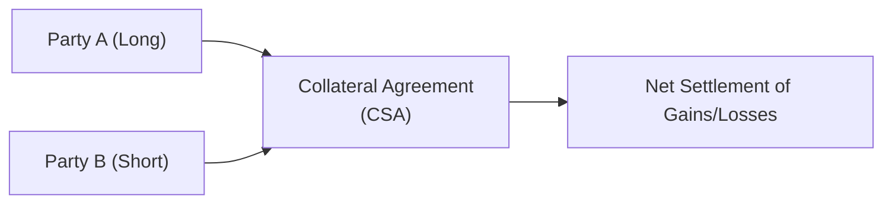

## Introduction

Forward contracts are often the very first thing that comes to mind when talking about over-the-counter (OTC) derivatives. They allow two parties—often a buyer (the “long”) and a seller (the “short”)—to lock in a purchase or sale price today for an underlying asset to be delivered (or cash-settled) at a future date. At first glance, that sounds almost too straightforward, but I can recall plenty of times when portfolio managers grew anxious about the “fine print”—from specifying delivery details to ensuring that the contract’s credit-risk provisions were in place. 

This section dives deep into the structure, payoffs, and settlement features of forward contracts. We’ll look at how they’re negotiated, how they impact portfolio risk and return, and how investors can use them for everything from hedging currency risk to locking in the cost of precious metals for industrial processes. Because we’re dealing with an OTC instrument, we’ll pay special attention to counterparty risk and the customization features. By the end, you’ll see how forward contracts fit into the broader derivatives toolbox discussed throughout Volume 7 (see, for instance, Sections 1.2 on forward commitments vs. contingent claims and 2.3 on forward vs. futures distinctions).

## Key Elements of a Forward Contract

Forward contracts typically exhibit several core elements:

• Notional Amount or Quantity: The contract specifies the exact notional quantity of the underlying asset. For example, if the contract covers 50,000 barrels of crude oil, the forward explicitly states that quantity.

• Underlying Asset Specifications: The quality or grade can be customized—like “Brent” vs. “West Texas Intermediate” for crude oil—or “Grade A” vs. “B” in certain commodity contexts. For equity forwards, the underlying is usually shares of a particular stock or an index’s notional value.

• Delivery (or Settlement) Date: The date by which the underlying must be delivered or a cash settlement paid. Maturity can be any date mutually agreed on, making these contracts flexible versus standardized exchange-traded futures.

• Forward Price: The all-important price at which the underlying asset will be bought or sold at maturity. This price, denoted as F₀(T), is set at contract initiation.

• Counterparty Risk Provisions: Since forwards are OTC instruments, many contracts include terms about collateral, netting agreements, or credit support annexes to reduce credit risk.

A forward contract’s unique flexibility means you can tailor it to meet a firm’s specific needs—think minimal basis risk, exact hedge ratio, or niche underlying asset. This makes forwards popular among corporations hedging currency or commodity exposures that don’t fit neat exchange contract standards.

## Payoff Profiles

For all their nuance, forward contracts have relatively simple payoffs. Let’s look at the perspective of the long position (the party agreeing to buy the underlying at the forward price):

At expiration T, if the underlying’s spot price is S_T and the agreed forward price is F₀(T), then the long position’s payoff is:


\text{Payoff}_{\text{long}} = S_T - F_0(T)


• If S_T > F₀(T), meaning the market price is above the contracted forward price, the long side profits because they can effectively buy at F₀(T) and the position is immediately worth S_T – F₀(T) > 0.  
• If S_T < F₀(T), the long side takes a loss because they’re locked into buying above the current market price.

Meanwhile, the short position (the party agreeing to sell the underlying) experiences the exact mirror payoff:


\text{Payoff}_{\text{short}} = F_0(T) - S_T


Because forwards are zero-sum games (barring credit issues), the long’s gain is precisely the short’s loss and vice versa.

### Example: Hedging a Currency Exposure

Imagine you’re a portfolio manager in Europe with a large US equity portfolio. You’re worried about a potential depreciation of the USD relative to the EUR. By entering into a forward contract to sell USD for EUR at a pre-agreed forward rate, you can lock in the exchange rate you’ll effectively receive at some future date. If the USD later declines, your forward contract gains value, compensating you for the lower spot value of the USD assets.

## Settlement Mechanisms

One of the critical decisions in drafting a forward contract is how settlement will occur. The two primary settlement methods are:

• Physical Delivery: The long pays the forward price, and the short delivers the underlying asset. For commodities, this involves a physical transfer. For equities, it’s a transfer of shares. For foreign currency forwards, the long pays domestic currency and receives the foreign currency from the short.

• Cash Settlement: Instead of exchanging the underlying asset, one party pays a cash amount equal to the difference between the spot price at settlement and the forward price. Cash settlements are common with indices, interest rate forwards, or when physical transfer is inconvenient.  

In practice, many commodity forwards (especially in the energy and metals markets) can be physically settled, while many equity index or interest rate forwards are cash settled. Always verify that your counterparty can handle physical delivery. I once knew a manager who forgot to specify “cash settlement only” on a commodity forward—leading to last-minute scrambles to avoid having to store hundreds of barrels of actual crude.

### Settlement Example

Let’s say you’re long a forward contract for 100 ounces of gold at a forward price of \$1,900 per ounce, settlement in 3 months. Suppose the gold spot price at expiration is \$1,950 per ounce, and the contract states physical delivery:

• You, the buyer (long), must pay \$1,900 × 100 = \$190,000.  
• The seller (short) must deliver 100 ounces of gold.  
• Your net benefit is: (spot price – forward price) × quantity = (\$1,950 – \$1,900) × 100 = \$5,000.

If the contract were cash-settled, you’d simply receive \$5,000 in cash, with no physical gold changing hands.

## Role of OTC Markets and Counterparty Risk

Forward contracts trade OTC, meaning each contract is privately negotiated between buyer and seller. This arrangement offers tremendous flexibility—varying maturity lengths, underlying grades, or even unique credit provisions. However, it does expose each party to counterparty risk, also known as default risk.

Unlike futures contracts that often benefit from a central clearinghouse that mitigates counterparty risk through margin requirements and daily settlement, forward contracts rely heavily on the creditworthiness and reputation of the counterparties. That’s why, in large forward markets (like foreign exchange), many deals come with collateralized terms outlined in an accompanying Credit Support Annex (CSA). The collateral arrangement might reduce net exposures daily or weekly, mitigating the possibility that one side can’t pay if the market moves against them.

### Credit Risk Mitigation

Below is a simplified flowchart illustrating how parties might structure a forward with collateral terms to manage risk:

1. Party A and Party B sign a forward contract.  
2. A separate CSA outlines how margin or collateral must be posted as the contract’s market value fluctuates.  
3. If the forward moves in favor of one party, that party collects additional collateral from the other.  
4. At expiration, any final difference is settled via cash or delivery.

In practice, banks and large investment firms often require daily or weekly margin calls from the losing party to keep potential losses from ballooning.

## Using Forward Contracts in Portfolio Management

The interplay of forwards with broader portfolio management cannot be overstated. The most common uses include:

• Hedging: Portfolio managers often protect against adverse price changes in currencies, interest rates, or commodities. For instance, an international bond fund might use currency forwards to lock in exchange rates.  
• Synthetic Asset Allocation: By using forward contracts on equity indexes, managers can gain or reduce market exposure without buying or selling the underlying shares. For example, if you already have cash on hand but anticipate a near-term equity rally, an equity index forward can function as a temporary “synthetic” long position.  
• Yield Enhancement: Sometimes, large institutions spot arbitrage opportunities where the forward price is out of line with no-arbitrage conditions (see Chapter 7: Arbitrage, Replication, and Cost of Carry). They might buy the underlying spot asset and sell a forward contract for a locked-in profit if financing and storage costs are favorable.  
• Liability Management: Pension plans with long-term liabilities can use forward contracts to manage interest rate risk, effectively locking in future rates.

From a CFA Level III perspective, scenario-based exam questions often ask you to evaluate which derivative instrument is most appropriate given a portfolio manager’s objective. Forwards can be powerful because they allow perfect tailoring to match the exact timeline and notional size of the asset or liability.

## Best Practices and Common Pitfalls

• Specify All Contract Terms Precisely: Remember that hedge success depends on contract parameters matching your exposure. You don’t want a mismatch in settlement date or underlying grade that leaves you partially hedged.  
• Monitor Counterparty Credit: Ensure your contracts have a workable credit support annex, or at least a partial collateral arrangement.  
• Understand the Accounting and Tax Implications: Under IFRS 9 or US GAAP, derivatives are generally recorded at fair value, with changes recognized in profit or loss unless designated in a qualifying hedge. Forwards used for cash-flow hedges (like future purchase of a commodity) can lead to different accounting treatments than forwards for speculation.  
• Avoid Over-Hedging: Sometimes a manager can get “over-hedged” if they fail to account for real consumption or usage patterns.  
• Contingency Planning: If physical delivery is not feasible, ensure your contract specifically states “cash settlement only” or has a fallback. You don’t want to accept hundreds of barrels of oil if you’re a manager in charge of a technology stock portfolio.  

## A Real-World Anecdote

Years back, I was consulting with a mid-size manufacturing firm that wanted to lock in the price of copper. Their CFO meticulously hammered out a forward contract with a metals supplier—great. But they only needed 80% of the contracted copper they locked in because of an unexpected dip in demand. So guess what? They ended up with excess copper they had to store or resell in the spot market. They inadvertently became a minor metals trader. Moral of the story: when you design a forward contract, be sure you truly need that quantity—or at least have a plan for surplus or shortfall. 

## Conclusion and Exam-Taking Tips

Forward contracts, although conceptually straightforward, can create complex obligations and exposures that ripple across a portfolio. They remain a cornerstone in risk management and strategic positioning for everything from currency and interest rates to commodities and equities. During your CFA exam, don’t be surprised if a multi-part question tests your ability to:

• Interpret a forward contract’s payoff under different spot scenarios.  
• Describe how hedging with a forward can alter portfolio returns.  
• Account for potential performance measurement issues when using derivatives.  
• Evaluate counterparty credit or regulatory constraints in a scenario-based question.

Keep in mind the big picture. Forwards are prime examples of forward commitments (see Section 1.2 in Chapter 1). They differentiate themselves from options (contingent claims) by having an obligation rather than a right. This sense of obligation underpins the payoff structure and is central to how you will address item-set or constructed-response questions in the exam.

If you find yourself drilling practice problems, focus on payoff diagrams, mark-to-market concepts, and the idea of cost of carry. Also, watch out for that dreaded mismatch scenario—maybe the forward’s settlement date doesn’t align with the portfolio rebalancing date, or a difference in the underlying’s specification leads to basis risk. The exam might specifically test your grasp of these subtleties.

## References

• Hull, John C. “Options, Futures, and Other Derivatives.” Pearson.  
• CFA Institute. “Derivatives and Risk Management.”  
• BIS. “OTC Derivatives Market Activity” Reports: https://www.bis.org/statistics/

----------

## Test Your Knowledge: Forward Contracts Structure, Payoffs, and Settlement



### Which of the following best describes a forward contract?

- [ ] A standardized agreement executed on an exchange to buy or sell an asset in the future.  
- [x] A customized, over-the-counter contract where two parties agree to trade an asset in the future.  
- [ ] An agreement that involves daily margin settlement through a clearinghouse.  
- [ ] A contract with no underlying asset, only purely notional cash flows.  

> **Explanation:** Forward contracts are bilaterally negotiated OTC agreements to buy or sell an asset in the future. They differ from futures, which are exchange-traded and standardized.

### What is the payoff to the long position in a forward contract at expiration if ST is the spot price and F₀(T) is the contract’s forward price?

- [ ] ST × F₀(T)  
- [ ] F₀(T) / ST  
- [x] ST – F₀(T)  
- [ ] F₀(T) – ST  

> **Explanation:** The long’s payoff is the difference between the spot price at maturity and the negotiated forward price, ST – F₀(T).

### In a physically settled forward contract on a commodity, which of the following is true?

- [x] The buyer pays the forward price, and the seller delivers the commodity.  
- [ ] The long position must deliver the commodity and receive the spot price at delivery.  
- [ ] No cash is exchanged if the spot price equals the forward price.  
- [ ] The contract is always net-settled, regardless of underlying commodity.  

> **Explanation:** Physical delivery generally requires the long to pay the agreed forward price, and the short delivers the underlying asset.

### Which risk is most associated with forward (OTC) contracts that is mitigated in exchange-traded futures?

- [ ] Market price risk  
- [x] Counterparty credit risk  
- [ ] Operational risk  
- [ ] Liquidity risk  

> **Explanation:** Because forwards are not cleared by an exchange or a clearinghouse, each party bears the risk that its counterparty might default.

### How can counterparty risk be mitigated in an OTC forward contract?

- [ ] By increasing the maturity of the contract  
- [x] Through the use of collateral or margin agreements  
- [ ] By having a zero initial value for the contract  
- [x] Through netting provisions and credit support annexes  

> **Explanation:** Collateral or margin requirements and netting provisions help reduce the net exposure if either party defaults.

### If a European firm wishes to hedge the risk of depreciating U.S. dollars in six months, which forward position could it take?

- [x] Short the EUR/USD forward, receiving USD at delivery  
- [ ] Long the EUR/USD forward, paying EUR at delivery  
- [ ] Short the USD/JPY forward, receiving JPY at delivery  
- [ ] Long the USD/GBP forward, paying GBP at delivery  

> **Explanation:** To hedge against USD losses, the firm would want to sell (short) USD forward. In currency notation, shorting EUR/USD means you’re effectively locking in the rate to deliver USD and receive EUR.

### Which of the following is an advantage of forward contracts for a hedger?

- [ ] They have daily margin requirements.  
- [x] They are customizable in terms of quantity, quality, and maturity.  
- [ ] They trade on regulated exchanges, increasing transparency.  
- [x] They allow the hedger to match specific exposures without standardization constraints.  

> **Explanation:** Customization is a key advantage of forward contracts: you can match the exact underlying specifications, quantity, and maturity that you need.

### When might a portfolio manager prefer cash settlement over physical delivery in a forward contract?

- [x] When the underlying is a broad equity index, and receiving actual shares is impractical.  
- [ ] When the manager wants to hold a large inventory of refined metals.  
- [ ] When the manager is uncertain about the maturity date of the contract.  
- [ ] When the manager wants to avoid paying the forward price at expiration.  

> **Explanation:** Cash settlement is common for instruments where physical delivery is impractical, such as equity indexes or commodities that the portfolio manager does not wish to physically handle.

### A manager enters a forward to buy 10,000 tons of wheat in three months at \$50 per ton. At maturity, the spot price of wheat is \$55 per ton. If physically delivered, what is the economic result for the manager?

- [x] They gain \$5 per ton, since they pay \$50 for an asset worth \$55, leading to a \$50,000 gain.  
- [ ] They lose \$5 per ton, since they pay more than the spot price.  
- [ ] They undergo no gain or loss because they must pay in cash.  
- [ ] They must immediately roll the contract for a new forward price.  

> **Explanation:** Buying wheat at \$50 when it is worth \$55 yields a \$5 per-ton profit. With 10,000 tons, that’s \$50,000.

### A forward contract is considered a forward commitment because:

- [x] Both parties are obligated to transact at expiration.  
- [ ] Only the long party has a right but not the obligation to buy.  
- [ ] Only the short party has a right but not the obligation to sell.  
- [ ] Neither party is obligated, but they have mutual options to exercise.  

> **Explanation:** A “forward commitment” means both parties are contractually obligated to transact (unlike options, which are contingent claims).


