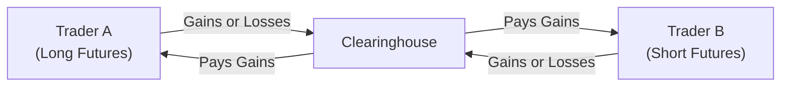
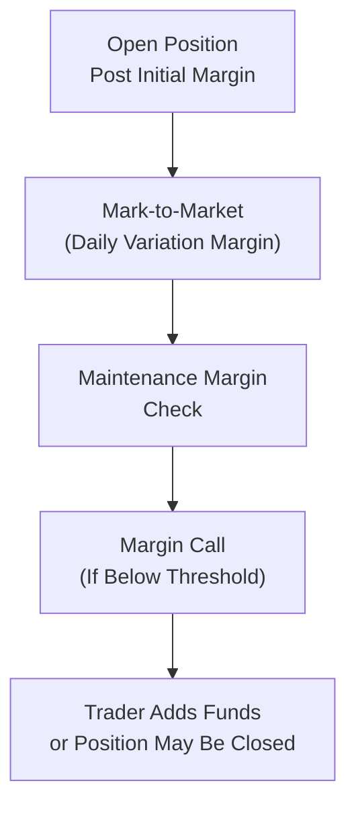

## The Role of the Clearinghouse

Clearinghouses are like the unsung heroes of the futures market. They sit in the middle of every trade, ensuring that both buyer and seller honor their contractual obligations. If you've ever wondered who shoulders the risk if your trade partner vanishes into thin air (not that we expect that to happen all the time, but you never know!), it’s the clearinghouse. They effectively become the buyer to every seller and the seller to every buyer, helping maintain trust, transparency, and stability in the entire derivatives ecosystem.

Unlike trading in less regulated OTC (over-the-counter) markets (discussed in detail in earlier sections of this book), futures exchanges use standardized contracts, and the clearinghouse enforces daily settlement. This daily settlement ensures that any profits or losses are promptly realized—so no one piles up enormous losses without detection. This sense of security is part of what makes futures markets so efficient and widely used for hedging, speculation, and everything in between.

## Variation Margin: A Daily Settlement Mechanism

Variation margin is the amount of money credited to—or debited from—a trader’s account on a daily (or intraday) basis to reflect gains or losses on open positions. If you’re long (or short) a contract, your profit or loss is settled every day according to that day’s closing (or settlement) price. In practical terms, it’s like marking your financial progress each night and moving money around to keep everyone current.

You might recall from earlier discussions on futures contracts (see the earlier sections of this chapter) that this daily settlement is designed to reduce counterparty risk. The clearinghouse calculates how much each account has gained or lost, and then:

• Credits the gains to accounts that made a profit that day.  
• Debits accounts that have suffered losses that day.  

This process ensures a near “real-time” reflection of the market’s price changes. If a trader’s losses become too big—and that trader fails to deposit additional funds—the clearinghouse can swiftly close out the position. Sounds a bit cold, but it’s crucial to protect everyone else.

Below is a simplified diagram illustrating how a clearinghouse manages variation margin flows among market participants:

In this setup, the clearinghouse stands between Trader A and Trader B, collecting or paying out the variation margin each day to keep the system balanced.

## The Concept of Initial Margin

Before you’re even allowed to open a futures position, you need to post what’s known as the initial margin. Think of it as a good-faith deposit—money you set aside to prove you can bear potential losses. For instance, if you want to trade equity index futures worth $200,000 in notional value, the exchange might require you to deposit, say, $10,000 as initial margin. This margin requirement depends on the volatility of the underlying, contract liquidity, and the clearinghouse’s risk policies.

Let’s talk about one of the most widely used frameworks for calculating initial margin: SPAN (Standard Portfolio Analysis of Risk). Developed by the Chicago Mercantile Exchange (CME), SPAN looks at your entire portfolio of futures (and in some cases, futures options) and measures the worst-case losses under various simulated market moves. If your positions are highly correlated in a negative sense (meaning one position’s loss is offset by another’s gain), your total margin requirement might be reduced through margin credits or “spread credits.” But, if you hold many correlated positions that all run the same direction, your margin requirement might be higher because your risk is amplified.

## Example: Variation Margin in Action

Suppose you’re bullish on crude oil and buy five futures contracts at $70 per barrel, each contract covering 1,000 barrels. The notional value of your position is 5 × 1,000 × $70 = $350,000. Assume the initial margin requirement is $10,000 (just a simplified scenario). Later that day, the settlement price moves to $72 per barrel. Each contract thus gains $2 per barrel.

• Profit per contract = $2 × 1,000 = $2,000.  
• You have 5 contracts, so total daily profit = $10,000.  

At the end of the day, $10,000 is credited to your account as variation margin. If the next day the price drops to $71, you’d lose $1 per barrel, or $5,000 in total. That amount would be debited from your account. If your account balance dips below a maintenance margin threshold, you’ll likely get a margin call—requesting you to top up your funds to remain in compliance.

## Portfolio Margining with SPAN

The SPAN framework is a bit like having a giant matrix that maps out potential price moves for each contract. For instance, it contemplates a range of upward and downward moves, along with volatility shifts. Then, based on all those “what if” scenarios, SPAN calculates the maximum projected loss over a specified time horizon. It’s not too different from how you might craft a worst-case scenario for your finances—except it’s more systematic, formalized, and integrated into the clearinghouse’s daily processes.

Here’s a simplified depiction of how SPAN might evaluate a portfolio:

• Identify each contract in your portfolio (e.g., S&P 500 futures, crude oil futures).  
• Retrieve the risk parameter file (RPF)—this file includes scanning ranges, implied volatilities, and other risk metrics for each contract.  
• For each scenario (up, down, sideways moves, and volatility changes), assess portfolio gains or losses.  
• Collate the worst-case losses across scenarios.  
• Subtract any “spread credits” if offsetting positions reduce risk.  
• Arrive at a final margin requirement.  

By looking at your portfolio holistically—rather than contract by contract—SPAN may let you enjoy lower margin if you have hedging positions in place. For example, if you’re long gold futures and short silver futures (and historically these two metals have some correlation in price movements), SPAN might recognize that a big drop in gold might be partially offset by a drop in silver. But if your portfolio is all long crude oil and long heating oil and long gasoline, all of which might crash together if the energy sector tanks, your margin requirement could be quite high.

## Considering Extreme Market Movements

Margin calculations often take into account potential extreme swings—far beyond the normal daily range. Clearinghouses don’t want to be caught off-guard if volatility suddenly spikes or if a major market event occurs. This was especially evident during periods like the 2008 financial crisis or the dramatic oil price plunge in 2020. Clearinghouses can raise margin requirements or update their risk parameter files more frequently during turbulent times, which can be jarring for traders who suddenly need to pledge more capital. But, from a risk management perspective, these measures are essential.

## Correlated Versus Diversified Positions

When positions share strong positive correlation, their price movements reinforce each other, which can amplify risk. Conversely, uncorrelated (or even negatively correlated) positions might help diffuse risk. Many clearinghouses offer margin offsets for positions that offset one another. But these offsets aren’t indefinite freebies; they come with constraints, and the correlation assumptions can be updated. So, if you hold an exotic combination of futures that typically move together in surprising ways, the clearinghouse might not grant you full margin relief. They’re always running statistical checks on how well your positions truly hedge each other.

## Regulatory Oversight and Robust Risk Management

Clearinghouses are under constant regulatory watch to ensure they’re properly controlling risk. Globally, regulators expect clearinghouses to be well capitalized and to have robust internal controls, stress-test frameworks, and backup liquidity lines. In some jurisdictions, clearinghouses are even considered systemically important financial institutions (SIFIs), which means they’re held to higher standards. The goal: no meltdown of a single clearinghouse should ripple through the entire financial system unchecked.

This level of scrutiny can mean that margin requirements vary across different regions or exchanges. Certain regulators may direct their clearinghouses to maintain more conservative margin standards, especially for high-volatility products or under certain macroeconomic conditions.

## Potential Pitfalls and Best Practices

It’s tempting to assume you’ll always have enough cushion, so you might be casual about depositing extra capital in your margin account. That’s a risky move. Here are a few tips:

• Watch your daily settlement statements. A single day’s big market move can drain your account drastically.  
• Keep a buffer above the minimum margin. This helps you avoid the dreaded margin call just when you’re scrapping for liquidity.  
• Diversify if possible. Although margin offsets help, it doesn’t pay to rely solely on correlation-based margin credits. Correlations can change.  
• Stay informed about changes in clearinghouse rules. Clearinghouses can—and do—adjust margin requirements, especially in times of heightened volatility.

## Personal Reflections

I remember, back when I first started dabbling in futures markets, I was surprised at how quickly margin calls would occur if the market even sneezed against my position. Another trader I knew was so confident in his directional bet that he left almost zero spare cash in his margin account. Sure enough, a sudden price swing forced him to liquidate at an unfortunate time—resulting in unnecessary losses. In hindsight, simply keeping a modest buffer and acknowledging that “surprise moves do happen” would have saved the day.

## Diagram: Simplified Margin Lifecycle

Here is a high-level depiction of the margin lifecycle from the start of a position to daily settlement:

In this sequence, you initially post the required margin and then each day the clearinghouse calculates gains or losses. If your account drops below the maintenance margin threshold, you’re required to restore it—quickly. If you fail, the clearinghouse closes out your position.

## Conclusion

Clearing and margin requirements can seem like textbook mechanics. But in reality, they have profound implications for risk, liquidity, and the overall integrity of futures markets. The daily variation margin process ensures that any contagion from a defaulting party is minimized, and initial margin ensures that all traders have some skin in the game. From a portfolio management perspective, the margin system can either be your best friend (if you understand offsets and effective hedges) or your worst enemy (if you lever up and risk margin calls). Keeping an eye on how the clearinghouse calculates your margin—and the key drivers such as correlation, volatility, and stress scenarios—will help you trade more confidently and responsibly.

For deeper insight, check out the official CME SPAN documentation, which offers a fascinating look at how scanning ranges, offset parameters, and implied volatilities are set. The Futures Industry Association (FIA) also provides extensive educational materials on the intricacies of clearing infrastructure and margin calculations.

## References

• Chicago Mercantile Exchange. “CME SPAN Margin Overview.”  
  https://www.cmegroup.com/clearing/risk-management/span-overview.html

• Futures Industry Association (FIA). “Futures and Options Clearing and Margin Education.”  
  https://fia.org/

• See prior sections in this Volume and Chapter 2 for a broader context on the mechanics of forward and futures contracts.

------------------------------

## Test Your Knowledge: Variation and Initial Margin Calculations Quiz



### Which statement best describes the role of the clearinghouse in futures trading?
- [x] It acts as the buyer to every seller and the seller to every buyer to mitigate counterparty risk.
- [ ] It only transfers margin between retail investors and brokers.
- [ ] It acts solely as a regulatory body setting the margin and fee structure.
- [ ] It has no authority to close out positions in the event of margin shortfalls.

> **Explanation:** The clearinghouse is central to all trades and effectively steps in as the direct counterparty to each side, reducing counterparty risk.

### Which of the following occurs if a trader’s futures position experiences a significant daily loss?
- [x] Variation margin is debited from the trader’s account.
- [ ] The initial margin requirement is permanently increased for all traders.
- [ ] The clearinghouse automatically liquidates the position without warning.
- [ ] The variation margin credit is postponed until the trader’s positions recover.

> **Explanation:** If the position incurs a daily loss, funds are debited from the trader’s account to cover that loss. If the account falls below maintenance margin, a margin call may occur.

### What is one key difference between variation margin and initial margin?
- [ ] Variation margin is posted at the outset of a trade, while initial margin is calculated daily based on market movements.
- [x] Variation margin represents realized gains or losses settled daily, while initial margin is a deposit posted when opening a position.
- [ ] Variation margin can never be reduced, while initial margin is generally refunded at the end of the contract.
- [ ] They are identical; the terms are used interchangeably in the futures market.

> **Explanation:** Initial margin is the good-faith deposit required to initiate a position, while variation margin reflects the daily settlement of gains and losses.

### Which of the following best describes SPAN (Standard Portfolio Analysis of Risk)?
- [x] A framework to calculate margin by analyzing the worst-case loss across a trader’s entire portfolio.
- [ ] A system used to track only the time value of existing options on futures contracts.
- [ ] A regulatory requirement for all OTC derivatives transactions.
- [ ] A method that calculates margin solely based on current volatility levels.

> **Explanation:** SPAN aggregates and evaluates risk across a trader’s whole suite of futures and options, factoring in potential market moves.

### Suppose a trader holds a long gold futures position and a short silver futures position that partially offset each other’s losses. How does SPAN typically treat such positions?
- [ ] SPAN ignores hedge effects entirely and calculates margin for each contract individually.
- [x] SPAN may reduce the total margin requirement via spread credits, reflecting offsetting risk.
- [ ] SPAN charges additional margin fees for having multiple asset classes in the portfolio.
- [ ] SPAN only applies offsets if the positions are in the same underlying.

> **Explanation:** SPAN offers spread credits when positions are correlated (negative correlation or partial offsets), reducing overall margin requirements.

### Which risk factor is least likely to impact the clearinghouse margin requirement for a specific futures contract?
- [x] Individual traders’ subjective forecasts about future market directions.
- [ ] The implied volatility of the underlying asset.
- [ ] Historical price volatility and correlation.
- [ ] The contract’s liquidity.

> **Explanation:** Clearinghouse margin requirements are driven by objective measures such as volatility, liquidity, and historical correlation. Subjective forecasts by individual traders are irrelevant to official margin calculations.

### A spike in market volatility often leads clearinghouses to:
- [ ] Lower margin requirements to encourage more trading activity.
- [x] Increase margin requirements to protect against potential large losses.
- [ ] Eliminate variation margin so traders can hold positions longer.
- [ ] Decrease margin and reclassify positions as low-risk to avoid disruptions.

> **Explanation:** When volatility soars, the clearinghouse typically raises margin requirements to account for potential large and rapid price swings.

### In a scenario where a trader fails to meet a margin call:
- [ ] The clearinghouse indefinitely suspends the margin rules for that trader.
- [ ] The clearinghouse liquidates other traders’ positions to recover the shortfall.
- [x] The trader’s position can be closed out by the clearinghouse to limit further losses.
- [ ] The position remains open until the next daily settlement cycle.

> **Explanation:** If a trader cannot satisfy a margin call promptly, the clearinghouse has the authority to close out the losing position to minimize systemic risk.

### Which of the following is a major advantage of using a clearinghouse for futures transactions?
- [x] Counterparty risk is significantly minimized for market participants.
- [ ] Traders can avoid paying any form of margin.
- [ ] The daily variation margin requirement is optional and can be skipped.
- [ ] Clearinghouses do not track risk exposure collectively.

> **Explanation:** By becoming the buyer to every seller and the seller to every buyer, clearinghouses greatly reduce the risk of counterparty default.

### True or False: Clearinghouses never grant reduced margin if a trader holds offsetting or correlated positions.
- [ ] False
- [x] True (This is a trick question—see explanation below)

> **Explanation:** In practice, clearinghouses commonly grant margin offsets (spread credits) when correlated or hedged positions reduce overall risk. The question is framed in reverse, so the correct answer is that the statement “never grants reduced margin” is false (i.e., it’s not correct).  


