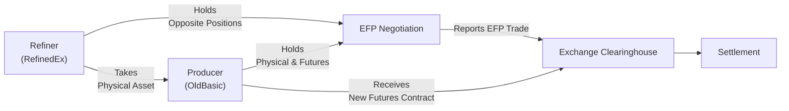

## Overview and Context

Exchange for Physical (EFP) transactions are a distinct and fascinating part of the futures market landscape that enable market participants to swap physical (cash) market positions for equivalent futures positions (or vice versa) through privately negotiated deals. If you recall earlier discussions around forward and futures contracts, you might wonder how EFPs fit into all of this. Essentially, EFP transactions sit on the boundary between the open-outcry or electronic marketplace (where trades typically occur) and the more private realm of over-the-counter (OTC) negotiations. They bring together the best of both worlds: the freedom of a direct arrangement plus the regulatory protection and transparency offered by exchanges.

Why would folks prefer an EFP over just trading in the open market? Well, there are many reasons: maybe they want to reduce slippage, avoid big price impacts, or achieve more accurate hedging for their specific physical positions. In my early days in the industry—this was years ago—I remember a grain merchant using EFPs to seamlessly roll his existing futures hedge without having to suffer the slippage he might have encountered on the exchange. It was a revelation for me, seeing how flexible the derivative markets can be when used correctly. This section hopes to pass along that same sense of discovery.

## The Basics of EFP Mechanics

An EFP is a privately negotiated, simultaneous exchange of:

• A futures contract position in a particular commodity or asset, and  
• An offsetting position in that same commodity or asset in the physical (cash) market.

One party typically holds the futures contract and wants to acquire or divest a physical position. Meanwhile, the other party holds the physical asset and wants to assume or offset a futures position. When they meet and agree on the terms, they exchange those two positions. The exchange itself—like the Chicago Mercantile Exchange (CME), Intercontinental Exchange (ICE), or others—simply requires the parties to report the details of the deal and confirm it meets the relevant “fair market levels.” This ensures the transaction’s price is near the prevailing market rates, preventing potential market manipulation or questionable valuations.

Here is a simplified diagram to illustrate the basic process:

```mermaid
flowchart LR
    A["Party A <br/> (Owns Futures)"] -- Negotiation --> B["Private EFP Agreement"]
    B -- Reports Deal --> C["Exchange"]
    A -- Receives Physical Asset --> B
    B -- Delivers Futures Position --> A
    C -- Regulatory <br/> Oversight
```

In this arrangement, Party A and Party B privately arrange a price (or prices) for both the futures leg and the physical leg. Once they finalize terms, they submit the transaction to the exchange for approval and clearing. After that, the physical commodity and the futures contract positions officially change hands.

## Rationale and Key Benefits

EFPs might sound a bit niche at first, but they serve as a highly strategic tool for traders, hedgers, and other participants in the futures market:

• Reduced Slippage  
  Slippage is the difference between the target or expected trade price and the actual price at which a trade is executed. In open markets, large orders can move prices unfavorably. By finalizing prices through private negotiation, the two parties sidestep wider bid-ask spreads or shallow liquidity pools. This can be especially valuable to larger accounts—like institutions—that need to transact significant volumes without rattling the market.

• Efficient Hedge Adjustments  
  Suppose you are a hedger managing a physical stake in crude oil, coffee beans, gold, or any other commodity. You already hold futures contracts to offset your exposure. As the contract nears expiration, you may want to roll your hedge forward to the next delivery month, but you worry about the potential cost of executing that roll in an active session. An EFP with another interested participant can facilitate a smooth rollover. 

• Customization  
  The physical side of derivatives transactions can be incredibly unique, varying by quality, location, and other attributes. Because EFP terms are negotiated privately, parties can adapt terms specifically to meet each other’s needs, ensuring the physical commodity or security delivered is precisely what each side wants.  

• Regulatory Acceptance  
  While EFPs are negotiated in the shadows (so to speak), they are still officially sanctioned and monitored by the relevant exchange. Both parties must report the trade details and confirm that the transaction is aligned with recent comparable market quotations. This ensures a level of transparency and fairness.

At one point, a colleague of mine used to joke, “If you think derivatives are complicated, just wait until you see how companies buy and sell actual tanker ships full of crude!” EFPs are precisely about bridging that complexity in an orderly fashion.

## EFP versus Open-Market Trading and Related Transactions

Imagine you’re a wheat farmer with 1,000 bushels you want to hedge. You might use a futures contract on an exchange. But if, later on, you and a local mill realize you can swap your positions (the physical wheat from you, and the mill’s offsetting futures position from them) at a price that beats open-market quotes, an EFP might make perfect sense.

This is distinct from simply showing up in the pit (or electronic order book) and placing a buy or sell order. In a typical exchange venue, you face the posted bid or ask, and the price is set by supply and demand dynamics across all participants. With an EFP, you choose your counterparty, and you’re able to settle at a privately negotiated price. As a result, you potentially save on transaction costs. But you must ensure your EFP meets exchange rules to avoid suspicion of off-market deals or mismarked prices.

## Potential Uses of EFP

• Rolling Hedge Positions  
  EFP is popular for rolling. When futures are near expiry, producers, merchants, or speculators wanting to maintain their futures exposure can privately arrange a swap involving the physical underlying. This helps them move from the near contract month to a further-out month without incurring extra costs or running into liquidity constraints.

• Converting Physical to Futures (or Vice Versa)  
  Some participants might prefer a physically settled position, while others might be happier with cash-based exposures. If you find a matching counterparty, an EFP allows you to transform your futures holding into the actual commodity (like gold bars or a tanker of oil), or transform your physical assets into futures positions.

• Minimizing Market Disruption  
  Large trades can spook markets. EFP participants often have significant size to trade. Doing it privately, away from the main order book, keeps them from signaling their intentions to the broader market.

• Customized Hedge Adjustments  
  In industries like metals, energy, or agriculture, quality and location differences can matter a lot. By negotiating the physical leg directly, parties can match exact contract specifications with their real-world needs.

## Regulatory Requirements and Reporting

One might guess that private transactions could lead to hidden deals. That’s why exchanges impose strict guidelines on EFPs. If in doubt, you can check official sources such as:

• ICE “Exchange for Related Position” rules:  
  https://www.theice.com/publicdocs/futures_us/exchange_regulations.pdf  

• CME Group EFP guidelines:  
  https://www.cmegroup.com (search “EFP Transactions”)

In a nutshell, the rules say:  
1. You have to report your EFP promptly (usually within a short reporting window).  
2. The negotiated price must reflect fair market levels—roughly consistent with the market’s open interest, last trade, or commonly quoted prices.  
3. The volume in the EFP must be consistent with the size (or multiple) of standard futures contracts.  
4. The transaction needs to involve the actual or equivalent underlying asset recognized by the exchange.  

Breaking these rules can lead to fines or more severe penalties. In practice, regulators want to ensure EFPs aren’t used to manipulate published settlement prices.

## Step-by-Step Example

Let’s consider an oil producer, OldBasic Energy, who has agreed to deliver 5,000 barrels of crude oil per month for the next three months to a refiner, RefinedEx. Meanwhile, OldBasic has sold crude oil futures on an exchange to hedge its price risk. As the near-month contract nears expiry, OldBasic wants to exit that futures position and move seamlessly into the next month’s contract so that physical delivery obligations remain aligned with its new schedule.  

1. Private Negotiation.  
   Both OldBasic and RefinedEx realize they can do a direct swap. OldBasic will transfer its physical barrel obligations to RefinedEx’s existing crude pipeline (the physically delivered portion) and in exchange, OldBasic receives futures positions from RefinedEx for the next delivery month, effectively rolling the hedge.  

2. Fair Market Price.  
   They will use an agreed-upon fair market reference—maybe the front-month WTI crude futures settlement from yesterday’s close plus a small premium or discount that reflects the local pipeline differentials.  

3. Reporting.  
   They submit the details of their EFP to the exchange’s clearing house, verifying that the volumes and negotiated price are appropriate. The exchange reviews the deal, ensures compliance, and eventually registers the transaction to the respective accounts.

4. Positions Settled.  
   OldBasic effectively closes out the near-month futures (handing it to RefinedEx) and picks up the next-month contract. RefinedEx does the opposite (they exit their next-month futures, taking over OldBasic’s near-month position for either offset or final settlement).

This structured approach saves both parties the trouble of open-market slippage. It also ensures that the physical flows align neatly with each party’s supply chain.

## Diagram: EFP Transaction in the Futures and Physical Markets

Below is another visualization showing how an EFP might look in parallel:



The big takeaway: The physical asset and the futures contract get swapped between the two parties outside the standard auction environment, subject to official reporting.

## Common Pitfalls and Challenges

• Pricing Disagreements  
  “What is fair market level?” is often subjective if the asset trades thinly, if the commodity has location-specific pricing, or if the market is particularly volatile on that day. Parties need to do their homework.

• Regulatory Scrutiny  
  If the exchange thinks an EFP was priced way off from surrounding trades or suspect that the involved commodity doesn’t reflect the listed underlying, it may investigate. Participants must keep thorough records.

• Operational Complexity  
  When physical commodities are delivered, you also face logistic or quality considerations. For example, crude oil can vary by grade, origin, and sulfur content. A mismatch in commodity specifications can sink the best-laid EFP plan.

• Liquidity Mismatch  
  EFP might not always be an option if you can’t find a counterparty equally keen to do the opposite side. You only skip the main exchange order book if you find someone else with complementary positions.

## Best Practices

• Document Thoroughly  
  Maintain a detailed record of the negotiation process, including how you arrived at your price. This includes referencing real-time quotes, historical settlement prices, or documented bid-ask spreads.

• Check Exchange Rules Regularly  
  Requirements, reporting procedures, and compliance guidelines evolve. It pays to stay updated.

• Align with Strategic Goals  
  Confirm that the EFP truly meets your hedging or risk management objectives. Sometimes an open-market trade might be more liquid or simpler. Make sure an EFP isn’t adding unnecessary complexity.

• Timing Is Key  
  Particularly for rolling positions, watch out for times when liquidity is shallow or volatility is high in the underlying commodity. Coordinating an EFP during calmer market moments can improve pricing outcomes.

• Focus on Credit and Counterparty Risk  
  Although the futures part of the transaction will clear through an exchange (thereby reducing counterparty risk), the physical component is a private arrangement and often more reliant on your trading partner’s creditworthiness. Evaluate that carefully.

## Personal Perspectives

I once witnessed the incredible efficiency of an EFP in the metals market: A large refiner and a jewelry manufacturer swapped a position on gold futures and the accompanying bullion. Instead of wrestling with wide spreads on the exchange—especially given the large order size—they cut a deal that satisfied both. They hammered out the premium and discount based on how pure the gold bars were and the location from which they’d be shipped. Both walked away feeling like winners, and best of all, the EFP posted without a hitch. At the time, the folks in the standard pit looked around for that big order but never saw it—resulting in minimal disturbance to the market. It’s moments like that which demonstrate how specialized derivatives tools can really mitigate friction in commercial transactions.

## Conclusion

Exchange for Physical (EFP) transactions reinforce a key theme in derivatives: flexibility combined with appropriate oversight. EFPs allow large-scale hedgers and other participants to trade physical assets for futures outside the main exchange environment. The close tie to an exchange’s rules ensures EFPs aren’t purely “off the grid” but still operate in an efficient, customized fashion. It’s a win for those who want to sidestep slippage, tailor their hedge to specific operational needs, or quietly readjust positions without broadcasting signals to the entire market.

From a CFA exam standpoint, understanding EFP is crucial—especially for bridging the conceptual gap between theoretical hedges and real-world commodity flows. The synergy EFPs create between physical and futures markets is part of what makes derivatives so central to modern finance. 

Remember: For exam preparation, you want to highlight the differences between EFPs and straightforward open-market futures trades, as well as identify how EFPs can mitigate transaction costs and meet the hedging demands of large commercial players. 

If you find yourself wanting to explore EFP further, check the references below and see how major exchanges articulate their rules. Or maybe do some hypothetical roleplay: imagine you’ve got coffee beans to hedge, and someone else has that offsetting futures position. Could you arrange an EFP that benefits both parties? The answer lies in a thorough understanding of the mechanics, pricing, and requirements laid out here.

## References and Further Reading

• ICE “Exchange for Related Position” rules:  
  https://www.theice.com/publicdocs/futures_us/exchange_regulations.pdf  

• CME Group EFP guidelines:  
  https://www.cmegroup.com (search “EFP Transactions”)  

• CFA Institute, 2025 Level I Curriculum—Derivatives.  

• Hull, J. “Options, Futures, and Other Derivatives,” 10th ed. (for additional detail on EFPs and other derivative structures).

• Chance, D. “Analysis of Derivatives for the CFA Program,” 2nd ed.

---------------------------------------------------------------------

## Test Your Knowledge: Exchange for Physical (EFP) Transactions Quiz



### Which statement best describes an Exchange for Physical (EFP) transaction?

- [ ] A transaction that only occurs on the central limit order book and always involves a cash settlement.
- [x] A privately negotiated swap of a futures position for an equivalent amount of a physical commodity or instrument.
- [ ] A strategy used exclusively to lock in a risk-free spread between spot prices and futures prices.
- [ ] A trade that ignores regulatory reporting requirements since it’s done off-exchange.

> **Explanation:** An EFP is precisely a privately negotiated exchange of a futures leg for a physical leg. It must still be reported to the exchange as per its rules.


### One of the primary benefits of conducting an EFP transaction is:

- [ ] Gaining access to free margin loans from the clearinghouse.
- [ ] Guaranteeing unlimited price improvements beyond market quotations.
- [x] Avoiding open-market slippage by privately negotiating the price.
- [ ] Eliminating operational risk in the physical market.

> **Explanation:** EFP transactions help participants avoid price slippage in the open market, as they directly negotiate the deal and do not need to execute large orders through an exchange order book.


### Which factor must parties in an EFP ensure for compliance with exchange rules?

- [x] They must execute the trade at or near fair market levels.
- [ ] They should wait for regulatory approval before finalizing the price.
- [ ] They must submit cash deposits equal to the notional amount of the futures leg.
- [ ] They only need to notify their broker if the trade is over $1 million.

> **Explanation:** The transaction should align with fair market levels to satisfy the exchange’s requirements and avoid allegations of off-market pricing.


### In an EFP, the physical leg of the transaction typically:

- [x] Reflects a genuine underlying good or financial instrument recognized by the exchange.
- [ ] Is always identical to a standardized futures contract specification without any variation.
- [ ] Carries less counterparty risk than the futures leg.
- [ ] Is delivered solely through the exchange’s clearinghouse, bypassing private negotiation.

> **Explanation:** The physical side should correspond to the actual underlying accepted by the exchange. However, its exact terms (quality, location, etc.) are often privately negotiated, and delivery typically occurs outside the clearinghouse.


### When might a hedger find an EFP particularly useful?

- [x] When rolling a futures position to the next contract month with minimal market impact.
- [ ] When speculating on short-term price movements in a highly liquid market.
- [x] When swapping a physical commodity for a futures position to better manage exposure.
- [ ] When they want to hold their position until the final day of futures expiration no matter what.

> **Explanation:** EFPs are popular for rolling or adjusting hedge positions (first correct answer) and for converting from physical exposure to futures (second correct answer), both done quietly to reduce market impact.


### Which of the following is considered a potential pitfall in EFP transactions?

- [x] Difficulty in determining a mutually agreeable fair market level.
- [ ] The inability for the physical portion of the trade to be privately negotiated.
- [ ] The mandatory use of standardized exchange specifications for the physical commodity.
- [ ] Complete insulation from regulatory oversight.

> **Explanation:** Because EFPs require a mutually agreeable price, it can be tricky if there’s large volatility or limited pricing data. Other aspects are not correct: EFPs remain under regulatory oversight, and the physical portion is indeed privately negotiated.


### Why is regulatory oversight still relevant for privately negotiated EFPs?

- [x] Exchanges need to ensure the trade is reported properly and done at fair market levels.
- [ ] To set uniform shipping terms for the physical leg.
- [x] To protect the integrity of settlement prices and prevent market manipulation.
- [ ] Because these trades are tax-exempt and subject to different legislation.

> **Explanation:** Regulators and exchanges oversee EFPs to protect overall market integrity—particularly the settlement process—and to curb manipulation. EFPs do not circumvent standard rules or taxes.


### If a trader wants to avoid the potential high bid-ask spreads in an illiquid futures market, an EFP might help by:

- [x] Allowing a direct negotiation with a counterparty, sidestepping the order book.
- [ ] Automatically guaranteeing a better price than the posted best bid or ask.
- [ ] Requiring an exchange floor broker to create a financial swap structure for them.
- [ ] Letting them take advantage of volume discounts from the clearinghouse.

> **Explanation:** Because EFPs happen off the central limit order book, participants can negotiate privately with their counterparties and reduce the impact of wide quoted spreads.


### A key distinction between a straightforward open-market futures trade and an EFP is:

- [x] EFP involves swapping a physical position and a futures position in a single transaction.
- [ ] EFP uses a separate clearinghouse for netting positions.
- [ ] Open-market trades always require the commitment of physical inventory before settlement.
- [ ] EFP trades are executed directly by the exchange without any negotiation.

> **Explanation:** An EFP bundles both the physical leg and the futures leg into one negotiated transaction, which is the defining factor setting it apart from a simple on-screen or pit futures trade.


### EFP transactions are reported to the exchange:

- [x] True
- [ ] False

> **Explanation:** Yes, all EFP transactions must be promptly reported to the respective exchange to ensure compliance, oversight, and price transparency.


