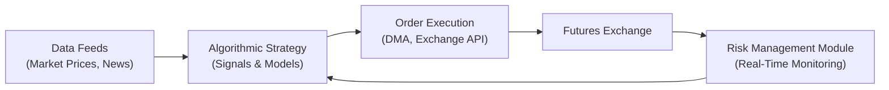

## Introduction

You know that feeling when you’re just trying to get that perfect price in a fast-moving market, and by the time you manually input your order… poof, it’s gone? Well, that’s part of what motivated the rise of algorithmic trading in futures markets. Algorithmic Execution—sometimes shortened to “algo execution”—really took off as computational tools became more powerful and data infrastructure got, well, faster than we ever dreamed. The major goal is to automate trading decisions, from “What to buy or sell?” to “When and how to trade?” in order to minimize costs, manage risk, and attempt to eke out a profit.

We’re doing an in-depth look at how these algorithmic approaches work, the role of high-frequency trading (HFT) within them, and the best practices for anyone interested in implementing or just understanding these strategies. Because, let’s face it, being able to hold your own in a world where machines can react to data in a fraction of a millisecond is crucial.

## Foundations of Algorithmic Trading in Futures

Algorithmic trading is, at its core, the use of computer programs to automate the process of buying or selling futures contracts (and sometimes the underlying assets, although we’ll focus on futures). The big plus here is that you’re substituting in a consistent, rule-based approach—free from the emotional biases humans so often bring to the table. For instance, an algorithmic trading system might automatically initiate a position in S&P 500 futures if it detects a certain market signal that historically predicted a favorable outcome, or it might dynamically hedge a portfolio of commodities if real-time data suggests price correlation is shifting.

### Why Algorithms Are Useful in Futures Markets

• Futures trading is often subject to extremely fast price changes. Algorithms can respond in microseconds to new data.  
• Traders might be hedging large positions (e.g., interest rate risk or commodity exposure), so the speed and precision of an algorithmic approach helps reduce slippage.  
• Market microstructure in futures (discussed in detail in the “Microstructure of the Futures Market” portion of this text) involves complex order book interactions, and well-designed algorithms can navigate these successfully—sometimes by splitting large orders into multiple smaller ones.

## Market Microstructure and Execution Quality

Market microstructure is a fancy term describing how order flows, price formation, and liquidity function within an exchange. When you build an algorithm to trade futures, microstructure knowledge is gold. It helps you figure out how your trade might influence the market or how the queue of existing limit orders might affect your execution price. 

If you place a large order all at once, you risk “walking the book,” which means pushing the market in an unfavorable direction—leading to higher costs. Skilled algo traders often deploy strategies like slicing large orders into smaller “child orders” or using pegged orders that adjust automatically to the best bid or offer.

## Evolution of Automated Futures Trading

It’s interesting to think about how we got here. I recall a friend telling me about the open outcry pits back in the day—picture hundreds of traders with color-coded jackets, yelling and gesturing to place trades. Now, a lot of that action has migrated to the digital sphere, with servers matching buy and sell orders in a fraction of a second.

• Early adopters: Banks and large hedge funds with specialized technology.  
• Today: Mid-sized trading shops and even individuals with robust internet connections and off-the-shelf software can do it.  
• Exchanges also encourage electronically executed orders (e.g., CME Group’s trading platform, ICE’s platform), resulting in narrower bid-ask spreads and more robust trading volume.

## High-Frequency Trading (HFT)

High-frequency trading (HFT) is the rocket-fueled child of algorithmic trading. Where “normal” algo traders might adjust positions over minutes or hours, an HFT firm might flip positions many times in a single second. They aim to exploit tiny price discrepancies or market inefficiencies that can vanish in the blink of an eye. 

### Hallmarks of HFT

• Very short holding periods—seconds or even milliseconds.  
• High turnover of positions, with large numbers of trades placed every day.  
• Reliance on ultra-low-latency infrastructure. Firms might co-locate servers at the exchange’s data center to shave off microseconds of data transit time.  
• Use of advanced market-making bots that place orders on both sides of the order book, adjusting quotes constantly.

Now, you might wonder: Does HFT help the market or hurt it? The debate continues. Some say HFT adds liquidity and narrows spreads, while others point to potential “flash crashes” and argue it can amplify market volatility. As we’ll see, risk controls such as circuit breakers have evolved to mitigate catastrophic disruptions.

## Core Algorithmic Strategies for Futures

Algorithms can do more than just “buy low, sell high.” Let’s break down a few popular strategies:

• Market Making: Placing simultaneous bid and offer orders, profiting off the bid-ask spread, but requiring strong risk management to avoid big hits when the market moves quickly.  
• Trend-Following: Identifying and riding existing price momentum in, say, crude oil futures or equity index futures. Could incorporate signals from technical indicators or even social sentiment.  
• Statistical Arbitrage: Exploiting small, temporary mispricings across related instruments—like E-mini S&P 500 futures on one exchange vs. a basket of large-cap stocks.  
• Spread Trading: We mention spreads in “Spread Trading in Futures Markets” (see other sections of this book). Algo programs can quickly detect anomalies between calendar spreads (buying a near-month contract while selling a further-month contract) or intermarket spreads (corn vs. wheat futures, for instance).

## Real-Time Data Feeds and Technical Infrastructure

To succeed in algo trading, especially at high frequencies, you need robust data feeds and stable technology. I once worked with a small prop shop that kept losing money because it had data latencies of 100 milliseconds while competitor systems had latencies of 10 microseconds. That difference might sound trivial, but it’s the difference between winning and losing if your edge depends on speed.

### Key Infrastructure Components

• Colocation: Putting your servers physically in or near the exchange’s data center.  
• Direct Market Access (DMA): Having a fast connection to place orders without intermediaries.  
• Low-Latency Hardware: Specialized network cards, field-programmable gate arrays (FPGAs), and streamlined software stacks.

## Risk Controls and Regulatory Safeguards

Algorithmic misfires can cause serious issues. The “flash crash” of May 6, 2010, is one of the most cited examples, where the Dow Jones Industrial Average fell nearly 1,000 points in minutes, only to recover quickly. Exchanges and regulators responded with measures like:

• Circuit Breakers: Temporarily halting trading if prices move too much, too quickly. This is common in equity index futures.  
• Kill Switches: Automated systems that can shut down an out-of-control algorithm if it starts placing anomalous orders.  
• Pre-Trade Risk Checks: For instance, the system verifies there’s enough margin and that orders aren’t too big relative to normal risk parameters.

We discuss some broader regulatory frameworks in “Role of Clearinghouses and Regulatory Environment” in Chapter 1. For algo trading, these rules help ensure one rogue algorithm doesn’t wreak havoc on the market.

## Implementation Example: A Python Snippet

Below is a simplified code snippet using Python-like pseudocode to illustrate how an algorithmic trend-following strategy might be set up for futures. This is a bare-bones example to show you how easily one can define an automated workflow. Please note: this is not production-quality code—nor is it a recommendation to trade. It’s purely educational.

```python
import numpy as np
import pandas as pd

prices = pd.Series([100, 101.5, 102.2, 101.8, 103.0, 104.5, 103.9, 105.2])

short_window = 3
long_window = 5

prices_df = pd.DataFrame()
prices_df['price'] = prices
prices_df['ma_short'] = prices_df['price'].rolling(window=short_window).mean()
prices_df['ma_long'] = prices_df['price'].rolling(window=long_window).mean()

prices_df['signal'] = 0
prices_df.loc[prices_df['ma_short'] > prices_df['ma_long'], 'signal'] = 1
prices_df.loc[prices_df['ma_short'] < prices_df['ma_long'], 'signal'] = -1

print(prices_df)
```

In a real environment, you’d integrate a live data feed (e.g., from CME) and pass the commands to a broker API or a direct market access gateway.

## Diagram: High-Level Algorithmic Trading Flow

Here’s a simple Mermaid diagram illustrating how an automated futures trading system might connect signals, execution, and risk management:



• Data Feeds (A) supply real-time price info to the Algorithmic Strategy (B).  
• The strategy sends orders to the Exchange (D) via an Order Execution interface (C).  
• Risk Management (E) monitors positions, margin, and abnormal trades, feeding back into the Strategy (B) for real-time adjustments.

## Glossary of Key Terms

Algorithmic Trading: Computer programs that automate trade execution based on predefined rules.  
Market Microstructure: The processes by which a market’s prices, liquidity, and trades form throughout the day.  
High-Frequency Trading (HFT): A specialized subset of algo trading emphasizing extremely fast execution times and brief holding periods.  
Circuit Breaker: An automatic pause in trading to prevent extreme volatility from spiraling out of control.  
Market Making Bots: Automated agents that place simultaneous buy and sell orders around the current market price to capture the bid-ask spread.

## Practical Considerations and Best Practices

• Data Quality: Garbage in, garbage out. You need reliable, clean data.  
• Latency: Even if you’re not an HFT shop, speed is still critical. Minimizing delays in data retrieval and order submission can improve fills.  
• Strategy Diversification: Don’t rely on a single signal or approach. Combine multiple strategies—like a trend-following model plus a hedge for tail risk (see “Tail Risk in Futures Trading” in Section 2.16).  
• Stress Testing: Simulate your algorithm under extreme scenarios (sudden market dips, data feed disruptions).  
• Compliance and Documentation: Regulators often require that firms keep logs of their algorithms, parameter changes, and order flow data.  
• Real-Time Monitoring: Keep a human in the loop—or at least a robust automated monitoring system—to watch for anomalies.

## Potential Pitfalls

• Overfitting: This is a big one. If your algorithm is tuned to historical data too precisely, it might fail under new conditions.  
• Infrastructure Costs: Setting up a colocation arrangement or advanced servers is expensive. Smaller players have to weigh that overhead.  
• “Ghost Liquidity”: Order books might show liquidity, but in fast-moving markets, it can vanish before your order executes (especially relevant for HFT).  
• Latency Arms Race: If you’re racing to be the fastest, you run up against diminishing returns.  
• Regulatory Risk: Laws and exchange rules regarding algo trading shift over time, so you need to stay updated.

## Case Study: The 2010 Flash Crash

On May 6, 2010, a large sell order in E-mini S&P 500 futures triggered a chain reaction. Combined with HFT strategies that withdrew from the market, the Dow Jones briefly plunged around 1,000 points. Although the exact chain of events was complex, it underscored how quickly algorithms can accelerate moves when panic sets in.

Regulatory bodies responded with new measures, such as raising awareness of “stub quotes” (quotes at extremely low prices) and reinforcing circuit breaker triggers for individual stocks and indexes.

## Cross-Reference to Other Relevant Sections

• For more on margin calculations and settlement of futures, see “2.4 Margining, Collateral, and Settlement.” Algorithmic traders need proper margin coverage, and real-time margin checks are often part of the risk management function.  
• “2.15 Microstructure of the Futures Market” delves deeper into order book mechanics, helping you design your algo for best execution.  
• “2.13 Spread Trading in Futures Markets” covers complex spread strategies that can be automated using similar strategies to those described here.

## Exam Tips and Final Thoughts

If you’re preparing for the CFA exam and want to feel confident about algorithmic execution, focus on the conceptual underpinnings of how algorithms work, risk controls, and how they might integrate with your broader investment or hedging strategy. You aren’t expected to write trading code from scratch, but do be familiar with:

• The potential benefits (lower transaction costs, speed) and drawbacks (technical complexity, possible contribution to market volatility).  
• How real-time data and market microstructure feed into an algorithmic trading model.  
• The importance of robust compliance and pre-trade risk checks to avoid catastrophic losses.

In my opinion, the future of futures (pun intended) is going to keep pushing deeper into automated execution. Regulators will keep refining rules around it, hardware will get even faster, and the competition for microsecond-level advantages will continue at the top end of the market-making game. For folks just breaking into it, there’s still plenty of opportunity—especially if you have new ideas to incorporate in your models or a better handle on risk than your competitors.

## References

• Aldridge, Irene. “High-Frequency Trading.” Wiley.  
• CME Group, ICE: Official published rules on automated and algorithmic trading.  
• CFA Institute, 2025 Level I Curriculum, Derivatives: Various references to algorithmic trading, margins, and risk management practices.

## Test Your Knowledge: Algorithmic Execution in Futures Markets Quiz



### Which of the following best describes the primary goal of algorithmic execution in futures markets?

- [ ] To guarantee profits regardless of market conditions  
- [x] To optimize trade timing, price, and amount using automated rules  
- [ ] To eliminate all forms of trading risk  
- [ ] To destabilize markets intentionally  

> **Explanation:** Algorithmic execution focuses on automation to achieve more efficient trade timing, price, and volume, but does not guarantee profits.

### Which term refers to an automatic mechanism halting trading after extreme price movements?

- [x] Circuit breaker  
- [ ] Market microstructure  
- [ ] Risk modeling switch  
- [ ] Multi-leg rollover  

> **Explanation:** A circuit breaker is a market-wide pause designed to reduce extreme volatility.

### What is the primary distinction between general algorithmic trading and high-frequency trading (HFT)?

- [ ] HFT strategies never rely on low-latency connections  
- [ ] HFT typically holds positions for weeks or months  
- [x] HFT strategies emphasize ultrafast order entry and extremely short holding periods  
- [ ] Algorithmic trading cannot involve large block trades  

> **Explanation:** HFT focuses on microsecond-level execution speeds and very short holding periods, distinguishing it from broader algorithmic approaches.

### Which of the following is a potential risk when implementing an automated trend-following strategy?

- [ ] Enhanced liquidity  
- [ ] Lower margin requirements  
- [x] Overfitting the historical data  
- [ ] Guaranteed profitability during volatile markets  

> **Explanation:** Overfitting occurs when an algorithm is too finely tuned to past data patterns, often failing when real market conditions differ.

### In a market-making algorithm, why might an order be split into many smaller orders?

- [x] To minimize price impact and reduce transaction costs  
- [ ] To increase the size of the overall position  
- [x] To better manage execution risk in highly liquid markets  
- [ ] To avoid regulatory requirements  

> **Explanation:** Splitting a large order into smaller chunks can reduce market impact, smooth out execution, and potentially achieve better overall pricing.

### Which of the following best characterizes “ghost liquidity”?

- [x] Orders that appear on the order book but quickly disappear when large orders arrive  
- [ ] Orders that remain hidden from the public order book  
- [ ] Overnight orders placed automatically  
- [ ] Block trades in illiquid contracts  

> **Explanation:** “Ghost liquidity” refers to the phenomenon of temporary order book depth that vanishes quickly under market stress.

### Why might a kill switch be particularly important for high-frequency trading bots?

- [x] It can quickly disable an out-of-control algorithm placing erroneous orders  
- [ ] It passes trades from one exchange to another  
- [x] It ensures immediate profitability during flash crashes  
- [ ] It eliminates the need for circuit breakers  

> **Explanation:** Kill switches are designed to shut down malfunctioning algorithms, preventing them from causing runaway losses or market disruptions.

### Which is a recommended best practice for implementing algorithmic trading strategies?

- [x] Stress testing under extreme market conditions  
- [ ] Ignoring backtesting results  
- [ ] Relying solely on unverified external data sources  
- [ ] Maintaining a single strategy without diversification  

> **Explanation:** Proper stress testing is crucial for ensuring the algorithm can handle volatile or unexpected market conditions.

### Which statement about high-frequency trading is most accurate?

- [x] HFT strategies often require expensive technology and co-located servers  
- [ ] HFT strategies need minimal computing power  
- [ ] HFT positions are typically held for months at a time  
- [ ] HFT doesn’t rely on fast data feeds  

> **Explanation:** HFT relies on ultrafast execution, requiring dedicated technology investments such as co-location and direct market access.

### True or False: Circuit breakers only apply to equity markets and never apply to futures contracts.

- [x] True  
- [ ] False  

> **Explanation:** This is a tricky point. In many jurisdictions, circuit breaker mechanisms also apply to major index futures (e.g., S&P 500 futures). However, some markets have different triggers than equities, but they still typically have some form of trading halt.  


