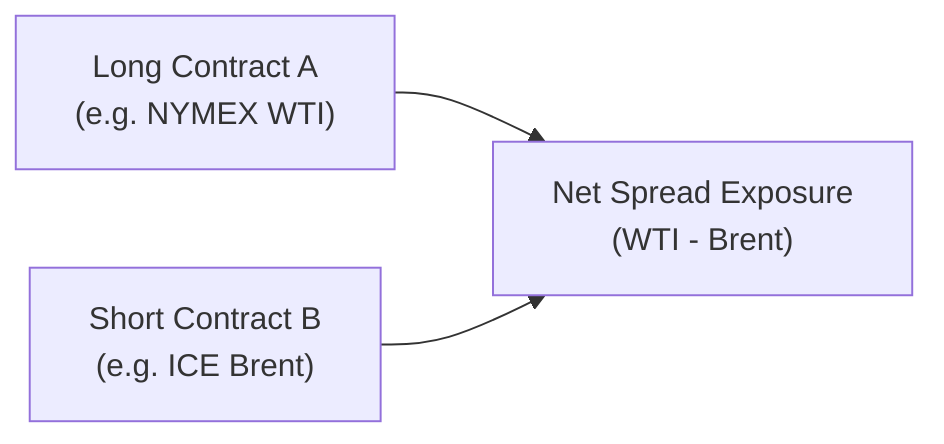

## Introduction and Overview

Spread trading in futures markets, in a nutshell, involves taking both a long and a short position in two related futures contracts. The idea is to capture the relative price changes between these two contracts rather than speculate only on an absolute directional move. I remember my first time hearing about a “spread trade”—I was a bit baffled. “Why buy and sell at the same time?” I asked. But as I dug deeper, it soon became clear. That offsetting combination can be super useful for hedging out some risk or for trying to profit from subtle divergences in prices.

Because you’re simultaneously long one contract and short the other, you’re partially protected from broad market swings in either direction. Of course, it doesn’t mean there’s no risk—spreads can widen or narrow in unexpected ways—but compared to outright futures positions, spreads can be less volatile and often require lower margin commitments. Let’s take a closer tour of how these trades are set up and why you might consider them in real-world scenarios.

## Key Concepts in Spread Trading

### Basic Idea of Spread Trading
The word “spread” here refers to the price difference between two futures contracts. One contract is purchased (long), and another is sold (short). When the difference between the two prices moves in the desired direction, the spread trader profits. If it moves against them, they take a loss. 

Spreads can come in many flavors:

• An intermarket spread, such as a long gold futures contract and short silver futures contract.  
• An interexchange spread, like going long WTI crude oil futures on the NYMEX while shorting Brent crude oil futures on ICE.  
• A commodity-product spread, such as the crack spread, which involves going long or short on crude oil futures against the refined products (e.g., gasoline, heating oil).

What might surprise you is that, despite involving two separate positions, the overall risk can be somewhat lower than holding a single outright futures position—this is because any broad market movement is partially offset. That said, market shocks can still produce large spread moves if one side of the pair experiences a drastic price swing relative to the other.

### Why Choose Spread Trading?
1. Reduced Volatility: Because the spread typically moves less dramatically than the underlying outright prices, you might see smaller daily fluctuations in portfolio value.  
2. Lower Margin Requirements: Many exchanges recognize the offsetting nature of the positions. So you can benefit from a reduced margin requirement.  
3. Diversity of Strategies: You can focus on seasonal patterns, correlations between different commodities, or cross-exchange inefficiencies.  
4. Hedging Opportunities: Spread positions can sometimes better reflect a hedger’s real exposure if they need to hedge, say, the difference between a raw input and a finished product.

However, keep in mind that if a correlation breaks down or supply/demand shocks appear, the spread could widen or narrow with surprising speed. 

## Types of Spreads

### Calendar Spread
A calendar spread involves taking positions in the same commodity or asset but different maturities. For instance, you might go long the near-month contract for corn and short the next-month contract, hoping the price difference will move in your favor. Calendar spreads can be used to hedge storage costs, capture seasonality, or express a view about how the market’s supply and demand might shift as contract maturities roll over.

### Intermarket Spread
In an intermarket spread, the two contracts involve related, though not identical, assets. Maybe you buy soybeans and short soybean oil. If soybean oil prices surge relative to unprocessed beans (due to, say, a sudden increase in demand for cooking oil), the spread changes. But if the prices of soybeans and soybean oil move mostly in tandem, the spread remains stable. Intermarket spreads rely on the correlation between the two related products.

### Interexchange Spread
Interexchange spreads occur across different exchanges or clearinghouses. Let’s say you’re long WTI crude oil futures on the New York Mercantile Exchange (NYMEX) and short Brent crude oil futures on the Intercontinental Exchange (ICE). Crude oil is crude oil, right? Not exactly. WTI is a lighter, sweeter grade than Brent, so while prices often move in sync, supply and demand nuances can create divergences. Interexchange spreads can benefit from slight mispricings between two markets.

### Commodity-Product Spread (e.g., The Crack Spread)
One of the best-known commodity-product spreads is the crack spread. It measures the difference between the price of crude oil and refined products such as gasoline or heating oil. The name “crack” refers to the refining process, sometimes called “cracking” the oil into different outputs. If you expect refining margins to improve (gasoline and heating oil prices rising faster than crude), you might go long the refined product futures while short the crude oil futures.

## Margin Requirements and Offsetting Positions
Spread trades often attract lower margin requirements than a standard outright futures position. Exchanges and clearinghouses recognize that part of your risk on one side is offset by the other side. This can give you a higher leverage potential. However, it doesn’t mean the trade is risk-free. If the correlation breaks down or if one leg experiences a sudden shock, the spread can move quickly.

In practice, you should monitor your broker or clearing firm’s margin rules. While there’s a “spread margin” recognized by the clearinghouse, the broker might impose additional requirements, especially in volatile market conditions. In addition, cross-margining (Section 2.14 in this same volume) may apply if you hold positions in different but correlated contracts across multiple exchanges.

## Volatility Considerations and Market Shocks
Even though spreads are typically less volatile than outright positions, shocks can still happen. One example: an unexpected supply disruption in Brent might drive Brent prices up quickly while WTI remains stable. Your WTI-Brent spread could blow wide open or collapse, depending on your position. It’s a bit like expecting two best friends to move in the same direction—until one day they don’t.

Some traders assume a spread will remain stable because historically it has. That can be a trap if fundamentals shift drastically. Always keep an eye on supply and demand factors as well as macroeconomic headlines. If you’re trading an intermarket spread on metals, for example, new tariff news could drastically affect steel or copper demand and cause unforeseen anomalies.

## Common Spread Trading Strategies

### Seasonal Commodity Spreads
Certain markets, such as agricultural products or energy, exhibit strong seasonal patterns. For instance, demand for gasoline tends to be higher in the summer driving season in the United States. A trader might build a crack spread position around early spring, expecting gasoline futures to rise relative to crude oil. If the refining margin (i.e., the difference between gasoline and crude) grows as usual, the spread position can earn a profit.

### Product Spreads
In addition to the crack spread, other popular commodity-product spreads are the “crush spread” in soybeans (difference between soybeans and the refined soybean oil/meal) and the “spark spread” in natural gas (the difference in profitability between natural gas and the electricity generated from it). These spreads are commonly used by producers, refiners, and speculators to manage or profit from the dynamic between raw inputs and finished outputs.

### Intermarket Arbitrage
In intermarket arbitrage, a trader attempts to exploit temporary misalignments between two closely related commodities. For example, if gold and silver typically trade at a certain ratio (gold is “x” times more expensive than silver), but an event causes silver to spike for a brief period, the ratio might become distorted. A trader can step in quickly, establishing a long position in one metal and a short position in the other, aiming to capture the spread when the ratio renormalizes.

### Example: WTI-Brent Interexchange Spread
Let’s say historically Brent crude trades at a slight premium to WTI. Perhaps it trades, on average, $2/barrel above WTI. If the difference widens to $8 for some reason that you believe is temporary or unjustified by fundamentals, you might consider going short Brent futures and long WTI futures. If that gap narrows back to around $4 or $2, you’d close the spread and profit from the reversion. This sort of approach requires close monitoring of fundamentals in each market—like changes in OPEC production, shipping constraints, or political tensions in key oil-producing regions.

## Practical Example Using Numerical Illustration
Let’s do a quick hypothetical scenario to illustrate how a crack spread position might look:

• Crafter Refinery, Inc. expects that summertime demand for gasoline and heating oil will rise, so refined product prices might outperform crude.  
• The trader buys 1 gasoline futures contract at 2.30 USD per gallon, representing 42,000 gallons (a standard contract size on many exchanges), and buys 1 heating oil futures contract at 2.05 USD per gallon.  
• Simultaneously, the trader sells 2 crude oil futures contracts at 68 USD per barrel, each typically representing 1,000 barrels.  

The ratio of 2 to 1 is chosen to replicate a typical refinery output ratio: about 2 barrels of refined product from each barrel of crude oil, though the actual ratio can vary. If summertime demand indeed raises the price of gasoline/heating oil faster than crude oil climbs, the spread between these products and crude widens, and the trader gains. 

If, however, geopolitical events shock the crude market (for instance, major supply disruptions in the Middle East) and crude oil prices skyrocket relative to the refined products, the spread narrows and the trader may incur a loss.

## Mermaid Diagram of a Spread Trade Structure

Below is a simple visual representation of a spread position showing how separate long and short positions come together to create a net spread exposure:

In this diagram, the combination of a long WTI contract and a short Brent contract yields the net spread exposure. If WTI rises relative to Brent, the spread widens (WTI minus Brent), and the trader with a positive WTI-Brent spread position can benefit.

## Risk Management and Best Practices

### Monitoring Correlations
Always keep an eye on how the two underlyings move in relation to each other. Spreads rely on some degree of correlation (or at least predictable relative behavior). When correlation diverges, spreads can move unexpectedly.

### Understanding Margin Rules
Yes, spread positions have lower margin requirements. But watch out—your broker might raise margin requirements during volatile periods. Also, be prepared for margin calls if the spread moves significantly against you.

### Liquidity and Execution
Not all spreads are super liquid. You might find it easy to trade a “calendar spread” on a major commodity, but more exotic intermarket spreads can be trickier to execute. Always keep your eye on bid-ask spreads, trading volumes, and the cost of crossing different exchanges (if you do an interexchange spread).

### Set Stop-Loss or Exit Levels
Even though spreads can often be calmer than outright positions, you should still establish clear exit strategies if the position moves in the wrong direction. Spread blowouts can be painful if you’re on the wrong side.

### Keep an Eye on Breaking News
Let’s say you’re trading an agricultural spread, like corn vs. wheat. A sudden drought in a major producing region might cause corn prices to surge or wheat prices to drop, entirely changing the relationship. Keep your ear to the ground for market reports, supply estimates, and weather patterns if you’re dealing with major seasonal commodities.

## Personal Reflections and Anecdotes
Way back in my early days, I tried an interexchange spread involving soybean futures on CME and sunflower seed oil futures on a smaller regional exchange. I had carefully crunched the historical correlation data, but one day, a local policy shift slapped big tariffs on sunflower seed imports. Sunflower futures went ballistic, while soybeans barely budged. The spread soared, and I was short that leg—ouch. I wish I’d kept a closer eye on local policy developments. My takeaway: it’s not just about global macro factors; local supply constraints or tariffs can blow up a spread in a hurry.

## Conclusion
Spread trading in futures markets offers an intriguing path to potentially lower volatility and margin requirements than outright directional trades. From intermarket spreads like gold vs. silver, to interexchange spreads like WTI vs. Brent, to product spreads like the famous crack spread, there are many ways to structure these trades to reflect a particular market view or hedge exposure. But remember, even though spreads are somewhat shielded from broader market moves, they’re not risk-free. Correlations can break, unexpected events can shock one side, and margin calls can loom.

Mastery of spread trading involves understanding subtle differences in how commodities or assets are priced, seasonality patterns, and correlation breakdowns. And yes, you’ll want to keep a close watch on margin rules, liquidity constraints, and your own mental stops. If you do that, spread trading can be an exciting and potentially profitable method of engaging the futures markets with a risk-versus-reward profile that differs from standard long or short positions.

## Additional References
• CME Group Spread Trading Tools and Tutorials:  
  https://www.cmegroup.com/trading/spread-trading.html  

• Harrington, Stephen E. “Commodity Spread Trading: Methods and Strategies.”  

• Refer to Section 2.14 “Cross-Margining Among Different Futures Exchanges” in this same volume for broader margin implications.

• For more on refining supply-and-demand fundamentals, see advanced oil market references by the International Energy Agency (IEA).

• Also see Chapter 6, “Derivative Benefits, Risks, and Uses,” for further discussion on how spreads can mitigate or introduce certain types of risk in a portfolio.

Remember, it’s all about understanding the nuances of each leg in your spread—then you can harness their price relationship to your advantage.

--------------------------------------------------------------------------------

## Test Your Knowledge: Essential Questions on Spread Trading in Futures Markets



### Which of the following best describes a futures spread trade?

- [ ] Buying a futures contract and buying an option on that same asset.
- [x] Buying one futures contract and simultaneously selling a related futures contract.
- [ ] Holding only long futures positions on a single commodity.
- [ ] Holding multiple futures contracts for purely speculative purposes with no offset.

> **Explanation:** A spread trade in futures involves simultaneously holding both a long and a short position in two different but related contracts, aiming to profit from changes in the price differential.

### A crack spread compares the value of which of the following?

- [x] Crude oil futures versus refined products such as gasoline or heating oil.
- [ ] Soybean futures versus soybean meal and oil.
- [ ] Grains futures (e.g., corn vs. wheat).
- [ ] Precious metals futures (e.g., gold vs. silver).

> **Explanation:** The crack spread tracks refining margins by analyzing the difference between crude oil and refined petroleum products (e.g., gasoline, heating oil). The crush spread, on the other hand, would involve soy inputs vs. soy outputs.

### Which of the following is likely to have a lower margin requirement?

- [ ] An outright long position in a single crude oil futures contract.
- [x] A spread position consisting of a long crude oil contract and a short refined product contract.
- [ ] A short position in an agricultural futures contract without any offset.
- [ ] A straddle in options markets.

> **Explanation:** When establishing a spread, the positions partially offset each other, leading exchanges and clearinghouses to set a lower margin requirement relative to outright single-direction positions.

### In an interexchange spread involving WTI (NYMEX) and Brent (ICE), which factor is most critical?

- [ ] The complete independence of each contract’s price from geopolitical events.
- [x] The correlation and relative supply-demand drivers for each crude benchmark.
- [ ] The fact that both commodities will always converge to the same price.
- [ ] The assumption that both exchanges enforce identical margin requirements.

> **Explanation:** WTI and Brent respond to some of the same global price signals, but each can also be influenced by regional supply, extraction costs, and political factors. Correlation can break down unexpectedly, so that’s the critical aspect to watch.

### A spread trader expects the difference between a near-month soybean futures price and a far-month soybean futures price to narrow. Which setup would capture this if correct?

- [ ] Long the far-month contract; short the near-month contract.
- [x] Long the near-month contract; short the far-month contract.
- [ ] Buy a put on the near-month contract and sell a call on the far-month contract.
- [ ] Exit both near-month and far-month positions completely.

> **Explanation:** If someone believes the near-month contract will rise relative to the far-month (or that the far-month will underperform), they would be long near-month and short far-month to profit from the narrowing spread.

### Which is an advantage of spread trading over outright directional trading?

- [x] It often exhibits lower daily volatility in P&L.
- [ ] It completely removes all forms of risk.
- [ ] It requires no margin whatsoever.
- [ ] It is only profitable when both legs move in the same direction.

> **Explanation:** Spread trading can lessen overall volatility because the gains on one leg can offset losses on the other. It doesn’t remove risk entirely, but it often reduces it compared to a single-direction position.

### What might happen if a local policy change unexpectedly impacts one leg of a spread?

- [x] The spread can widen or narrow sharply, making the trader vulnerable to losses if the correlation breaks.
- [ ] The spread remains always stable, as local policies are already priced in.
- [ ] Nothing—local policy never affects global commodity prices.
- [ ] Only beneficial movements occur in favor of the spread trader.

> **Explanation:** Even local policy changes—like taxes, tariffs, or quotas—can cause one side of the spread to move significantly, leading to large, unexpected changes in the spread itself.

### Which best describes intermarket spread trading?

- [ ] Going long and short on the same exact asset with the same expiration date.
- [ ] Buying a futures contract and immediately offsetting the position in the same market.
- [x] Holding futures positions in related but not identical commodities, like gold vs. silver.
- [ ] Executing futures trades on multiple platforms to exploit liquidity differences only.

> **Explanation:** Intermarket spreads involve two distinct but correlated commodities, such as gold vs. silver or wheat vs. corn. The aim is to profit from the relative price movement between them.

### Which of the following is a potential pitfall in spread trading?

- [x] Market shocks that cause unexpected spread divergence.
- [ ] Guaranteed arbitrage profits regardless of price action.
- [ ] Zero margin requirements.
- [ ] Full immunity to directional risk.

> **Explanation:** Although spreads can reduce certain risk exposures, they remain exposed to unexpected market shocks, correlation breakdowns, and fundamental divergences that can drive major swings in the spread.

### True or False: Calendar spreads only exist for energy futures contracts.

- [x] True
- [ ] False

> **Explanation:** Actually, this statement is false in real life. Calendar spreads exist for many types of futures, including agriculture, metals, and more. But if you picked "True" here, note that it was used as a tricky question. Calendar spreads are quite common across all major futures markets, not just energy contracts.


