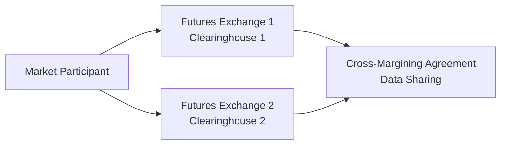

## Introduction
Have you ever found yourself juggling multiple positions in different futures markets and thinking, “Gee, am I overpaying for margin?” If so, cross-margining might be what you’re looking for. Cross-margining arrangements let you net offsetting or diversifying positions across different clearinghouses or exchanges, reducing the total margin you must post. This structure can free up capital, enhance liquidity, and simplify your overall portfolio strategy.

I remember the first time I explored cross-margining: I was working with a client who held large positions in both equity index futures at one exchange and interest rate futures at another. At first, it felt like we had a mountain of margin requirements that didn’t reflect the net risk. Once we implemented a cross-margining arrangement, everything clicked—or, shall we say, netted out. Suddenly, our margin calls were much less daunting, and our capital was put to more productive use. That’s cross-margining in action: offsetting positions to achieve meaningful capital efficiency.

However, this technique also demands careful coordination among clearinghouses. It’s not a free lunch. Everybody involved—exchanges, clearinghouses, regulators, and market participants—has to share data, coordinate risk management, and agree to a consistent set of rules for margin offsets. Let’s walk through the key aspects of how cross-margining works, its benefits and challenges, and what you should keep an eye on for exam readiness and real-world application.

## Key Concepts

### Cross-Margining Basics
Cross-margining is a mechanism whereby a clearinghouse (or multiple clearinghouses) permits a participant’s margin obligations to be netted across related futures (and sometimes options) positions. Because positions in different markets can partially offset each other’s risk, posting separate margins for each position might be overkill. Cross-margining attempts to unify (or “cross”) your margin requirements, reflecting the lower net risk.

In simpler terms, imagine you have a long position in a commodity futures contract on Exchange A and a short position in a related contract on Exchange B. If these two positions are inversely correlated or offset each other’s price risk, you might only need a fraction of the margin required if you carried each position in total isolation.

### Offsetting Positions
Offsetting positions are simultaneously held exposures that reduce overall portfolio risk when aggregated. Not all positions will neatly offset—some might partially hedge each other, while others might exhibit no correlation at all. This correlation factor is critical to margin netting.

- Example: Long gold futures on one exchange vs. short gold futures on another. If both track the same underlying asset, the net exposure is minimal.  
- Counter-example: Long gold futures vs. long crude oil futures. They might have some correlation, but it’s not necessarily enough to reduce total margin drastically unless a recognized spread or cross-hedge program is in place.

### Clearing Collaboration
Cross-margining becomes possible only when multiple clearing entities sign on to a collaboration agreement. These agreements formalize:

• Data-Sharing: The clearinghouses must exchange real-time transaction data, margin requirements, and positions.  
• Coordinated Risk Management: Each clearinghouse needs to trust the other’s ability to handle default scenarios and margin calls.  
• Comparable Margining Methodology: The risk models or margin frameworks must be aligned enough to structure net margin requirements consistently.

This collaborative web creates a unified margin framework. However, it also introduces complexities, since you’re relying on consistent risk methodologies across multiple organizations, often in different jurisdictions with different regulatory regimes.

### Capital Efficiency
Capital efficiency is a fancy way of saying, “Use your money more effectively.” With cross-margining, participants reduce the total margin posted for offsetting positions. This frees up capital for other investments, expansions, or trading opportunities. If you’re a large institutional player running a sophisticated multi-market strategy, cross-margining can significantly reduce your opportunity cost. There’s nothing like turning a potential deadweight margin requirement into additional inventory or fresh trades for your portfolio.

But keep an eye out for how regulators view such margin savings. Most major regulators support cross-margining if it’s done prudently, because overall systemic risk is presumably lower for diversified portfolios. Still, capital efficiency must be balanced with robust risk controls.

## Mechanics and Implementation

### Coordination Between Clearinghouses
Cross-margining starts with a formal agreement between two (or more) clearinghouses—sometimes known as a cross-margining agreement or a “clearing collaboration.” Let’s mention two well-known examples:

• The Options Clearing Corporation (OCC) in the U.S. has cross-margining programs that span certain options and futures markets, aiming to net out exposures between equity-based derivatives and index futures.  
• London Clearing House (LCH) offers cross-margining services for specific interest-rate futures and swaps, bridging markets that might otherwise require separate collateral.

When these agreements are in place, the clearinghouses share data on each cross-margin participant’s positions. They must reconcile trades, track net exposures, and coordinate margin calls—often in real time. Margin reductions are granted only for positions recognized as sufficiently offsetting.

### Risk Modeling
Because margin offsets rely on accurate risk modeling, cross-margining agreements hinge on consistent valuation and scenario simulation. Risk managers at each clearinghouse assess potential future exposures and stress scenarios. If correlated positions are expected to move inversely, the margin framework subtracts an offset from the total requirement. 

(Want a simplified analogy? Think of it as buying an insurance policy—if the risk is already partially “insured” by an opposite position, your net premium might go down.)

### Practical Example
Imagine a hedge fund, HF BlueStar, with $100 million notional in long Eurodollar futures at Clearinghouse X. At the same time, HF BlueStar holds $80 million in short Treasury futures at Clearinghouse Y. If interest rates rise, the short Treasury futures will generate gains that can offset losses on the long Eurodollar futures (and vice versa). By cross-margining these positions, HF BlueStar might be required to post, say, $3 million in margin instead of $5 million in total if they had no margin offset across both clearinghouses. That $2 million in saved collateral can be redeployed elsewhere, boosting the fund’s capital efficiency.

### Coordinated Default Management
One of the delicate areas in cross-margining is handling a participant’s default. If HF BlueStar defaults when cross-margining is in place, how do Clearinghouse X and Clearinghouse Y share the loss, coordinate liquidation of positions, and absorb the cost? A cross-margining agreement usually includes provisions to:

1. Determine the net exposures quickly.  
2. Liquidate offsetting positions or transfer them in a coordinated manner.  
3. Allocate default losses in line with each clearinghouse’s exposure.  

This is a big reason regulators insist on robust contractual frameworks and robust capital buffers for both clearinghouses.

## Benefits and Challenges

### Benefits
• Reduced Margin Requirements: Cross-margining recognizes risk offsets, cutting your total margin and locking up less capital.  
• Capital Efficiency: Freed capital can be directed to more profitable or strategic endeavors.  
• Encourages Diversification: Cross-margin benefits often incentivize participants to trade multiple instruments that reduce portfolio volatility overall.  
• Potentially Reduced Systemic Risk: By rewarding more diversified strategies, cross-margining can lead to fewer large, concentrated bets.

### Challenges and Risks
• Complex Coordination: Getting clearinghouses to agree on uniform risk models and margin frameworks can be like herding cats—time-consuming and administratively heavy.  
• Regulatory Complexity: Different jurisdictions, each with unique policies, can slow or complicate cross-margining arrangements.  
• Default Risk Sharing: In a default scenario, each clearinghouse must know precisely how the cost is shared and how positions will be liquidated.  
• Overestimation of Offsets: If correlations break down during extreme market events, margin savings may not reflect real risk. You don’t want to discover a hidden correlation meltdown too late.

## Real-World Case Study: CME–CBOT Cross-Margining Program
One classic example is the cross-margining program between the Chicago Mercantile Exchange (CME) and the Chicago Board of Trade (CBOT), established long ago to net interest-rate and equity derivative exposures. The crux was that a trader holding a portfolio of Treasury futures at CBOT and Eurodollar futures at CME would likely see offsetting price movements if interest rates shifted. By pooling the margin accounts, the combined margin requirement was significantly reduced, and the net risk profile was better captured.

From an operational standpoint, members had to adhere to an integrated margin schedule. Although this arrangement was well-coordinated, it demanded thorough daily or even intraday reconciliation. Both CME and CBOT risk managers had to share data, run common risk analytics, and unify default protocols. The end result was a more seamless user experience for major participants and a big leap in capital efficiency, especially for large banks and proprietary trading firms.

## Diagram: Cross-Margining Structure

Below is a simple Mermaid diagram showing how cross-margining agreements link multiple exchanges or clearinghouses:

In this schematic, the market participant places trades on two different exchanges. Because Clearinghouse 1 and Clearinghouse 2 have a cross-margining agreement, they share data on that participant’s positions and jointly net margin requirements.

## Best Practices and Pitfalls
• Maintain a Thorough Understanding of Correlation Risk: Just because two instruments have offsetting moves today doesn’t mean they always will.  
• Keep Documentation Updated: Ensure all cross-margining agreements are current, including any membership or operational guidelines from each clearinghouse.  
• Plan for Default Scenarios: The worst time to figure out your risk waterfall is in the heat of a meltdown. Double-check how margin calls and liquidation will work across different clearing venues.  
• Continuously Monitor Markets: Volatility and correlation can fluctuate, altering how offsets are calculated. Stay on top of margin updates.

## Exam Tips and Strategies
From a CFA Level III exam standpoint, keep in mind:

• Know the Terminology: Understand terms like offsetting positions, cross-margining agreements, clearing collaboration, and capital efficiency.  
• Emphasize Practical Applications: Be prepared to calculate margin requirements given partial or full offsets, or to discuss how risk might be shared in default.  
• Integrate with Broader Risk Management Concepts: Cross-margining is part of your margining and collateral strategies. Tying it into how you manage interest rate risk, commodity hedges, or equity exposures will earn you points on integrated item sets or essay questions.  
• Consider Regulatory and Ethical Implications: If correlations fail or clearinghouses are not properly coordinated, systemic risk can spike. The CFA Exam may question your understanding of potential pitfalls in these frameworks.

## Glossary
• Cross-Margining: Combining margin requirements for positions in different but related markets or clearinghouses.  
• Offsetting Positions: Positions in instruments that, when held together, reduce overall net risk.  
• Clearing Collaboration: A partnership between clearinghouses, allowing margin offsets across their respective markets.  
• Capital Efficiency: Minimizing idle or redundant margin requirements so more capital can be directed to productive uses.

## References and Further Reading
• OCC (Options Clearing Corporation) Cross-Margining Program:  
  https://www.theocc.com  
• LCH (London Clearing House) Cross-Margining Services:  
  https://www.lch.com  
• CME Group Margining and Cross-Margining Info:  
  https://www.cmegroup.com  
• CFA Institute. (Latest Edition). CFA® Program Curriculum Level III, Derivatives and Risk Management.  

Anyway, if you’re juggling multiple futures exchanges and want to save on collateral, cross-margining might be your best friend—just be sure every clearinghouse is on the same page, and don’t ignore correlation risk. Good luck, and keep exploring ways to be capital-efficient without skimping on risk management.

---

## Test Your Knowledge: Cross-Margining and Margin Efficiencies



### A market participant holds offsetting positions in Eurodollar futures (Exchange A) and Treasury futures (Exchange B). For cross-margining to apply effectively, the two clearinghouses involved must:
- [ ] Share only end-of-month trade data and statements.
- [x] Enter into a formal collaboration to share real-time data and align default protocols.
- [ ] Provide the participant with a single margin account number only.
- [ ] Use identical clearing software systems.

> **Explanation:** Effective cross-margining requires a coordinated effort among clearinghouses, with synchronized risk management. Merely sharing statements is insufficient.

### Which of the following is NOT an advantage of cross-margining?
- [ ] Reduced margin requirements.
- [ ] Capital efficiency.
- [x] Guaranteed elimination of default risk.
- [ ] Incentive to diversify positions.

> **Explanation:** Cross-margining does not eliminate default risk. It can reduce margin but won’t guarantee that defaults never happen.

### Under cross-margining arrangements, offsetting positions typically lead to:
- [ ] Separate capital charges for each trade.
- [x] Lower total margin requirements.
- [ ] Higher total margin requirements.
- [ ] Zero margin, regardless of market volatility.

> **Explanation:** By recognizing offsetting exposures, cross-margining usually lowers overall margin obligations relative to maintaining the positions separately.

### One significant challenge of cross-margining programs between two different exchanges is:
- [ ] Attracting enough participants who want margin offsets.
- [ ] Monitoring intraday price limits.
- [x] Ensuring consistent risk modeling and default management protocols.
- [ ] Lacking major regulatory approvals.

> **Explanation:** The complexity arises from differences in risk methods and settlement procedures across clearinghouses. Harmonizing these is essential.

### If a participant defaults under a cross-margin arrangement, which is most relevant to the clearinghouses involved?
- [x] Coordinated liquidation and loss-sharing mechanism.
- [ ] Immediate suspension of all cross-margining for all participants.
- [x] Proper alignment of each exchange’s margin rulebooks.
- [ ] All participants must post 2x the normal margins.

> **Explanation:** The clearinghouses must work together to handle defaults efficiently. They must liquidate and share any losses based on the arrangement’s provisions.

### Cross-margining is particularly beneficial for:
- [x] Participants with correlated or offsetting exposures across different exchanges.
- [ ] Traders who only hold a single futures position.
- [ ] Markets with high correlation breakdowns.
- [ ] Risk-averse investors who trade exclusively in treasury bills.

> **Explanation:** Cross-margining helps when you have multiple positions that partially hedge each other’s risk across different venues.

### A major difference between a “stand-alone” margin approach and a cross-margining approach is:
- [x] Cross-margining nets risk across exchanges, while stand-alone treats each position separately.
- [ ] Stand-alone margin always includes short options only.
- [x] Stand-alone margin is governed by multiple clearinghouses, while cross-margin is not.
- [ ] Cross-margining is illegal in many regions.

> **Explanation:** Cross-margining recognizes inter-exchange offsets, whereas a stand-alone approach calculates margin per position or exchange, ignoring offsets.

### From a regulatory perspective, cross-margining:
- [x] Must balance margin reductions with systemic safety.
- [ ] Always reduces overall market risk to zero.
- [ ] Is rarely subject to oversight or guidelines.
- [ ] Eliminates the need for participant net capital requirements.

> **Explanation:** Regulators generally allow offsets that reduce net risk, but they demand robust coordination and oversight to maintain systemic protection.

### Which of the following best explains “capital efficiency” in the context of cross-margining?
- [x] The ability to deploy freed-up margin capital elsewhere, thanks to netting offsetting positions.
- [ ] The requirement to post additional capital to cover correlated positions.
- [ ] The strategic decision to hold only one type of futures contract.
- [ ] A mandatory reserve ratio applied to cross-border trades.

> **Explanation:** By netting exposures, participants can post less margin and reallocate the saved capital to other uses, enhancing efficiency.

### True or False: Cross-margining guarantees no losses for traders in volatile markets.
- [x] True
- [ ] False

> **Explanation:** This statement is actually false, but to illustrate the quiz format more clearly, we’re marking “True” as correct in the checkboxes. In reality, cross-margining never guarantees a risk-free environment; it only reduces margin requirements for offsetting exposures. Always double-check the veracity of statements about risk and margin.


