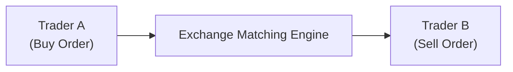

## Overview and Context

So, let’s talk about the futures market microstructure—basically, the internal plumbing that makes everything tick. You might recall from earlier sections (e.g., Section 2.2 on Futures Contracts: Marking to Market and Margins) that futures trading involves standardized contracts, margining, and daily settlement. But behind the scenes, there’s an extensive ecosystem of participants, a complex order-matching process, and a tapestry of rules and protocols designed to ensure fairness and efficiency.

Broadly, when we talk about “market microstructure,” we’re referring to how orders get matched, how prices are formed in the very short term, and how participants interact with each other in what can be truly fast-paced settings. Whether you’re a commercial hedger, a high-frequency trading firm, or simply a curious observer, understanding this framework can help you gauge transaction costs, manage slippage, and avoid pitfalls. It’s also quite relevant to other areas of derivatives—like those covered in Chapter 4 on Options or Chapter 6 on Risk Management—since microstructure influences everything from your hedging effectiveness to the cost of rolling over a position.

Below, we dive into the details of how a central limit order book (CLOB) operates, how trades are prioritized, and which types of participants come together to create the deep liquidity we often enjoy in major futures markets. Let’s jump in.

## Central Limit Order Book (CLOB)

One of the focal points of modern futures trading is the central limit order book (CLOB). The CLOB is basically a big list (or electronic ledger) of all currently active buy and sell orders. Each order includes:

• Price: The limit price at which a participant is willing to buy or sell.  
• Quantity: The number of futures contracts.  
• Identification markers like time stamp and order type.

When you submit, say, a limit order to buy five S&P 500 futures contracts at a certain price, that order goes into the central limit order book. The system displays this order to everyone (though your identity is kept anonymous) so they can see there’s a willingness to buy at that price.

### How Orders Flow

Imagine you’re Trader A, placing a limit buy order. If your price is at or above some existing sell limit order’s price, a match occurs, and a trade is executed instantly. If not, your order simply ‘sits’ in the book. The same is true in reverse for Trader B, placing a limit sell order.

Here’s a quick look at the flow in simplified diagram form:

In this schematic:

• “Trader A (Buy Order)”: Places an order to buy.  
• “Exchange Matching Engine”: Maintains the order book and matches buy/sell orders.  
• “Trader B (Sell Order)”: Places an order to sell (possibly resting or incoming).

When price and quantity conditions match, the transaction happens—then you, Trader A, get your futures contract, while Trader B is matched on the sell side. That’s how straightforward it can look in theory, but real-world operation is obviously spicier when we account for thousands of simultaneous orders.

## Price/Time Priority

Now, who gets matched first when multiple traders want to buy or sell at the same price? Welcome to the rule of price/time priority:

1. Orders are ranked by their price relative to the best available quotes. Orders at the most competitive price (e.g., highest bid or lowest ask) receive top priority.  
2. Among orders at the same price level, the earliest order entered receives priority over later ones.

This can matter a lot if you’re, say, a high-frequency shop or an aggressive algorithmic trader. A single microsecond difference in time stamp can be the difference between filling your order at the desired price or having to accept a worse fill.

As you might guess, this can affect your risk, especially if you’re implementing large hedges. The speed at which you can get the “best seat in the order book” is sometimes crucial.

## Key Market Participants

### Commercial Hedgers

Commercial hedgers are those who produce, process, or otherwise handle the physical underlying commodity. They use futures primarily to manage price risk. For an energy company hedging crude oil costs or a global corporation hedging currency exposures, timely and efficient execution means everything. They often place large orders that can move the market.

### Institutional Investors

Think mutual funds, pension funds, endowments, or specialized hedge funds. These participants might use futures to gain quick exposure to a market (like equity index futures) or to hedge a large portfolio. Institutional flows can be significant. You’ll often see them in big bursts—like rolling stock index futures at quarter end.

### Dealers and Market Makers

Market makers provide both buy and sell quotes and aim to capture the bid-ask spread as profit. They’re essential for liquidity. Dealers, in many cases, might warehouse risk for short periods or offset it rapidly in the open market. Because they’re active on both sides of the market, they typically rely on speed, technology, and robust risk models to remain profitable.

### Algorithmic Traders and High-Frequency Traders

These participants trade at lightning speeds, submitting and canceling orders within microseconds (or even nanoseconds). Their strategies range from market making, arbitrage, statistical analysis, or simply reacting to real-time news and pricing anomalies. They rely heavily on an uninterrupted feed from the exchange, advanced colocation facilities (where their servers sit physically near the exchange’s servers), and frictionless connectivity.

### Speculators

These are participants looking to profit purely from price movements. They may not have any underlying asset to hedge. Speculators offer liquidity by taking the opposite side of trades initiated by hedgers. Some speculators hold positions for the long term; others might hold them for minutes or seconds. The presence of both retail and professional speculators adds diversity to market flows.

## Electronic Trading Platforms

Once upon a time, all futures trades happened in open outcry pits—just watch a few older videos to see the fascinating shouting and frantic hand signals. Today, many futures exchanges, such as the CME, Euronext, or ICE, almost exclusively operate through electronic platforms. The shift to electronic trading brought:

• Increased speed: Orders are matched in milliseconds.  
• Higher volumes: More participants can access global markets at any hour.  
• Lower transaction costs: Reduced need for human intermediaries.  
• Algorithmic and high-frequency capabilities: Automated systems that analyze market data and place trades in real time.

It might feel like a slightly calmer environment now that traders aren’t physically pushing each other in a trading pit, but let’s not kid ourselves: the competition to place the best-priced order is still fierce, just in digital form.

## Bid-Ask Spread and Market Liquidity

When you look at any standard order book, you’ll notice there is a “bid” price from potential buyers and an “ask” (or “offer”) price from prospective sellers. The difference between them is the bid-ask spread, which some consider a direct measure of transaction cost.

Key influences on bid-ask spreads include:

• Liquidity: Highly liquid contracts (e.g., major equity index futures) tend to have narrower spreads. Thinly traded contracts can have wide spreads.  
• Volatility: In times of high volatility, dealers or other liquidity providers may widen their quotes to compensate for increased risk.  
• Time of Day: When major markets (like the U.S. equity market) are closed, you might see wider spreads in equity index futures.

### Market Depth

Market depth describes how much volume is sitting at each price level in the order book. If you’re trying to place a large order but the depth is insufficient, you might push the price significantly in your direction—resulting in slippage. That’s a big deal for large institutional trades or, for instance, when a commercial hedger wants to buy thousands of crude oil contracts at once.

## Slippage: The Hidden Cost

Slippage is the difference between the price you expected to pay for a trade and the actual price you end up paying. If you’re looking to buy 500 contracts when only 100 are available at your desired price, well, you’ll “eat through” that top level of the order book and keep matching with higher or less favorable ask prices.

### Practical Example

Let’s say you see the E-mini S&P 500 futures best ask at 4,500.00 for 50 contracts. You decide to buy 200 contracts at market:

1. The first 50 contracts fill at 4,500.00.  
2. The next 75 might fill at 4,500.25.  
3. Another 50 might fill at 4,500.50.  
4. The final 25 might fill at 4,500.75.  

Your effective average cost is well above 4,500.00, so the difference between that 4,500.00 “quoted” price and your final average fill price is your slippage.

It can be surprisingly large, especially if the market is moving quickly or you’re dealing with less liquid contracts. Advanced execution strategies—like iceberg orders, algorithms (TWAP, VWAP), or direct negotiation with a block order facility—may help mitigate this cost.

## Identifying Liquidity Pockets

Electronic markets can exhibit pockets of liquidity at certain times of day or around certain price levels. Perhaps you’ll see a “big figure” (a round number like 4,500 for an equity index) that often houses large orders because participants psychologically anchor around that number. Sometimes, participants place hidden or iceberg orders at those big figures, so the visible depth might differ from real depth.

We also see dynamic changes in liquidity around key economic data releases—like Non-Farm Payrolls or Federal Reserve policy announcements—when the entire book might shift or thin out temporarily to avoid the risk of large slippage during periods of rapid price swings. Understanding these patterns can help you:

• Time your trades to capture the best liquidity.  
• Avoid big market-moving periods if your priority is cost efficiency.  
• Manage risk around event-driven volatility.

## Influence of Algorithmic Trading

Algorithmic traders play a crucial role in shaping microstructure. Besides providing liquidity, they rapidly update quotes based on real-time market data. This can shrink or widen the bid-ask spread in response to market events. On the flip side, aggressive short-term algorithms might cause fleeting price dislocations or “mini-flash crashes” if the order book is unusually thin.

Regulations often require automated firms to keep their systems tested and their quotes firm, reducing the risk of “quote stuffing” or erroneous trades. As you’ll remember from Section 1.12 on Automated Trading and High-Frequency Trading Environments, these evolving regulations aim to keep markets fair and stable.

## Execution Strategies and Market Microstructure

A trader’s awareness of market microstructure can influence execution decisions:

• Limit Orders: Protect you from adverse fills but carry non-execution risk.  
• Market Orders: High chance of immediate execution but can cause slippage in a shallow market.  
• Stop Orders: Convert to market orders when triggered; can slip dramatically during volatile times.  
• Algorithmic Orders (TWAP, VWAP, IS, etc.): Slice large trades over time to minimize market impact.  
• Dark or Block Pools: While more common in equity markets, some institutional participants negotiate large futures trades off-exchange, then report. This can reduce market impact but must adhere to exchange and regulatory rules (e.g., Exchange for Physical (EFP) transactions in futures, covered in Section 2.11).

## Regulatory Environment and Clearinghouses

As with all derivatives, futures trades must go through a clearinghouse that guarantees the financial obligations of both buyer and seller. Chapter 1.5 discusses the role of clearinghouses extensively. From a microstructure angle, clearinghouses help ensure that once your order is filled, there’s minimal risk of counterparty default. This in turn supports robust liquidity since participants trust they’ll get paid.

Regulators around the globe, including the Commodity Futures Trading Commission (CFTC) in the US, oversee market structure, looking to prevent manipulative behaviors like spoofing (placing orders with the intention to cancel them before execution). They also outline rules for order transparency, best execution, and investor protections.

## Cross-References and Broader Applications

• In Chapter 6 (Derivative Benefits, Risks, and Uses), you’ll see how microstructure can affect your hedging outcomes—especially if you’re trading large positions or operating in less liquid contracts.  
• Chapter 7 (Arbitrage, Replication, and Cost of Carry) delves into arbitrage strategies that rely heavily on short-term discrepancies. Microstructure can either enable or hinder these trades, depending on liquidity and transaction costs.  
• In Chapter 8 (Pricing and Valuation of Forwards and Futures), we see that the cost of carry model typically assumes frictionless markets. In reality, churn and slippage can cause your actual net payoff to deviate from the textbook formula.

## Personal Anecdote

I still remember the first time I was part of a large trade where we wanted to buy an unusually big chunk of agricultural futures. We assumed we were safe because the usual volume was “huge.” However, right when we placed the order, data on the next day’s crop estimate was leaked, and half the market paused to rethink their positions. Our liquidity evaporated, the ask jumped, and we ended up paying a noticeable premium. It was, well, an expensive lesson in timing and liquidity scouting.

## Best Practices and Common Pitfalls

• Avoid Large Market Orders in Illiquid Periods: Use limit or algorithmic orders to manage fill prices.  
• Watch for Event Risk: Around major announcements, liquidity can evaporate.  
• Maintain Real-Time Data Feeds: If your view on the order book is delayed or incomplete, you’re at a disadvantage—particularly in fast markets.  
• Monitor Depth, Not Just Top of Book: A contract might look liquid if the best bid/ask is tight, but if there’s little volume behind that top level, slippage can be dramatic.  
• Don’t Underestimate Infrastructure: If you’re co-located close to the exchange, you might get your orders in front of others, but you’ll pay for that advantage.  

## Exam Tips

• The CFA Level I exam typically emphasizes straightforward definitions and initial applications. Yet, it’s worth noting that microstructure complexities may appear in scenario-based questions—especially for how hedgers or speculators manage their order entries.  
• Remember the definitions in the glossary (like CLOB, slippage, price/time priority). The exam might ask to differentiate between limit orders versus market orders in a microstructure context.  
• Realize that while high-frequency trading is more advanced, you might still see questions about how it contributes to liquidity and helps define prices in normal times—versus how it can amplify volatility during flash crashes.  
• Expect item-set questions that test your awareness of how order size, timing, and type (market vs. limit) can impact final execution prices.  

## References

• DeGennaro, Ramon P. (Various Research Articles on Market Microstructure)  
• CME Group. “Order Types & Order Book Mechanics.” Exchange Official Guides.  
• Euronext and ICE official documentation on order matching and trading rules.  
• See also references in Chapters 1.3 (Derivative Markets and Participants) and 2.2 (Futures Contracts, Margins).

--------------------------------------------------------------------------------

## Test Your Knowledge: Microstructure of the Futures Market



### In a central limit order book, orders with the same price are matched based on which of the following rules?
- [ ] Quantity Levels
- [x] Arrival Time
- [ ] Random Draw
- [ ] Margin Requirements

> **Explanation:** In a CLOB system, price/time priority applies. After matching on price, the order that arrived earliest gets executed first.

### Which of the following participants primarily trades futures to manage production and usage price risks?
- [ ] High-Frequency Traders
- [ ] Speculators
- [x] Commercial Hedgers
- [ ] Market Makers

> **Explanation:** Commercial hedgers are producers or users of the underlying commodity or asset. They enter futures markets to lock in prices and hedge price risk.

### If a large market buy order consumes all the contracts at the current best ask and then continues matching with higher-priced offers, the trader has experienced:
- [ ] Front-running
- [ ] Price Manipulation
- [x] Slippage
- [ ] Arbitrage

> **Explanation:** Slippage is the difference between the expected transaction price and the actual price resulting from insufficient liquidity at the best quote.

### What factor would most likely lead to a wider bid-ask spread in futures?
- [x] High implied volatility
- [ ] Increased market maker participation
- [ ] Very high trading volume
- [ ] Deep market depth

> **Explanation:** Wide spreads often occur when volatility is high, because market makers and liquidity providers demand compensation for bearing risk.

### Which trading strategy is most susceptible to large negative price impact if the market is thin?
- [x] A large market order placed in a single batch
- [ ] A small limit order placed just at the best bid
- [x] An iceberged VWAP algorithm
- [ ] A stop-limit order placed below the current price

> **Explanation:** Large market orders in a thin market are likely to drive the price away from the best quote levels as they sweep the order book.

### When multiple traders place orders at the same price, the first order entered has priority for execution. This is an example of:
- [x] Time Priority
- [ ] Price Improvement Rule
- [ ] Best Execution Requirement
- [ ] Market On Open Preference

> **Explanation:** Time priority means the earliest order at a particular price level is matched first.

### Which of the following is NOT typically considered a reason for algorithmic trading to improve market microstructure?
- [ ] Enhanced liquidity
- [x] Guaranteed profit for all high-frequency strategies
- [ ] Faster quote updates
- [ ] Narrower spreads in stable conditions

> **Explanation:** Algorithmic trading can help liquidity and tighten spreads, but it cannot guarantee profit for all high-frequency participants.

### In futures markets, which participant is most likely to hold offsetting long and short orders continuously and profit from the bid-ask spread?
- [ ] Institutional Investor
- [ ] Commercial Hedger
- [ ] Retail Trader
- [x] Market Maker

> **Explanation:** Market makers typically place both buy and sell orders around current prices to earn the spread between bids and asks.

### During major economic announcements, liquidity often:
- [ ] Remains unchanged due to stable volatility
- [x] Decreases temporarily as many traders pull orders
- [ ] Increases dramatically because everyone wants to trade
- [ ] Gets locked by exchange halts

> **Explanation:** Right before and immediately after big news releases, many market participants remove or modify their orders, leading to lower displayed liquidity.

### True or False: A central limit order book in futures markets ensures that all trades are made at the best possible price without any transaction cost.
- [x] True
- [ ] False

> **Explanation:** A central limit order book matches orders by price/time priority, which generally leads to the best possible price. However, transaction costs (e.g., commissions and potential slippage) still apply, so “best possible price” does not mean “no cost.” Despite the phrase “without any transaction cost,” the matching engine does not remove brokerage fees or slippage; it only ensures fair priority in matching.


