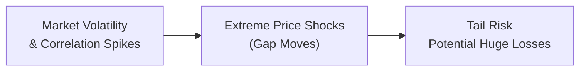

## Introduction
Tail risk in futures trading might sound like a fancy buzzword, but trust me—it’s very real and can be a game-changer in how we manage our market exposure. In the simplest of terms, tail risk deals with the possibility that what we think of as rare—or even downright impossible—price movements suddenly become real. Think of that “strange once-in-a-decade meltdown” in the markets, except it arrives out of the blue on a quiet Tuesday morning.

I actually remember a friend of mine who’d built a smooth track record trading crude oil futures using meticulously placed stop-loss orders. Then, one day, crude prices gapped down on a major supply announcement; his stop orders didn’t trigger anywhere near his intended levels. By the time he exited, the position was severely underwater. That’s a classic example of tail risk manifested in a single, stressful moment.

Futures contracts, being highly leveraged instruments, can amplify these sudden, large price moves. In normal market conditions, we might rely on things like moderate volatility or stable correlations. But in times of stress—when correlations jump toward 1 and illiquidity rears its head—traditional risk management models can fail spectacularly. This section aims to demystify tail risk in futures, showing you what it is, why it happens, and how you can prepare to navigate these stormy market waters.

## Understanding Tail Risk
Tail risk is the risk of outcomes in the extreme “tails” of a probability distribution. Most standard risk models (like a normal distribution) heavily discount the likelihood of such extreme moves. In real markets, however, these moves occur more often than a normal distribution would predict. The 2008 financial crisis, the 2020 pandemic-driven sell-offs, and major geopolitical surprises are all testaments to those heavier-than-expected tails.

• Rare but Severe Events: Tail events don’t happen daily, but when they do, they can tear through a portfolio’s risk controls.  
• Non-Normal Distributions: Market returns often exhibit “fat tails,” meaning high-magnitude moves are more frequent than predicted by a simple normal (Gaussian) model.  
• Positive vs. Negative Tail Risk: In theory, one could experience extreme gains (a positive tail). In practice, however, we usually fear the negative tail.

## Key Drivers of Tail Risk in Futures
Futures contracts carry intrinsic leverage, which can exacerbate seemingly small market shifts into large P&L swings. Below are some major drivers that can lead to an outsize tail risk scenario.

### Leverage and Gap Moves
The leverage embedded in futures is a double-edged sword—on typical days, it keeps margin requirements low, but during extreme days, it can turn a moderate price move into a catastrophic loss. Gap moves, where prices jump significantly from one trade to the next, make it worse. If there’s breaking news when the futures market is closed, the opening price can be drastically different from the previous day’s close.

### Liquidity Dry-Ups
During times of market stress, liquidity can vanish in an instant, as market makers pull back. In illiquid conditions, slippage increases, and your stop orders might not fill near the intended level. This liquidity risk compounds the effect of price gaps.

### Correlation Breakdown
Portfolio diversification can reduce risk when assets behave differently. But in a crisis, assets can move in the same direction, all at once. That’s the phenomenon we call correlation breakdown (or correlation “spike to 1”). Futures positions that were hedged or diversified with multiple instruments can suddenly become heavily correlated.

### Volatility Regimes
Volatility isn’t constant over time; it often clusters in certain regimes. When volatility spikes, futures margin requirements might spike too, forcing margin calls at the worst possible moment. This can fuel a self-reinforcing cycle of forced liquidations that further deepens losses.

### Systemic Shocks
Large-scale, unexpected political or economic events can jolt the entire market. Wars, pandemics, currency devaluations, or sudden regulatory announcements can serve as powerful catalysts for tail risk events.

Below is a simplified visual representation of how tail risk can emerge from volatility spikes and gap moves, ultimately leading to extreme losses:

## Risk Management Approaches
Though it’s impossible to eliminate tail risk entirely, several strategies can help mitigate it. Let’s not pretend these are foolproof solutions—big market moves have a knack for humbling even the most prepared trader. Still, careful planning can go a long way.

### Position Sizing
It might sound basic, but the first line of defense is to not be overextended. Particularly in a leveraged product like futures, controlling the size of your positions is crucial. If your entire portfolio is riding on a single futures contract that can easily move 5–10% in a day, you’re a sitting duck when a big tail event emerges (because 5–10% in a futures contract can translate into a much larger P&L effect).

### Stop-Loss Orders (and Their Limitations)
Stop-orders are popular, but as my friend found out with crude oil, they can fail during gap moves. If the market jumps below your stop price before the next available trade, you’ll get filled at a much worse level. Nonetheless, they can be helpful if used in conjunction with other forms of risk control. For instance, you could set multiple layered stop-loss levels, or combine stops with options-based hedges.

### Options Hedges (Protective Puts or Call Spreads)
One effective way to mitigate tail risk is to pair your futures positions with options. For example, if you’re long equity index futures, you can buy put options to protect against a catastrophic move to the downside. Although this costs money (option premium), it can limit your maximum loss. Some traders also replace stops with put options entirely, so that they’re not reliant on the market’s liquidity at the moment of crisis.

### Stress Testing and Scenario Analysis
The beauty of scenario analysis is that it forces you to imagine the unimaginable. Ask yourself: “What if the market opens down 10% tomorrow?” or “What if a major geopolitical event cripples the economy?” Then, see how your futures positions fare. This type of stress testing helps you identify your biggest vulnerabilities before a real shock hits.

### Margin and Collateral Management
In a tail risk scenario, margin calls can pop up quickly. Maintaining a healthy collateral cushion ensures you aren’t forced to liquidate positions at fire-sale prices during a meltdown. Keep an eye on your margin utilization and consider having dedicated reserves of cash or cash-equivalents.

### Circuit Breakers and Exchange-Imposed Controls
Futures exchanges employ circuit breakers—predefined limits that halt trading once prices move beyond a certain threshold. This approach can provide a “cooling off” period to prevent runaway panic selling (or buying). Of course, circuit breakers also create potential liquidity imbalances on the resumption of trading, so tail risk can still be present.

## Circuit Breakers and Price Limits
For many major futures contracts (equity indices, treasuries, and some commodities), exchanges provide pre-set price limits or “limit up” and “limit down” rules. If the price hits these boundaries, trading may be halted or conducted in a limit-only mode. On one hand, this attempts to ensure that everyone has a chance to breathe during panicky markets; on the other hand, if a shock is big enough, these limits might simply delay the inevitable price move.

## Diversification Challenges
Traditional risk models assume that correlations between different assets remain stable. In reality, the correlation structures can shift drastically during crises, as different asset classes crash together. Diversifying across multiple futures (e.g., equity index futures, commodity futures, currency futures) is still a valid risk management strategy, but we have to be prepared for the times when everything correlates. That sense of security from diversification might vanish exactly when we need it most.

## Practical Example: Agricultural Futures Tail Risk
Let’s say you’re heavily invested in agricultural futures—corn, soybeans, wheat—figuring you’ve got some diversification there. Normally, weather patterns, planting data, and supply-demand shifts in each crop create a relatively uncorrelated environment. But then imagine a worldwide drought coupled with trade restrictions, simultaneously slashing supply and shutting off cross-border trade. Suddenly, all these agricultural commodities surge or plunge in lockstep, generating a systemic shock that was never apparent in your historical data. Traders who assumed they were well diversified end up swallowing a correlated triple whammy.

## Handling Tail Risk Through Position Limits
Many institutional investors use position limits to control how large a futures position they can hold in any one market. This approach reduces exposure to a catastrophic single-event risk. Between regulatory guidelines and internal risk protocols, position limit rules help ensure a meltdown in any single futures contract won’t crater your entire fund or account.

## Stress Scenarios and Correlation Spikes
One robust strategy is “conditional correlation analysis,” which attempts to model correlations under stress, as opposed to ordinary times. If you see that your portfolio’s correlation jumps to nearly 1 in a crisis scenario, then you can re-run your risk metrics (like Value at Risk, or VaR) using those stressed correlation levels. The results can be eye-opening, calling for potentially smaller positions or more hedges.  

## Best Practices in Tail Risk Management
• Keep a “What If?” Mindset: Always ask yourself what your worst week would look like.  
• Don’t Overlook Options: Protective options can function as “insurance.”  
• Utilize Stress Tests: Run severe but plausible worst-case scenarios, not just mild historical ones.  
• Build Liquidity Buffers: Having ready cash can be paramount.  
• Set Manageable Position Sizes: Resist the temptation to overleverage.  
• Understand Exchange Rules: Know how and when circuit breakers might impact trading.  

## Common Pitfalls
• Relying Solely on Historical Volatility: Past data might not reflect future extremes.  
• Overconfidence in Stop Orders: Stops can be rendered ineffective by gap moves.  
• Ignoring Correlation Changes: Diversification might be minimal when fear grips all markets.  
• Neglecting Liquidity Risk: In a tail event, good luck offloading a large futures position quickly.  
• Overtrading with Leverage: Amplifies even small tail events into serious trouble.

## Concluding Thoughts
Tail risk in futures trading is a classic “it probably won’t happen… until it does” phenomenon. We can’t fully inoculate ourselves from extreme market events, but we can reduce the damage they inflict by following prudent risk management steps. Be realistic: assume that markets can move beyond your wildest expectations. Leveraged instruments like futures can deliver high returns in normal times; ironically, that same leverage can unravel you when the tail risk hits.  

At the end of the day, controlling tail risk is about humility in the face of markets. If you maintain that sense of humility—ready to hedge, allocate responsibly, stress test, and monitor liquidity—then you’ll be much more likely to endure the storm when it finally arrives.

## Glossary
• Tail Risk: The risk of rare, extreme outcomes that conventional models (e.g., normal distribution) might underestimate.  
• Stop-Loss Order: An order triggering a market or limit order once the asset reaches a specified price, intended to limit loss.  
• Circuit Breaker: A market-halting mechanism triggered by a predefined percentage price move.  
• Correlation Breakdown: A phenomenon where historically uncorrelated assets suddenly move in tandem during market stress.

## References and Further Reading
• Taleb, Nassim Nicholas. “The Black Swan.” (Philosophical discussion of rare, high-impact events.)  
• Jorion, Philippe. “Value at Risk.” (Risk modeling techniques and limitations regarding tail events.)  
• CFA Institute. “CFA Program Curriculum.” (Core material for risk management and derivative strategies.)  
• Hull, John. “Options, Futures, and Other Derivatives.” (Comprehensive treatment of derivatives risk and pricing.)

## Test Your Knowledge: Tail Risk in Futures Trading



### A gap move in futures refers to:
- [ ] An increase in futures margins at the end of each trading day.
- [ ] A short-term correction of prices after a long rally.
- [x] A sudden leap in price where trading moves from one level to the next without any trades in between.
- [ ] A prolonged sideways market with low volatility.

> **Explanation:** Gap moves occur when the market “jumps” from one price to another, typically due to large, sudden events or news, leaving a literal gap in price charts.

### Which of the following best describes “tail risk?”
- [ ] The potential for steady, predictable returns.
- [x] The possibility of rare but severe price movements beyond normal expectations.
- [ ] The risk of incremental daily losses due to normal market volatility.
- [ ] The tendency for correlations to remain constant over time.

> **Explanation:** Tail risk is about the rare, extreme events in the asset’s return distribution that can result in unexpectedly large losses.

### In a tail risk event, correlations among different futures contracts often:
- [ ] Remain near historical levels.
- [x] Move closer to 1, indicating a breakdown of diversification.
- [ ] Behave unpredictably without any pattern.
- [ ] Shift inversely to normal market conditions.

> **Explanation:** In highly stressed markets, previously uncorrelated assets often move together as market participants become uniformly risk-averse.

### A primary limitation of using stop-loss orders to mitigate tail risk is:
- [ ] They are very expensive to maintain.
- [ ] They always require collateral to initiate.
- [x] They may not be effective during sharp gap moves or extreme illiquidity.
- [ ] They only function in rising or bullish markets.

> **Explanation:** Stop-loss orders can be bypassed by a swift price movement, causing fills at much worse levels than intended.

### Which of the following is a potential benefit of using protective put options?
- [x] They can serve as an “insurance” policy, capping downside risk.
- [ ] They reduce the notional value of the underlying futures contract.
- [x] They provide a guaranteed exit price, regardless of market liquidity.
- [ ] They eliminate tail risk entirely.

> **Explanation:** Buying put options can limit maximum loss, functioning like insurance. While they can’t fully eliminate all risk, they do offer a safety net.

### An exchange-imposed circuit breaker:
- [x] Temporarily halts trading upon a major price move, aiming to restore order.
- [ ] Guarantees that orders will be filled at the last traded price before the halt.
- [ ] Reduces margin requirements in a stressed market.
- [ ] Assures no price movements beyond a set threshold.

> **Explanation:** Circuit breakers are designed to provide a pause for traders to process conditions, though they do not prevent all further declines or volatility.

### When volatility spikes in futures markets:
- [ ] Margin requirements typically decrease due to reduced position risk.
- [x] Positions face higher margin requirements and forced liquidations may occur.
- [x] Bid-ask spreads tighten significantly due to faster price discovery.
- [ ] Liquidity increases, making periods of high volatility safer.

> **Explanation:** A volatility spike often comes with higher margin requirements and wider bid-ask spreads, increasing the likelihood of forced liquidations.

### Which approach is most useful for analyzing extreme market moves that haven't occurred in historical data?
- [x] Stress testing and scenario analysis.
- [ ] Correlation-based portfolio optimization alone.
- [ ] Normal distribution-based risk estimates.
- [ ] Using only option-implied volatilities.

> **Explanation:** Stress tests allow for hypothetical large moves outside observed historical ranges, addressing potential tail events.

### Diversification among different futures contracts:
- [ ] Always eliminates tail risk if the portfolio is large enough.
- [ ] Increases tail risk because there are more positions to manage.
- [x] May fail if correlations jump to 1 in a stressed market scenario.
- [ ] Is not recommended for tail risk management.

> **Explanation:** Although diversification is generally a solid strategy, in a tail event, correlations can rise significantly, reducing its effectiveness.

### Tail risk can be entirely eliminated by prudent risk management. True or False?
- [ ] True
- [x] False

> **Explanation:** No risk management technique, however diligent, can fully eliminate tail risk. The best we can do is mitigate and prepare for it.


