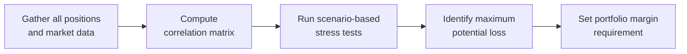

## Introduction
If you’ve ever traded futures contracts, you know how it feels when margin requirements creep up out of nowhere. I remember, during my first week of active trading, feeling pretty confident about my well-hedged positions, only to discover that traditional margin requirements saw each contract in isolation. This meant I was forced to post way more collateral than I thought necessary. It made me wonder: “Why isn’t my broker giving me credit for these offsetting positions?” Enter portfolio margining. It’s a more sophisticated margin calculation method that sets collateral requirements based on the net risk of your entire portfolio rather than on each individual contract. This approach can significantly reduce required margin for well-hedged strategies, freeing up liquidity for other trades or investments. But it’s not just about having more capital to play with; it’s about ensuring that margin requirements accurately reflect actual risk.  

In this article, we’ll take a deep dive into portfolio margining from both theoretical and practical angles. We’ll explore how it differs from classic margin rules, highlight the benefits of risk-offsetting correlations, walk through real-world dynamics of portfolio margining systems, and discuss key regulatory considerations.

## Key Concepts of Portfolio Margining
Portfolio margining is fundamentally a risk-based approach. The margin on your positions is not computed contract by contract; instead, the system looks at your entire set of open positions, identifies offsets arising from correlation, and then determines how much capital you’d need in a plausible worst-case scenario.

Here are the core features of portfolio margining:

• Comprehensive Risk Assessment: Rather than requiring margin for each position, portfolio margining aggregates risk across all positions in a trader’s account.  
• Correlation Offsets: When two or more positions are negatively correlated (or at least not positively correlated), the net risk can be lower than if each position is considered alone.  
• Dynamic Adjustments: Portfolio margin is recalculated more frequently—sometimes even intraday—to account for volatile market conditions.  
• Advanced Scenario Analysis: Traders using portfolio margining frameworks often consider multiple market scenarios (e.g., 1% to 10% moves in underlying futures) to estimate potential losses.  
• Regulatory Safeguards: Regulators mandate that brokerage firms running portfolio margin programs subject traders’ portfolios to “stress scenarios” to ensure the margin remains sufficiently protective under adverse market moves.

## Portfolio Margin Versus Traditional (Strategy-Based) Margin
In a classical “strategy-based” margin system—that is, the type you often see in smaller brokerage accounts, retail accounts, or standard margin setups—each position or spread has a specific margin requirement according to standardized formulas. If you happen to hold positions that offset each other’s risk, the strategy-based system might not fully account for that synergy.

Portfolio margin turns that approach on its head. By measuring net exposure, you get margin rules that align more closely with economic reality:

• Enhanced Capital Efficiency: Hedge funds and active traders value portfolio margin for the capital efficiency it offers. If you’re holding offsetting positions (say, a long position on one futures contract and a short position on a closely correlated or the same underlying), you’re typically allowed to post a lower margin overall.  
• Risk Sensitivity: Portfolio margining recognizes that risk isn’t static and that different types of futures might behave similarly or inversely in specific market conditions.  
• More Complex Calculations: These margin models can be complicated and rely on correlation matrices, volatility estimates, and real-time pricing feeds.

## Risk Calculation Methodologies
An important question is: How does the broker or clearinghouse figure out your net risk?

• Tiering Approach: Different positions might be grouped for margin calculation. For example, equity index futures might form a separate “tier” from commodity futures. Within each tier, correlation assumptions are used to net positions.  
• Scenario-Based Stress Testing: Typically, the broker will simulate how your portfolio behaves if the underlying price changes by +5%, –5%, +10%, –10%, and so on. Each scenario produces a hypothetical profit or loss for the portfolio. The scenario with the largest loss is used to set the margin requirement, often plus an additional “buffer.”  
• Correlation Matrices: Some advanced portfolio margin software calculates the covariance or correlation between each pair of instruments in your portfolio. Positions that are inversely correlated produce more margin offsets.  

Below is a simple Mermaid.js diagram to illustrate a conceptual flow of how a portfolio margin system might evaluate correlated positions:



The net effect is that if your positions happen to offset each other nicely, your “maximum potential loss” is smaller than if you had each position calculated separately. This smaller number translates into a lower margin requirement—phew, more free capital for you and your firm.

## Dynamic Approaches and Intraday Recalculation
One of the biggest perks (and also challenges) of portfolio margining is that it can be dynamic, recalculating margin requirements multiple times a day. Let’s say you’re running an equity futures strategy that’s inversely correlated with a bond futures strategy. If equity volatility suddenly spikes, your correlation assumptions might change intraday, which can cause your portfolio margin requirement to shift—sometimes drastically.

Dynamic portfolio margining typically involves:

• Intraday Price Feeds: The system taps live data for each underlying, constantly re-computing possible worst-case scenarios.  
• Automatic Risk Alerts: Traders might receive notifications when their margin usage creeps too close to their allowance, enabling them to adjust positions or post additional collateral in real time.  
• Liquidity Stress Tests: In times of extreme illiquidity, historical or implied volatilities may jump, thereby increasing margin requirements.  

## Regulatory Requirements and Worst-Case Scenarios
From a compliance standpoint, portfolio margining is heavily scrutinized. Regulators like the SEC, FINRA (in the United States), and local authorities in other jurisdictions lay out guidelines ensuring that:

• Plausible Worst Cases Are Examined: The margin system must test enough adverse scenarios so no single “fat tail” event is overlooked.  
• Daily Monitoring: Firms offering portfolio margining have to continuously monitor client accounts to confirm margin sufficiency.  
• Risk Disclosure: Traders need to understand that while portfolio margining might reduce margin requirements in many cases, it can also require sudden margin top-ups if correlations or volatilities shift unexpectedly.  

Regulators want to ensure that portfolio margining never leads to an underestimation of maximum potential loss. After all, your positions might be correlated 99% of the time, but that won’t help in the 1% scenario when everything unravels.

## Practical Examples Involving Hedge Funds
Hedge funds are prolific users of portfolio margining. Here’s a typical scenario:

• A global macro fund has offsetting positions in stock index futures and short-term interest rate futures. The portfolio margin system sees these two exposures as partially correlated.  
• Suppose the fund also holds foreign exchange futures in a strategy that is somewhat inversely correlated with the equity market. This further reduces net risk from a margin perspective, because potential losses in one segment might be offset by gains in another segment in a stress scenario.  
• By netting out these exposures, the fund might enjoy a significantly smaller margin requirement than if each position was margined separately. The saved capital can be redeployed for other alpha-generating strategies.

## Best Practices for Implementing Portfolio Margining
• Diversify Strategically: If you’re strictly a single-asset-class trader, portfolio margin might not help much. But if you trade multiple asset classes (e.g., equity index futures, commodity futures, and currency futures) with distinct or negative correlations, you stand to gain from margin offsets.  
• Monitor Correlation Stability: Correlations can be fickle. Strategies that seem uncorrelated in calm markets might move in tandem amid a liquidity crisis.  
• Maintain Adequate Liquidity: Even if portfolio margining gives you a lower margin threshold, keep additional funds on hand. Market volatility can explode quickly, spurring margin calls.  
• Communicate with Brokers: If you’re intensively using portfolio margin, keep up a dialogue with your broker. Let them know about changes in your trading strategy or expected big portfolio shifts that can impact margin.  

## Common Pitfalls and Challenges
• Correlation Breakdowns: Relying on correlation-based offsets is great, except in periods of correlation breakdown. An event can unexpectedly link previously uncorrelated markets.  
• Over-leveraging: Portfolio margining can encourage traders to load up on positions they might otherwise perceive as “low margin,” risking outsized exposure if markets go haywire.  
• Complexity and Technology: Running elaborate scenario analyses and correlation matrices intraday requires robust data feeds, computational power, and risk management systems.  
• Regulatory Variation: Not all jurisdictions allow portfolio margining, or they may impose different stress scenarios or data requirements.  

## Illustrative Example
Let’s do a simple numeric illustration. Suppose you have:

• A Long Position in S&P 500 Futures: Valued at $1,000,000 notional.  
• A Short Position in NASDAQ 100 Futures: Valued at $800,000 notional.  
• Both indexes usually move in the same direction but with some differences in volatility.

Under standard margin rules, you might have to post margin equal to, say, 5% of each notional value (just for example’s sake). That’d be 5% of $1,000,000 = $50,000 plus 5% of $800,000 = $40,000, totaling $90,000 in margin.

However, with portfolio margin, the system might run scenarios that show the positions partially offset each other. The net scenario-based risk might be, say, $60,000 in the worst-case scenario (instead of $90,000). You’d post only $60,000 as margin, freeing up $30,000 of capital—an efficiency improvement of one-third.

Granted, that’s a very simplified example. Real portfolio margin calculations incorporate correlation data, implied volatilities, and multiple scenario movements, leading to a more nuanced result.

## A Quick Python Illustration
Here’s a snippet of Python code that conceptually demonstrates how you might combine positions’ covariance to get a simplified estimate for required margin. This is obviously not a production-level snippet but can serve as a teaching tool.

```python
import numpy as np

exposures = np.array([1_000_000, -800_000])  # Long S&P, short NASDAQ

sigma = np.array([0.01, 0.012])  # 1% and 1.2% daily

corr_matrix = np.array([
    [1.0,  0.8],
    [0.8,  1.0]
])

cov_matrix = np.diag(sigma).dot(corr_matrix).dot(np.diag(sigma))

variance = exposures.dot(cov_matrix).dot(exposures.T)
std_dev = np.sqrt(variance)

worst_case_multiplier = 3.0  # e.g., 3-sigma possible adverse move

portfolio_margin = worst_case_multiplier * std_dev
print(f"Estimated portfolio margin requirement: ${portfolio_margin:,.2f}")
```

In this mini-example, correlation is fairly high at 0.8. Notice that if it were 1.0, the positions would be perfectly correlated—yielding a higher net risk. If it were –1.0, you’d see a dramatic risk offset.  

## Conclusion and Final Exam Tips
Portfolio margining might look like an obvious improvement over strategy-based margin, but it comes with extra complexities, intraday recalculations, and correlation pitfalls. For the CFA Level I exam—particularly in a derivatives context—remember that portfolio margining’s prime advantage is capital efficiency through netting offsets across correlated positions. However, always keep in mind how correlation shifts, scenario-based testing, and regulatory minimums can change the ultimate margin requirement.  

If you find an exam question about portfolio margining, it might ask you to:  
• Calculate the margin for offsetting positions using correlation or scenario-based analysis.  
• Discuss the benefits versus the risks of portfolio margining.  
• Evaluate how a dynamic margin approach can alter required capital in a volatile market.  
• Identify the regulatory or operational challenges.  

When you practice exam-style questions, pay attention to how changes in correlation or volatility might drastically change the margin outcome. The difference between using a 0.2 correlation factor and a 0.9 correlation factor can be the difference between a comfortable margin cushion and a surprising margin call.

## Glossary
• Portfolio Margining: A risk-based margin approach that offsets correlated positions’ margins, thereby reducing total collateral if net portfolio risk is lower.  
• Scenarios: Sets of simulated market moves used to test hypothetical gains or losses on a portfolio.  
• Correlation-Based Offsets: Reductions in margin due to low or negative correlations among positions.  
• Hedge Funds: Pooled investment vehicles that employ varied hedging, leverage, and speculative strategies (often prime candidates for portfolio margin accounts).  

## References and Further Reading
• US SEC on Portfolio Margin:  
  https://www.sec.gov/rules/sro/finra/2007/34-55431.pdf  
• Interactive Brokers Guide to Portfolio Margining:  
  https://www.interactivebrokers.com  

--------------------------------------------------------------------------------

## Test Your Knowledge: Portfolio Margining Essentials



### In a portfolio margin system, margin requirements are primarily determined by:
- [ ] Summing margin required for each contract independently.  
- [x] Measuring the net risk exposure across all positions.  
- [ ] Using a fixed percentage of the total notional value of the portfolio.  
- [ ] The average daily volume of the underlying instruments.  

> **Explanation:** Portfolio margin focuses on the net risk across the entire portfolio, accounting for correlations and offsets among positions rather than simply adding up margins contract by contract.

### Which of the following best describes the advantage of dynamic portfolio margining?
- [x] It recalculates margin as positions, volatility, and correlations change to reflect current risk.  
- [ ] It guarantees that margin requirements remain constant throughout the trading day.  
- [ ] It fully removes the need for any mid-day margin calls.  
- [ ] It only benefits traders in single-asset class portfolios.  

> **Explanation:** Dynamic portfolio margining adjusts margin requirements in real time, considering changing market conditions and correlations. This can lead to intra-day margin calls when risk exposures increase.

### A high positive correlation between two long futures positions generally results in:
- [ ] A substantial reduction in margin requirement.  
- [ ] No change in margin requirement.  
- [x] A smaller reduction in margin requirement than if correlations were lower or negative.  
- [ ] A complete elimination of margin requirement.  

> **Explanation:** If positions are highly positively correlated, they tend to move together, so there’s less risk reduction. Lower or negative correlations result in more netting, hence a bigger margin reduction.

### Which of the following statements is most accurate about regulatory requirements for portfolio margining?
- [ ] Regulators only require a single positive and a single negative scenario test.  
- [ ] Regulators mandate portfolio margin usage for all retail investors.  
- [ ] Regulators require daily or more frequent monitoring of plausible worst-case scenarios.  
- [x] Regulators require that plausible worst-case scenarios be assumed to ensure margin is adequate.  

> **Explanation:** Regulators insist on plausible worst-case scenario testing to avoid underestimations of a portfolio’s risk. They also require frequent monitoring to maintain adequate protection.

### Which example best demonstrates a benefit of portfolio margining?
- [x] A trader holds long S&P 500 futures and short Nasdaq futures and posts less margin than if each was margined separately.  
- [ ] A trader holds only one position and benefits from a discounted margin rate.  
- [x] A trader diversifies into correlated currency futures.  
- [ ] A firm imposes the same margin rate on every position without netting.  

> **Explanation:** Because the S&P 500 and Nasdaq positions are partially correlated, calculating net exposure generally indicates a lower margin requirement in a portfolio margin environment.

### Scenario-based testing in portfolio margin accounts primarily:
- [x] Simulates various market moves to assess the maximum potential loss for the entire portfolio.  
- [ ] Calculates the minimum possible gains the portfolio might achieve.  
- [ ] Eliminates all margin calls in times of high volatility.  
- [ ] Replaces correlation-based margin offsets with flat charges.  

> **Explanation:** Scenario-based testing is key to portfolio margin calculations, identifying the portfolio’s largest possible loss under adverse market moves.

### In times of extreme market stress, correlations among markets often:
- [x] Increase toward 1, reducing the effectiveness of offsetting positions.  
- [ ] Move sharply toward –1, improving the effectiveness of offsetting positions.  
- [x] Remain unchanged.  
- [ ] Cannot be estimated.  

> **Explanation:** Under stress conditions, historically uncorrelated markets may suddenly move together, diminishing the benefits of hedging strategies based on negative or low correlations.

### One downside of portfolio margining for traders is that:
- [ ] It prevents them from using leveraged positions.  
- [ ] It only accommodates equity futures positions.  
- [x] Margin calls can be large and unexpected when correlations shift.  
- [ ] The system never recalculates margin during the trading day.  

> **Explanation:** While portfolio margining often reduces margin needs, a sudden shift in correlations or volatility can quickly trigger additional margin calls.

### If a trader’s portfolio margin approach calculates a maximum potential loss of $75,000 under a worst-case scenario, how might the broker set the margin requirement?
- [ ] Exactly at $75,000, with no buffer.  
- [ ] No margin required because the worst-case scenario is unlikely.  
- [x] At $75,000 plus a conservative buffer.  
- [ ] At half the potential loss as standard practice.  

> **Explanation:** Brokers (and regulators) generally conservatively require margin at least equal to the calculated worst-case scenario plus an extra buffer, ensuring adequate capitalization for unforeseen market shocks.

### Portfolio margining typically:
- [x] Allows for intraday recalculation of margin requirements.  
- [ ] Locks margin requirements based on the start-of-day positions.  

> **Explanation:** One of the prominent features of portfolio margining is the possibility of re-evaluating risk (and margin needs) as market conditions evolve intraday.


