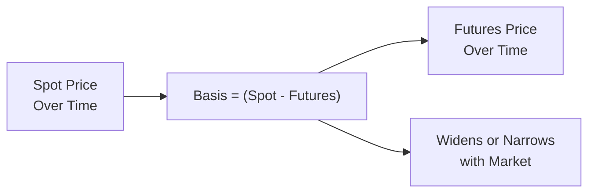

## Understanding Basis Risk

When we talk about hedging with futures, we usually assume that the futures contract price and the hedger’s underlying asset price move in perfect tandem. Of course, the real world is never that tidy. Basis risk, in essence, arises from the mismatch—or incomplete correlation—between the futures price and the spot price of what you're trying to hedge. 

In a perfect hedge, your gain in one market (futures) offsets your loss in another (the spot or cash market), leaving you with zero net loss or gain. However, that perfect lock-step alignment is about as common as a real four-leaf clover. If the futures contract and your underlying asset exhibit slight differences—in terms of grade, location, timing, or even different market forces—you're left with basis risk.

I personally remember the first time I had to hedge a commodity position—soybeans, to be exact. I was new to the concept of basis. One week, the local spot price decoupled unexpectedly from the futures price. I was scratching my head thinking, “Seriously, I thought these were supposed to move together?” Surprise! The basis had widened, prompting me to roll my futures contract and reevaluate the correlation. The net result was not disastrous, but it was definitely an eye-opener that hammered home the notion: no matter how well you plan, basis risk lurks in the details.

In this section, we’ll explore how basis risk arises, how to measure and manage it, and why it’s important for anyone who uses futures to hedge exposures—whether in commodities, fixed income, or even equity indices.

## Defining Basis

The “basis” is simply the difference between the spot price of the asset you’re hedging and the futures price of the contract you select. We can express it in a straightforward formula:

(1)  
B(t) = S(t) – F(t)

Where:  
• B(t) = Basis at time t  
• S(t) = Spot (cash) price of the asset at time t  
• F(t) = Futures price of the chosen contract at time t  

If the basis is positive, it means the spot price is higher than the futures price. A negative basis implies the spot is lower than the futures. While these definitions may sound simple, the real trick is understanding how B(t) changes over time. This shift—called “basis movement” or “basis risk”—can be the real troublemaker in a hedge.

## Why Basis Risk Happens

It’s perfectly normal for the spot and futures prices to differ, given factors like storage costs, interest rates, convenience yield, or location adjustments. But when these factors change unpredictably, the basis changes, too. Three main causes often stand out:

• Seasonal Effects: Agricultural commodities often exhibit seasonal basis movements based on harvest times, weather shocks, or changes in inventory.  
• Quality Differences: Crude oil, for instance, is not just “crude oil”—there’s West Texas Intermediate (WTI), Brent, and a variety of other blends. If you hedge WTI with Brent futures, the correlation might be strong but not perfect. Differences in quality or grade lead to basis risk.  
• Market Demand/Supply Discrepancies: Spot and futures markets can each react differently to sudden demand or supply shifts (transportation bottlenecks, shipping constraints, immediate local demand, etc.).  

Even if you choose the theoretically “right” contract (e.g., the same underlying commodity grade and the same delivery location), day-to-day or intraday variations can still arise. Over time, if your hedge horizon is several months, these variations can accumulate and turn your intended offset into something that’s less than perfect.

## The Correlation Factor

Correlation is key. The closer the correlation between your underlying spot asset and the futures contract, the less basis risk you typically face. Let’s say you’re an airline hedging jet fuel with crude oil futures. That’s a cross-hedge: you’re not directly hedging jet fuel with a jet-fuel futures contract (maybe it’s not liquid enough, or doesn’t exist in your market). Instead, you’re using crude, which is a closely related but not identical product. The correlation might be high, but it’s never 1.0 (i.e., perfect). If the correlation unexpectedly drops, your hedge can slip off track.

In more quantitative terms, you might examine historical correlation data to see how your underlying’s spot price has tracked the futures you plan to use. The higher the correlation, the smaller the expected basis risk. But always remember: historical correlation is only a guide. Real-world markets love to break old patterns when you least expect it.

Below is a short Python snippet that demonstrates how you might check correlation between two price series—one representing your spot, the other your prospective futures contract:

```python
import pandas as pd

correlation = prices['spot'].corr(prices['futures'])
print(f"Historical Correlation: {correlation:.4f}")
```

A correlation close to +1.0 suggests strong positive movement, while anything significantly less might hint at bigger basis risk.

## How Basis Risk Affects Hedging Effectiveness

Whether you’re a soybean farmer or an airline CFO, your main question is: how effectively does my hedge offset adverse moves in the spot? If your underlying asset sells off by $10 per unit, and your futures gain is $10, that’s a perfect hedge. But if the future only gains $8 while your spot asset lost $10, that $2 difference centers around basis.

In general, the total risk of your position is:

(2)  
Total Risk = Spot Market Risk – Gain from Futures Hedge + (Change in Basis)

When the futures price moves nearly in sync with the spot price, that “Change in Basis” is negligible or downright zero. But if it widens or narrows unpredictably, the difference can be significant. You can measure the hedge’s effectiveness by comparing the variance of your unhedged position to the variance of your hedged position—factoring in basis changes.

## Managing Basis Risk

So, you might be thinking, “Okay, so what do I do about it?” Although you’ll never fully eliminate basis risk in most real-world hedges, there are steps you can take to reduce it:

• Select the Closest-Matching Futures Contract: The best scenario involves using a futures contract that’s tied to the same underlying, same quality or grade, and ideally the same delivery location and month as your exposure.  

• Monitor the Basis Continuously: Keep track of how the basis is evolving. If you see unusual widening or narrowing, it might be time to adjust your hedge or even temporarily close it out.  

• Roll the Hedge at Appropriate Intervals: As futures delivery months approach, the contract will expire. Rolling your hedge means closing out the near-month contract and moving into a further-out contract. This “rolling” introduces additional basis risk because the new contract’s pricing environment might deviate from what you had.  

• Diversify Your Hedge Tools: Sometimes using only one type of futures contract might be too narrow. You could supplement with options, different maturities, or even over-the-counter swaps, as long as the combined correlation to your underlying remains robust.  

## Rolling the Hedge and Adjusting Positions

Rolling is a natural part of a long-term hedge. Suppose you’re hedging a commodity that you’ll need to protect for the next 12 months, but the most actively traded futures contract expires in four months. As expiration looms, you’ll need to “roll” into a contract further down the curve. Each time you do this, the new contract will have its own price, which might not align with the old contract’s basis. This creates roll yield or roll loss, which can change your total hedging effectiveness.

### Example of Rolling a Hedge

Imagine you initially sold a December futures contract at \$50 to hedge a spot position that was valued at \$52 (i.e., the basis was \$2, spot – futures). When December is about to expire, you buy back that contract (at \$49) and then sell a March contract at \$51. The new basis (your spot might be \$53 while the new futures is \$51) is now \$2 again, but the overall effect of the roll might have introduced an extra gain or loss compared to if you just magically extended the original December contract. This entire process demands close attention to how the spot and futures “reset” around each roll date.

## Cross-Hedging and Its Unique Basis Risk

If the asset you’re trying to hedge doesn’t have a liquid futures market—or any futures contract at all—you might resort to cross-hedging. In cross-hedging, you choose a futures contract for an asset closely related to your exposure, but not identical. An example is using crude oil futures to hedge jet fuel, or using a euro futures contract to hedge a basket of European currencies. Because the underlying is merely related, not the same, you’re likely to experience a more substantial basis risk. You can measure historical basis movements for guidance, but you must expect that basis can shift substantially in times of market stress.

## Multi-Step Hedge Optimization

Some advanced hedgers try to optimize their hedge ratio. Instead of a 1:1 ratio (one futures contract for each unit of underlying exposure), they’ll run a regression or some correlation-based optimization to find the ratio that minimizes the variance of their combined spot-futures exposure. This approach can partially address basis risk by adjusting the hedge ratio to the actual empirical relationship between spot and futures.  

Nonetheless, even with an optimized hedge ratio, if the underlying correlation dynamics break down or if a shock hits the market, basis risk can still become a costly surprise.

## Practical Example and Case Study

Let’s walk through a short hypothetical:

• A wheat producer wants to hedge 10,000 bushels of Hard Red Winter Wheat (spot price \$5.10 per bushel). No exact futures contract for that specific variety and region is available; the farm decides to use a more liquid Soft Red Winter Wheat futures that trades at \$5.00—a basis of \$0.10.  
• Over the next two months, the local spot price for Hard Red Winter Wheat increases to \$5.50, while the Soft Red Winter Wheat futures only rise to \$5.30.  
• Now the basis has moved to \$0.20. If the farmer sold futures at \$5.00 originally to hedge, they lost out an additional \$0.10 per bushel in local cash terms beyond what the futures offset.  

This example underlines how the difference between the local spot price and the futures reference price changed—raising the final, net cost (or lost revenue) for the farmer despite having a hedge. Had the farmer used a Hard Red Winter Wheat futures contract (assuming good liquidity), the basis risk might well have been smaller.

## Diagramming Basis Changes Over Time

Below is a conceptual diagram of basis changes over time. Imagine a steadily increasing spot price and a futures curve that lags or leads slightly.



In this simplistic diagram, the difference (Spot – Futures) is not constant and can shift due to various market conditions.

## Glossary of Key Terms

• Basis: The difference between the spot price of the asset being hedged and the futures price of the contract used.  
• Correlation: A statistical measure (ranging from –1.0 to +1.0) indicating how two variables move in relation to each other.  
• Cross-Hedge: Using one asset’s futures contracts to hedge exposure in a different but correlated asset.  
• Rolling the Hedge: Exiting an expiring futures position and opening a new position in a later-expiration contract to maintain continuous hedging coverage.  

## Common Pitfalls and Best Practices

• Using Illiquid Contracts: If the futures contract you pick is thinly traded, slippage and illiquidity can exacerbate basis risk.  
• Ignoring Storage and Carry Costs: For commodities, storage and carrying charges can affect futures prices differently than your local spot market environment.  
• Not Tracking Time Decay of Correlation: Past correlations can shift if supply-demand factors change drastically over time.  
• Overconfidence in “Perfect” Hedge: Remember, perfect hedges rarely exist. Maintain a realistic understanding of the limitations of your hedge instrument.  

Meanwhile, best practices pivot around thorough research, continuous monitoring, and dynamic hedge adjustments. Some large firms keep “basis risk trackers” or dashboards that plot daily changes to ensure swift action when unexpected basis movements occur.

## Regulatory and Accounting Considerations

In many jurisdictions, how you account for your hedges can affect reported earnings. If you qualify for hedge accounting under rules like IFRS 9 or U.S. GAAP (ASC 815), then changes in fair value of the futures might be offset against the exposure in a special accounting framework. But if your basis risk becomes large, the mismatch might still emerge in your financial statements and cause earnings volatility. Also, regulators often require you to post margin for your futures positions, which can tie up capital that might be needed elsewhere.

## Exam Relevance and Tips

For the CFA Level III exam, basis risk can appear in constructed-response questions where you must discuss the effectiveness of a proposed hedging strategy and the reasons it may fail to provide perfect protection. You could also see item sets focusing on calculating the final payoff of a hedged position, factoring in changes in the basis. Be sure to:

• Practice relevant calculations (e.g., computing the effective outcome when basis changes).  
• Understand rolling mechanics.  
• Know when cross-hedging is appropriate and how to articulate the potential basis risk.  
• Remember to highlight that perfect correlation is rarely guaranteed.  

As with many advanced exam questions, the scenario might require you to evaluate how well a futures contract matches an exposure. Mention the likely basis risk, potential correlation shifts, and how you might fine-tune the hedge ratio or re-balance your positions over time.

## References and Further Reading

• Working, Holbrook. “Theory of the Inverse Carrying Charge in Futures Markets.” Journal of Farm Economics. (Historical discussion of basis in commodity markets.)  
• CFA Institute continuing education materials on hedging strategies and basis risk management.  
• Hull, John C. Options, Futures, and Other Derivatives.  
• Official CFA Institute Curriculum – Derivatives: Pay special attention to sections discussing hedging effectiveness and cross-hedging.  

--------------------------------------------------------------------------------

## Test Your Knowledge: Basis Risk in Futures Hedging



### In a hedging scenario, basis risk is best described as:

- [ ] The risk that the spot price will move in a favorable direction.
- [ ] The risk that exchange margin requirements will increase unexpectedly.
- [x] The risk arising when the futures and spot prices fail to move in perfect tandem.
- [ ] The risk due to changes in the interest rate used for discounting.

> **Explanation:** Basis risk comes from imperfect correlation between the hedged asset's spot price and the futures contract price.  

### When the spot price of a commodity is higher than the futures price, we often say the basis is:

- [ ] Negative.
- [x] Positive.
- [ ] Zero.
- [ ] Indeterminate.

> **Explanation:** Basis = Spot – Futures. If Spot > Futures, basis is positive.  

### Cross-hedging implies:

- [ ] There is no possibility of basis risk as long as the correlation is above 0.8.
- [x] Using a futures contract on a related but not identical asset, leading to increased basis risk.
- [ ] Perfectly matching spot and futures prices, eliminating basis risk.
- [ ] Rolling futures contracts on the same underlying asset.

> **Explanation:** In cross-hedging, you rely on a different but correlated asset’s futures, thereby introducing more basis risk.  

### Which of the following would most likely increase basis risk for a wheat farmer who hedges with a wheat futures contract?

- [ ] Tight correlation between spot and futures prices.
- [x] A sudden divergence in the quality or grade demanded in the spot market versus the underlying quality specified in the futures contract.
- [ ] Lower volatility in the futures market.
- [ ] An increase in market liquidity.

> **Explanation:** If the specific type of wheat being grown becomes highly desirable (or less desirable) in the spot market relative to the contract grade, the basis can widen significantly.  

### Rolling the hedge refers to:

- [x] Closing an expiring futures position and opening a new one in a later month to maintain hedge coverage.
- [ ] Closing a futures position immediately after any price movement.
- [x] Simultaneously taking short and long positions with different expiry dates to offset basis risk.
- [ ] Failing to exercise an in-the-money futures contract.

> **Explanation:** Rolling keeps the hedge going when the original contract is near expiration by entering a new contract with a further expiry date.  

### An airline uses crude oil futures to hedge its jet fuel costs. This arrangement:

- [x] Is an example of cross-hedging and may incur material basis risk if jet fuel prices diverge from crude oil prices.
- [ ] Eliminates all price risk due to perfect correlation between crude oil and jet fuel.
- [ ] Eliminates all basis risk with the correct hedge ratio.
- [ ] Is typically easier to account for, requiring no special disclosures.

> **Explanation:** Jet fuel and crude oil are related but not identical, creating basis risk.  

### If the spot price of a commodity increases by $5 while the futures price increases by only $3:

- [ ] The basis has decreased by $2.
- [ ] The basis hasn’t changed, as both moved higher.
- [x] The basis has widened by $2.
- [ ] Basis risk is zero in this situation.

> **Explanation:** If spot increased more than futures, the difference (spot – futures) is larger, meaning the basis widened.  

### A key tactic to minimize basis risk is:

- [ ] Choosing the most illiquid futures market to discourage speculators.
- [x] Selecting a contract that closely matches the underlying commodity’s grade, location, and delivery month.
- [ ] Using only short positions in the futures market.
- [ ] Avoiding rolling the hedge.

> **Explanation:** The closer the futures contract matches the actual commodity, the lower the basis risk tends to be.  

### In monitoring basis risk, a hedger should:

- [x] Track the difference between the spot price and futures price on a continuous basis.
- [ ] Only re-check the basis at contract expiry.
- [ ] Assume basis is constant if historical data shows moderate stability.
- [ ] Eliminate correlation coefficients from the analysis.

> **Explanation:** Basis risk can shift at any time, and continuous monitoring is vital for timely hedge adjustments.  

### Changes in basis can still affect a firm even if it achieves hedge accounting treatment because:

- [x] Residual gains or losses from basis changes may not be perfectly offset on the income statement.
- [ ] Hedge accounting eliminates all price risk.
- [ ] The forward points on the futures contract remove all basis risk.
- [ ] Regulators do not allow companies to hold futures contracts for more than one period.

> **Explanation:** Hedge accounting primarily deals with matching the timing of gains/losses but doesn’t guarantee a perfect offset for basis swings.  


