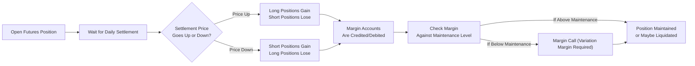

## Overview

Futures contracts are powerful tools for hedging risk and expressing market views, but they come with unique mechanics that can feel, well, a little peculiar at first. One of the key factors that sets futures apart from forward contracts is daily “marking to market.” This process ensures that traders realize profits and losses on a day-to-day basis rather than only at contract expiration. Margins—both initial and maintenance—play a central role in safeguarding all participants and the clearinghouse from excessive credit risk.

The concept of marking to market and managing margin calls is integral to futures trading across global markets, whether you’re hedging commodity price swings, speculating on equity index movements, or dealing in interest rate futures. By the time you finish this section, you’ll not only understand what’s happening behind the scenes in your margin account each day but also the “why” behind the daily settlement checks and balances.

## Standardization and Clearinghouse Support

Before diving into the specifics of how gains and losses are settled daily, let’s revisit one major difference: a futures contract is standardized. The exchange and its clearinghouse provide features such as:

• Standard Contract Sizes: For example, each S&P 500 futures contract might control a certain multiple of the index, and each crude oil futures might represent 1,000 barrels.  
• Fixed Delivery or Cash-Settlement Procedures: Futures have set expiration days, delivery locations (for physical delivery), or standardized cash settlements.  
• Clearinghouse Guarantee: The clearinghouse acts as the buyer to every seller and the seller to every buyer, stepping in to ensure trades are honored.

By putting the clearinghouse in the center of all trades, default risk from individual counterparties is vastly reduced. Your biggest question then becomes, “What if my counterparty is insolvent?” The short answer: The clearinghouse collects margin from everyone, continuously. If someone can’t meet margin requirements, they are closed out of their positions quickly to limit losses, and the clearinghouse remains financially sound.

## Key Components of Futures Margins

Margin in the futures market might sound similar to margin accounts in equity trading, but it generally functions more like good-faith collateral rather than borrowed money. There are two main types of margin:

• Initial Margin: The deposit required when you first open a position. This represents a fraction (commonly 2–12% of contract value, depending on volatility) of the underlying notional.  
• Maintenance Margin: The minimum balance you must maintain in your margin account. If your account dips below this level, you face a margin call and must top it up—this is known as variation margin.

The margin levels differ based on the type of underlying asset, the participant’s classification (hedger or speculator), and general market volatility. Exchanges often coordinate with their regulatory authorities to set margin requirements that minimize unintended systemic risk. 

### A Quick Anecdote

I remember a time when a friend of mine, who was relatively new to futures, set up a long position in soybean futures. He was thrilled to be part of the “big leagues” of commodity trading. Two days later, a slight daily price move forced him to post variation margin. “I thought I only needed to put down that initial margin!” he exclaimed in disbelief. After topping up his margin account twice more over the following week, he realized the first big lesson of futures trading: the daily settlement of gains and losses is unforgiving if you’re underfunded or overleveraged.

## How Marking to Market Works

Marking to market (MTM) is the process of updating a futures contract’s value based on the official daily settlement price:

1. At the close of each trading day, the exchange determines a settlement price.  
2. Traders’ margin accounts are adjusted to reflect gains or losses from the previous day’s price to the new settlement price.  
3. Net gains are credited to the margin accounts of those holding profitable positions, while losses are debited from the margin accounts of those with losing positions.  
4. If a trader’s margin balance falls below the maintenance margin level, the clearinghouse sends a margin call.  

The daily settlement is beneficial because it limits the buildup of unpaid losses. By settling gains and losses daily, credit exposure is effectively reset each evening. This approach stands in stark contrast to forward contracts, where gains and losses accumulate until expiration.

### Illustration with a Simple Flow Diagram

Below is a simplified Mermaid flowchart illustrating the marking-to-market settlement approach. It shows how the margin accounts get credited or debited based on the settlement price changes:

## Margin Requirements and Margin Calls

Margin calls can occur at any point after the daily settlement if the account balance falls below the maintenance threshold. The typical cycle looks like this:

• You deposit initial margin to start a long or short futures position.  
• At the end of each day, your margin account is marked up or down by the day’s P/L.  
• If the margin balance drops below the required maintenance margin, you must bring it back up to the initial margin level—or face forced liquidation by the clearinghouse.  

Speculators (who up their risk for potential profit) often pay higher margins to offset the risk they pose to the clearinghouse. Hedgers (like farmers or corporate treasurers covering foreign exchange exposures) may be granted lower margin requirements because their positions usually represent real economic hedging activities outside the futures market.

### An Illustrative Numeric Example

Let’s say you go long one S&P 500 futures contract, each contract representing 250 times the index. Suppose the index stands at 4,000, so the notional value is 4,000 × 250 = $1,000,000. The exchange sets:  
• Initial margin: $60,000  
• Maintenance margin: $48,000  

Day 0 (Position Opened):  
• You deposit $60,000 into your margin account.  

Day 1 (Price Goes Up):  
• The index settlement goes from 4,000 to 4,010, a +10 point move.  
• Gain in points = 4,010 – 4,000 = +10  
• Dollar gain = +10 × 250 = +$2,500  
• Margin account is now $60,000 + $2,500 = $62,500  

Day 2 (Price Moves Against You):  
• Settlement drops by 15 points, going from 4,010 to 3,995.  
• Loss in points = 3,995 – 4,010 = –15  
• Dollar loss = –15 × 250 = –$3,750  
• New margin balance = $62,500 – $3,750 = $58,750  

Since $58,750 is still above the $48,000 maintenance margin, you do not receive a margin call, and you can maintain your position. But if further adverse price moves push your account below $48,000, you will need to deposit variation margin to bring it at least back up to the initial margin level.  

This daily settlement mechanism ensures your account is never “secretly” building up a large loss. Instead, the clearinghouse sees your margin balance every day and can act quickly if your funds become insufficient.

## The Role of the Clearinghouse

Clearinghouses stand as the gatekeepers of integrity for the futures market. By guaranteeing each trade, they shoulder the “performance obligation” of every buyer and seller. Without the clearinghouse, you’d have to worry about the creditworthiness of your counterparty. With clearinghouse intermediation, the operational and credit risks are dramatically lowered.

The clearinghouse’s role in the daily settlement process is crucial:

• Collect and calculate daily settlement prices.  
• Automatically debit and credit margin accounts.  
• Enforce margin requirements and issue margin calls.  
• Liquidate positions when a margin call is not met, preserving the system’s overall stability.

Thanks to real-time risk management systems, clearinghouses can proactively monitor large or risky positions, stepping in if exposures become excessive. They also provide cross-margining privileges if you have offsetting positions in correlated products—for instance, a Treasury futures position offset by an interest rate swap (see Chapter 3 on Swaps for details about interest rate swap structures).

## Risk Management and Daily Settlement

Daily marking to market significantly reduces credit risk. Think about it: if you trade a forward contract (see Section 2.1), your counterparty could rack up tremendous losses before you realize their inability to pay. In futures, the daily margin adjustments help contain any hemorrhaging of funds.

Still, no system is perfect. The meltdown of a large participant could still cause systemic ripples if market liquidity is poor. That said, even major, unexpected market shocks (for example, the “Black Swan” events) are often mitigated by the robust margin system in place. From a portfolio management perspective, futures margins also impose discipline: you cannot simply ignore your mounting losses for long.

## Accounting and Regulatory Considerations

From an accounting standpoint, under IFRS or US GAAP, you generally record daily cash movements from marking to market as realized gains or losses. This can differ from forward contract accounting, where gains or losses may remain off the balance sheet until settlement. However, consult your local financial reporting standards and the CFA Institute’s Global Investment Performance Standards (GIPS) for the specifics of how to present these daily settlements in performance reports.

On the regulatory front, futures margins are typically set by exchange clearinghouses with oversight from national regulators (e.g., the Commodity Futures Trading Commission (CFTC) in the United States). These regulators also require robust reporting and risk disclosures—something you’ll see come up repeatedly across the derivatives markets (see Chapter 6 on Derivative Benefits, Risks, and Uses for more regulatory insights).

## Best Practices and Common Pitfalls

• Overleveraging: Because initial margins can be as low as 2% of the notional contract value, it’s easy to get carried away. Traders must calibrate position sizes carefully to handle daily P/L swings.  
• Neglecting Maintenance Margin: Untimely margin calls can result in forced liquidation at unfavorable prices. Keep a cash buffer to avoid a dreaded margin call at the worst moment.  
• Failing to Monitor Volatility: Exchanges might hike margins if volatility spikes. That can catch traders off guard, especially those not prepared for sudden margin changes.  
• Misjudging Basis Risk: If you are using futures for hedging, be mindful that your underlying asset’s price activity may not perfectly sync with the standardized futures contract, thus creating basis risk (covered in Section 2.18).  
• Underestimating Liquidity Risk: Although most major futures markets are highly liquid, smaller contracts (e.g., on niche commodities) may widen their bid-ask spreads during market stress, making it costlier to exit.

## Practical Perspectives for the CFA® Exam

• Scenario-Based Questions: Be prepared to see item sets where you’ll be asked to calculate daily variation margin. You might see a question describing how many contracts a fund manager holds, the day-to-day moves, and the margin implications.  
• Adjusting Strategies: At Level III (and realistically in advanced practice), you’ll find portfolio managers rolling futures forward, employing spread strategies, or cross-margining with other derivatives. The daily settlement remains at the heart of it all.  
• Ethics and Disclosure: The CFA Institute Code and Standards require that you fully disclose the use of derivatives. If you manage a portfolio that occasionally uses futures for hedging, you must accurately portray them in the client’s risk framework.

## Conclusion

Futures contracts operate on a foundation that’s designed to minimize counterparty risk, chiefly by standardizing contracts, involving a clearinghouse, and requiring margin posting. The daily marking-to-market process is both a risk management gem and a potential shock to new market participants who realize they must “settle up” every day, not just at expiry. However, this daily mechanism keeps traders honest, helps maintain the integrity of global futures markets, and enforces disciplined risk controls.

Whether you’re a corporate treasury manager hedging interest rate risk or a speculator betting on the soybean harvest, you can’t escape marking to market and margin calls if you trade futures. So embrace them—you’ll find that they not only keep your trades on track but they also provide early signals about whether you should adjust or exit a position altogether.

## Exam Tips

• Practice daily settlement calculations. The CFA exam loves scenarios where you track margin over multiple days.  
• Stay vigilant with interpretations of margin calls. Understand whether the margin must be replenished to the maintenance margin or the initial margin—it’s often the latter.  
• Connect the dots between marking to market and credit risk mitigation. The exam might ask you to compare how futures differ from forwards from a counterparty risk perspective.  
• For item set or constructed-response questions, keep your numeric answers clearly organized, and label each step distinctly.  
• Time management is crucial: daily settlement questions can lead to multi-part computations. Plan your calculations methodically.

## References

• Black, Fischer. “The Pricing of Commodity Contracts.” Journal of Financial Economics.  
• CME Group. https://www.cmegroup.com  
• CFA Institute. CFA Institute Code of Ethics and Standards of Professional Conduct.  
• GARP, Global Derivatives Handbook, Chapters on Futures Margining and Clearinghouse Operations.  

## Test Your Knowledge: Marking to Market and Margin Calls Quiz



### A futures trader has an initial margin requirement of $10,000. After a day of adverse price movements, her account drops to $7,500, below the $8,000 maintenance margin. How much margin must she deposit if the rules require replenishment back to the initial margin?

- [ ] $500
- [ ] $1,500
- [x] $2,500
- [ ] $10,000

> **Explanation:** When the account balance dips below the maintenance margin, the trader must top up the entire difference between the current balance ($7,500) and the initial margin ($10,000), which is $2,500.

### Which of the following best describes the concept of marking to market?

- [ ] Establishing an internal valuation method for your portfolio each quarter.
- [x] The daily adjustment of futures contract profits and losses based on settlement prices.
- [ ] Calculating dividend payments on equity derivatives.
- [ ] Conducting fundamental analysis to mark fair value.

> **Explanation:** Marking to market involves adjusting futures accounts daily to reflect gains or losses based on official settlement prices.

### In a normal market environment, how does the clearinghouse minimize counterparty risk?

- [x] It stands between buyers and sellers, guaranteeing contract performance.
- [x] It requires traders to post margins, settling gains/losses daily.
- [ ] It waits until expiration to verify any profits or losses.
- [ ] It does not enforce daily settlement.

> **Explanation:** Clearinghouses guarantee contract performance and enforce daily margin postings, greatly reducing credit exposure.

### When an adverse price movement causes a trader’s margin balance to fall below the maintenance margin:

- [ ] No action is needed until the contract expires.
- [ ] The trader can carry on if they anticipate a price rebound.
- [x] The trader typically receives a margin call and must add funds.
- [ ] The contract automatically terminates.

> **Explanation:** If the margin account dips below the maintenance margin, the clearinghouse requires a deposit to bring the balance back up to the initial margin level.

### Which statement about margin requirements is correct?

- [x] Speculators often face higher margin requirements than hedgers.
- [ ] Hedgers must always post double the margin speculators do.
- [x] Margins typically reflect contract volatility and credit risk.
- [ ] Margin requirements never change once set at the start of a contract.

> **Explanation:** Exchanges usually set different margins depending on trader classification and volatility. Speculators generally need more margin because their risk profile tends to be higher.

### Which of the following is an advantage of daily marking to market in futures contracts?

- [x] It reduces the accumulation of unpaid losses over time.
- [ ] It allows traders to avoid margin calls.
- [ ] It eliminates all basis risk.
- [ ] It synchronizes dividend payments with contract profits.

> **Explanation:** Daily marking to market reduces credit exposure by settling gains or losses incrementally, rather than waiting until the end of the contract.

### In the event of a sharp spike in price volatility, the exchange might:

- [x] Increase initial and maintenance margin requirements for open positions.
- [ ] Grant a waiver to all participants to lower their margin requirements.
- [x] Close all open positions on behalf of the clearinghouse.
- [ ] Freeze margin accounts at current levels.

> **Explanation:** Exchanges often raise margin requirements to counter heightened market risk during volatile periods.

### Which statement accurately describes the relationship between marking to market and liquidity?

- [ ] Marking to market often renders large futures markets illiquid.
- [x] Marking to market can trigger margin calls that force traders to liquidate positions, potentially affecting market liquidity.
- [ ] Marking to market only affects mature contracts.
- [ ] Marking to market has no bearing on liquidity.

> **Explanation:** Sudden margin calls may compel traders to close or scale back positions, which can impact market liquidity if widespread.

### A trader’s balance is $52,000, while maintenance margin is $50,000 and initial margin is $60,000. If the account sees a $3,000 loss in a day, how much variation margin must the trader post?

- [ ] $1,000
- [ ] $50,000
- [x] $8,000
- [ ] $3,000

> **Explanation:** After the $3,000 loss, the account is at $49,000, which is below the $50,000 maintenance margin. The trader must deposit enough to bring the account back to $60,000. So, the total deposit is $60,000 – $49,000 = $11,000. (Note: If you answered $8,000, watch the arithmetic carefully. Many markets require topping back to initial margin. But if only required to meet the maintenance margin—$50,000—then it’s a $1,000 deposit. Always clarify the exchange rule. Different rules exist, but typically it’s the initial margin that must be restored.)

> **Correction Note:** The question states “how much variation margin must the trader post?” If the exchange rule demands replenishment to the initial margin of $60,000, then it’s $11,000. If the rule only requires topping up to the maintenance margin, it’s $1,000. Real-life exchanges mostly require going back to initial margin, but the question’s data might be ambiguous. This highlights the importance of reading the question carefully!

### Marking to market in futures contracts is a more effective risk management process than waiting until contract expiry because:

- [x] Losses are realized daily, limiting large unaddressed exposures.
- [ ] Gains cannot ever exceed the principal deposited.
- [ ] Commodity prices rarely move intraday.
- [ ] Forward contracts require daily margin checks, too.

> **Explanation:** Daily marking to market keeps credit risk in check by addressing gains and losses in real time, preventing accumulation of large unpaid obligations.


