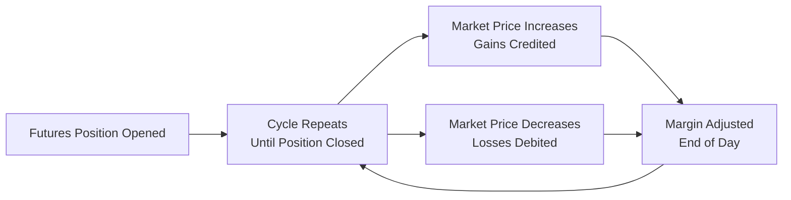

## Overview

Whenever I look back on my early days studying derivatives, I still remember the moment I realized just how pivotal it is to understand the nuances between forward and futures contracts. These instruments might seem interchangeable at first glance—they both let you lock in a price today for something you want (or need) in the future. But the devil is in the details. So, let's walk through the key distinctions: standardization, counterparty risk, liquidity, margining, and so forth. If you have a handle on these differences, you’ll be way ahead in managing derivatives strategically for both hedging and speculation.

## Bespoke Nature of Forward Contracts

Forward contracts are private arrangements negotiated directly between a buyer and a seller (often facilitated by a commercial bank or a broker). Because they're outside any formal exchange, you've got a ton of flexibility: you can tailor quantity, quality, and delivery date to whatever best fits your needs.

• Customization: You want 32,500 bushels of a particular corn variety for a date that’s 187 days from now? You can do that with a forward contract. No problem.  
• Negotiated Terms: There’s no standardized contract size or standardized settlement procedure. Everything is hammered out by you and the other party.  
• Illiquidity: Since these are unique agreements, there’s typically limited (or no) secondary market. You can’t just exit easily—if you want out, you often need to strike a deal with the original counterparty.  

Because forwards lack an organized clearing mechanism, they may require less initial cash outlay—especially in the sense that there’s no daily margin posted. However, that also means there’s credit risk that accumulates over time, like a slow-simmering pot that you have to keep an eye on.  

## Key Features of Futures

Futures, on the other hand, operate in a more formalized context: they are standardized contracts traded on exchanges such as the CME (Chicago Mercantile Exchange), ICE (Intercontinental Exchange), or any of the numerous global futures markets. The emphasis is on clarity, transparency, and, generally, a shorter path to liquidity.

• Standardization: Exchange rules define contract size, delivery months, acceptable grades (if it’s a commodity), and other nuts and bolts.  
• High Liquidity: You can jump in and out of a futures position pretty quickly without causing big shifts in price—a big plus if you’re actively managing positions.  
• Transparent Pricing: Because trades happen on a central exchange, prices are visible to all market participants.  

In practice, many futures contracts are closed out prior to expiration (through offsetting trades), and a much smaller portion actually proceed to physical delivery. Futures positions are buffered by a clearinghouse that ensures counterparty defaults are rare events, diminishing your worry about focusing on the other side’s credit worthiness.

## Margining and Daily Settlement

Arguably the biggest difference from a day-to-day operational perspective is the practice of daily marking to market for futures positions. That’s just a fancy way of saying every single day, gains or losses on a futures position are settled in cash. Let’s break down how that works:

• Initial Margin: When you open a futures position, you post a relatively small fraction of the contract’s total value as “initial margin” with your broker or clearing firm.  
• Maintenance Margin: If your position starts losing money, you might get a margin call to bring your margin balance back up. If your account slides below this threshold, you’ll need to deposit additional funds.  
• Daily Settlement (Marking to Market): At the end of each trading day, the futures exchange calculates each contract’s settlement price. Your account is credited (if you have gains) or debited (if you have losses).  

This daily repricing drastically reduces credit exposure because unrealized losses are settled daily. A forward contract, conversely, settles at maturity. There’s no daily “check-in,” so the credit risk can accumulate throughout the contract’s life.

### A Quick Example of Daily Futures Settlement

Suppose you go long one gold futures contract at $1,800 per ounce (and for simplicity, let’s say the contract size is 100 troy ounces). The next day:

• If gold settles at $1,820, you gain $(1,820 – 1,800) × 100 = \$2,000.  
• That \$2,000 is credited to your account at the end of the trading day.  

If gold settles at \$1,780, you lose \$(1,800 – 1,780) × 100 = \$2,000, and your account is reduced accordingly. This daily “cash-in” or “cash-out” never happens with a plain-vanilla forward contract, where the net payoff (gain or loss) is realized only at expiration.

### Using a Mermaid Diagram for Illustration

## Counterparty Risk and Clearinghouses

I still recall working at a brokerage firm on an intense project analyzing forward contract defaults in emerging markets. One big lesson learned: for forward contracts, your only real protection is the creditworthiness of the other party. If they renege at maturity, you’re left with limited recourse beyond legal options.  

Futures markets largely solve this by having a central clearinghouse stand in the middle of every trade. From your viewpoint:

• Your counterparty risk is virtually replaced by the clearinghouse—if the original seller can’t deliver, the clearinghouse ensures the contract obligations are met.  
• To help mitigate risk, clearinghouses require margins from both sides.  

This centralization is a game-changer from a risk reduction perspective and is a primary reason large financial institutions often prefer futures to minimize credit exposure.

## Pricing Considerations and Cost of Carry

Though forward and futures prices often look interchangeable in a “frictionless” world, real-life differences in interest rates, storage costs, convenience yields, and daily margining can cause slight deviations.

### Basic Pricing Model

A typical no-arbitrage relationship for a forward or futures contract on a non-dividend-paying asset is:


F(0, T) = S_0 \, e^{rT}


Here:  
• \\( F(0,T) \\) is the fair forward (or futures) price at time 0 for delivery at time \\( T \\).  
• \\( S_0 \\) denotes the current spot price of the underlying asset.  
• \\( r \\) is the continuously compounded risk-free rate.  
• \\( T \\) is time to maturity (in years).  

In a perfect market with constant interest rates and zero cost of carry, forward and futures prices converge closely. However, if interest rates are highly volatile or correlated with the price of the underlying, the futures price may diverge a bit from the theoretically equivalent forward price.

## Practical Use Cases

• Hedgers in Commodity Markets: Farmers might use forward contracts for a highly specific crop or unique delivery schedule. Meanwhile, large commodity traders might prefer the liquidity and transparency of futures.  
• Interest Rate Management: Corporations sometimes prefer an interest rate forward for a custom date matching their specific financing. Meanwhile, interest rate futures (like Eurodollar or SOFR futures) are widely used for standardized hedges.  
• Portfolio Managers: When rebalancing a portfolio, portfolio managers often favor futures because they’re easy to trade in large volumes quickly. But they might turn to forwards when they need a specific exposure that’s not readily available in a standardized exchange contract.  

In practice, the choice hinges on balancing customization needs against the benefits of reduced counterparty risk and higher liquidity.

## Common Pitfalls and Best Practices

• Concentration of Credit Risk: If you’re dealing in a forward contract, ensure you measure credit exposure and possibly obtain collateral from the counterparty.  
• Liquidity Mismatch: Using forwards to hedge short-term exposures can be okay, but if you need daily liquidity, a futures contract is probably more transparent.  
• Margin Calls: Overlooking the possibility of margin calls in a volatile market can lead to forced liquidation of futures positions. Always monitor your margin levels.  
• Operational Complexity: Forwards can require more negotiation and legal documentation, while futures have a standardized operational flow.  

Try to keep an eye on your organization’s risk management policies, net open exposures, and line up your forward or futures positions so that they actually mitigate the exposure you intended.

## Exam Tips

• Be ready to discuss how daily marking to market alters the credit risk profile of a futures contract relative to a forward.  
• Memorize the standard pricing relationship, and understand why forward and futures prices can differ.  
• Know how to compute gains and losses under daily settlement for futures.  
• Understand reasons for customization (forwards) vs. standardization (futures) in exam scenario-based questions involving portfolio hedging.  
• Practice short essay-style questions that ask for a recommendation: “Which instrument is suitable for a certain hedging or speculative strategy, and why?”  

Above all, keep in mind that the differences in margining, liquidity, and default risk are at the heart of any forward-futures comparison question you may see.  

## References

- Chance, Don M. “Essentials of Derivatives.”  
- CFA Institute. “Basics of Derivative Pricing and Valuation.”  
- Hull, John C. “Options, Futures, and Other Derivatives.”  
- CFA Institute. “Derivatives and Risk Management.”  

## Test Your Understanding: Forward vs. Futures Distinctions



### Which key factor most reduces default risk in futures contracts?

- [x] The clearinghouse guarantee mechanism.
- [ ] The flexibility of contract terms.
- [ ] High storage costs on futures positions.
- [ ] The large notional size of most futures contracts.

> **Explanation:** A central clearinghouse acts as the buyer to every seller and the seller to every buyer, effectively insulating each counterparty from the default risk of the other.

### A forward contract typically does NOT offer:

- [ ] Customizable maturity dates.
- [x] Daily marking-to-market settlement.
- [ ] Less margin requirement than a futures contract.
- [ ] Unique and negotiated contract size.

> **Explanation:** The hallmark of a forward contract is that gains and losses are realized at maturity, with no daily mark-to-market mechanism.

### Which characteristic is most likely associated with forward contracts instead of futures?

- [ ] Standardized contract size.
- [x] Bilateral negotiation of terms.
- [ ] Central clearinghouse intermediation.
- [ ] Daily margin requirements.

> **Explanation:** Forward contracts are arranged bilaterally between two counterparties and can be highly customized.

### A portfolio manager who needs to quickly liquidate a hedged position will likely prefer:

- [ ] A forward contract due to specific settlement features.
- [x] Futures due to higher liquidity on exchange.
- [ ] A physically settled forward for guaranteed delivery.
- [ ] Options due to unlimited profit potential.

> **Explanation:** Exchange-traded futures typically offer superior liquidity, enabling managers to close positions quickly without significant price impact.

### An investor holds a long position in a gold futures contract. At the close of trading today, gold's settlement price is higher than yesterday. The investor:

- [x] Receives a gain credited to their margin account.
- [ ] Pays a loss debited from their margin account.
- [x] May receive a margin call if the balance falls below the maintenance margin.
- [ ] Is unaffected because futures do not settle until maturity.

> **Explanation:** With daily mark-to-market, positive price movements increase the investor’s margin balance. However, if the maintenance margin level is not met for any reason (perhaps from prior losses), a margin call may still occur (though unlikely on a gain day).

### Assume two derivative contracts have the same underlying and the same expiration date. The forward price is slightly less than the futures price. Which factor might explain this difference?

- [x] Interest rates are positively correlated with the underlying asset price.
- [ ] The forward contract has a lower cost of carry.
- [ ] The futures contract has zero credit risk.
- [ ] The underlying asset is illiquid.

> **Explanation:** If interest rates tend to rise when the asset price rises, holders of a futures contract benefit (or suffer) from daily reinvestment gains, causing the futures price to deviate from the otherwise equivalent forward price.

### In a forward contract on a commodity with significant storage costs, the price of the forward relative to the spot price is typically:

- [x] Higher than spot due to positive cost of carry.
- [ ] Equal to spot since storage costs are negligible.
- [x] Possibly influenced by convenience yield.
- [ ] Reversed, making the forward cheaper than spot.

> **Explanation:** Storage costs push forward prices above the spot price, but if there's a convenience yield (e.g., for essential commodities), that might reduce or offset the effect of storage costs.

### From the perspective of a risk manager worried about credit exposure, which instrument requires more thorough credit checks?

- [x] Forward contracts.
- [ ] Futures contracts.
- [ ] Exchange-traded options.
- [ ] Swaptions.

> **Explanation:** Forwards do not have a central clearing party, so credit checks on each counterparty are crucial.

### Which statement is true regarding closing a position?

- [x] Futures can be offset easily on an exchange.
- [ ] Forward contracts can be closed with any party on the exchange.
- [ ] Futures require both parties to agree to early termination.
- [ ] Forward contracts must be cash-settled daily.

> **Explanation:** Offset is a common practice in futures markets, enabling a trader to exit by taking an equal but opposite position on the exchange.

### Forward and futures prices tend to converge at maturity because:

- [x] Both contracts ultimately reference the same underlying at expiration.
- [ ] The clearinghouse enforces the same prices.
- [ ] Cost of carry disappears long before maturity.
- [ ] The forward contract never includes carrying charges.

> **Explanation:** As expiration approaches, the spot, forward, and futures prices must converge to avoid arbitrage. Any persistent difference close to maturity would be exploitable by traders until prices align.


