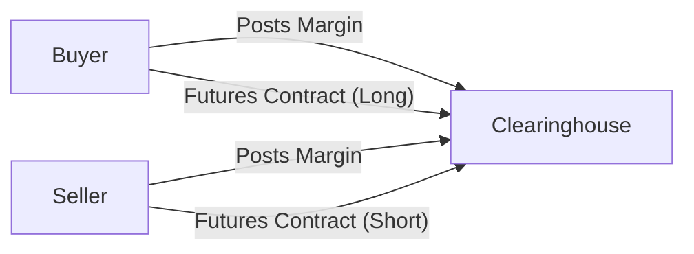

## Overview of Margining, Collateral, and Settlement

Margining, collateral, and settlement form the backbone of all futures markets. In simple terms, they’re the safety nets ensuring that each party to a futures contract can meet their financial obligations—whether prices move in their favor or against them. This section explains how margin works, why collateral is posted, and how physical or cash settlement is carried out.

I remember the first time I placed a futures trade—I felt a jolt of excitement and a fair bit of anxiety. “What if the market moves against my position?” I thought. Well, that’s precisely why margin exists: to give everyone in the market some assurance that trades will settle even when things go sour.

Below, we’ll discuss initial margin vs. maintenance margin, the role of clearinghouses, and how settlement can occur in different forms, including actual delivery of commodities or cash transfers.

## The Purpose of Margin in Futures Contracts

Margin in the futures market serves as collateral to cover potential losses. It protects both sides of the contract—buyers (longs) and sellers (shorts)—by ensuring each participant is creditworthy on any given day. Margin requirements are typically enforced by the exchange’s clearinghouse, which is effectively the central counterparty guaranteeing all trades.

### Initial Margin

• Definition: The initial margin is the collateral posted when a position is first opened.  
• Objective: This deposit covers the estimated maximum loss a trader might incur within a given time frame. Exchanges often estimate potential adverse price moves using historical volatility, stress tests, or standardized risk models.  
• Forms of Collateral: Although cash is most common, high-quality government securities or other highly liquid assets may be accepted. These non-cash assets can be subject to “haircuts,” meaning their value is discounted to account for liquidity or price risk.

“Haircut” means, for instance, that if you pledge $100 of a certain asset, the exchange may only credit you with $90 worth of margin due to potential fluctuations in the collateral’s market value. This practice ensures the true, or conservative, value of your posted collateral is recognized.

### Maintenance Margin and Margin Calls

Unlike the initial deposit, the maintenance margin is the minimum level your margin account balance must not fall below. If losses accrue and your margin balance dips below this threshold, you’ll receive a margin call. This is essentially the clearinghouse (via your brokerage) saying, “Hey, top up your account so that it meets the required maintenance margin.” If additional funds (or collateral) are not posted promptly, the clearing member can close out your position to protect the market.

It might feel a little stressful to get that “margin call” phone call or email—trust me, I’ve had that mini heart attack before—but it’s a normal part of the futures trading process. Margin calls highlight how derivatives can magnify losses if the market moves against you.

Mathematically, one can express the margin account balance at the end of each trading day (also known as the “daily settlement”) like this:


\text{MarginBalance}_{t+1} 
= \text{MarginBalance}_{t} 
+ (\Delta P_t \times \text{ContractSize} \times \text{NumberOfContracts}),


where ΔPₜ is the day's price movement for the futures contract. If this new margin balance falls below your maintenance margin, then a margin call is triggered.

## Daily Mark-to-Market and Variation Margin

Futures positions are marked to market every trading day. Gains or losses are reflected in your margin account in real time, often at the close of the market or at pre-scheduled intervals. Because of this daily settlement practice:

1. Profitable traders see their accounts credited.  
2. Traders on the losing side see their accounts debited.  
3. If the account falls below the maintenance margin, the trader must promptly deposit additional margin.  

This daily mark-to-market process is the core reason futures contracts are said to have very low (though not zero) counterparty credit risk. Losses are paid daily to offset potential greater accumulation of losses in the future.

## Clearinghouses: The Central Counterparty

A clearinghouse stands between every buyer and seller of a futures contract, effectively guaranteeing performance. By doing so, it transforms the bilateral contract (Buyer ↔ Seller) into two contracts (Buyer ↔ Clearinghouse) and (Clearinghouse ↔ Seller). The clearinghouse is indifferent to the direction of the price but extremely interested in ensuring all participants maintain adequate margins.

Rather than trusting that your counterparty will pay up, you rely on the clearinghouse. As long as margin requirements are met, the clearinghouse will honor the contract. This structure greatly reduces counterparty risk.

Here’s a simple Mermaid diagram illustrating how participants interact with the clearinghouse:

In practice, the buyer and the seller do not know each other’s creditworthiness directly. Rather, they both trust the clearinghouse to collect and monitor collateral from both sides appropriately.

## Types of Collateral Accepted

As touched on earlier, collateral typically includes:

• Cash: The most straightforward collateral.  
• Highly Liquid Securities: Government bonds, Treasury bills, or high-rated corporate debt. But remember, these can be subject to haircuts.  
• Letters of Credit: Some clearinghouses accept these in limited scenarios.

The key is that the collateral must be easily convertible into cash. In a crisis scenario, the exchange wants to be sure it can liquidate collateral quickly if a participant fails to meet obligations. The reason haircuts exist is to account for potential price fluctuation or liquidity shortfalls if forced liquidation becomes necessary.

## Collateral Haircuts: Ensuring Risk Coverage

A “haircut” is a risk management adjustment, typically expressed as a percentage, by which the collateral’s market value is reduced. For example, if a government bond is typically considered a strong piece of collateral, the haircut might be small—say 1% or 2%. For less liquid or more volatile securities, the haircut might be higher.

Common factors driving haircut decisions:  
• Volatility and liquidity of the pledged collateral.  
• Credit risk associated with the collateral instrument.  
• Market conditions (during times of stress, haircuts might be increased across the board).

Haircuts can be found across many areas of the derivative world, not just in futures. They also show up in repurchase agreements (repos), securities lending, and margin loans. But in futures markets, haircuts are crucial because participants often post non-cash collateral when they seek yield or prefer not to hold uninvested cash.

## Settlement Mechanisms: Physical vs. Cash

When the contract reaches expiry or is closed out, the net outcome must be “settled.” This settlement can occur in two primary ways:

### Physical Delivery

Physical delivery is when the underlying asset—often a commodity such as oil, gold, or corn—is delivered by the seller to the buyer. Practical considerations:  
• The short is responsible for supplying the commodity or instrument.  
• The long must be ready to accept and pay for the underlying asset.  
• Warehousing, logistical, and licensing issues might arise (think about storing 1,000 barrels of crude oil!).

Physical delivery is more common in certain commodity futures and some bond futures, where a bond can be delivered to settle the contract. Nonetheless, most market participants choose not to hold positions all the way to physical delivery. They generally close out or roll their positions before expiry (more on that in Section 2.7, “Physical vs. Cash Settlement”).

### Cash Settlement

Cash settlement is more common for financial futures, such as equity index futures or interest rate futures. Instead of physically exchanging the underlying, the losing side pays the winning side the net difference. If the settlement price is higher than the contract price for the long side, the short pays. If it’s lower, the long side pays the short.

This approach is far more convenient for assets that are difficult to deliver physically (imagine attempting to deliver a basket of stocks of an equity index!). Cash settlement also simplifies final accounting for participants who primarily trade for hedging or speculative purposes and do not need (or desire) the actual commodity.

## Practical Example: A Treasury Bond Futures Contract

Let’s walk through a short scenario:

1. Alice believes interest rates will go down (bond prices will go up). She buys 10 contracts of a Treasury bond future at a price of 100.  
2. The initial margin per contract is $2,000, so she posts $20,000 in a margin account. Her maintenance margin might be set at $1,500 per contract.  
3. Daily Mark-to-Market: On day one, the price settles at 101, meaning a +1 move from her entry. She gains $1,000 per contract (each contract might represent a notional bond price times a certain multiplier). Her account is credited with $10,000 total.  
4. Suppose the next day the price drops from 101 to 99 (a −2 move from the prior settle). She then loses $2,000 per contract, or $20,000 total. If her margin balance falls below the maintenance margin level (say $15,000 for 10 contracts), she’ll get a margin call asking her to top up.  
5. If the contract is cash settled and she holds until expiry at a final settlement price of 103, her net payoff from her original purchase price is +3 points per contract. The short party will pay that net difference in cash. Alternatively, if it’s physically settled, she may choose to take delivery of the underlying bonds—though in practice she might roll or offset the position before expiry.

## Role of the Clearing Member

In the futures world, most traders don’t directly interface with the clearinghouse; they use a “clearing member” or “Futures Commission Merchant (FCM).” The clearing member monitors trader margins in real time, manages margin calls, and ensures that all rules set by the exchange and clearinghouse are followed. Large banks and brokerage firms typically serve as clearing members if they meet capital and regulatory requirements. The clearing member in turn has an account with the clearinghouse.

### Margin in the Context of Intermediaries

If you have a retail brokerage account, your broker is likely a customer of a clearing member or is itself part of a larger clearing membership structure. This layered setup ensures that each level meets capital and margin obligations, all culminating at the clearinghouse, which is the final backstop.

## Common Mistakes and Pitfalls

• Ignoring Maintenance Margin: Some traders forget to monitor their margin balances daily and get caught off-guard by margin calls.  
• Underestimating Market Volatility: Rapid market moves can consume your margin quickly, leading to forced liquidation.  
• Mismanagement of Collateral: Posting less liquid assets without an understanding of haircuts can reduce effective margin capacity.  
• Holding into Delivery Without Logistics: Accidentally entering the delivery month without a plan can cause unwanted deliveries of commodities to your warehouse (or a big headache if you don’t manage a warehouse!).  

A friend of mine once forgot to close out a small natural gas contract and ended up scrambling in the final week to offset her position because she definitely didn’t want to take physical delivery. The logistical complexities can escalate quickly if you are not paying attention.

## Managing Collateral: Key Considerations

1. Liquidity: Be sure you can quickly convert your collateral into cash should you need to meet margin calls.  
2. Cost of Carry: Holding certain forms of collateral (e.g., T-bills) can earn interest, offsetting some of the opportunity cost of tying up funds.  
3. Regulatory Rules: Especially for larger institutions, stricter guidelines exist concerning collateral type, concentration limits, and re-hypothecation (the reuse of posted collateral elsewhere).  
4. Haircut Changes: Monitor if the clearinghouse or regulators alter haircuts on posted assets. A small shift in haircut policy can trigger additional margin requirements.  
5. Additional Collateral Requirements: Consult the relevant sections (2.10 “Clearing House Variation and Initial Margin Calculations”) for how the clearinghouse calculates these amounts more precisely.

## Clearinghouse Guarantee Mechanisms

A robust guarantee fund is maintained by the clearinghouse. All clearing members contribute to this fund, designed to cover losses that exceed the defaulting member’s own contributions. Essentially, it’s a waterfall of protection:

1. The Defaulting Party’s Margin  
2. The Defaulting Party’s Additional Collateral  
3. The Clearing Member’s Guaranty Contribution  
4. The Clearinghouse’s Own Capital  
5. The Mutualized Guaranty Fund from All Participants (if needed)

This layered approach ensures the continuity of the market, even in extreme times. It’s also why clearinghouses enforce strict risk management rules—nobody wants a chain reaction of defaults. The clearinghouse’s guarantee is only as robust as the sum of margins and contributions across all participants.

## Real-Time Monitoring and Technology

In modern markets, margin calls can be issued intraday, not just at the close of business. With high-frequency trading (HFT) and automated execution (discussed in Section 1.12), price swings can be abrupt, prompting clearinghouses to track intraday risk. If a trader’s position is extremely volatile, an intraday margin call might arise, requiring prompt collateral top-up. Technology has made these real-time checks far more feasible than in earlier decades.

## Regulatory Considerations

Regulatory frameworks—like those enforced by the Commodity Futures Trading Commission (CFTC) in the United States or the European Securities and Markets Authority (ESMA) in Europe—set broad guidelines for clearinghouses. These regulations often specify:

• Minimum capital requirements for clearing members  
• Minimum margin requirements across various asset classes  
• Mandatory central clearing for standardized derivatives, reducing the systemic risk of bilateral over-the-counter (OTC) contracts  

Regulators also oversee that all participants are treated fairly, that settlement prices are determined transparently, and that margin rules are enforced consistently. By promoting standardized clearing and settlement, they aim to keep the entire derivatives ecosystem stable.

## Closing Thoughts on Margining, Collateral, and Settlement

Margining, collateral, and settlement are the nuts and bolts that make futures markets efficient and relatively safe. The daily mark-to-market and the clearinghouse’s central role significantly minimize credit risk compared to many other financial instruments. Whether you’re hedging a commercial exposure, attempting to speculate on price movements, or investing in a broad-based equity index futures contract, understanding these concepts is essential for responsible and informed participation.

Next time you see a precipitous drop in the market and wonder, “How do all these futures contracts not go bust?”—remember, it’s the daily margin calls, robust collateralization, and clearinghouse structure that keep everything (mostly) under control.

If you’re curious about more intricate calculations regarding margin requirements, definitely check out Section 2.10 “Clearing House Variation and Initial Margin Calculations.” There, you’ll find formula-driven examples, plus some insights on margin offsets for correlated positions and spread strategies. Also, the CME Group website offers very detailed resources on margin methodologies and collateral acceptance policies, which can be invaluable in building a more advanced understanding of how rates and haircuts are set in practice.

## References and Further Reading

• CME Clearing Resources:  
  https://www.cmegroup.com/clearing  
  (Complete documentation on margin methodologies, settlement, and details about collateral acceptance and haircuts.)

• Duffie, Darrell. “Futures Markets.”  
  A foundational text on how futures markets operate, including discussion around margining, settlement, and the role of clearinghouses.

---

## Test Your Knowledge: Margining, Collateral, and Settlement



### Which of the following describes the main purpose of margin in the futures market?

- [ ] To charge additional fees whenever the market is volatile
- [x] To ensure traders can cover potential losses on their futures positions
- [ ] To set an upper limit on the number of contracts a trader can hold
- [ ] To provide a guaranteed profit at contract expiry

> **Explanation:** Margin acts as collateral to ensure traders meet their obligations, covering potential losses as the market moves.

### A “haircut” applied to posted collateral refers to:

- [x] A reduction in the value of the collateral for margin calculations
- [ ] A fee charged by brokers for each trade
- [ ] A daily penalty for failing to meet margin calls
- [ ] An additional charge for physically delivered contracts

> **Explanation:** A haircut is the percentage by which the collateral’s market value is discounted to account for liquidity or market risk.

### If a trader’s margin account balance falls below the maintenance margin:

- [ ] The futures contract is terminated automatically
- [x] The trader receives a margin call and must deposit additional funds
- [ ] The trader’s profit is automatically reduced
- [ ] The exchange blocks the trader from opening new positions

> **Explanation:** When an account dips under the maintenance margin level, the broker issues a margin call requiring the trader to top up the margin account.

### Daily mark-to-market for futures positions means:

- [ ] All futures contracts expire at the end of each day
- [ ] The exchange sends out daily trade confirmation emails
- [x] Gains and losses are credited or debited daily to each trader’s margin account
- [ ] The seller physically delivers the commodity each day

> **Explanation:** Mark-to-market is the daily settlement process in which unrealized gains or losses are realized into the margin account every day.

### Which of the following is true regarding physical delivery?

- [x] The short party must deliver the underlying asset at contract expiration
- [ ] The clearinghouse automatically converts all physical contracts into cash
- [x] Physical delivery is more common in commodity futures than equity index futures
- [ ] It involves no logistical concerns since everything is handled electronically

> **Explanation:** In physically settled contracts, the short side delivers the commodity or instrument. This is more common in commodity or certain bond futures and can involve significant logistical planning.

### In a cash-settled futures contract, settlement involves:

- [x] A monetary payment corresponding to the net gain or loss at expiration
- [ ] Both parties delivering a portion of the underlying asset
- [ ] A guaranteed transfer of physical stocks to the buyer
- [ ] A complete refund of initial margin to both parties

> **Explanation:** In cash settlement, the net difference between the settlement price and the original futures price is exchanged in cash—no physical asset changes hands.

### If a government bond is posted as collateral and is subject to a 5% haircut, it means:

- [x] Only 95% of the bond's value is counted towards margin
- [ ] The haircut applies only if the price of the bond falls by 5% overnight
- [x] The bond is deemed riskier than assets with a lower haircut
- [ ] No additional cash margin is necessary under any scenario

> **Explanation:** A 5% haircut reduces the value counted toward margin coverage to 95%. A higher haircut often signifies higher perceived risk or volatility of the collateral.

### A clearinghouse guarantees a futures contract by:

- [x] Standing between the buyer and the seller and collecting margin from both sides
- [ ] Eliminating all risk in the market by offering profit protection
- [ ] Setting an artificial price floor to limit losses
- [ ] Forcing retailers to stop trading during high-volatility periods

> **Explanation:** The clearinghouse serves as the central counterparty and requires margin from both sides to ensure contract performance.

### Which of the following is the best example of a margin call scenario?

- [x] A trader’s margin balance drops below the maintenance requirement after incurring daily losses
- [ ] A trader incorrectly fills out a tax form and receives a broker notice
- [ ] The broker demands higher commissions due to increased trading volume
- [ ] The clearinghouse notifies the trader that immediate physical delivery is required

> **Explanation:** Margin calls occur when losses reduce the margin balance under the maintenance margin threshold.

### True or False: Daily mark-to-market reduces counterparty risk in futures contracts.

- [x] True
- [ ] False

> **Explanation:** The daily settlement of gains and losses ensures margin accounts are kept up to date, mitigating the buildup of large uncollateralized exposures.


