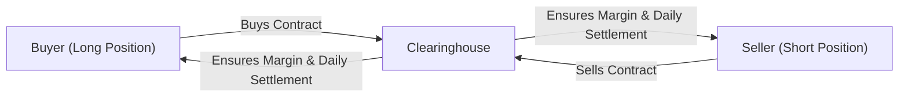

## Overview

Index and currency futures play a critical role in the global derivatives markets. They help portfolio managers hedge systematic risk, enable companies and individuals to lock in currency rates, and allow speculators to gain exposure to broad market movements. In my early days as a junior portfolio analyst, I remember being both excited and intimidated the first time I used index futures to rebalance a client’s equity portfolio. It felt like unlocking a powerful tool that could replicate broad market exposure in just one trade. Fast forward to today, and index futures (and their currency counterparts) still provide some of the most versatile and efficient ways to manage risk and capture returns across markets.

This section dives into the practical mechanics, pricing, settlement procedures, strategic uses, and best practices for index and currency futures. While it’s easy to get stuck in technical jargon, we’ll strive to keep things grounded by using relatable examples and straightforward explanations. We’ll also peek into how these contracts fit into an overall portfolio management framework—especially for risk management and speculation. And I’ll toss in a bit of personal hindsight from working with these instruments over the years.

## Stock Index Futures

### Why They Matter

Stock index futures are derivatives whose underlying asset is a specific equity index such as the S&P 500, FTSE 100, or Nikkei 225. Because these indexes often track broad segments of the equity market, the futures contracts allow investors to effectively buy or sell “the market” in one fell swoop. For large portfolio managers, hedge funds, or even sophisticated individual investors, such contracts provide a quick and cost-effective venue to adjust exposure without having to buy or sell individual stocks.

Common uses of index futures include:

• Hedging systematic risk (the kind of risk you can’t fully diversify away).  
• Gaining immediate exposure to a market’s direction without rebalancing many positions.  
• Speculating on broad market moves at relatively low transaction costs and margin requirements.

### Contract Specifications

An index future typically has a contract multiplier that translates the index price into a contract’s notional value. For instance, if the S&P 500 index is at 4,000 and the multiplier is 50, the notional exposure of one futures contract is 4,000 × 50 = USD 200,000. Because physically delivering “the index” would mean delivering each constituent stock in the correct proportion—a logistical nightmare—most index futures settle in cash. At contract expiration, the final settlement value is based on the index’s official closing price, and any gain or loss is paid or received in cash.

Key elements of an index futures contract:

• Underlying Index: Specifies the exact index tracked (e.g., S&P 500).  
• Contract Multiplier: Scales the index level to a notional contract value.  
• Tick Size: The minimum price increment.  
• Expiration Date: The date the contract ends (e.g., quarterly).  
• Settlement Method: Predominantly cash-settled for stock index futures.

### Margin Requirements and Marking to Market

Just like other futures, index futures use a system of margin and daily marking to market. Every trading day, each position (long or short) is credited or debited based on the new settlement price. This ensures credit risk is minimized and that profit and loss (P&L) is realized daily.

• Initial Margin: The deposit required to open a position.  
• Maintenance Margin: The minimum equity required to keep the position open.  
• Variation Margin: Funds paid (or received) to bring the margin balance back to the maintenance level after daily settlement.

### Hedging Applications

Hedging with index futures allows an investor to protect against broad market downturns. Instead of selling all your stocks, you can short a corresponding number of index futures contracts. If the market drops, you’ll likely lose on the stock positions but gain on the short container of index futures, helping offset the losses.

The hedge ratio is the ratio of the number of futures contracts you need relative to your underlying portfolio exposure:
  
(1)  
Hedge Ratio = (Portfolio Value ÷ Contract Multiplier) ÷ Index Level

This formula is the starting point; you would typically refine it to account for beta adjustments if your portfolio’s systematic risk diverges from the index.

### Tactical Asset Allocation and Speculation

On the speculation and tactical side, if you expect the market to rise, you might go long index futures. A small margin deposit lets you control a large notional amount of equities, leveraging your market view. That leverage is a double-edged sword: a small adverse price move can cause big losses relative to the margin posted.

Portfolio managers also engage in tactical asset allocation by using index futures to quickly tilt the portfolio toward or away from equities, adjusting risk exposure. One notable example I recall is a global equity manager who used index futures to reduce equity exposure within minutes when anticipating bad news out of a central bank press conference. Such speed simply wouldn’t be possible if they had to liquidate individual securities.

### Expanded Global Reach

Index futures aren’t limited to domestic indexes. Many popular benchmark indexes around the world (e.g., Euro STOXX 50 in Europe, Hang Seng in Hong Kong) have active futures contracts. Investing in these instruments can be more cost-effective than direct foreign stock purchases—though keep an eye on currency exposure, because you might need to hedge that separately if the contract you’re trading is denominated in a foreign currency.

## Currency Futures

### The Basics

Currency futures—sometimes called FX (foreign exchange) futures—are contracts to buy or sell a specified amount of a foreign currency at a set date for a predetermined exchange rate. Similar to index futures, currency futures are traded on regulated exchanges, meaning there’s a clearinghouse that mitigates counterparty risk. This stands in contrast to currency forwards, which typically trade over-the-counter and can be customized for any notional amount and settlement date.

Standardized contract sizes, widely followed settlement dates, and robust exchange trading volumes make currency futures a popular tool. Whether you’re a multinational company hedging foreign revenues or an investor looking to profit from shifts in exchange rates, currency futures can offer a convenient and regulated approach.

### Contract Specifications

While exact details can differ across exchanges, a few standard features include:

• Underlying Currency Pair: Popular pairs involve the USD, EUR, GBP, JPY, CAD, and many others.  
• Contract Size: Each contract typically covers a specific amount of the base currency (e.g., EUR 125,000).  
• Expiration Cycle: Currency futures often expire on a quarterly cycle (March, June, September, December).  
• Quotation: Usually quoted in terms of USD per unit of foreign currency (e.g., USD per euro).  
• Settlement: Some contracts are physically settled (you’ll receive or deliver the currency), while others settle in cash, depending on the exchange’s rules.

As an example, the Euro FX futures contract on the Chicago Mercantile Exchange (CME) is for EUR 125,000, typically quoted in USD/EUR. If the contract is trading at 1.1000, each contract has a notional value of 125,000 × 1.1000 = USD 137,500.

### Hedging Currency Exposure

Hedging currency risk is one of the most common reasons to use currency futures. If you’re a European exporter expecting to receive USD in three months, you might worry that the USD could weaken relative to the euro, reducing the EUR value of your future USD receipts. By shorting (selling) USD/EUR futures, you lock in the exchange rate. If the USD actually does weaken, your short futures position gains in euro terms, offsetting the loss in your actual revenues.

Similarly, an institutional investor with an international equity portfolio might buy or sell currency futures to manage FX exposures. This can be done in a passive manner to peg a known currency exchange rate or in a dynamic manner as part of an active currency overlay strategy.

### Speculation and Arbitrage

Currency futures also attract speculators who aim to profit from changes in exchange rates. Rather than physically exchanging currencies or using the OTC forward market, which might require credit lines and complex documentation, trading a standardized contract on an exchange is often simpler. It’s also beneficial because transparency and liquidity can be quite high.

Moreover, arbitrage opportunities can arise if the currency futures price deviates too much from the theoretical forward rate implied by spot exchange rates and interest rate differentials (covered interest rate parity). If the futures price is out of line, savvy traders can do a cash-and-carry (or reverse cash-and-carry) strategy using the spot FX market, the futures market, and a short-term money market position until the mispricing corrects.

## Pricing Considerations

### Cost of Carry Model

At a high level, the price \\(F\\) of a futures contract is derived from the spot price \\(S\\) of the underlying asset, plus any costs of carrying that asset to the settlement date. For currencies, the cost of carry effectively translates to the interest rate differential between the two currencies, as captured by covered interest rate parity.

In simplified terms for currency futures:


F_{(t,T)} = S_{t} \times \frac{(1 + i_{dom})^{(T-t)}}{(1 + i_{for})^{(T-t)}}


Where:  
• \\(i_{dom}\\) is the domestic interest rate.  
• \\(i_{for}\\) is the foreign interest rate.  
• \\(T - t\\) is the fraction of the year until maturity.

For stock index futures, the cost of carry might include the domestic risk-free rate, plus or minus any dividend yield or convenience yield. Essentially:


F_{(t,T)} = S_{t} \times e^{(r_{dom} - \delta)(T-t)}


where \\(\delta\\) represents the dividend yield on the index. If the index is expected to pay substantial dividends, it reduces the futures price relative to the spot price.

### Arbitrage Boundaries

The no-arbitrage framework keeps futures prices in line with what you’d expect from the cost of carry model. If the futures price drifts too high, arbitrageurs can short the futures contract and buy the underlying asset (for currency: buy the higher-yielding currency spot, etc.). Conversely, if the futures price drifts too low, they can do the reverse. This dynamic helps ensure that index and currency futures prices remain efficient in well-traded markets.

## Market Mechanics and Clearing Processes

All standardized futures trades go through a clearinghouse that guarantees settlement. After the trade is matched, the clearinghouse becomes the buyer to every seller and the seller to every buyer. This mitigates counterparty risk and is one of the key advantages of futures over some over-the-counter products.

Below is a simplified mermaid diagram illustrating the structure:

The clearinghouse requires each party to post initial margin. Gains or losses are reflected in daily variation margin calls, so participants must maintain sufficient funds to support any adverse price movements.

## Portfolio Management Implications

For portfolio managers, index and currency futures are indispensable building blocks:

• Rebalancing: Quickly re-orient an asset allocation without disrupting the underlying portfolio holdings (e.g., adjusting equity beta while continuing to hold a well-curated set of stocks).  
• Tactical Overlays: Express short-term market views—long or short—using index or currency futures.  
• Currency Overlay Strategies: Isolate currency risks and manage them separately through a series of futures trades, especially for global multi-asset portfolios.  
• Cross-Hedging: Use correlation relationships to hedge exposures if direct hedges aren’t available or are too costly.

I recall a situation where a client’s portfolio denominated in JPY included a large portion of European equities. We used Euro FX futures to manage the currency risk, so that the portfolio’s returns were more stable in yen terms. The manager only needed to tweak futures positions every so often, rather than liquidate the underlying equities.

## Best Practices and Pitfalls

• Margin Management: Keep an eye on margin calls—futures are marked to market daily, and you can be asked (at sometimes inconvenient moments) to post additional collateral.  
• Basis Risk: If you’re using S&P 500 futures to hedge a portfolio that doesn’t perfectly track the S&P 500 index, the hedge might not be exact. A mismatch between the underlying exposure and the chosen futures contract can lead to residual risk.  
• Rollover Risk: When a futures contract nears expiration, you might need to “roll” the position into the next contract to maintain the hedge or exposure. The transaction costs can add up, and the new contract’s price might not match your prior contract exactly—though it typically closely follows fair value.  
• Liquidity Risk: Most heavily traded index and currency futures have robust liquidity. However, less common currency futures pairs, or smaller stock indexes, can have wider bid-ask spreads or lower volume, raising trading costs.  
• Regulatory and Accounting Issues: Check local IFRS/GAAP guidelines for derivative usage and hedge accounting. Under IFRS 9, for instance, designating a futures-based hedge in formal hedge accounting can have specific documentation requirements.

## Exam Tips and Final Thoughts

From a CFA exam perspective, you should understand how to use index futures to create synthetic positions, adjust portfolio beta, or hedge currency risk. Expect scenario-based questions testing your ability to compute hedge ratios, demonstrate the cost of carry model, and highlight how futures achieve a desired target exposure. 

On essay-type questions, the exam might ask you to describe how a manager can shift asset allocation blends quickly using index futures, or how to hedge foreign currency receipts using currency futures. Make sure you can calculate the notional amounts, contract multipliers, and interpret the daily marking-to-market mechanics. Also, watch out for pitfalls such as partial hedges, basis risk, or incorrectly matching contract months with the horizon of your underlying exposure.

And always keep an eye on the bigger picture. Futures offer leverage, convenience, and liquidity, but they can magnify losses if not managed carefully. Also, real-world complexities—like taxes, transaction costs, or unexpected shifts in volatility—can change the profit/loss profile in ways that aren’t always reflected in a textbook example.

## References and Further Reading

• Kolb, R. W. (2021). Futures, Options, and Swaps.  
• Bloomberg Intelligence: Regular reports on currency and equity index futures.  
• CME Group: Contract specifications and daily bulletins on index and currency futures.  
• IFRS 9 and IAS 39: Guidance on hedge accounting rules.  

---

## Test Your Knowledge: Index and Currency Futures Mastery



### A portfolio manager wants to hedge systemic equity risk using futures. Which of the following statements is most accurate?

- [ ] The manager should buy index futures to hedge against falling equity prices.  
- [x] The manager should short index futures to offset potential losses in the equity portfolio.  
- [ ] The manager cannot hedge equity exposure with an index future because of basis risk.  
- [ ] The manager should buy single-stock futures for each underlying security.  

> **Explanation:** To hedge a long equity portfolio, the manager typically takes a short position in a relevant index futures contract. This offsets potential losses if the market declines.

### Which factor does the cost-of-carry model for currency futures primarily account for?

- [ ] Dividend yield on the foreign currency.  
- [x] Interest rate differentials between the two currencies.  
- [ ] Volatility of the underlying equity index.  
- [ ] Government macroeconomic policy announcements.  

> **Explanation:** The cost-of-carry model for currency futures focuses on interest rate differentials, reflecting the idea of covered interest rate parity.

### When an index futures contract is cash-settled, the buyer and the seller:

- [x] Exchange a net cash amount based on the difference between the futures price and final settlement value.  
- [ ] Deliver the underlying basket of stocks to each other.  
- [ ] Must roll positions to the next contract month before settlement.  
- [ ] Fulfill the contract with a physical asset exchange.  

> **Explanation:** Cash-settled index futures simply involve a net cash payment. No physical delivery of the entire index constituents occurs.

### A European exporter anticipates receiving USD in three months. To hedge against a drop in the USD/EUR exchange rate, the exporter could:

- [x] Short USD/EUR futures.  
- [ ] Buy puts on the USD to preserve upside.  
- [ ] Buy USD/EUR call options.  
- [ ] Enter a forward rate agreement.  

> **Explanation:** By shorting USD/EUR futures, the exporter locks in an exchange rate and gains if USD weakens relative to the euro, offsetting losses from a potentially unfavorable currency move.

### Which of the following is the primary reason most stock index futures settle in cash rather than physical delivery?

- [x] Delivering every stock in the index is impractical and costly.  
- [ ] Regulators prohibit physical delivery of stock indexes.  
- [ ] Exchanges do not permit any physical delivery in futures.  
- [ ] The underlying index must be completely rebalanced before expiration.  

> **Explanation:** Cash settlement is preferred because it is highly cumbersome to deliver each stock in the exact proportions required by the index.

### When using currency futures for speculation, traders benefit from:

- [x] Standardized contracts and centralized clearing.  
- [ ] Complete avoidance of margin calls.  
- [ ] Unlimited return with zero risk exposure.  
- [ ] Freedom from bid-ask spreads.  

> **Explanation:** Speculative currency futures trading offers benefits such as standardized contract sizes and exchange clearing, which reduce counterparty risk. However, margin calls and bid-ask spreads still apply.

### A key difference between currency futures and currency forwards is that:

- [x] Currency futures are standardized, exchange-traded, and cleared, whereas forwards are usually OTC and customizable.  
- [ ] Currency futures always result in physical delivery, while forwards only settle in cash.  
- [ ] Forward contracts cannot be used for hedging.  
- [ ] Currency futures do not require posting of any initial margin.  

> **Explanation:** The primary difference is that currency futures trade on an organized exchange with standardized terms, whereas forwards are customized OTC contracts.

### An investor holds a European equity portfolio but wants to remain fully invested in equities while hedging currency risk. Which is the best choice?

- [x] Use currency futures to hedge the FX component without selling the equities.  
- [ ] Sell the entire European equity portfolio and invest in domestic bonds.  
- [ ] Use stock index futures on the domestic index.  
- [ ] Short-sell the same European equities.  

> **Explanation:** By using currency futures, the investor can hedge out the FX exposure while keeping the equity exposure intact.

### Rollover risk in futures commonly refers to:

- [x] The uncertainty and transaction costs involved when one futures contract is about to expire and needs to be replaced with another.  
- [ ] The possibility that the exchange will suspend trading.  
- [ ] A daily variation margin call that must be paid before the next trading session.  
- [ ] Enforcement actions taken by regulatory authorities when a contract expires.  

> **Explanation:** Rollover risk involves the mechanics and potential cost differentials when you ‘roll’ out of a near-to-expire contract into a longer-dated contract.

### Backwardation in a futures market means:

- [x] The futures price is below the expected future spot price.  
- [ ] The futures price is always higher than the spot price.  
- [ ] The spot price has crashed, forcing contract cancellation.  
- [ ] Interest rate differentials have disappeared between the two currencies.  

> **Explanation:** Backwardation occurs when the futures price is lower than the expected future spot price, often due to high convenience yield or supply constraints on the underlying asset.


