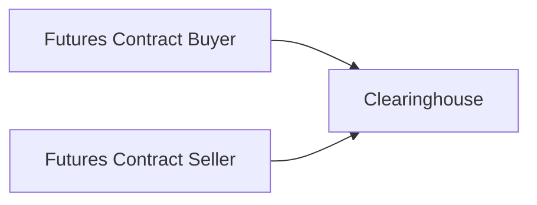

**Overview**  
Well, here we go—let’s delve into the bustling world of commodity, interest rate, and equity futures. If you’ve surveyed any major commodity exchange or financial market floor (or maybe just watched a trading documentary), you’ve likely seen that frenzied energy as traders yell, gesture, and jockey for position. I remember once stepping onto the floor of the Chicago Board of Trade and feeling the adrenaline rush! It was like stepping into a different universe.

In this section, we’ll examine three vibrant categories of futures markets: commodities (including agriculture, metals, and energy), interest rates (spanning short- and long-term instruments), and equities (single stocks and stock indexes). Futures contracts have their own “personalities,” so to speak, with operational differences in how they’re quoted, how they settle, and how different participants use them to hedge or speculate. Let’s shake off any intimidation. We’ll piece it all together step by step—covering practical examples, best practices, potential pitfalls, and everything in between.

---

**Commodity Futures**  
Commodity futures are some of the oldest derivatives, historically tied to agricultural markets. Over time, these contracts expanded to include metals (like gold, silver, copper) and energy products (like crude oil, natural gas). Despite the variety, these futures share some foundational mechanics.

- Physical vs. Cash Settlement  
  Many commodity futures still involve physical delivery. For example, gold futures on certain exchanges require the seller to deliver a specified quantity (often 100 troy ounces) of gold with a minimum purity standard. Similarly, agricultural futures such as wheat or corn often allow physical delivery in authorized warehouses. That might surprise you if you’re picturing big sacks of corn. Indeed, it’s real stuff. However, many participants exit or roll (extend) their positions before the delivery period, because they never actually want, say, bushels of corn in their backyard.

  Cash-settled commodities exist too. Energy index futures or certain weather-related derivatives might settle purely in cash based on an index price. This helps traders who want price exposure but have no interest in physically warehousing or transporting a commodity.

- Contract Specifications and Notional Value  
  Each commodity futures contract defines the amount of the commodity, the delivery location, and the quality grade. The notional value is the product of the futures price and the contract size. So, if a crude oil contract controls 1,000 barrels, and each barrel trades at USD 75, the notional value is USD 75,000. Keep in mind that you’ll have to post margin, which is a fraction of this notional value, to open and maintain your position. That leverage can be both exciting and a bit scary.

- Common Participants  
  You’ll find hedgers like farmers, oil producers, or precious-metal mining companies looking to lock in future prices to manage operational risk. On the other side are financial speculators—everyone from proprietary traders to large hedge funds—seeking to profit from anticipated price changes. Finally, there are arbitrageurs who try to exploit mispricing across geographical locations or timescales (like calendar spreads) to lock in riskless profit (in theory).

- Example: Gold Futures  
  Gold futures often specify a minimum purity of 995 parts per 1,000, with delivery at designated exchange vaults. The convenience yield (the intangible benefit of physically holding gold, such as meeting immediate production needs or responding to consumer demand) can influence pricing. Because gold is widely recognized as a safe-haven asset, shifts in sentiment around economic uncertainty can drive big price swings, so risk management is paramount.

---

**Interest Rate Futures**  
Interest rate futures let you trade views on short- or long-term rates. If you’re a bond portfolio manager, you might use these to hedge the risk of rising yields. Or if you’re more of a thrill-seeker (I won’t judge!), you might use them to speculate on central bank policy decisions.

- Short-Term vs. Long-Term  
  Short-term interest rate futures track instruments like 3-month Eurodollar deposits (historically tied to LIBOR) or other short-term benchmarks. These are often used by traders looking at near-term yield curve movements. Although the world is transitioning away from LIBOR, you’ll still see references to Eurodollar futures. In many regions, new products pegged to alternative risk-free rates (like SOFR in the U.S.) are gaining traction.

  Long-term interest rate futures track sovereign bonds—prime examples include U.S. Treasury bonds and notes (e.g., 2-year, 5-year, 10-year, 30-year). Because these instruments have longer maturities, the price movement is typically more sensitive (i.e., higher duration) to underlying interest rate changes.

- Cash vs. Physical Delivery  
  Many short-term interest rate futures are cash-settled, reflecting the difference between the contract price and a reference interest rate at expiry. For example, a Eurodollar future typically settles based on 100 minus the 3-month USD LIBOR (though this is evolving). On the other hand, Treasury futures might involve physical delivery of a specific bond or a “cheapest-to-deliver” obligation, typically giving the short seller a delivery option. This cheapest-to-deliver bond dynamic can lead to interesting basis trades because the short effectively picks which bond to deliver.

- Hedging or Speculating  
  Commercial banks can hedge interest rate risk by using interest rate futures to offset movements in the rates paid on deposits or rates earned on loans. Bond portfolio managers frequently go short Treasury futures to protect against the risk of rising yields (and falling bond prices). Meanwhile, speculators can take leveraged positions in anticipation of the Federal Reserve or other major central banks changing their policy rates.

- Example: Eurodollar Futures  
  These represent a USD 1 million deposit for a 3-month term, with each basis point move in interest rates equating to USD 25. That may sound modest, but it can add up quickly when you factor in the contract’s leverage. When I was first learning about Eurodollar futures, I found the formula for the contract quote a bit daunting. The price is quoted as 100 minus the implied 3-month interest rate. So if the futures price is 95.00, the implied interest rate is 5.00%. “Simple,” you say. Sure, but keep an eye on how quickly a 1% change in interest rates can multiply across large notional amounts!

---

**Equity Futures**  
Equity futures let market participants gain or hedge exposure to single stocks or stock indexes. Single-stock futures (SSF) exist but are relatively less liquid compared to index futures. Index futures—like those on the S&P 500—dominate equity derivatives trading volumes.

- Single-Stock Futures (SSF)  
  SSFs specify a particular stock, the contract multiplier (often 100 shares), and the delivery method. They can be physically delivered (you hand over the shares at expiration) or cash-settled based on the final stock price. Liquidity can be thin, making bid-ask spreads wide—something to watch out for.

- Index Futures  
  Perhaps the most popular equity futures. A single contract on the S&P 500, for instance, controls a notional exposure of the index level times a multiplier (often USD 50). If the S&P 500 stands at 4,000, then one contract has a notional value of USD 200,000. These futures generally settle to an official closing index level (cash delivery).

- Hedging or Speculating  
  A portfolio manager long a basket of stocks can short index futures to hedge against broad market declines. Or, an investor might buy index futures to quickly gain diversified market exposure—sometimes a more cost-effective strategy than buying all underlying shares individually. Meanwhile, speculators looking to time the market might prefer index futures for their liquidity and tight bid-ask spreads.

- Example: Hedging a Large Equity Portfolio  
  Suppose a portfolio is heavily weighted toward U.S. equities. The manager becomes nervous about a possible market correction. Instead of selling all the stocks (triggering transaction costs and potential capital gains), the manager shorts the S&P 500 futures. A downward move in the index will generate gains on the short futures to offset some losses on the long equity positions. This is a classic approach to quickly reduce equity beta without liquidating everything.

---

**Key Contract Features and Delivery Procedures**  
Each of these futures has unique contract features. Paying attention to seemingly small details—like contract size, tick value, and delivery specifics—is incredibly important. Here’s a quick summary table:

| Category   | Contract Example         | Settlement Type     | Contract Size / Notional     |
|------------|--------------------------|---------------------|------------------------------|
| Commodity  | Gold Futures, Crude Oil | Physical or Cash    | e.g., 100 troy oz (Gold), 1,000 barrels (Crude) |
| Interest Rate | Eurodollar, Treasury | Cash or Physical    | e.g., 3-mo. 1M deposit (Eurodollar), $100K face T-Notes |
| Equity     | Single-Stock, S&P 500   | Physical or Cash    | e.g., 1 index point × USD 50 (S&P 500 futures) |

You can see from the table that “standard size” can be quite different. It might be 100 shares for a single-stock future, or it might be 125,000 euros in a Euro Bund future. Watch for conversion factors, too, especially in bond futures.

---

**Market Structure and Flows**  
The basic transaction structure for futures trades looks something like this:

The clearinghouse stands between the buyer and the seller, guaranteeing performance of each side as long as margin requirements are met. This structure is central to mitigating counterparty risk. Daily margining means gains/losses are settled every day or even intraday, ensuring that net exposures remain manageable.

---

**Practical Examples and Case Studies**  

- A Farmer Hedging Wheat Prices  
  Let’s say a wheat farmer is worried about declining prices by the time harvest comes around in six months. The farmer sells wheat futures to lock in a favorable price. If the wheat spot price falls by harvest time, the farmer’s futures position should offset losses. If prices rise (and the farmer misses out on some extra profit), well, that’s the trade-off for price certainty.

- Bond Portfolio Manager Hedging with Treasury Futures  
  If the manager expects interest rates to rise, they can short U.S. Treasury futures. If rates do climb, making bond prices fall, the gain on the short futures position can offset or mitigate losses on the underlying bond portfolio.

- Quick Market Exposure with Equity Index Futures  
  A large institutional investor receives a sudden influx of cash. Buying each stock in the S&P 500 individually would be time-consuming and generate significant transaction costs. Instead, the manager purchases S&P 500 futures, instantly gaining exposure to the broad market. Over time, the manager might choose to convert those futures positions into actual equity holdings in a more measured approach.

---

**Best Practices and Common Pitfalls**  

- Understand Margin Requirements  
  It sounds simple, but ignoring margin can lead to forced liquidations if your position moves against you. Always keep enough available funds to maintain margin requirements.

- Delivery-Related Risks  
  If you’re unprepared for physical delivery (say, you’re an oil speculator with no storage facilities), close or roll your contracts well before the notice period. We’ve seen cautionary tales of traders unexpectedly ending up with the real commodity on their hands.

- Bid-Ask Spreads and Liquidity  
  In less liquid contracts (like certain single-stock futures), wide spreads can eat away any profit. There’s no point in having a winning trade if half the gain goes to large transaction costs.

- Basis Risk  
  For hedgers, basis risk arises when the futures price doesn’t move in perfect sync with the spot price of your actual commodity or asset. The mismatch can reduce hedge effectiveness.

- Market Volatility  
  Large swings can lead to sharp margin calls. Keep in mind how leveraged these instruments are. Extreme moves, like in energy markets during geopolitical crises, can introduce huge intraday price fluctuations.

---

**Risk Management**  
Futures can be an efficient way to manage risk, but ironically, they’re also a significant source of potential risk if used improperly. Adopting a robust risk management framework includes:

• Diversifying across multiple contracts or strategies, so you’re not “betting the farm” on one commodity or rate change.  
• Using stop orders or other exit strategies to prevent catastrophic losses.  
• Monitoring intraday margin calls—some clearinghouses might require top-ups in the middle of the trading day if volatility explodes.  

---

**Exam Tips**  
• Be sure you can distinguish between physical and cash-settled futures. That difference is often tested.  
• Learn the typical contract sizes and how final settlements are determined.  
• Understand how each type of futures contract can be used for hedging vs. speculation—that’s a common scenario-based exam question.  
• Know your terminology: “notional value,” “cheapest-to-deliver,” “delivery options,” etc.  
• For exam calculations, always keep track of the contract multiplier. Many mistakes come from forgetting to multiply (or dividing incorrectly).  
• Remember that basis risk and margining are central to real-world usage. The exam might test your ability to compute the change in margin given a small tick movement.

---

**Further References and Suggested Readings**  
• [CME Group Product Specifications](https://www.cmegroup.com/trading/products/) – A treasure trove of up-to-date details on contract sizes, tick values, trading hours, etc.  
• Chisholm, Andrew M. “Derivatives Demystified” – Offers accessible explanations of the mechanics behind each contract type.  
• CFA Institute Level I Study Resources – Look for derivative and risk management curriculum sections.

---

## Test Your Knowledge: Commodity, Interest Rate, and Equity Futures



### Which of the following is most commonly associated with physical delivery in the futures market?

- [ ] Eurodollar futures
- [x] Gold futures
- [ ] S&P 500 index futures
- [ ] Treasury note futures

> **Explanation:** Gold futures typically require physical delivery of a specified quantity of gold in specified vaults. Many other contracts, such as Eurodollar or equity index futures, often settle in cash.

### A bond portfolio manager believes interest rates will increase in the near future. Which is the most likely hedging strategy?

- [ ] Buying Treasury futures
- [x] Shorting Treasury futures
- [ ] Buying commodity futures
- [ ] Selling S&P 500 index futures

> **Explanation:** Rising rates imply falling bond prices. To hedge, the manager would short Treasury futures, offsetting some of the loss if bond prices fall.

### Which of the following is true about single-stock futures compared to equity index futures?

- [x] Single-stock futures typically have lower liquidity.
- [ ] Single-stock futures typically have smaller bid-ask spreads.
- [ ] Single-stock futures are the most actively traded equity derivatives.
- [ ] Single-stock futures generally have lower basis risk than index futures.

> **Explanation:** Single-stock futures often have less liquidity and wider bid-ask spreads versus index futures. Index futures are typically more popular among traders, portfolio managers, and hedgers for broad market exposure.

### How is the final settlement price of Eurodollar futures commonly determined?

- [x] By 100 minus a reference interest rate (e.g., 3-month LIBOR or alternative benchmark) at expiration
- [ ] By delivering physical deposits at expiration
- [ ] By adjusting for the spot gold price
- [ ] By referencing the S&P 500 closing level

> **Explanation:** Eurodollar futures pricing convention is based on 100 minus the implied interest rate, historically based on 3-month LIBOR, though newer benchmarks may apply.

### A wheat farmer wants to lock in the price of the upcoming harvest. Which position should they take?

- [ ] Long a call option
- [ ] Long a put option
- [x] Short a wheat futures contract
- [ ] Long a wheat futures contract

> **Explanation:** A farmer worried about falling prices (because they plan to sell wheat) typically shorts futures contracts to lock in a price and hedge against declining spot prices.

### One major advantage of cash-settled futures over physical delivery contracts is:

- [x] Traders do not have to handle or store the underlying commodity.
- [ ] They allow trading at lower margin rates.
- [ ] They have no basis risk.
- [ ] They always have higher liquidity.

> **Explanation:** Cash-settled futures spare participants the logistical burden and cost of handling physical commodities, making them more convenient for purely financial players.

### Why might an equity portfolio manager choose to hedge using index futures rather than selling individual stocks?

- [x] To reduce transaction costs and maintain portfolio composition
- [ ] To increase correlation risk across stocks
- [x] To quickly gain or reduce broad market exposure
- [ ] To lock in a physical delivery of underlying shares

> **Explanation:** Index futures allow quick, cost-effective broad market hedging. The manager avoids the complexity and cost of selling each stock individually, and can easily reverse or adjust the futures hedge.

### Which of the following is a common risk when hedging with futures?

- [x] Basis risk
- [ ] Guaranteed free arbitrage
- [ ] Zero credit risk
- [ ] Absence of daily margin adjustments

> **Explanation:** Basis risk refers to the possibility that the futures price and the underlying asset’s spot price do not move perfectly in sync. This can reduce the effectiveness of a hedge.

### Which of the following might be subject to a “cheapest-to-deliver” option?

- [x] Treasury futures
- [ ] Gold futures
- [ ] S&P 500 index futures
- [ ] Single-stock futures

> **Explanation:** Certain bond futures (such as U.S. Treasury futures) allow the short position to deliver one among a basket of eligible bonds, choosing the cheapest one to deliver.

### Futures contracts commonly employ margining to mitigate counterparty risk. True or False?

- [x] True
- [ ] False

> **Explanation:** The clearinghouse employs a daily (or intraday) marking-to-market mechanism, ensuring losses are covered daily. This significantly reduces the buildup of counterparty risk.


