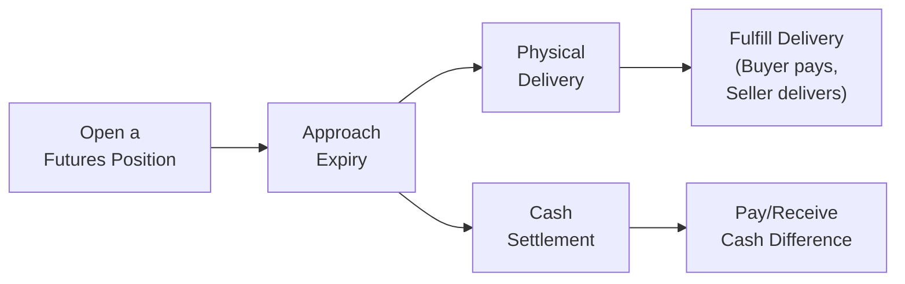

## Introduction

Sometimes, when we talk about derivatives like futures and forwards, we tend to focus on the contract terms, margins, and payoffs—without thinking too hard about what happens when the contract actually expires. But here’s the catch: not all contracts get settled in the same way. Some require you to deliver or receive the underlying asset, while others simply require a cash payment reflecting any gains or losses. This difference—between physical and cash settlement—can seriously affect everything from your operational setup to your risk management strategy.

In this section, we’ll discuss the essentials of physical settlement and cash settlement for forward and futures contracts. I remember back when I was a fresh-faced junior analyst: I read about how some unsuspecting trader ended up receiving a literal shipment of commodities because they failed to close out a physically delivered contract before expiry. It was a bit of a fiasco—and definitely a story that made me realize how “settlement details” are critically important!

## Overview of Settlement Mechanisms

When a forward or futures contract matures, you have to settle the position. Settlement can be executed either physically (transferring the underlying asset) or financially through a cash payment. Let’s break it down in simple terms before diving into more advanced details:

• Physical Settlement: The party in the short position delivers the actual commodity or instrument. The party in the long position pays the agreed-upon price and takes possession.  
• Cash Settlement: No one delivers any physical asset. Instead, one party pays the other an amount equal to the difference between the contract price and the final settlement price, which is typically determined by a benchmark or exchange-set price on the last trading day.

## Why Differentiate Between Physical and Cash Settlement

So, why do we even have two types of settlement? In a perfect world, you’d just pick whichever is easiest. But in reality, the choice depends on:

• The nature of the underlying asset (is it practical to store or deliver?).  
• The market's preference (some markets, like corn or crude oil, prefer actual delivery for commercial reasons).  
• Regulatory standards (some jurisdictions or exchanges might require certain types of settlement).  
• Operational feasibility (for instance, financial index futures are impossible to deliver physically).  

From a portfolio manager’s perspective, the decision to hold a physically delivered or cash-settled contract can also affect your hedging approach—especially if you legitimately need the commodity for your business operations.

## Physical Settlement in Depth

### Physical Delivery Basics

Physical settlement entails transferring the actual commodity or financial instrument at expiration (or during the delivery window). For example, if you hold a long cattle futures contract until maturity, you could literally end up with live cattle in a holding pen somewhere. Similarly, if you’re trading a bond futures contract with physical delivery, you would need to deliver or receive a pool of deliverable bonds that meet certain exchange criteria.

Physically delivered contracts are more common when the underlying assets are tangible (e.g., agricultural products, metals, or energy commodities) or are easily standardized financial instruments (e.g., government bonds).

### Key Participants and Motives

• Hedgers in Commodity Markets: Farmers may use futures to lock in a selling price for their produce or cattle. They often favor physical delivery because they can deliver the goods they already produce.  
• Commercial Consumers (e.g., food processors, power plants): These entities might opt for a physically settled contract so they can take delivery of necessary raw materials.  

If you’re in charge of a real-world commodity operation, you want the option to deliver or receive the underlying product in a streamlined manner, helping you lock in costs or revenues.

### Practical Example

Let’s say you’re a wheat farmer. You sell a wheat futures contract at $5 per bushel to lock in a price for your harvest. When the contract expires, if you choose not to close out your futures position, you’ll be responsible for physically delivering the wheat to fulfill your obligation. The short position (you, the farmer) delivers the wheat; the long position pays the agreed price, and the contract is settled.

### Notice Periods for Delivery

Physical settlement often comes with specific rules that require the short position to notify the exchange or clearinghouse of their intention to deliver. This “notice period” typically starts a few days before the contract’s final expiration. Missing that window can force you into an unexpected cash settlement—or additional fees or complications.

### Operational and Logistical Considerations

With physical settlement, you have logistical challenges:

• Storage Facilities: If you’re the buyer (long), do you have somewhere to store those barrels of oil or bushels of wheat?  
• Transportation Arrangements: Delivery can involve trucking, shipping, or pipeline logistics.  
• Quality and Grade Standards: Exchange rules typically specify the grade or quality of the commodity that must be delivered (e.g., for wheat, the protein content or moisture level).  

In short, if you’re dabbling in physically delivered futures, you need to plan for more than just the financial side of the trade. Otherwise, you might be caught by surprise.

## Cash Settlement in Depth

### How Cash Settlement Works

With cash settlement, there is no need to move any physical good or financial security at expiration. Instead, the difference between the contract price and the official settlement price is exchanged in cash. This official settlement price is usually determined by the exchange’s methodology—often based on the closing price of the underlying or a specially calculated index.

For instance, if you have a futures contract with a price of $2,050 on an equity index and that index settles at $2,100 on the final day, the short position would pay the difference ($2,100 – $2,050) times the multiplier to the long position.

### Common Markets Using Cash Settlement

Cash settlement is especially popular in:

• Stock Index Futures (e.g., S&P 500 futures). Let’s be honest: you can’t deliver “500 stocks” in neat physical bundles.  
• Interest Rate Futures (e.g., Eurodollar, certain LIBOR-based or risk-free rate-based futures). The underlying is an interest rate, not a commodity you can ship in a truck.  
• Currency Futures (some are physically delivered, but many prefer net settlement). Currency is deliverable, but often it’s simpler to net out the difference in cash.

### Efficiency and Reduced Complexity

The biggest perk of cash settlement is convenience. Traders don’t have to worry about:

• Warehousing a commodity.  
• Managing the logistics of shipping.  
• Potential disruptions from supply chain or inventory issues.  

For purely financial assets (like indices or interest rates), cash settlement is a must. And from a risk management perspective, it’s simply more efficient if you have no commercial use for the underlying commodity or bond.

### Real-World Case Study: Index Futures

Imagine an asset manager who wants to hedge a broad equity portfolio but doesn’t want to sell each individual stock. They can short S&P 500 futures. If the S&P 500 index goes down, they gain on the futures contract, offsetting losses in the underlying portfolio. At expiry, the gain or loss is settled in cash based on the final index value. No transferring “500 separate stocks,” no complicated partial deliveries.

## Comparing Physical vs. Cash Settlement

The following table offers a quick snapshot of the major differences:

| Aspect                | Physical Settlement                            | Cash Settlement                                          |
|-----------------------|-----------------------------------------------|----------------------------------------------------------|
| Delivery of Asset     | Underlying commodity or security is delivered | No actual asset moves; differences settled in cash       |
| Common Underlyings    | Commodities (wheat, oil, metals)   Some bonds | Stock indices   Interest rates   Many currency futures |
| Key Participants      | Producers, commercial hedgers                  | Financial hedgers, speculators, portfolio managers       |
| Logistical Requirements | Storage, shipping, quality checks, notice period | None (just need to reconcile final settlement prices)     |
| Operational Complexity | High                                          | Low                                                      |
| Settlement Risk       | Physical inspection, quantity, and quality risk | Primarily price risk (less operational risk)            |

## Market Microstructure and Settlement

### Role of Clearinghouses

Whether settlement is physical or cash-settled, the clearinghouse stands at the center, ensuring both buyer and seller fulfill their obligations. For physically delivered contracts, the clearinghouse typically supervises delivery logistics. For cash-settled contracts, it calculates how much cash must be exchanged.

### Margin and Marking to Market

Margin requirements are standard tools to mitigate counterparty risk, especially in futures. While the daily mark-to-market process is the same for both physical and cash-settled contracts, the final settlement day can trigger additional margin calls if prices move sharply. The difference is in what you must deliver: margin calls for a physically settled contract ensure the short can actually acquire or produce the commodity (or security), while margin calls in a cash-settled world just ensure there’s enough cash on hand.

## Best Practices and Common Pitfalls

1. Know Your Deadline: If you’re trading in physically settled futures, be fully aware of the contract’s last trading day and notice periods.  
2. Watch For Unexpected Deliveries: As trivial as it sounds, thoroughly plan exit strategies or roll forward positions if you don’t intend to take or make physical delivery.  
3. Avoid Unintended Costs: Physical settlement can lead to extra fees (e.g., storage, insurance, transport) if you’re left holding an unwanted commodity.  
4. Liquidity Considerations: Some physically settled contracts can be less liquid near expiration if commercial players dominate the market.  

## Diagram: Settlement Pathways

Here is a simple flowchart illustrating how a futures contract can either settle physically or in cash:

## Application in Portfolio Management

For a portfolio manager balancing multiple asset classes, these settlement differences can be critical. Sometimes you’d prefer to avoid the physical side altogether—like if you’re simply adjusting your exposure to an index. Other times, physical settlement can be a strategic advantage. An energy company needing oil for operations might want to receive actual barrels via physically settled futures. By aligning settlement type with your end goal, you avoid inefficiencies and possible headaches.

## Regulatory Notes

• In many jurisdictions, regulators (e.g., the Commodity Futures Trading Commission in the US) set rules governing who can deliver the underlying and how.  
• Exchanges often have detailed rulebooks for the quality of physically delivered commodities.  
• Cash settlement is frequently used for index and rate futures to simplify market participation and reduce operational risk.

## Accounting and Reporting Implications

Under IFRS and US GAAP, futures and forwards are recognized at fair value on the balance sheet, with gains/losses typically flowing into profit or loss. For physical settlement, you might reclassify the underlying commodity or financial instrument in your accounting records once delivery takes place. In many cases, if the contract is used as a hedge, you should comply with hedge accounting standards (e.g., IFRS 9 or ASC 815). If you’re dealing with physically settled contracts for your operational needs, the cost of the goods might be recognized as inventory upon receipt.

## Final Exam Tips

• Carefully distinguish between physical and cash settlement in any derivative scenario. Formulas and payoff diagrams don’t always highlight settlement mechanics, so be sure you know the conditions for each.  
• On the exam, you may be asked how physical vs. cash settlement impacts risk management. Articulate how operational risk, liquidity considerations, and storage costs factor into decision-making.  
• Remember that physically settled commodities may require planning around delivery procedures.  
• If you see a question about interest rate or index futures and the exam scenario mentions “no actual transfer of assets,” it’s a strong indicator of cash settlement.  
• Time management: Don’t spend too long on settlement details unless the question specifically demands it; answer precisely what the prompt requests.

## References

• Commodity Futures Trading Commission (CFTC) Guidelines:  
  https://www.cftc.gov  
• Reuters Commodity Essentials (News coverage on deliveries and their influence on prices).  
• IFRS 9, “Financial Instruments.”  
• CFA Institute, 2025 Curriculum—Level I, Volume 7: Derivatives.  

---

## Practice Questions: Physical vs. Cash Settlement in Futures and Forwards



### A futures contract on wheat includes a provision for physical delivery. Which of the following is most likely to be a concern for the long position?

- [ ] They will need to pay a cash settlement instead of receiving the asset.
- [x] Arranging for the storage and transportation of the delivered wheat.
- [ ] Calculating the difference between the final settlement price and the contract price.
- [ ] Having to prevail in an auction process at expiry to receive the asset.

> **Explanation:** With physical settlement, the long is obligated (if they keep the contract open until expiry) to take delivery of the underlying commodity. Storage, transportation logistics, and related costs become primary concerns.

### When physical settlement is required, how do exchanges typically inform the short position about the delivery process?

- [x] Through a notice period before the contract’s final expiration date.
- [ ] By automatically delivering all physical goods without advanced notice.
- [ ] Via an email sent after the contract expires.
- [ ] Using a penalty system that charges the short if they fail to deliver.

> **Explanation:** Exchanges generally mandate a formal notice period during which the short party must declare their intent to deliver. This ensures both parties are prepared for the physical exchange.

### In cash-settled equity index futures, which of the following best describes the final settlement procedure?

- [x] The final settlement is determined by a reference index value on the last trading day, and net gains or losses are exchanged in cash.
- [ ] The underlying shares for each stock in the index are delivered to the long position.
- [ ] Traders must roll the contract forward or face an automatic penalty.
- [ ] The exchange calls for margin returns only and no final settlement is needed.

> **Explanation:** With cash settlement, the net difference between the contract price and the reference market price/index value is settled in cash, eliminating the need for any physical exchange of shares.

### Which market participant is most likely to use physically settled contracts?

- [ ] A speculator in interest rate futures.
- [x] A farmer hedging their crop output.
- [ ] A portfolio manager hedging an equity benchmark index portfolio.
- [ ] A day trader specializing in intraday currency swings.

> **Explanation:** Farmers commonly rely on physically settled futures to lock in a sale price, which directly aligns with their need to deliver the actual commodity at harvest.

### Which of the following is a potential benefit of cash settlement?

- [x] Avoiding logistical obligations and storage costs.
- [x] Reduced operational risk.
- [ ] Ensuring the buyer receives the exact commodity specification.
- [ ] Gaining exposure to physical commodity flows.

> **Explanation:** Cash settlement means you net out gains and losses without the hassle of physically moving or storing the underlying asset, minimizing both cost and operational complexity.

### When comparing physically delivered and cash-settled commodity futures, which risk factor is unique to physical delivery?

- [x] Quality and grade discrepancy risk.
- [ ] Price fluctuations between inception and expiry.
- [ ] Counterparty credit risk.
- [ ] Exchange margin calls for daily mark-to-market.

> **Explanation:** With physical settlement, the quality or grade of the commodity delivered might differ from expectations, creating an additional layer of risk. That risk is absent in cash-settled contracts.

### How might a short position in a physically settled contract comply with delivery requirements?

- [x] Arrange to deliver the specified grade and quantity of the underlying asset at an approved delivery point.
- [ ] Pay the final settlement price as determined by the exchange.
- [x] Provide advanced notice to the clearinghouse of their intent to deliver.
- [ ] Automatically convert it to a long position before expiry.

> **Explanation:** In a physically settled contract, the short must deliver the actual underlying asset, meeting the grade and quantity specifications, and must notify the clearinghouse beforehand.

### For physically settled contracts, which of the following heavily influences the contract’s final settlement price?

- [x] Spot market dynamics for the specific deliverable grade or commodity.
- [ ] A synthetic benchmark index that tracks monthly returns.
- [ ] Government-imposed reference rate.
- [ ] An average of daily margin calls in the previous month.

> **Explanation:** Physical delivery means the spot market for the commodity itself, particularly the specific grade or location eligible for delivery, becomes a major determinant of final settlement prices.

### An investor accidentally holds a physically settled crude oil futures contract until expiry but has no storage capacity. What is the most likely outcome?

- [x] They must close or roll the position before delivery occurs, or else risk being obligated to accept barrels of oil they cannot store.
- [ ] They automatically receive a cash-settled payout rather than the physical product.
- [ ] They can claim a penalty from the short position for inconveniencing them.
- [ ] The exchange always helps store the oil at no extra cost.

> **Explanation:** If the long doesn’t want to handle physical delivery, the position should be closed or rolled prior to expiry. Otherwise, they risk being obligated to take delivery of the crude, incurring high storage or disposal costs.

### True or False: In cash settlement, the final exchange of value is based on the difference between the contract’s original price and the reference price at expiry, with no actual transfer of the underlying asset.

- [x] True
- [ ] False

> **Explanation:** That’s exactly how cash-settled contracts work: only the net difference in value changes hands, so there’s no physical commodity or financial asset delivery.


