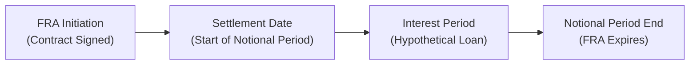

## Introduction

Forward Rate Agreements (FRAs) are a specialized type of forward contract keyed to short-term interest rates. They often reference benchmarks like 3-month LIBOR or modern risk-free rates such as SOFR (Secured Overnight Financing Rate) or SONIA (Sterling Overnight Index Average). Much like other forward contracts examined earlier in this text (see “Forward Contracts: Structure, Payoffs, and Settlement”), an FRA allows you to lock in an interest rate for a future borrowing or lending period. That can be a big comfort when you suspect rates may rise (or fall) at precisely the time you need that credit or investment. 

From large multinational banks to smaller niche lenders, FRAs are a staple structure for hedging interest rate risk. And you know, I remember once hearing a colleague at a regional bank say, “An FRA is like the seatbelt on the roller coaster of short-term interest rates—I just strap in and know where I’ll end up.” Of course, real-life financial markets can be more complicated than your average theme park ride, but the analogy holds: FRAs help ensure that sudden surges in interest rates don’t catch you unprepared.

Below, we’ll dig into the details of FRAs, how they’re structured, calculated, and settled, as well as some helpful best practices and cautionary tales from the real world.

## Core Concepts and Market Usage

An FRA is an over-the-counter (OTC) contract intimately tied to short-term interest rates. Two key points:

• By “forward rate,” we mean an agreed-upon interest rate for a loan or deposit that will begin at some future point.  
• Settlement (i.e., exchanging the gain or loss) usually occurs in cash at the start of the notional loan period—this is somewhat different from other derivatives that might settle at expiry.

Since FRAs are OTC products, there’s greater flexibility in terms of notional amounts, settlement dates, and contract terms, which is a big advantage if you have unique needs. The flip side is that the OTC nature introduces counterparty risk—a recurring theme in derivatives (also see “Counterparty Risk in OTC Markets” in Chapter 6). Financial institutions rely on tools like netting agreements, collateral postings, and robust documentation (anchored by ISDA Master Agreements) to mitigate these exposures.

Market participants typically use FRAs to hedge upcoming cash flows or to speculate on changes in short-term interest rates. For instance, if a corporate treasurer expects that 3-month interest rates will rise in three months’ time—possibly raising the cost of rolling over short-term debt—an FRA locks an interest rate in advance. That effectively neutralizes the risk that rates shoot up unexpectedly. Conversely, a speculator might enter an FRA to profit from a bet that the market has mispriced future interest rate movements.

## Anatomy of an FRA

You can think of an FRA as a simple forward contract with an interest rate as the underlying “asset.” Let’s break down five main features:

• Notional Principal: The hypothetical principal on which interest calculations are based. With most FRAs, this notional amount isn’t exchanged at the start or end; it’s purely for calculation.  
• Reference Rate: Common choices are interbank offered rates (historically LIBOR but transitioning to SOFR, SONIA, ESTR, etc.), either 1-month, 3-month, 6-month, or whichever short-term period suits the parties’ needs.  
• FRA Rate (or Contract Rate): This is the fixed rate agreed upon in the contract.  
• Settlement Date: The date when cash settlement actually occurs. Note that this date is typically at the beginning of the notional interest period.  
• Maturity or End of Notional Period: The time when the hypothetical loan or deposit would terminate. 

It’s generally called a “3×6 FRA,” for instance, meaning the contract starts in 3 months and extends for a total of 6 months (i.e., a 3-month interest period). The first number references the time until the FRA goes into effect, the second references the overall horizon to the end of the notional loan term.

## Timeline of an FRA

FRAs have a somewhat unique timeline compared with other forwards. The payoff is determined at the start of the underlying loan period, but the interest period itself extends through to the FRA expiry. The following flowchart illustrates this structure:

At “FRA Initiation,” the parties agree on the rate (the FRA rate). At the “Settlement Date,” the reference rate is observed, and a cash settlement is made from one party to the other based on the difference between the FRA rate and the reference rate. Finally, the notional period ends at “FRA Expiry,” though by that time, the FRA contract is already settled.

## Calculation and Settlement

The FRA payoff formula is typically expressed in terms of the difference (spread) between the agreed FRA rate and the prevailing reference rate at settlement, discounted because payment is made at the start of the interest period rather than at the end. One standard formula for the buyer’s payoff (if receiving the FRA rate) is:


\text{FRA Payoff} = 
\text{Notional} \times 
\frac{(R_\text{ref} - R_\text{FRA}) \times \tau}{1 + R_\text{ref} \times \tau}


Where:  
• R₍ref₎ = Actual reference rate observed at settlement.  
• R₍FRA₎ = Agreed FRA rate.  
• τ = The day count fraction for the interest period (e.g., 90/360).

If the reference rate ends up higher than the FRA rate, the FRA buyer receives a positive payoff. Conversely, if it’s lower, the seller receives payment from the buyer.

### Example of an FRA Payoff

Suppose a company, call it Redwood Inc., wants to lock in a 3-month interest rate on USD 100 million, starting 3 months from now. They agree to a 3×6 FRA at 5.00% (annualized). The day count convention is 30/360 for simplicity, and the 3-month period is 90 days.

• FRA Rate = 5.00%  
• Notional = USD 100,000,000  
• τ (day count fraction) = 90/360 = 0.25  

Three months later (the settlement date), the 3-month reference rate is observed to be 5.25%. That’s 0.25% above Redwood’s FRA rate, so Redwood gains on the FRA.  

Payoff = Notional × [(Reference Rate − FRA Rate) × τ] ÷ [1 + (Reference Rate × τ)]  

= 100,000,000 × [(0.0525 − 0.05) × 0.25] / [1 + (0.0525 × 0.25)]  

= 100,000,000 × [0.0025 × 0.25] ÷ [1 + 0.013125]  

= 100,000,000 × 0.000625 ÷ 1.013125  

= 62,500 ÷ 1.013125 ≈ 61,640.  

This payment of approximately USD 61,640 would take place immediately at settlement, compensating Redwood for the higher interest they’d have to pay if they were actually borrowing at the now-higher reference rate. In real transactions, Redwood might be a net lender or borrower; the net effect is they’re effectively locked into the 5.00% borrowing rate they agreed upon, plus or minus some settlement adjustments.

## Hedging and Speculation with FRAs

### Hedging

Financial institutions and corporates often use FRAs to offset or hedge their exposure to interest rate risk for a future loan or deposit. If you expect to borrow in three months and fear rising rates, you could **buy** an FRA (i.e., receive an interest payment if reference rates go above your contract rate). On the other hand, if you expect to be rolling over a deposit in three months, you might **sell** an FRA to hedge against falling rates.

This direct hedge is simpler than trying to replicate a short-term interest rate hedge with futures on a different product (like Eurodollar futures, or if you have to manage day count mismatches). FRAs, by design, allow you to customize the notional, reference rate, and tenor to mirror your real-world exposure.

### Speculation

Of course, FRAs can also be used to make directional bets on future interest rates. If you think short-term rates will rise, you’d buy FRAs. If you think they’ll fall, you’d sell them. Because they’re OTC and not standardized, it does take some searching to find a counterparty, or you might go through a broker dealer to arrange a suitable contract.

But speculation with FRAs can be risky, not only because you might guess wrong about the direction of interest rates but also because FRAs inherently carry counterparty risk. If your trading partner fails to honor the contract at settlement, that’s a big problem (one that’s less common in exchange-traded futures). Chapter 6 includes a broader discussion of how to mitigate credit exposures in OTC derivatives.

## Counterparty Risk and Documentation

Because FRAs are bilateral (OTC) contracts, the potential for counterparty default is important. Mechanisms to manage that risk range from simple credit limits to more sophisticated collateral agreements, margin calls, or netting arrangements under legal frameworks such as ISDA Master Agreements. If a major bank or corporate were to default right when rates have moved significantly, the other side to the FRA might face significant losses.

The 2008–2009 global financial crisis highlighted the potential for systemic risk when large financial institutions hold vast derivative positions. Although FRAs may seem smaller and less complex than certain exotic interest rate swaps or structured securities, they still contribute to overall exposure. Several reforms, including clearing mandates for standardized derivatives, have come into play—but FRAs generally remain an OTC product.

## Market Conventions

FRAs often reference the same interest rates as short-term interest rate futures (like Eurodollar or Euribor futures). In practice, the FRA’s discounting and settlement conventions can vary by region. Some markets use an actual/360 day count, while others prefer 30/360 or actual/365.

You might see quotes like “5.00–4.95 FRA,” which means the FRA buyer can buy the contract at 5.00% and sell at 4.95%—the bid–ask spread. The notional is also flexible—one party might need EUR 13 million, while the other might want EUR 50 million. The contract might specify any notional the counterparties can agree on. This flexibility is both an advantage and a complication compared to standardized futures.

Keep in mind that with the phaseout of LIBOR, references to short-term interest rates have updated to new risk-free rates. For instance, you might see an FRA referencing 3-month SOFR, SONIA, or SARON. The principle is the same, but the details of compounding and day counts shift slightly.

## Practical Example: Corporate Hedging Case

Imagine a European exporter, Maple & Co., that knows it must roll over a big floating-rate loan in six months. Maple’s CFO has read news that interest rates in the Eurozone might climb due to persistent inflation. The CFO enters into a 6×9 FRA referencing 3-month Euribor at 2.50%, on a notional of EUR 20 million.

Six months later, the actual 3-month Euribor is 3.10%. Maple & Co. receives a cash settlement compensating it for that 0.60% difference in interest rates (annualized over 3 months, discounted for early payment). Although Maple & Co. will then borrow at 3.10% in reality, the cash from the FRA offsets the extra interest cost.

If interest rates had fallen to, say, 2.20%, Maple & Co. would owe a settlement to the FRA counterparty. In that scenario, Maple & Co. ends up effectively “locked” at 2.50%, even though the reference rate ended lower.

## Valuation Over Time

An FRA’s fair value at initiation is usually zero—neither side pays a premium. Over time, as market expectations of future interest rates shift, the FRA’s value can become positive or negative. If you entered an FRA to receive a fixed rate and interest rates are moving upward, the FRA’s value increases in your favor.

Marking such positions to market requires updating the expected settlement rate and discounting any payoff back to the present. In practice, it’s often simpler to rely on short-term interest rate curve data from the interbank market (e.g., short-dated swap curves, deposit rates, or short-term futures) to estimate the implied forward rate for the FRA settlement date. The difference between that implied forward rate and the FRA rate indicates how much the contract is “in the money” or “out of the money.”

## Relationship to Other Interest Rate Derivatives

If you’re wondering whether FRAs and interest rate futures are basically the same, well, there’s a lot of overlap, but they differ in three big areas:

1. Exchange vs. OTC: Futures are exchange-traded, standard-notional, standardized maturities, and typically have daily marking to market. They also enjoy the benefit of a clearinghouse that drastically reduces counterparty risk. FRAs are privately negotiated with more flexible terms, but with no clearinghouse, leading to higher credit risk.  
2. Settlement Date: FRA settlement occurs at the beginning of the interest period. Futures typically settle daily on a mark-to-market basis, with final settlement around the contract’s expiry.  
3. Precision of Hedge: Because FRAs can be tailored with any notional or exact dates, you can match your exposure very precisely. With futures, you might have to trade multiple contracts or accept near-dated maturities that aren’t a perfect match for your actual exposure dates.

Sometimes, a trader might replicate an FRA payoff by combining interest rate futures positions or by using standard short-dated interest rate swaps. In a pinch, you get a similar economic effect, but the customized route might give you a better hedge.

## Accounting and Regulatory Considerations

Under IFRS 9 and similar standards, FRAs are recognized on the balance sheet as derivative instruments measured at fair value through profit or loss, unless designated in a qualifying hedging relationship (in which case hedge accounting rules can apply). In such a hedging relationship, changes in fair value might be deferred in Other Comprehensive Income instead of recognized immediately.

From a regulatory capital perspective, FRAs attract counterparty credit risk charges. Banks must hold capital against potential future credit exposure. In clearing jurisdictions, standardized interest rate derivatives may be centrally cleared, but FRAs typically remain in the bilateral OTC space. Market participants should follow local or international guidelines, as stated by the Basel Committee on Banking Supervision and local regulators.

## Best Practices and Pitfalls

• **Proper Sizing:** The notional amount should align with the underlying exposure you’re trying to hedge. Over-hedging or under-hedging can lead to unnecessary risk.  
• **Day Count Conventions:** Keep an eye on the day count (30/360 vs. actual/360 vs. actual/365). Mismatching your FRA with your actual loan day counts can lead to partial hedges.  
• **Documentation:** Use clear ISDA terms, especially definitions on fallback rates if the reference rate becomes unavailable (e.g., if LIBOR is replaced).  
• **Counterparty Risk**: Evaluate credit risk carefully. A default can wipe out your protective hedge.  
• **Speculative Use**: Anticipating interest rate moves can be profitable but also risky. Make sure your assumptions are well-grounded in robust rate forecasting if you’re venturing beyond a hedge strategy.  

## Final Exam Tips

• Know the difference between an FRA’s settlement date and the actual interest period.  
• Practice the FRA payoff calculation formula thoroughly. You might see a question that tests your ability to discount the payoff for the early settlement.  
• Remember the link to forward contracts in general (see “Forward vs. Futures: Key Distinctions”). FRAs are basically forwards on interest rates.  
• Keep in mind the shift away from LIBOR toward risk-free reference rates such as SOFR. On exam day, they may mention these new benchmarks.  
• Understand the motivations for entering an FRA: hedging vs. speculation.  
• Stay alert for day count convention differences. Overlooking them can lead to mispriced or miscalculated FRA questions.  
• Cross-reference your knowledge of interest rate swaps (Chapter 3). FRAs are conceptually related to the short end of the yield curve, whereas swaps often involve multiple periods.

## References and Further Reading

• Fabozzi, Frank J. “Bond Markets, Analysis, and Strategies.” Gainsville: ProFinance, 2022.  
• International Swaps and Derivatives Association (ISDA): https://www.isda.org  
• CFA Institute. **2025 Level I Curriculum**. Derivatives volume, Chapter 2: “Forward and Futures Contracts.”  
• BIS (Bank for International Settlements) papers on OTC derivatives and clearing best practices.  

---

## Practice Questions: Forward Rate Agreements Mastery



### In an FRA, which rate do the parties agree upon?

- [ ] The spot rate for future borrowing.  
- [x] A fixed interest rate to be applied at a future date.  
- [ ] The next available central bank policy rate.  
- [ ] The historical average of an overnight rate.  

> **Explanation:** In an FRA, two parties lock in a fixed interest rate (the FRA rate) for a notional loan or deposit starting at a future date.  

### How is an FRA typically settled?

- [ ] In physical delivery of the notional principal at maturity.  
- [ ] Through daily marking to market on an exchange.  
- [x] Via a single cash payment at the beginning of the notional interest period.  
- [ ] By substituting an interest rate swap.  

> **Explanation:** Unlike many other derivatives, FRAs settle in cash at the start of the underlying notional period based on the difference between the FRA rate and the reference rate.  

### Which of the following is a key reason FRAs remain primarily traded OTC?

- [x] Flexibility in custom notional amounts and settlement dates.  
- [ ] Strict margin requirements mandated by exchanges.  
- [ ] Limited usage by large financial institutions.  
- [ ] High liquidity in standard contract maturities.  

> **Explanation:** FRAs typically remain OTC because they allow parties to customize terms (notional, tenor, reference rate) to match specific exposures.  

### What happens if reference interest rates end up higher than the FRA rate on the settlement date?

- [x] The FRA buyer receives a payment from the FRA seller.  
- [ ] The FRA buyer owes a payment to the FRA seller.  
- [ ] The notional principal is returned plus accrued interest.  
- [ ] No cash payment is made since the contract has zero value.  

> **Explanation:** If the actual reference rate is above the agreed FRA rate, the buyer (who locked in that lower rate) receives a gain at settlement.  

### Which of the following best describes the formula for an FRA’s payoff?

- [ ] (Notional × (Reference Rate − FRA Rate)) paid at the end of the notional period without discounting.  
- [x] (Notional × (Reference Rate − FRA Rate) × Day Count) ÷ [1 + (Reference Rate × Day Count)].  
- [ ] (FRA Rate × Notional − Spot Rate × Notional) recognized daily.  
- [ ] (Reference Rate − FRA Rate) only if the result is positive.  

> **Explanation:** The payoff formula accounts for the rate differential and discounts for the fact that settlement is at the start of the notional period.  

### A 3×6 FRA means:

- [ ] The FRA starts immediately and ends in 6 months, with 3 months for settlement.  
- [ ] The FRA references 3 different interest rate benchmarks over 6 months.  
- [x] The FRA begins in 3 months and covers a 3-month loan, ending 6 months from now.  
- [ ] The FRA references a 3% interest rate with a 6% fixed leg.  

> **Explanation:** In conventional FRA notation, 3×6 means the notional interest period starts in 3 months and ends in 6 months, covering a 3-month window.  

### Which of the following is true regarding counterparty risk in FRAs?

- [x] FRAs are OTC instruments, so each party must manage credit exposures bilaterally.  
- [ ] FRAs are cleared through a central counterparty, eliminating default risk.  
- [ ] Counterparty risk is negligible due to daily mark-to-market.  
- [ ] FRAs are regulated similarly to exchange-traded futures, greatly reducing counterparty risk.  

> **Explanation:** FRAs are OTC products and do not typically go through a central clearinghouse, so counterparty credit risk is a direct concern.  

### What is the effect of a rise in short-term interest rates on the mark-to-market value of an FRA where you are the buyer (i.e., you want to lock in borrowing costs)?

- [x] It increases the mark-to-market value of the FRA to you.  
- [ ] It decreases the mark-to-market value of the FRA to you.  
- [ ] It has no impact on the mark-to-market value.  
- [ ] It negatively affects both buyer and seller equally.  

> **Explanation:** If short-term rates rise above the FRA’s locked rate, the contract becomes more valuable to the buyer, who effectively locked in lower borrowing costs.  

### Why might a corporate choose an FRA over a short-term interest rate futures transaction to hedge interest rate risk?

- [ ] Futures have fewer counterparties, making it difficult to secure liquidity.  
- [ ] FRAs are exchange traded, meaning they’re cheaper.  
- [x] FRAs allow for more precise matching of date and notional requirements.  
- [ ] Futures are too difficult to mark to market.  

> **Explanation:** FRAs can be tailored to specific notional amounts and settlement dates, offering more precise hedging than standardized exchange-traded futures.  

### FRAs are recognized on the balance sheet under IFRS as:

- [x] Derivative financial instruments measured at fair value through profit or loss (unless designated for hedge accounting).  
- [ ] Off-balance-sheet items with no fair value recognition.  
- [ ] Loans and receivables recognized at amortized cost.  
- [ ] Equity instruments recognized in other comprehensive income.  

> **Explanation:** Under IFRS 9, FRAs typically fall under the classification of derivatives carried at fair value through profit or loss, except if designated in a qualifying hedge relationship.  


