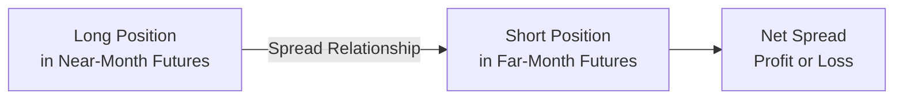

## Introduction

Calendar spreads (sometimes called time spreads) and interdelivery spreads are popular strategies in futures markets. They let traders, hedgers, and speculators aim to profit from anticipated price relationships between different contract months, or slight differences in delivery specifications for otherwise similar underlying assets. While these spreads can be super attractive because of their lower net margin requirements and targeted directional exposure, they do come with unique risks—such as unexpected supply–demand shocks and shifts in market structure.

Anyway, I still remember one of my first personal explorations with a soybean futures calendar spread: I was long on a far-month contract and short on a nearby month. I naively assumed the spread would narrow as the near month approached expiration. Instead, a sudden shift in demand for the near-month contract (random, right?) caused the spread to widen—definitely not what I was expecting. That experience taught me to pay extra attention to seasonality, storage costs, and unexpected market events when trading calendar spreads.

Below, we’ll explore fundamental concepts, practical applications, key risks, common pitfalls, and everything else you need to know about calendar and interdelivery spreads in futures markets, especially from a CFA® exam perspective.

## Fundamentals of Calendar Spreads

A calendar spread involves buying one futures contract month (e.g., December) and simultaneously selling another futures contract month (e.g., March) in the same underlying asset. By focusing on the difference between the two contract prices, the trader looks to benefit from a convergence or divergence in these prices over time—rather than from an outright directional bet on the underlying.

From Section 2.1 on forward contracts, you might recall that forward and futures prices are influenced by factors such as the cost of carry, expected interest rates, storage costs, and seasonal demand patterns. These same elements shape the price relationship between near-month and far-month futures contracts, creating spread opportunities for both hedgers and speculators.

### Mechanics of a Calendar Spread

Let’s say you buy (go long) a September gold futures contract and simultaneously sell (go short) a December gold futures contract. Your net position is “long the Sept–Dec spread.” Ideally, if the September contract’s price rises relative to the December contract’s price, the value of your spread position goes up. If the opposite occurs, the spread position declines in value.

Below is a simple Mermaid diagram illustrating the basic setup:



The spread’s profitability depends on how the two contract prices move relative to each other. This difference can be influenced by factors like seasonality, perceived changes in supply and demand, and shifting storage costs.

### Backwardation vs. Contango

In commodity futures, two key terms describe the shape of the forward curve:

• Contango: When the distant (far-month) futures prices are higher than near-month futures prices. This often occurs when there's a cost of carry—such as storage, insurance, or financing—that makes distant deliveries more expensive.  
• Backwardation: When the distant futures prices are lower than near-month futures prices, possibly due to immediate supply constraints or strong current demand.

Calendar spreads can help express a view on whether the current futures curve (whether in contango or backwardation) will flatten, steepen, or move back to a “normal” level.  

For instance, if you believe the market is in excessive contango and that the far-month price will drop relative to the near-month price, you might go short the far month and long the near month to profit from a potential narrowing of that price gap.

### Influence of Storage Costs and Seasonality

Storage costs (or carrying costs) for a commodity can shape the term structure of futures prices—particularly if it’s an agricultural commodity or an energy product like crude oil. Markets with high storage costs typically display a contango structure. Conversely, backwardation sometimes is tied to low inventories or immediate demand outstripping supply.

Seasonality—regular recurring demand patterns—can greatly affect how near-month and far-month contracts relate. For agricultural commodities, harvest times, growing seasons, or predicted weather events cause seasonal shifts in supply and demand. Traders can exploit these seasonal patterns through calendar spreads, going long or short specific months to reflect their outlook on how inventory levels will change over time.

## Interdelivery Spreads

Closely related to calendar spreads, interdelivery spreads differ slightly in that they might involve the same or extremely similar underlying commodity, but with differences in delivery specifications, such as location or quality. For example, one contract might specify delivery at a certain facility, while another is for the same commodity but delivered at a different location. If the fundamentals of the two delivery points are closely correlated, you can attempt to profit from small pricing divergences across these related contracts.

Of course, interdelivery spreads can also occur in interest rate futures (e.g., 2-year vs. 5-year Treasury futures) or in petroleum markets (e.g., WTI vs. Brent blends, if they share similar characteristics). This kind of strategy is typically used by traders who want exposure to supply–demand changes across locations or qualities, without necessarily being heavily exposed to the broad directional movement of the underlying commodity’s price.

## Use Cases for Hedgers and Speculators

• Hedgers might use these spreads to reduce risk from shifts in the overall price level while still managing exposure to inter-month or inter-location changes. For example, a wheat producer might be locked into certain near-month deliveries, but also anticipate future sales in far-month periods. A spread allows them to isolate the risk in that near-month environment without taking a full short (or long) on the entire position for the far month.

• Speculators often like these spreads because they typically require lower margin than two outright futures positions. The margin offset arises from the correlation between the two contract months—after all, both revolve around the same or very similar underlying commodity. If the contracts are highly correlated, the overall risk is considered lower, resulting in margin benefits. However, these margin offsets can lull some traders into a false sense of security—always keep an eye on supply disruptions or changing fundamentals that can quickly blow out a spread.

## Building a Pricing Intuition

One way to get better at calendar or interdelivery spreads is to model these spreads historically. You can observe how the price difference evolves in response to changes in inventory, storage rates, demand cycles, and so forth. If, for instance, you see that near-month natural gas futures consistently trade at a premium before winter, you might structure a spread that benefits from that predictable price pattern.  

Below is a simple Python snippet that simulates how one might track daily spread changes using synthetic data for a near-month and a far-month futures contract:

```python
import numpy as np
import pandas as pd

np.random.seed(42)
days = pd.date_range(start='2025-01-01', periods=30, freq='D')

near_month = 50 + np.cumsum(np.random.normal(0, 0.5, size=30))
far_month = 52 + np.cumsum(np.random.normal(0, 0.5, size=30))

spread = near_month - far_month

df = pd.DataFrame({
    'NearMonth': near_month,
    'FarMonth': far_month,
    'Spread': spread
}, index=days)

print(df)
```

By analyzing spread data like this (in real-time or historically), you can see typical ranges, standard deviations, and correlation patterns. That helps you decide how volatile the calendar or interdelivery spread might be, and whether it provides a risk–reward ratio that fits your strategy.

## Common Pitfalls and Risks

As with any derivative strategy, calendar and interdelivery spreads come with their share of potential hazards:

• Unexpected Fundamental Shocks: Weather conditions, political upheavals, user demand changes—these can all cause abrupt shifts in supply and demand. If you wake up one morning to find that a certain contract month soared on the back of a new development, your spread can move against you fast.

• Incorrect Seasonal Projections: Seasonal patterns are helpful but not guaranteed. Sometimes the usual supply–demand cycle is disrupted (think unseasonably warm winter for natural gas), and what was “normal” last year or for decade averages might not hold this year.

• Margin Risk: A big advantage of spreads is that they often require lower initial margin, but if the spread suddenly widens or narrows sharply, you might face major variation margin calls. Overleveraging in spread positions is a well-known beginner mistake.

• Liquidity Constraints: Some far-out delivery months have lower trading volumes, leading to wide bid–ask spreads. This illiquidity can make rolling positions or closing out trades more expensive, and it can magnify price volatility if you try to exit quickly.

• Calendar Roll: Closely watch the final trading days of the near-month contract. If you forget to close or roll your position, you could end up with an unintended delivery obligation on the near-month leg. This is especially relevant for physical delivery contracts like certain metals or agricultural commodities (though many traders close their positions well before expiration).

## Practical Case Study

Let’s consider a hypothetical spread trade in the copper market. You notice that copper is typically in higher demand in the summer months when construction picks up. You find that the June contract (near month) is trading at $4.00/lb, while the September contract (far month) trades at $3.98/lb. The current spread is $4.00 – $3.98 = $0.02 in favor of near-month copper.

You expect summer demand to spike even more than usual, possibly increasing the premium of the near-month contract relative to September. Hence, you decide to go long the June contract and short the September contract. If, say, the near-month contract climbs to $4.05 while the far-month remains at $3.98, the spread widens to $0.07—and you can close the spread for a $0.05 profit per pound. On the other hand, if demand fails to materialize and June futures slump down to $3.95 (while September hits $3.93), the spread would stay at $0.02, providing no net profit. If June gets even cheaper relative to September, you risk an outright loss.

## Best Practices

• Use Historical Data: Review at least several years of historical spread data (if available) to identify typical seasonal or cyclical patterns.  
• Understand Fundamental Drivers: Keep up with market reports, inventory data, weather forecasts, or macroeconomic indicators that could influence either leg of your spread.  
• Manage Margin Actively: Ensure you have enough capital to handle large moves against your spread. Avoid letting lower margin requirements tempt you into an excessively large position size.  
• Monitor Roll Dates: Put reminders or alerts in your trading system so you don’t miss the final trading day on the near-month leg.  
• Diversify Spreads: Some traders combine multiple spreads (e.g., a bull spread in one commodity and a bear spread in another) for a more diversified exposure.

## Glossary

Calendar Spread: Holding a long (or short) position in one contract month and an offsetting position in another month of the same underlying.  
Storage Cost: Expense related to storing a physical commodity (e.g., warehousing, insurance). Storage cost heavily influences futures pricing across different maturities.  
Seasonality: Predictable and recurring trends or patterns in supply and demand tied to specific times of the year (harvest season, winter heating, etc.).  
Interdelivery Spread: A spread involving different delivery specifications (e.g., location, grade, or other contract details) of the same or substantially similar commodity futures.  
Backwardation/Contango: Describes whether near-month futures are trading higher (backwardation) or lower (contango) than contracts for more distant delivery.

## Exam Relevance and Tips

Calendar spreads and interdelivery spreads are a perennial favorite topic on the CFA® exams for illustrating how different maturities or deliveries can experience unique price dynamics. Scenario-based questions might present specific real-world disruptions—like an unanticipated weather event or a shift in interest rates—that change the frequency or magnitude of monthly demand.

When tackling item-set or constructed-response questions:

• Carefully note which contract month is long or short.  
• Understand how the spread changes if one leg moves more dramatically than the other.  
• Check if the exam question hints at contango or backwardation to see how storage costs, interest rates, and supply/demand expectations shape the spread.  
• Watch for references to seasonality or unexpected fundamental events.  
• Show your work! Demonstrate how you calculate a profit or loss from the difference in the near vs. far month settlement prices.

Time management is key. The exam might present a multi-part question that starts with a general scenario on contango or scarcity and ends with you calculating gains or losses on a calendar spread. Practice using hypothetical examples to quickly evaluate changes in the difference between near- and far-month futures.

## Final Thoughts

Calendar and interdelivery spreads can be powerful tools in both hedging and speculative contexts. They allow you to benefit from price differentials across contract months, based on factors such as storage costs, seasonality, and supply–demand pressures. But watch out for unexpected market shocks—no strategy is risk-free. By studying historical patterns, remaining aware of fundamental drivers, and diligently monitoring margin requirements, you’ll be better positioned to navigate the complexities of these spread trades.

## References

• Carter, Colin A. “Futures and Options Markets.” (Coverage of spread trading, particularly in agricultural commodities.)  
• ICE (Intercontinental Exchange) Guides on Spread Trading:  
  – https://www.theice.com/  
• For further reading on commodity markets, see [Chapter 1.6 Classification of Underlying Assets] in this volume for more background on how underlying assets are categorized.

-------------------------------------------------------------------

## Test Your Knowledge: Calendar and Interdelivery Spreads



### Which of the following best describes a calendar spread in futures?

- [ ] Going long and short on completely unrelated commodities.
- [x] Holding a long position in one contract month and a short position in another month of the same commodity.
- [ ] Selling the same contract month on two different exchanges.
- [ ] Going long two different underlying commodities with unrelated maturities.

> **Explanation:** A calendar spread involves positions in different months of the same underlying asset.  

### What is the primary reason speculators might choose a calendar spread instead of an outright futures position?

- [x] Lower margin requirements, because the spread typically has less risk than two outright positions.
- [ ] Guaranteed profit potential since both legs are highly correlated.
- [ ] It’s legally mandated for all commodity speculators.
- [ ] Regulatory bodies require only calendar spreads for hedging strategies.

> **Explanation:** By offsetting much of the outright price risk, a proper calendar spread usually qualifies for lower margin requirements. However, there are no guarantees of profit.  

### What term refers to a market state in which near-month futures are priced lower than far-month futures?

- [x] Contango
- [ ] Backwardation
- [ ] Inversion
- [ ] Equilibrium

> **Explanation:** Contango refers to a situation where far-month contracts trade at a higher price than near-month contracts.  

### A trader goes long the March soybean futures and short the July soybean futures, anticipating increased demand for the March contract. If the March contract rises more than the July contract, how will the spread be affected?

- [x] The spread will widen in favor of the long near-month contract.
- [ ] The spread will narrow, resulting in no profit.
- [ ] The spread remains unchanged.
- [ ] The spread moves only if both prices drop.

> **Explanation:** When the near-month leg (which is long) increases more than the far-month leg (which is short), the net difference widens, benefiting the trader.  

### Which of the following factors is least likely to be relevant to calendar spread pricing?

- [x] The exporter’s foreign currency exchange rate controls.
- [ ] Seasonality and cyclical demand shifts.
- [x] Storage costs for a commodity.
- [x] The shape of the forward curve, whether in contango or backwardation.

> **Explanation:** While currency exchange complexities may matter for international export considerations, typical calendar spreads focus on the underlying’s own price structure, storage costs, and seasonality.  

### Interdelivery spreads often involve:

- [x] Similar or identical commodities delivered in different locations or with varying specifications.
- [ ] Owning call and put options on the same commodity.
- [ ] Buying and selling the same contract in the same month.
- [ ] Purchasing multiple contracts in different exchanges with identical terms.

> **Explanation:** An interdelivery spread involves two related futures contracts of similar underlying commodities but with different delivery specifications.  

### Why might hedgers use a calendar spread?

- [x] To mitigate risk from short-term price fluctuations while retaining some exposure to long-term pricing.
- [ ] For guaranteed arbitrage profits between near and far months.
- [ ] Because single futures contracts are not permitted for hedging.
- [ ] To comply with margin regulations that prohibit outright futures positions.

> **Explanation:** Hedgers can fine-tune their exposure to short-term market changes without fully relinquishing their longer-term positions.  

### Which of these situations would most likely widen a spread between near-month and far-month futures?

- [x] A sudden large demand increase in the near-term market.
- [ ] Consistent future price predictions.
- [ ] Reduced volatility in the near months.
- [ ] Equal changes in supply across both months.

> **Explanation:** If near-term demand jumps suddenly, prices for the near-month contract could rise faster than the far-month, widening the spread.  

### A market is in backwardation if:

- [x] Near-month futures prices exceed far-month futures prices.
- [ ] Far-month prices exceed near-month prices.
- [ ] Both near and far-month prices are identical.
- [ ] The market cannot determine the fair price.

> **Explanation:** Backwardation is when the front-month futures are priced higher than the distant-month futures.  

### True or False: Calendar spreads require a larger initial margin compared to an outright futures position.

- [ ] True
- [x] False

> **Explanation:** Typically, calendar spreads have lower margin requirements because each leg partially offsets the risk of the other.  


