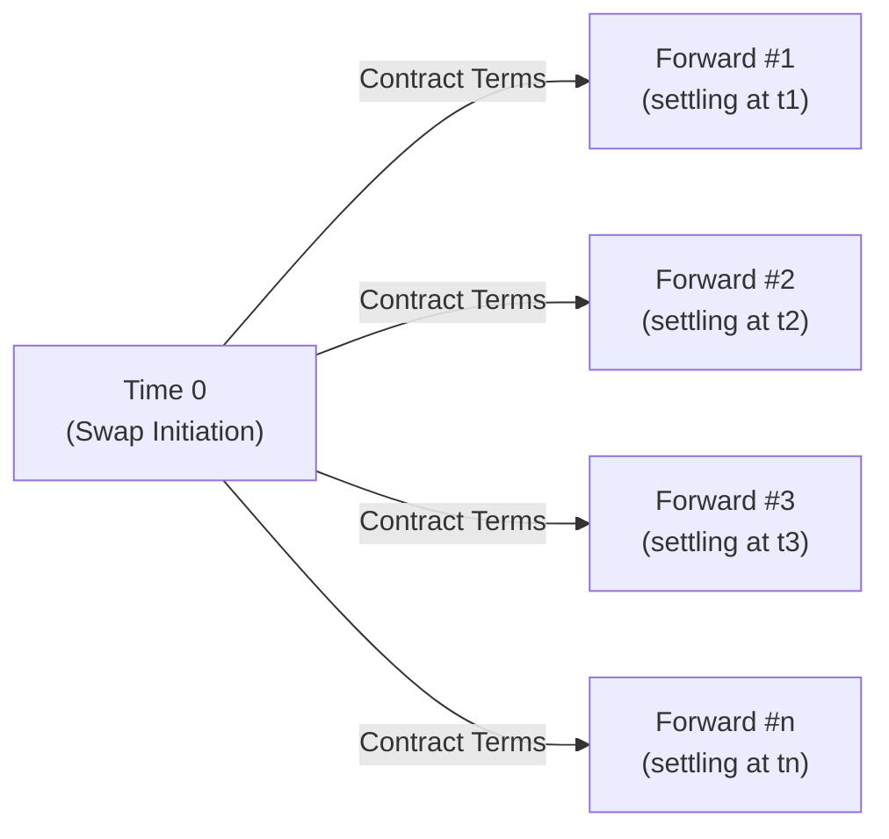

## Introduction and Core Idea

Swaps often sound intimidating, but at their heart, they’re basically a bunch of forward contracts stitched together. Let me just say, the first time I heard that each swap payment period could be treated like a “mini-forward,” I had one of those ah-ha moments. In fact, you can conceptualize each interest payment as a forward contract on an interest rate that settles when that payment is due. That’s a lot to take in, but it’s also pretty cool because it shows you can break the big problem (valuing a swap) into smaller, more approachable components (forward contracts).

In this section, we’ll explore the nuts and bolts of viewing a swap as a strip of forward contracts, with particular focus on interest rate swaps. We’ll talk about the rationale behind this breakdown, the net settlement idea, how you might price each piece, plus credit risk considerations—since, hey, you don’t want to be left high and dry by a default at the third payment date.

Along the way, we’ll slip in some personal anecdotes, maybe one or two silly examples, and warn you about common pitfalls. Ready to dig in?

## Conceptualizing Swaps as a Series of Forwards

Many practitioners—and your friendly CFA curriculum—refer to an interest rate swap as a series of forward rate agreements (FRAs). Each FRA addresses a single future payment date. Picture a timeline with settlement dates t₁, t₂, t₃, …, tₙ. At each date, a floating rate is determined (e.g., based on some reference like SOFR or EURIBOR) and compared to the fixed rate established at the start of the swap. You then exchange the net difference.

To illustrate:

Each forward is like an agreement that says, “At time tᵢ, if the floating rate is above the fixed rate, the floating-rate payer owes the difference to the fixed-rate receiver, and vice versa.” In classic plain vanilla interest rate swap form:

• The fixed leg: Pays a constant fixed rate (the “swap rate”).  
• The floating leg: Pays a reference rate (e.g., 3-month USD LIBOR—historically—or a new risk-free rate like SOFR).

Net out these payments, and you get a single cash flow at each settlement date. That’s the net settlement concept: you only exchange the difference. This arrangement reduces transactions, which—trust me—can be a relief to your back-office folks.

## Valuation at Inception

At the start of the swap, the value to both parties is typically zero. Why? Because the present value (PV) of one leg (say the fixed payments) matches the PV of the floating leg. If it didn’t, well, you’d have an arbitrage scenario: the side with a positive value could theoretically demand a premium or otherwise exploit the mispricing.

So how do you ensure the PVs match up?

• You look at forward rates. For each future settlement date, you estimate the floating rate (using the forward yield curve).  
• You discount these expected floating payments back to the present using appropriate discount factors (often derived from the same curve).  
• You solve for the fixed rate that makes the PV of all its future payments equal to the PV of the floating payments.  

While you don’t always do this algebra by hand—financial calculators or spreadsheets can handle it—knowing the logic is essential. It’s also crucial in exam contexts: the typical “plain vanilla” interest rate swap is simply a portfolio of forward rate agreements priced so that, at inception, the total net present value (NPV) is zero.

## Ongoing Valuation and Net Settlement

After inception, the swap’s value will fluctuate due to interest rate changes. Each “forward” embedded in the swap is revalued as the yield curve shifts. You can imagine that if rates rise, the fixed-rate payer is at a disadvantage (they’re locked into paying a potentially too-high fixed rate), so the swap’s value might become negative to them and positive to the fixed-rate receiver.

On each settlement date:

• The floating rate is observed (usually determined at the beginning of the period).  
• The difference between the floating payment and the fixed payment is computed.  
• That net amount is exchanged.  

In practice, only one net payment changes hands. If the floating leg owes more, it pays the fixed leg the difference, and vice versa. This simplicity helps reduce operational overhead and, more importantly, lowers credit risk exposure.

## Forward Start Swaps and the Link to Forward Rates

Now, consider forward start swaps. These are swaps that don’t begin right away but at some point in the future—kind of like a “swap on a swap.” If you think about it, those forward start ones line up perfectly with the concept of forward contracts: they’re specifying the terms of a swap that will initiate later. Why would anyone do that? Perhaps you want to lock in a fixed rate for a period that begins in six months because you believe rates will skyrocket. You effectively say, “Let’s play the game starting in six months, but I want to fix the rules now.”

Under the hood, the floating rates that come into play on that future start date are themselves forward rates. Practitioners love to break these into notional FRAs to reflect the predicted path of interest rates. It’s the same concept: a series of forward periods lined up.

## Risk Management and Collateralization

When you have multiple settlement points in time, you’re obviously concerned about credit risk. If your counterparty goes bust mid-swap, you might lose the positive present value your side has accumulated. So how can you mitigate?

• Collateral Posting (Margin): You might be required to post collateral daily or weekly, ensuring that if you default, the other side is partly (or fully) protected.  
• Central Clearing: In many jurisdictions, especially after global financial regulations tightened, standard swaps must be cleared through a central counterparty (CCP). The CCP collects margins from both participants.  

These techniques reduce the chance that a default on future obligations leads to a big hit. But, of course, they don’t eliminate the risk entirely—no system is perfect. For exam purposes, familiarizing yourself with central clearing is wise. And from a real-world standpoint, it’s become “the new normal” for a lot of standard interest rate swaps.

## A Practical Numerical Sketch

Let’s imagine a very simple scenario. Suppose you enter a one-year swap with quarterly settlements (four settlement dates: 3, 6, 9, and 12 months). You pay a fixed 5% annual rate (on some notional of, say, $1,000,000) and receive a floating rate that resets quarterly. For demonstration, let’s say all forward rates are predicted to be around 5% as well, so the swap’s initial value is zero.

Incidentally, that means each forward contract embedded in the swap has a net zero present value. If at settlement 1, the floating rate is 5.2%, you pay the net difference: (5% − 5.2%) × (Notional × 0.25) = −$500. Actually, wait, that means you *receive* if your fixed is lower? Let’s be sure we keep the sign consistent:

• You pay fixed 5%.  
• You receive floating (5.2%).  

So your net is (5.2% − 5.0%) on $1,000,000 for a quarter, or 0.2% × 1,000,000 × 0.25 = $500. You get $500. If the floating rate had been 4.8%, you’d pay $500.  
 
While that’s extremely simplified, hopefully it helps illustrate how each settlement date is “just” a forward contract on the interest rate that’s about to be realized.

## Modeling Each Payment Period Like an FRA

Inside the black box, each coupon period is indeed priced like a forward rate agreement. Basic FRA valuation states that you can find the value of paying a fixed rate and receiving a floating rate by referencing the forward yield curve. Summation across all FRAs (one for each settlement period) yields the total swap value.

• Each FRA ensures you pay/receive the difference between the realized floating rate and your contracted fixed rate.  
• Summing them up, you get an overall net for the swap.  

This decomposition is handy for risk measurement, too. Because if you want to do, say, scenario analysis, you can look at how each forward period’s rates might shift under a variety of yield-curve movements, then re-aggregate those results.

## Common Pitfalls and Challenges

• Misunderstanding Net Settlement: Some folks new to swaps assume the full notional is exchanged. Typically, it’s not—only net interest.  
• Confusing FRAs with Swaps: They’re closely related, but remember a swap is a portfolio of FRAs, each with different settlement dates.  
• Ignoring Collateral and Credit Risk: In real life, not addressing credit risk can blow up in your face if the counterparty can’t pay (looking at you, 2008 meltdown).  
• Overcomplicating the Forward Rate Curves: Especially in exam questions, you must stay systematic: label each settlement date, lay out forward rates, discount, done.  

## Exam Tips and Strategy

• When you see “plain vanilla interest rate swap,” think “series of forward rate agreements.” This perspective can help you break down the question into more manageable parts.  
• Practice discounting each leg’s cash flows separately and verifying that the PV of the fixed leg equals the PV of the floating leg at inception.  
• Keep your timeline organized. Mark each settlement date, the floating rate determined for that period, and the payment date.  
• Remember that net settlement is usually paid at the end of each period—so watch out for tricky day-count conventions.  
• If a question mentions “forward start swap,” tie it to the same logic—just shifted.  
• Watch out for credit risk discussions. The question might pivot to how clearinghouses or collateralization reduce exposure.  

## Further Reflections

You might wonder, do folks in the real world literally break out a swap into 20 or 40 separate forward contracts? Probably not. They rely on standard swap pricing formulas or curves that handle all the discounting and forward rate calculations in one go. But behind the scenes, it’s exactly the same concept, and the exam may test your understanding of that equivalence.

When you’re pricing or managing risk on a swap portfolio for, say, a big pension fund, you might indeed track how your net risk is distributed across each “leg,” or each forward period. That’s where quant finance and risk management teams get super busy building complex term structure models. The short version: if you ever see an exam question about “Swaps as a Series of Forward Contracts,” just remember the decomposition approach is at the core of the standard pricing method, no matter how complicated it might look.

## References and Additional Study

- Hull, John C., “Options, Futures, and Other Derivatives.” Pearson, latest edition.  
- Chui, Michael, “Structure of Interest Rate Swaps,” Bank for International Settlements Working Papers.  
- Fabozzi, Frank J., “The Handbook of Fixed Income Securities.”  

For official CFA curriculum references, check out the readings on derivatives and fixed income in the CFA Program Curriculum. That’s always the best place to confirm how exam questions might be formatted or cross-referenced.

And speaking from personal experience, practicing with real-world yield curve data can help you see the difference between theory and daily market noise. My first attempt at building a spreadsheet for swaps had me going in circles. But once it clicked—tying each payment date to a forward rate and discounting—it felt both elegant and hugely empowering. Possibly a little geeky, I know, but hopefully you’ll also appreciate that sense of “Oh, so that’s how it works!”

---

## Test Your Knowledge of Swaps as a Series of Forward Contracts



### Which of the following best describes the concept of treating a swap as a series of forward contracts?

- [ ] Each leg of the swap is replaced by a single forward contract for the entire maturity.
- [ ] The notional of the swap is exchanged at inception, mimicking multiple currency forwards.
- [x] Each payment period in the swap is viewed as an independent forward contract settling on that date.
- [ ] Future swap cash flows cannot be decomposed into forward contracts.

> **Explanation:** One of the foundational insights is that each settlement date in a swap can be seen as a separate forward contract.

### At the inception of a plain vanilla interest rate swap, which statement is most accurate?

- [ ] The value of the swap to both parties is positive.
- [ ] The floating rate leg is always worth less than the fixed leg.
- [ ] The notional principal is exchanged at inception to keep the value zero.
- [x] The present value of the fixed leg’s cash flows equals the present value of the floating leg’s cash flows.

> **Explanation:** A key characteristic of a plain vanilla interest rate swap is that its initial value is zero, so the PV of the fixed side equals the PV of the floating side.

### In an interest rate swap, the “strip of forwards” view means each coupon period is modeled like:

- [ ] A currency forward exchange rate contract.
- [ ] An outright purchase of the notional principal.
- [x] A forward rate agreement based on the yield curve.
- [ ] A credit default swap on the underlying rate.

> **Explanation:** Each settlement date can be treated as a forward rate agreement, referencing the appropriate forward rate.

### What is the primary advantage of net settlement in swap transactions?

- [x] Only the net difference between cash flows is exchanged, reducing credit risk and operational complexity.
- [ ] It provides full principal exchange at each settlement date.
- [ ] It eliminates the need for collateral posting.
- [ ] It requires no discounting of expected future payments.

> **Explanation:** Net settlement means you just exchange the difference, which significantly reduces the amount of cash that changes hands and thus lowers exposure.

### Which of the following best describes the role of forward rates in valuing the floating leg of a swap?

- [ ] Forward rates are not relevant to swap valuation once the fixed leg is set.
- [ ] Forward rates only matter at the time of final payment.
- [ ] Forward rates are used as a proxy for historical cost of funds.
- [x] Forward rates are used to project future floating payments and discount them back to the present.

> **Explanation:** The floating leg is typically valued by projecting future cash flows using forward rates and discounting these amounts to the present.

### A forward start swap:

- [ ] Begins immediately and ends in the future.
- [x] Starts at a future date, with terms set today.
- [ ] Combines an equity swap with a currency swap.
- [ ] Always involves an immediate exchange of notional principal.

> **Explanation:** A forward start swap commences at some specified future date, with its rate and other conditions determined at inception.

### From a risk management perspective, collateral posting in a swap arrangement:

- [ ] Eliminates credit risk entirely.
- [ ] Is only carried out at swap maturity.
- [x] Requires both parties to post margin, mitigating counterparty credit risk.
- [ ] Is prohibited in centrally cleared swaps.

> **Explanation:** Collateral posting is a common way to reduce counterparty risk by having both parties post margin on a regular basis.

### How does central clearing affect standardized interest rate swaps?

- [ ] It increases overall credit risk.
- [x] It reduces counterparty risk by routing swaps through a clearinghouse.
- [ ] It eliminates net settlement features.
- [ ] It disallows any form of margin requirements.

> **Explanation:** Central clearing has become standard in many jurisdictions post-financial crisis, helping reduce counterparty risk through the clearinghouse mechanism.

### Why might a company use a forward start swap instead of an immediate-start swap?

- [ ] The forward start swap is cheaper in terms of fees.
- [ ] The forward start swap involves lower credit risk.
- [ ] The floating rates are locked in at historically low levels.
- [x] They expect to hedge or fix rates starting at a known future date when funding needs or exposures begin.

> **Explanation:** A forward start swap is beneficial for hedging exposures that begin in the future. The company locks in terms before that future date arrives.

### True or False: The value of a swap to one counterparty and the value to the other can both be positive at the same time.

- [x] True
- [ ] False

> **Explanation:** It is indeed possible for both sides to have the swap recorded at a positive value if they use different discount rates or if their internal valuations differ (e.g., they have different funding costs or accounting methods). However, from a strict arbitrage-free market perspective using the same discount curve, the sum of the market values should net to zero (one side’s positive is the other side’s negative). But on an actual ledger, each party’s perspective can vary depending on internal metrics or credit adjustments.


