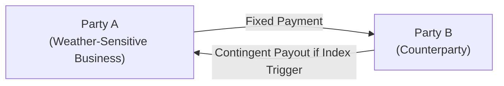

## Introduction and Rationale

Have you ever worried about how an unexpectedly warm winter might slash your local ski resort’s revenues or how a cyclone could wreak havoc on an insurer’s balance sheet? Well, that’s where weather and catastrophe (cat) swaps step into the limelight. Weather and cat swaps are part of a category of risk-transfer instruments that allow businesses and insurers to offload some of the financial volatility stemming from climate-related events.

In a casual chat with an energy executive friend, she once told me that her company used weather swaps to hedge against unseasonably mild winters that could reduce natural gas demand. She was worried about shareholders complaining if the hedging program was too costly. But, interestingly, by carefully structuring a swap, they found a sweet spot: they didn’t overhedge; they simply neutralized the biggest climate-related revenue swings. This sort of trade-off—paying a premium in exchange for weather-related stability—is often how weather swaps are used in real life.

In these pages, we’ll explore how weather swaps work, what triggers them, and why they’ve become indispensable for a broad range of industries and insurers. We’ll also look at catastrophe swaps, which are used to manage the financial consequences of major disasters such as earthquakes and hurricanes. You might think: “Isn’t this something only big insurance companies care about?” Actually, it turns out that investors, municipalities, agricultural producers, and energy firms may also use these instruments to protect themselves against climate-driven risks. Let’s dive in.

## Understanding Weather Swaps

Before we get into the specifics, let’s clarify what makes a derivative a “weather swap.” A weather swap is a forward-type or swap-type contract whose payoff depends on a particular weather index. This index might be something like:

• Cumulative cooling degree days (CDD) or heating degree days (HDD).  
• Cumulative rainfall levels in millimeters or inches.  
• Snowfall levels in certain regions.  
• Average wind speed or maximum wind gust.  

The idea is straightforward: if the actual weather metric (e.g., temperature) crosses a predefined threshold, a payment is triggered in favor of the party harmed by that weather event.

### Key Features of Weather Swaps

• Underlying Index: Rather than referencing a financial instrument like an interest rate or equity price, weather swaps reference a meteorological measure (e.g., average temperature).  
• Fixed vs. Floating Leg: A typical weather swap has one “fixed” leg (a payment established at contract initiation) and a “floating” leg (payment contingent on the observed weather outcome).  
• Settlement: These swaps typically settle in cash, based on the difference between forecasted and realized weather outcomes.  

Now, you might wonder: how is all this measured? It depends on data from reputable weather stations, often overseen by a neutral third party or a government agency like the National Oceanic and Atmospheric Administration (NOAA) in the United States. The biggest challenge is ensuring that the data source is accurate, timely, and reflective of the risk you’re trying to hedge.

## Illustrative Example of a Weather Swap

Let’s look at a simplified example. Suppose an ice cream manufacturer in Florida expects scorching summers. They earn higher profits when the average monthly temperature is above 90°F. Worried about a cooler-than-expected summer, they enter into a weather swap. They agree on:

• Notional: $1 million per “degree day” below 90°F.  
• Reference: Average monthly temperature for June, July, and August at a specific meteorological station.  
• Settlement: At the end of August, the average temperature is measured. If it is below 90°F, they receive a payment.

In KaTeX notation, the payoff for the ice cream manufacturer could be something like:


\text{Payoff} = \max \left(0, N \times (T_{\text{threshold}} - T_{\text{actual}}) \right)


Where:  
• \\( N \\) = $1 million (the notional amount per degree below threshold),  
• \\( T_{\text{threshold}} \\) = 90°F,  
• \\( T_{\text{actual}} \\) = the realized average temperature.  

If \\( T_{\text{actual}} \\) is 88°F, then the manufacturer gets:


\max (0, 1\,\text{million} \times (90 - 88)) = \$2\,\text{million}.


Since 88°F is two degrees below 90°F, they receive $2 million at the season’s end to offset the likely decrease in ice cream sales from cooler weather. 

## When Weather Swaps Make Sense

• Energy Firms: Natural gas or heating oil distributors may lose revenue if the winter is warmer than expected, reducing demand for heating. On the other hand, electricity providers might use a cooling-degree-day swap to hedge air-conditioning demand.  
• Agriculture: Farmers or agribusinesses use rainfall-based swaps to protect themselves from droughts or floods.  
• Hospitality and Tourism: Ski resorts might try to hedge against warm winters with minimal snowfall. Water parks might fret over rainy summers.  

In each case, a mismatch arises between actual weather-driven demand and the typical level of revenue expected in normal conditions. Weather swaps can plug that gap. The real question is whether paying for the hedging is financially attractive given your risk appetite and typical operating margins.

## Structure and Modeling Using a Mermaid Diagram

Below is a high-level depiction of how a weather swap might look. Party A (the company seeking protection) pays a fixed amount to Party B (providing the coverage) in exchange for receiving a contingent payoff if the weather index deviates from an agreed corridor.

Although the mechanics are simple to illustrate, the actual payments hinge on robust meteorological data, carefully negotiated terms, and a crystal-clear definition of the underlying index.  

## Catastrophe Swaps: Managing Large-Scale Disaster Risk

If weather swaps deal with everyday climate fluctuations, then catastrophe swaps (often called cat swaps) handle the “big stuff.” These are the hurricanes, earthquakes, floods, and other natural disasters that can drain an insurance company’s reserves or wipe out entire regions. In a cat swap, payments are triggered if a catastrophic event occurs or if certain parametric or indemnity triggers are met.

• Parametric Triggers: Payment is activated if, for example, the hurricane’s wind speed exceeds 120 mph as measured at landfall. Another parametric measure might be the earthquake’s magnitude on the Richter scale.  
• Indemnity-Based: Payment is disbursed according to the actual losses sustained by the insurance or reinsurance provider.  

Cat swaps are especially popular among insurers, reinsurers, and even governments looking to shield their finances. For instance, an insurer that covers coastal properties in hurricane-prone Florida might find that cat swaps lower the cost of reinsurance while providing capacity to handle large-scale claims.

## Comparing Weather Swaps and Catastrophe Swaps

While these two types of swaps share common structural DNA—both aim to transfer risk from one party to another—there are notable differences:

| Feature          | Weather Swaps                                                                             | Catastrophe Swaps                                                                                                                                                         |
|------------------|-------------------------------------------------------------------------------------------|----------------------------------------------------------------------------------------------------------------------------------------------------------------------------|
| Underlying Index | Temperature, rainfall, snowfall, or other frequent climate metrics                        | Probability or occurrence of a catastrophic event (e.g., hurricane, earthquake), measured param. or by actual claims data                                                 |
| Trigger Frequency| More frequent, often embedded in regular business operations (seasonal changes)           | Rare but high-severity events (true tail risks)                                                                                                                            |
| Payout Approach  | Generally uses parametric triggers (e.g., variance from normal temperature)               | Often uses parametric triggers (wind speed, magnitude) or indemnity triggers (insurance claims)                                                                            |
| Typical Users    | Energy, agriculture, leisure, travel, municipalities                                      | Insurance and reinsurance firms, large corporations, governments (e.g., Caribbean or Pacific nations at risk of hurricanes, earthquakes, or tsunamis)                     |
| Correlation with Market | Usually low correlation with standard financial markets                             | Also relatively low correlation unless widespread catastrophes simultaneously roil markets                                                                                 |

## Valuation and Pricing

### Data-Driven Models

Weather and cat swap valuations rely on specialized modeling. For weather swaps, you might see:

• Historical Weather Data: 10–30 years of temperature or rainfall logs, used to approximate probability distributions.  
• Seasonal Trends: Weighted averages that consider El Niño or La Niña patterns.  
• Meteorological Forecasting: Up-to-date satellite data can feed short-term predictions.

For cat swaps, modeling is even more intricate:

• Geological Risk Models: Seismic data, structural vulnerability assessments, etc.  
• Meteorological or Hurricane Track Simulations: Advanced computer simulations that estimate landfall probability and severity.  

Investors and counterparties often rely on third-party catastrophe modeling firms (e.g., RMS, AIR Worldwide) to price these instruments fairly. They might measure expected losses (EL) using an event frequency times the probable severity. From an exam standpoint, you should be aware that these modeling assumptions introduce model risk—any errors or oversimplifications can make the swap mispriced.

### Premium, Spread, or Fixed Payment

One might say, “Aren’t derivatives typically zero-sum at initiation?” Indeed, but for weather and cat swaps, an upfront or periodic premium is often negotiated to compensate the protection seller for taking on risk. The size of this premium depends on:

• Probability of the weather or catastrophic event occurring,  
• Anticipated severity or magnitude of the potential payout,  
• Basis risk, credit risk, and overall supply-demand in the market.

### Example of a Pricing Approach

Imagine an insurer wanting cat coverage for a potential hurricane. The insurer might collect historical hurricane data over the last 50 years, noting that a Category 3 or higher storm makes landfall in their region once every 10 years on average, with an expected total cost of $100 million. The annual expected loss is about $10 million (probability × severity). For a simple cat swap structure, the “fair premium” might start around $10 million per year. Then, adjustments for basis risk, uncertainty, and overhead would push up the final negotiation price.

## Parametric vs. Indemnity Triggers

As you’ve seen, cat swaps and even certain weather swaps can be structured with parametric or indemnity triggers:

• Parametric: These triggers are based purely on an index reading (e.g., “Hurricane Category 3+ means immediate $X payout”). While parametric structures are simpler to administer, they can cause basis risk if actual damages differ from the parametric measure.  
• Indemnity: Payment is based on actual losses sustained. This mirrors traditional insurance but requires a claims adjustment process. It can be more accurate but also more administratively complex and slower to settle.

So which is “better”? It’s all about trade-offs. Parametric structures are simpler and faster, but you might not get a perfect match to your real losses. Indemnity structures offer a better match but come with more friction. On the CFA exam, watch for scenario-based questions about basis risk with parametric coverage (the difference between actual losses and indexed triggers).

## Diversification Benefits and Non-Correlation

One major attraction of weather and cat swaps is that their payoffs are mostly uncorrelated with traditional stock or bond markets. This can help investors diversify a portfolio. For instance, an asset manager seeking “alternative beta” might purchase a cat swap if they believe the spread they receive from selling coverage is high compared to the actual risk. Catastrophic events typically hinge on geological or meteorological realities—these won’t necessarily coincide with equity bear/bull cycles.

The low correlation can be a double-edged sword in extreme circumstances, though. Imagine a massive natural disaster hitting critical supply chains. Financial markets might also react badly, leading to some indirect correlation. Still, generally, weather and cat swap payoffs historically demonstrate strong diversification benefits for a broad portfolio.

## Risk Considerations and Common Pitfalls

### Basis Risk

You might not fully hedge your underlying risk if the contract’s trigger doesn’t align perfectly with your actual exposure. A ski resort that chooses a precipitation-based swap might suffer from a mismatch if the contract references rainfall in a region that doesn’t perfectly track snowfall up in the mountains.

### Moral Hazard and Adverse Selection

In indemnity-based swaps, the protection buyer could have an incentive to overstate actual losses or be less proactive about risk management if their coverage is too generous. In parametric triggers, moral hazard is generally lower because the payout depends solely on an objective measure (like wind speed).

### Liquidity and Customization

Weather and cat swaps are often bespoke, negotiated over-the-counter (OTC), and thinly traded. That means liquidity can be limited—exiting a position might be challenging. On the bright side, high customization is typical, allowing you to fine-tune triggers, durations, and coverage amounts to match your risk.

### Regulatory Environment

Globally, these products may be regulated under derivatives frameworks (such as in the EU under EMIR, or in the US under the CFTC). For insurers specifically, IFRS 17 or local insurance regulations could require adequate capital provisioning for catastrophe exposures, and regulators often look favorably on cat swaps as a valid way to mitigate catastrophic event risk. However, each jurisdiction might have a slightly different perspective, so you need to be mindful of cross-border compliance.

## Case Study: Caribbean Hurricane Protection

A group of Caribbean nations once collaborated with reinsurance providers to create parametric-based cat swaps that trigger if a hurricane surpasses certain criteria within predetermined latitudes and longitudes. The region’s tourism-driven economies needed swift payouts post-disaster to restore infrastructure, so the parametric structure was deemed key for a quick infusion of funds.

Interestingly, some local governments considered it a worthwhile trade-off to face minor basis risk (perhaps the storm path was narrower than predicted, or the event was slightly below windspeed triggers) in exchange for near-immediate financial relief when a large-scale hurricane did hit. This is a classic example of parametric coverage being chosen for speed and simplicity.

## Exam Tips and Best Practices

• Understand the Distinction: Weather swaps typically reflect smaller, more frequent climate variations, whereas cat swaps are about infrequent but high-severity events.  
• Recognize Contract Triggers: Be ready to explain or differentiate parametric triggers from indemnity triggers, especially regarding basis risk.  
• Model Risks: Acknowledge that modeling climate data or catastrophic events is inherently uncertain, so exam questions might focus on how mispricing can occur due to inaccurate risk models.  
• Non-Correlation Angle: Weather and cat swaps often show low correlation with standard market factors—this can be relevant in portfolio optimization questions.  
• Potential Pitfalls: Keep in mind moral hazard, adverse selection, and liquidity constraints.  
• Real-World Application: Case studies (like the Caribbean parametric coverage examples) might appear in scenario-based item sets or essay questions.

If you see a question referencing a scenario where a reinsurance company wants to offset the risk of a big hurricane hitting the Gulf Coast, be prepared to identify the type of trigger they might prefer, which data sources they’d rely on, and how they’d manage basis risk. 

## References and Further Exploration

• CME Group (https://www.cmegroup.com): Offers resources on weather derivatives, grounding your understanding of temperature, snowfall, and rainfall index products.  
• Swiss Re and Munich Re Publications: Industry reports on catastrophe risk transfer, including parametric cat swaps.  
• Whaley, Robert E., “Derivatives: Markets, Valuation, and Risk Management”: Offers broader coverage, with specialized examples of derivative structures.

## Test Your Knowledge: Weather and Catastrophe Swaps



### Which of the following best describes a weather swap?

- [ ] A swap in which the fixed leg is an interest rate that floats according to seasonal trends.  
- [x] A swap whose payout depends on a predefined weather index, such as average temperature or rainfall.  
- [ ] An exotic equity swap whose payoff is inversely linked to the VIX.  
- [ ] A commodity swap focusing on the cost of carry for agricultural products.  

> **Explanation:** Weather swaps are built around an underlying climate or meteorological index (often temperature or precipitation), not traditional financial indices like interest rates or equity volatility measures.

### What is the primary benefit of parametric triggers in catastrophe swaps?

- [ ] They fully match actual losses every time, minimizing basis risk.  
- [x] They offer a quick payout based on objective data, reducing settlement times.  
- [ ] They are less transparent than indemnity triggers, avoiding moral hazard.  
- [ ] They are prohibited in many major jurisdictions.  

> **Explanation:** Parametric triggers pay out once an objectively measured event threshold is met, making it simpler and faster to settle. However, they come with basis risk since the payout might not match actual losses perfectly.

### Which party typically benefits when average temperatures are lower than expected in a standard heating-degree-day weather swap?

- [ ] The party paying the floating leg.  
- [x] The party seeking protection from reduced demand for heating.  
- [ ] The counterparty providing capital to an insurance-linked securities fund.  
- [ ] A reinsurance company with no direct exposure to energy markets.  

> **Explanation:** In a heating-degree-day swap, a party exposed to reduced demand if temperatures are unseasonably mild (warmer) or unseasonably cold (depending on how the swap is structured) can receive payouts compensating for their losses.

### Which of the following statements about a cat swap is most accurate?

- [ ] It is typically traded on a major exchange with standardized contract sizes.  
- [ ] It usually involves continuous daily mark-to-market settlement like a futures contract.  
- [x] It often includes a parametric or indemnity trigger that defines a specific catastrophic event.  
- [ ] It rarely serves the needs of reinsurance firms.  

> **Explanation:** Cat swaps are commonly over-the-counter arrangements, dominated by parametric or indemnity triggers. They’re highly relevant for reinsurance firms to manage large-scale disaster exposures.

### In an indemnity-based cat swap, why is moral hazard potentially higher than in a parametric swap?

- [x] The party receiving the payout might inflate or misreport actual losses.  
- [ ] The parametric index is harder to measure, leading to data manipulation.  
- [ ] The event threshold is set arbitrarily, making payouts random.  
- [ ] The payoff is based on wind speed or earthquake magnitude only.  

> **Explanation:** Indemnity triggers link payouts to actual losses, which could (in theory) be inflated—creating moral hazard—if the insured party does not manage risk carefully or misrepresents the scope of damage.

### Which of the following best describes basis risk in a weather swap?

- [ ] The risk that interest rates move contrary to expectations, causing a loss on the fixed leg.  
- [x] The risk that the chosen weather index does not perfectly correlate with the actual financial exposure.  
- [ ] The risk that the weather data fails to meet the required regulatory standards.  
- [ ] The risk of default by the counterparty issuing the swap.  

> **Explanation:** Basis risk refers to the mismatch between actual losses and the contract’s payout based on a potentially imperfect weather index.

### How might an investor benefit from selling cat swap protection?

- [x] They could earn periodic payments or an upfront premium for bearing the risk of a catastrophe.  
- [ ] They obtain convertible debt in the event of a natural disaster.  
- [x] They gain diversification benefits due to low correlation with traditional equity and bond markets.  
- [ ] They immediately qualify for tax-free status on realized premium income.  

> **Explanation:** An investor who sells cat swap protection typically receives a premium, plus potential diversification advantages. Note that while we also marked the second correct answer regarding diversification, that is indeed an additional reason an investor might participate.

### When is a rainfall-based weather derivative most likely to be used for hedging?

- [x] When agricultural producers worry about drought impacting crop yields.  
- [ ] When an airline seeks protection from high fuel prices.  
- [ ] When an oil driller anticipates large spikes in oil’s spot price.  
- [ ] When a hospital is concerned about malpractice suits due to weather.  

> **Explanation:** Rainfall-based derivatives give farmers and agricultural producers coverage if rainfall is too low (or, in some cases, too high), protecting them from weather-induced revenue drops.

### Which approach is most commonly used to price cat swaps?

- [ ] Simple linear regression on historical interest rate fluctuations.  
- [ ] Statistical analysis of sales data from big-box retailers.  
- [x] Specialized catastrophe models incorporating meteorological or geological data.  
- [ ] Fundamental stock valuation with discounted free cash flow.  

> **Explanation:** Cat swap pricing generally relies on specialized catastrophe modeling that weighs the frequency and severity of potential disasters, rather than typical financial market correlations or standard discounting methods.

### Parametric cat swaps have which of the following main advantages?

- [x] Quick settlement speed once the parametric trigger is verified to have occurred.  
- [ ] Direct watch on actual insurance claims, eliminating basis risk.  
- [ ] Natural alignment with IFRS 17 reinsurance disclosures, eliminating the need for additional reporting.  
- [ ] Unlimited payouts not set by any index measure.  

> **Explanation:** Parametric triggers settle once an objective index threshold is reached and thus can pay out quickly, helping insured parties access funds to mitigate disaster fallout without a lengthy claims investigation.


