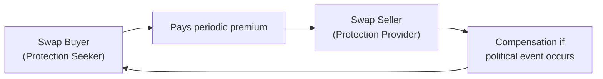

**Overview**  
Political risk swaps—sometimes referred to as sovereign risk swaps—are fascinating but relatively niche derivatives. Their primary purpose is to hedge against adverse outcomes resulting from political or sovereign actions. Think about a multinational firm that invests heavily in emerging markets. Well, these guys face possible upheavals such as expropriation of assets, sudden policy changes barring repatriation of profits, or even the possibility of a sovereign debt default. All that is political risk. A political risk swap is designed to mitigate at least part of that anxiety.

In many ways, political risk swaps mirror credit derivatives, such as credit default swaps (CDS). Instead of tying the trigger to a typical credit event, though (like a missed coupon or principal payment), a political risk swap is triggered by specified political events, for instance a unilateral government moratorium on foreign debt, expropriation without fair compensation, or other forms of instability that drastically undermine asset values. Before you assume these instruments are merely theoretical, just know that large multinational banks and infrastructure investors actually do consider these swaps to offset risk—though liquidity in this market is often limited.

Here’s a short personal story: A colleague of mine, who worked in project finance, spent months setting up a power plant investment in a developing country. He called me one day, exasperated, explaining how the local government threatened to nationalize foreign-owned infrastructure. It was a perfect case where a political risk swap might have offered some security if properly structured—albeit not an easy piece of coverage to find. But let’s dig right in and see how these instruments work.

---

**Key Concepts and Mechanics**  
Political risk swaps come with many moving parts. To show how they’re arranged, let’s outline a typical structure. The table below sketches out roles in a simplified deal:

| Party                   | Role                                                                            |
|-------------------------|---------------------------------------------------------------------------------|
| Swap Buyer             | Pays a periodic premium; seeks protection from political/sovereign event losses. |
| Swap Seller            | Receives premium; compensates Buyer if specified political events occur.         |
| Reference Entity/Event | Typically a government, state-owned enterprise, or political event index.        |

As you might guess, the Swap Buyer is the one worried about political risk in a particular region—maybe it’s an investor with huge stakes in that country’s infrastructure. The Swap Seller, on the other hand, is effectively insuring the Buyer. If a trigger event occurs—like a government default or expropriation—the Seller compensates the Buyer for the resultant losses (subject to the terms of the contract, of course).

Below is a simple Mermaid diagram to illustrate the flow of payments in a political risk swap:

Just like a credit default swap, the crux is all about defining what exactly constitutes a “trigger.” In some cases, the trigger might be any official decree that prohibits debt repayment (like a declared moratorium), or some recognized expropriation declared by an international organization. Alternatively, the trigger could tie to an index that measures political stability—though that approach is trickier since the threshold for “instability” must be defined, and the index itself might lag real-world events.

---

**Underlying Triggers and Documentation**  
• **Political Instability Index**: In some swaps, the payoff references a country’s ranking on an external political risk index from, say, the International Country Risk Guide (ICRG). If certain thresholds or rating downgrades are met, the protection buyer can claim a settlement.  
• **Expropriation Events**: Another approach is specifying an expropriation (full or partial) by a government. For instance, if you’re an oil company operating local wells and the government seizes them, the swap contract can define how the loss will be calculated.  
• **Sovereign Default or Moratorium**: Similar to a CDS, but instead of focusing on missed coupon payments, the contract zeroes in on a declared suspension of external debt payments.  

The precise definitions are hammered out in the swap documentation. Clear definitions go a long way in avoiding disputes. Honestly, though, it’s never straightforward. I once heard about a swap dispute where one party insisted that an announced “temporary bond moratorium” didn’t count as a formal default event. The other side reckoned it sure sounded like one. Because of that, careful language in the contract is critical.

---

**Pricing and Valuation Challenges**  
Political risk is notoriously tough to price because it’s a hybrid of many intangible factors. Unlike corporate default risk—where we have reams of corporate balance sheet data—political instability data can be scarce, and events can feel abrupt and random. A few key challenges that make these swaps heavy-lift:

• **Data Scarcity**: Historical data on expropriations or government defaults can be sporadic. Emerging markets often lack consistent historical records, so the standard default probability approach used in credit markets might not help so much.  
• **Subjective Triggers**: In some deals, the “trigger event” is ambiguous. Defining expropriation or specifying how an index threshold is measured can lead to contractual disagreements and, subsequently, higher risk premiums.  
• **Geopolitical Volatility**: Politics can change quickly. A stable regime for decades might collapse overnight. Markets can shift from calm to chaos in a matter of days—or even hours!—pedestalizing unpredictability.  
• **Correlation with Other Risks**: Political risk rarely operates in isolation. Sovereign debt crises often coincide with interest rate spikes, currency devaluation, or capital controls. Modeling that correlation into a pricing framework is no small feat.  

Given these complexities, pricing is often done on a case-by-case basis, sometimes referencing risk premiums gleaned from sovereign CDS spreads or direct insurance policies offered by multilateral agencies (like MIGA—Multilateral Investment Guarantee Agency). In a structured approach, you might attempt a scenario analysis:

1. Estimate event probability by region or country.  
2. Estimate potential loss under each scenario.  
3. Discount the expected losses at a rate reflecting the risk profile.  
4. Arrive at a premium that fairly compensates the Swap Seller.  

But each step can have huge error bars, leading to wide bid-ask spreads in the fledgling market for these instruments.

---

**Practical Applications and Users**  
• **Multinational Corporations**: Automobile manufacturers, consumer goods companies, or telecom providers operating in several countries. They want a degree of protection if a host government imposes sudden foreign ownership restrictions.  
• **Infrastructure Investors**: Construction of airports, power plants, or highways in emerging markets. Infrastructure is a prime target for nationalization or heavy-handed regulation.  
• **Banks and Lenders**: Financial institutions exposed to sovereign risk in their loan portfolios. A political risk swap can reduce the bank’s regulatory capital requirements if recognized by certain frameworks.  
• **Private Equity Funds**: Funds focusing on frontier and emerging markets might purchase political risk protection for large-scale or strategic investments.  

It’s worth noting that standard insurance products from export credit agencies (like U.S. EXIM Bank or various European agencies) often compete to cover such political risks. Yet, those can be more rigid and limited in scope. Political risk swaps, in theory, offer more flexible or nuanced coverage, though at a custom price.

---

**Benefits and Pitfalls**  
**Benefits**  
- **Holistic Risk Management**: These swaps protect not just credit risk, but the broader spectrum of government or regulatory actions.  
- **Tailored Coverage**: Parties can define triggers and coverage periods precisely, unlike a one-size-fits-all insurance policy.  
- **Potential Regulatory Capital Relief**: Under certain jurisdictions and with proper documentation, a recognized hedge might lower the credit risk capital charges for a bank.  

**Pitfalls**  
- **Complex Definitions**: Contractual wording can lead to disputes. “Political event” is inherently subjective.  
- **Liquidity Constraints**: The market for political risk swaps is small compared to mainstream derivatives. Spreads are wide; exit might be tough.  
- **Correlation with Other Market Crises**: If a big credit meltdown hits an emerging region, odds are that political upheavals will coincide, multiplying potential losses.  
- **Regulatory Uncertainty**: Cross-border transactions raise compliance issues (licensing, local laws).  

---

**Case Study: Infrastructure Project in Country X**  
Let’s illustrate with a hypothetical example. Imagine an infrastructure fund invests $300 million to build a toll road in Country X, an emerging market that recently had a turbulent election. Fearing expropriation, the fund enters a 5-year political risk swap with a global reinsurer:

• **Premium**: 350 basis points annually on the project’s notional (e.g., $300 million). That’s $10.5 million per year.  
• **Reference Event**: Any official government decree expropriating or nationalizing the roadway or halting the contractual right to collect tolls for more than 90 days in a rolling 12-month period.  
• **Compensation**: If expropriation happens, the reinsurer pays the lesser of $300 million or an adjudicated “fair value” of the road.  

Now, if Country X remains stable, the fund simply “loses” the annual premium cost. If an expropriation event occurs, the fund activates the swap. Perhaps the only theoretical hiccup is verifying that the expropriation is indeed recognized under international law or under an agreed-upon third-party arbitration. That’s the trouble with intangible triggers.

Anyway, the moral is: that’s an enormous premium, but for some investors, the risk of losing the entire toll-road asset might be so catastrophic that they’re willing to pay for protection.

---

**Relationship to Other Chapters and Instruments**  
- **Credit Default Swaps (CDS)** (Chapter 5) – Political risk swaps share structural similarities but differ in the exact triggers.  
- **Currency Swaps** (Section 3.3) – If a country imposes strict capital controls, that might hamper currency swap settlement, an indirect form of political risk.  
- **Risk Management and Hedging** (Chapter 6) – Political risk swaps exemplify advanced hedging of non-market, intangible risks.

---

**Exam Tips for CFA® Candidates**  
1. **Understand the Similarities to CDS**: You may be asked to compare political risk swaps to more familiar instruments like CDS. The difference is in what triggers the payout.  
2. **Look for Qualitative Triggers**: On the exam, if they give you a scenario about a moratorium or expropriation, watch how they define it. The contract language is vital.  
3. **Valuation Approaches**: You could see a question about the difficulty in pricing or scenario analysis methods. Show that you know the lack of historical data complicates the discount rate and probability estimates.  
4. **Contractual Nuances**: If a question references ambiguous triggers or incomplete contract definitions, watch for the possibility of moral hazard or disputes.  
5. **Time Constraints**: For short-answer or item set questions, ensure you highlight the correct logic in identifying risk triggers and acknowledging that precise definitions can be tricky in real life.  

It might feel daunting, but you’ve already tackled the conceptual building blocks in credit derivatives. Just remember: political risk is more intangible, so the exam might emphasize the conceptual framework (probability of event × severity of loss) more than complicated formulas.  

---

**Glossary and Terms**  
• **Political Risk**: The risk that political decisions, events, or instability significantly affect asset value or operations.  
• **Sovereign Default**: A government’s failure or refusal to repay its debt obligations.  
• **Expropriation**: Government appropriation of private assets, often with inadequate compensation.  
• **Geo-Indicator**: Index or proxy for measuring political risk in certain regions.  
• **Emerging Markets**: Countries typically characterized by less mature capital markets and higher inherent political/sovereign risk.

---

**References for Further Exploration**  
• International Country Risk Guide (ICRG): Provides data and rating systems for comparing political stability worldwide.  
• World Bank and IMF Publications: Reports on sovereign credit risk, debt sustainability, and strategies for mitigating sovereign default.  
• “Managing Political Risk,” Harvard Business Review: Articles detailing multinational corporate strategies and best practices for coping with political upheaval.  
• MIGA (Multilateral Investment Guarantee Agency): Offers political risk insurance, often referenced as a baseline for pricing.  
• Corporate Finance Texts on Multinational Operations: Useful for deeper analysis of expropriation and political event scenarios.

---

## Test Your Knowledge: Political Risk Swaps Quiz



### A political risk swap differs from a standard credit default swap primarily because:
- [ ] It only involves private corporate issuers.
- [x] It ties payout triggers to events such as expropriation or moratoriums, not just missed payments.
- [ ] It requires central clearing under all regulations.
- [ ] It is always cheaper to purchase.

> **Explanation:** While both instruments aim to hedge potential losses from default or distress, political risk swaps focus specifically on political events, such as nationalization or government shutdowns of debt repayment.

### Which of the following is a challenge in pricing political risk swaps?
- [x] Limited historical data and subjective risk triggers.
- [ ] Well-established liquidity in the market.
- [ ] Access to perfect governmental action forecasts.
- [ ] The absence of any correlation with other market risks.

> **Explanation:** Political risk is particularly hard to model given the lack of reliable historical data and the complexity of “what if” scenarios in emerging markets.

### In a political risk swap, the “protection buyer” refers to:
- [x] The party seeking coverage against political or sovereign events.
- [ ] The government entity issuing sovereign debt.
- [ ] The rating agency responsible for assessing creditworthiness.
- [ ] The regulatory body imposing capital requirements.

> **Explanation:** The buyer is the entity trying to mitigate the impact of a designated political risk event, paying a premium for that protection.

### A key similarity between a credit default swap (CDS) and a political risk swap is that:
- [x] Both involve a periodic premium and a contingent payout.
- [ ] Both are standardized on major global exchanges.
- [ ] Both are triggered exclusively by missed coupon payments.
- [ ] Both target only the same corporate reference entities.

> **Explanation:** Structurally, both instruments rely on a premium payment in exchange for a payout on a specified trigger event, though the nature of these triggers differs.

### Which statement best describes how expropriation triggers are typically determined in a political risk swap?
- [x] They are contractually defined and depend on specific legal or governmental actions.
- [ ] They are always immediately recognized by any local court.
- [x] They must be adjudicated by a recognized international body.
- [ ] They only apply if the local government publicly admits wrongdoing.

> **Explanation:** Expropriation triggers must be carefully and precisely defined in the contract. Often, recognition by an international entity helps reduce disputes about whether an expropriation occurred.

### Why might banks consider political risk swaps when lending to emerging markets?
- [x] They can reduce exposure to unpredictable sovereign actions and potentially lower capital requirements.
- [ ] They are mandated by all central banks worldwide.
- [ ] They have zero cost and infinite liquidity.
- [ ] Sovereign defaults cannot occur in emerging markets.

> **Explanation:** Banks use these swaps to manage or offset the risk of political upheavals. In some jurisdictions, proven risk mitigation can indeed reduce regulatory capital charges.

### Which of the following best illustrates a “political event” trigger for a swap payout?
- [x] A central government declares a moratorium on all foreign debt payments.  
- [ ] A corporation misses a coupon payment on its bond for operational reasons.  
- [x] An official expropriation of a port facility.  
- [ ] A CEO resigns due to personal scandal.

> **Explanation:** Moratoriums on debt and expropriations are common political triggers. A typical corporate default or CEO resignation is different, as it doesn’t necessarily stem from a sovereign or political action.

### One major pitfall in political risk swaps is:
- [x] Defining triggers so vaguely that settlement disputes arise.
- [ ] The easy exit and zero restrictions in the market.
- [ ] Their extremely detailed historical defaults data.
- [ ] The guarantee that they always trigger before any government action occurs.

> **Explanation:** Without precise definitions, there can be disagreements about whether or not a trigger event has actually taken place, making contract specificity critical.

### Compared to buying an insurance policy from a multilateral agency, political risk swaps:
- [x] Can offer more tailored coverage but may have limited liquidity.
- [ ] Are always cheaper.
- [ ] Are guaranteed by global central banks.
- [ ] Usually have unlimited capacity and standard terms.

> **Explanation:** While political risk swaps may allow for customized protection, the market remains relatively illiquid, and pricing can be much more deal-specific.

### Political risk swaps:
- [x] True
- [ ] False

> **Explanation:** Yes, they exist as an alternative to sovereign or political event hedges, though they may be less common and more complex than standard credit derivatives.


