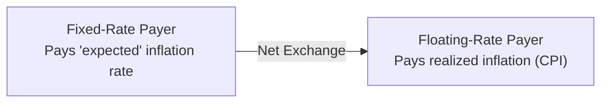

## Introduction
Inflation swaps are derivatives that help market participants manage exposure to inflation risk, whether that means hedging against rising consumer prices or speculating on future inflation trends. In many ways, they’re conceptually similar to interest rate swaps (see [3.2 Interest Rate Swaps](../3.2-currency-swaps) and [3.1 Swaps as a Series of Forward Contracts](../3.1-swaps-as-a-series-of-forward-contracts) for background on swap basics). However, instead of exchanging fixed interest payments for floating interest payments tied to, say, LIBOR or SOFR, inflation swaps revolve around exchanging a fixed inflation rate for realized inflation, often tracked by a well-known index such as the Consumer Price Index (CPI).

I recall chatting with a risk manager at a pension fund who joked that her biggest fear wasn’t necessarily stock market fluctuations; it was inflation eating away the real value of their beneficiaries’ checks. Inflation swaps can be a crucial tool for folks in her shoes—people who need a way to align their assets with liabilities that may grow as prices rise.

In this section, we’ll dive into the mechanics of inflation swaps, explore how they’re valued and used, discuss best practices for risk management, and walk through a few examples to illustrate real-world applications. We’ll also take a look at break-even inflation rates and how these derivatives can provide valuable insight into the market’s expectations for future inflation.

## Basic Mechanics of Inflation Swaps
An inflation swap is an agreement between two parties to exchange a series of cash flows that depend on actual inflation outcomes. Typically, one party—often called the fixed-rate payer—pays a predetermined “inflation expectation rate,” while the other party pays the realized inflation over the same period. For instance:

• The fixed-rate payer might pay 2.5% per year (which is the then-current implied inflation rate).  
• The floating-rate payer pays whatever inflation actually turns out to be, as measured by a reference index such as CPI.

In practice, the payments are netted so that only the difference changes hands. The timeline and frequency of payouts can vary (some swaps pay annually, semiannually, etc.). A common structure is a zero-coupon inflation swap, where there’s only one exchange of payments at maturity.

Below is a simple diagram showing the flow of payments in a standard inflation swap.

### Key Elements
• Reference Index: Typically the Consumer Price Index (CPI), but other measures exist (Retail Price Index in the U.K., for example).  
• Fixed Rate: Known at the contract’s start, representing the market’s consensus inflation forecast over the swap’s life.  
• Calculation Periods: Time intervals over which realized inflation is measured and payments are calculated.  
• Indexation Lag: Inflation data is published with a lag, so parties need to handle timing carefully.  

## Comparing Inflation Swaps to Interest Rate Swaps
If you’re familiar with interest rate swaps, some of this will sound intuitive. In interest rate swaps, one party pays a fixed rate, and the other pays a floating rate, say based on an interbank rate like LIBOR or SOFR (see [3.2 Interest Rate Swaps](../3.2-currency-swaps)). In inflation swaps, that floating “interest rate” is replaced by the realized rate of inflation. Both instruments help manage risk:

• Interest Rate Swaps: Manage interest rate risk (sensitivity to changes in market interest rates).  
• Inflation Swaps: Manage inflation risk (sensitivity to changes in price levels).

Both instruments are conceptually built from a series of forward contracts (see [3.1 Swaps as a Series of Forward Contracts](../3.1-swaps-as-a-series-of-forward-contracts)).

## Common Structures of Inflation Swaps
While there are many variants, here are some structures worth highlighting:

### Zero-Coupon Inflation Swap
Arguably the most popular form, a zero-coupon inflation swap involves a single exchange at maturity:

• Counterparty A (fixed-rate payer) pays a notional multiplied by the cumulative inflation over the life of the swap at a fixed rate.  
• Counterparty B pays the realized inflation growth of the same notional, calculated from changes in the CPI over that period.  

This structure simplifies administration because there’s only one net settlement at the end of the swap, rather than multiple interim payments.

### Year-on-Year Inflation Swap
In a year-on-year inflation swap, payments are exchanged periodically, typically once a year. The floating leg is based on the realized rate of inflation year by year. If actual inflation is higher (or lower) than expected, the floating leg payer will pay more (or less) on these annual settlement dates.

## Market Participants and Use Cases
• Pension Funds: Often have liability streams indexed to inflation (e.g., retiree benefits). By receiving an inflation-based payment stream in a swap, they hedge the risk of rising inflation that would otherwise erode real returns.  
• Insurance Companies: Similar to pension funds, insurance companies offering annuities or other inflation-linked policies may want to match asset flows to liability needs.  
• Asset Managers: Sometimes use inflation swaps to diversify portfolios, take speculative positions on future inflation, or exploit mispriced expectations.  
• Corporations: May have revenue streams or production costs that are sensitive to inflation. An inflation swap can help them manage overall cost structure predictability.  

There was a story I heard from an insurance firm’s treasury department: they were so laser-focused on interest rates that they overlooked the risk inflation posed to their policy payouts. Once they recognized the mismatch, they turned to inflation swaps to lock in a portion of their future liability growth.

## Valuation of Inflation Swaps
Valuing an inflation swap requires discounting the expected cash flows, much as we do in interest rate swaps (see [3.5 Valuation of Swaps at Initiation and During the Contract](../3.5-valuation-of-swaps-at-initiation-and-during-the-contract)). However, the floating payments here depend on inflation outcomes rather than rates like LIBOR or SOFR. In practice, the forward inflation path is implied by:

1. Current inflation readings.  
2. Market-based forecasts (break-even inflation rates derived from nominal and inflation-linked bonds).  
3. Macroeconomic data such as central bank projections.

At inception, the present value (PV) of the fixed leg equals the PV of the expected floating leg—so the net value is typically zero (neglecting bid-ask spreads and transaction costs). Over time, changes in realized inflation or shifts in expected inflation cause imbalances in the swap’s market value. A few special considerations:

• Discount Curve: Typically based on nominal interest rates for both legs, although some practitioners incorporate real yield curves for the floating leg.  
• Forecasting Inflation: Often draws from the break-even inflation embedded in inflation-linked bonds, such as TIPS in the U.S.  
• Index Lag: Settlement amounts can only be finalized once official inflation data is published.  

### Break-Even Inflation and Inflation Swaps
By comparing nominal rate yields with real yields from inflation-protected securities like TIPS, we can estimate the market’s implied inflation (i.e., the break-even inflation). Inflation swaps also provide a direct gauge of break-even inflation by looking at the fixed rate on an inflation swap. If a zero-coupon inflation swap quotes a fixed rate of 2.3% annually for the next five years, that is effectively the market’s consensus for average inflation over that span (again, ignoring risk premiums and liquidity differences).

This measure can complement or substitute for break-evens calculated from the nominal vs. inflation-linked yield spread. In practice, traders and economists watch both. Discrepancies between the two can lead to arbitrage strategies, or at least signal certain risk premiums in inflation markets.

## Practical Example
Imagine you’re a small pension fund manager in Europe:

• You have future liabilities indexed to Eurozone inflation.  
• Current inflation is running around 2%, but you fear it could spike to 4% or higher.  
• You come across an inflation swap priced at 2.5% fixed for the next ten years.

By entering a swap where you receive the floating inflation leg and pay the fixed 2.5%, you essentially lock in your inflation cost at 2.5%. If actual inflation rockets higher, you’ll receive bigger floating payments, offsetting the higher payouts owed to pensioners under your plan. Conversely, if inflation underperforms your expectation, you’ll still pay 2.5% but collect lower floating amounts.

No one can predict inflation precisely, but this arrangement eliminates some of the guesswork and helps your liability management. Some managers find the mental relief alone is worth it.

## Risk Considerations and Challenges
• Counterparty Risk: Like any OTC derivative (see [6.4 Counterparty Risk in OTC Markets](../../6-derivative-benefits-risks-and-uses/6.4-counterparty-risk-in-otc-markets)), an inflation swap participant faces the possibility that the other side cannot fulfill its obligations. Collateral and central clearing can mitigate this risk.  
• Index Complexity: Index lags and revisions can cause mismatches between what you need to hedge and what the swap covers. Adjustments or custom inflation indices may be required.  
• Liquidity: Inflation swaps are less liquid than standard interest rate swaps, especially in certain currencies or for long tenors. This can widen bid-ask spreads.  
• Model Risk: Forecasting inflation is notoriously tricky, making mark-to-market valuations and risk management somewhat more sensitive to assumptions.  
• Regulatory Framework: Some jurisdictions might have stricter margin requirements or regulation for inflation swaps compared to interest rate swaps, affecting cost and availability.  

## Best Practices and Strategies
• Match the Reference Index to Your Liabilities: If liabilities are tied to CPI-U (U.S. Urban Consumers), it may not make sense to hedge with another region’s inflation index.  
• Monitor the Swap’s Mark-to-Market: Changes in inflation expectations throughout the contract’s life will affect your position’s value.  
• Use a Portfolio Approach: Combine inflation swaps with other instruments (e.g., TIPS, commodity exposures) to form a holistic inflation-hedging strategy.  
• Evaluate Collateral Requirements Ahead of Time: This can be a major factor in the total cost of the swap, especially if the contract spans many years.  

## Real-World Anecdote
I once spoke to someone at a corporate treasury team of a multinational consumer goods company. They critiqued how they had hedged all manner of interest rate exposures but dismissed inflation risk as “only relevant if the central bank messed up.” Their input costs began creeping upward due to supply chain inflation and raw material price surges. After a few painful quarters, they found themselves exploring inflation swaps to smooth out their margins and be better prepared for future spikes. It’s a reminder that inflation can show up in unexpected ways.

## Exam Tips for CFA Candidates
• Be ready to compare interest rate swaps and inflation swaps. Many exam questions revolve around structuring the appropriate hedge for a given liability.  
• Know how to calculate and interpret break-even inflation rates as implied by inflation swaps.  
• Remain comfortable with discounting future cash flows and identifying how changes in realized or expected inflation shift a swap’s value.  
• Watch for potential trick questions on index lags and timing of payouts.  
• Practice scenario-based item sets that ask you to incorporate an inflation swap into an overall portfolio hedging strategy.

## References and Further Reading
• Deacon, Mark, Derry, Andrew, and Mirfendereski, Dariush. “Inflation-Linked Products: A Practical Guide.”  
• Bloomberg and Reuters Terminals: Real-time quotes on inflation swap rates and break-even inflation analytics.  
• Federal Reserve Economic Data (FRED) for historical inflation metrics.  
• CFA Institute. “Derivatives and Risk Management” from the official curriculum materials.

## Evaluate Your Understanding of Inflation Swaps



### Inflation Swap Structure
- [ ] The floating leg is typically linked to SOFR or LIBOR.  
- [ ] The fixed leg is typically determined by a policy rate set by central banks.  
- [x] The floating leg is typically linked to an inflation index like CPI.  
- [ ] The fixed leg is typically set to the central bank's forecast of GDP growth.

> **Explanation:** The classic inflation swap structure has a floating rate tied to an inflation index (such as CPI) and a fixed rate that represents expected inflation.

### Zero-Coupon Inflation Swap
- [ ] Involves multiple payments during the life of the swap.  
- [ ] Provides daily payments of inflation.  
- [x] Involves a single payment at the end of the swap reflecting cumulative inflation.  
- [ ] Uses a variable notional to reflect changes in interest rates.

> **Explanation:** A zero-coupon inflation swap settles only once at maturity, capturing the cumulative inflation over the life of the swap.

### Main Market Participants
- [ ] Manufacturers with no labor cost volatility.  
- [x] Pension funds and insurance companies with inflation-linked liabilities.  
- [ ] Only central banks.  
- [ ] Short-term speculators exclusively.

> **Explanation:** Pension funds and insurance companies often have payouts sensitive to inflation, so these swaps help them hedge that risk.

### Valuation at Initiation
- [ ] Typically has a large premium paid by the fixed leg payer.  
- [ ] Dependable only on historical inflation.  
- [x] The present value of the fixed leg equals the present value of the floating leg.  
- [ ] Calculated by referencing the nominal bond yield only.

> **Explanation:** At inception, the swap’s market value is generally zero if priced fairly: the discounted fixed payments match the discounted expected floating payments.

### Break-Even Inflation Rate
- [x] Reflects the market’s consensus expectation of future inflation.  
- [ ] Always lower than realized inflation.  
- [ ] A measure used only by central banks.  
- [x] Can be derived from comparing nominal bonds to inflation-linked bonds.

> **Explanation:** Break-even inflation is what the market expects inflation to be, derived from nominal vs. real yields or from the fixed rate of an inflation swap.

### Inflation Index Lag
- [ ] Has no effect on settlement calculations.  
- [x] Can affect the timing of cash flows.  
- [ ] Only matters in interest rate swaps.  
- [ ] Eliminates the need for discounting.

> **Explanation:** Inflation data is published with a delay, so the index lag can influence which reference date is used for determining the floating leg in the swap.

### Risk Factors
- [x] Counterparty risk and liquidity risk.  
- [ ] Only credit risk.  
- [ ] Limited to operational risk.  
- [x] Market risk due to changing expectations of future inflation.

> **Explanation:** Counterparty default and shifts in inflation expectations are two primary risks for inflation swap participants, along with liquidity concerns.

### Zero-Coupon vs. Year-on-Year Structures
- [ ] They are effectively the same.  
- [ ] Both pay only once at maturity.  
- [x] Year-on-year swaps exchange payments periodically, while zero-coupon swaps settle at maturity.  
- [ ] Zero-coupon structures require monthly settlement.

> **Explanation:** Zero-coupon swaps settle once at maturity, whereas year-on-year swaps involve periodic settlements based on annual inflation.

### Using Inflation Swaps for Speculation
- [ ] Only hedgers can trade inflation swaps.  
- [x] Traders can buy or sell inflation exposure if they think inflation will deviate from the market’s expectation.  
- [ ] Regulatory authorities forbid taking speculative positions in inflation swaps.  
- [ ] Requires the use of physical commodities.

> **Explanation:** Inflation swaps can be traded by speculators seeking to profit from differences between actual inflation outcomes and the market’s implied inflation expectations.

### True or False: “Inflation swaps can provide insight into the market’s inflation expectations.”
- [x] True  
- [ ] False  

> **Explanation:** The fixed rate of an inflation swap essentially compensates the floating leg payer for expected future inflation, therefore it’s a good market-based gauge of inflation expectations.


