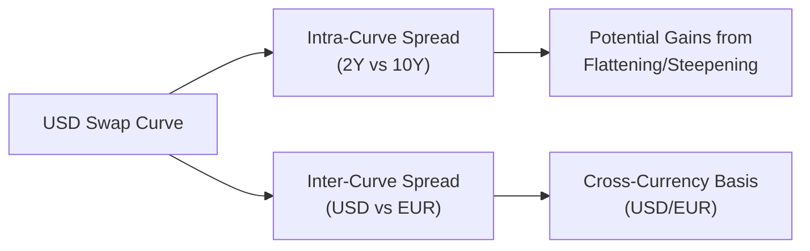

## Introduction

It’s very common to hear traders discuss “the 2s10s spread” or “the USD–EUR spread” as if they’re describing daily weather forecasts in the financial markets. At first, I found the jargon a bit overwhelming: Are we talking about the same yield curve, or are we crossing from one currency to another? The world of swaps involves both intra-curve spreads (differences within one yield curve) and inter-curve spreads (differences between two or more yield curves denominated in different currencies). If you’re feeling a little unsure, don’t worry—by the end of this discussion, you’ll see how these spreads work, how they’re traded, and why they’re so crucial to interest rate and macro strategies.

## Defining Intra-Curve Swap Spreads

Intra-curve swap spreads compare swap rates of different maturities along the same yield curve. Perhaps the most popular reference is the difference between the 2-year swap rate and the 10-year swap rate on the same currency’s yield curve (like the USD LIBOR swap curve, or nowadays more commonly a SOFR-based swap curve). This spread is often used as a stand-in for the slope or shape of that segment of the yield curve.

Why do we care about differences between, say, 2-year and 10-year rates? The shape of the yield curve can tell us a lot about market expectations for economic growth, central bank policy, and inflation. For instance:

• A steep yield curve (where the 10-year rate is much higher than the 2-year rate) might indicate markets expect economic expansion or eventual interest rate hikes.  
• A flat or even inverted yield curve (where the 10-year rate is equal to or lower than the 2-year rate) can be a signal of market pessimism or a sign of impending recession.

Firms and traders who enter “flattener” or “steepener” trades in swaps do so by receiving (or paying) fixed in one maturity and paying (or receiving) fixed in another. Essentially, they position themselves to profit from changes in the slope of the curve. If they expect the curve to steepen, they might receive fixed at the short maturity and pay fixed at the longer maturity, hoping the difference widens.

### Typical Intra-Curve Spread Formula

A common way to represent an intra-curve spread is:

$$
\text{Intra-Curve Spread}_{(T_1, T_2)} = \text{SwapRate}(T_2) - \text{SwapRate}(T_1)
$$

where \\( T_1 \\) and \\( T_2 \\) are two distinct maturities. For example, a “2s10s” spread might be:

$$
\text{2s10s Spread} = S_{10} - S_{2}
$$

If this difference is historically low, some market participants might anticipate a return to normal levels—say, if typically the difference is 1.50% but it’s currently only 0.75%. They’ll consider trades that benefit if the curve steepens back to more “average” conditions.

Below is a quick Python snippet that calculates a sample 2s10s intra-curve spread:

```python
import math

S2 = 0.025  # 2-year swap rate (2.5%)
S10 = 0.040 # 10-year swap rate (4.0%)

intra_curve_spread = S10 - S2
print(f"Intra-curve spread (10y-2y) = {intra_curve_spread*100:.2f} bps")
```

This simple script just prints out a 1.50% (150 bp) spread. In real life, you’d have to incorporate discount factors, day-count conventions, and the specific currency’s standard quoting methods, but the idea remains the same.

## Defining Inter-Curve Swap Spreads

While intra-curve spreads stay within one currency, sometimes the opportunity lies in comparing two entirely different yield curves, such as the USD swap curve versus the EUR swap curve. This is known as an inter-curve swap spread. So if a trader believes the Federal Reserve will keep rates on hold while the European Central Bank (ECB) might hike aggressively, you might see a difference in the relative shape of these curves.

Inter-curve spreads help clients and traders:

• Hedge currency basis risk.  
• Execute cross-currency strategies.  
• Exploit divergences in central bank policies.  
• Take advantage of relative mispricings when one currency’s swap curve is “out of whack” compared to another’s.

A typical scenario is cross-currency basis swaps, where you exchange principal and interest flows in one currency for principal and interest flows in another. Your net exposure depends on the difference in swap rates and the basis, which can fluctuate due to capital flows, liquidity conditions, and global macro events.

### Visual Representation

Here’s an overview in a quick diagram that shows how we can think about intra-curve and inter-curve spreads:



## Market Participants and Motivations

Many types of market participants get involved in swap spreads:

• Hedge Funds: Often set up relative value trades. They might put on a steepener in the USD swap curve and offset that with a flattening position in EUR if they see diverging monetary paths.  
• Banks’ Proprietary Desks: Seek arbitrage or short-term profit. They also manage their own balance-sheet exposure.  
• Corporate Treasurers: Hedge interest rate exposure. A U.S. corporation with euro-denominated liabilities might use an inter-curve swap to lock in lower rates if the EUR curve is cheaper compared to the USD curve, or vice versa.  
• Asset Managers: Adjust portfolio duration or shift exposures between currencies.  

In short, if there’s an opportunity for profit, traders will look at yield curve spreads—both within a curve and across multiple curves—to see if they can find an anomaly or position themselves ahead of expected macro events.

## Basic Trading Strategies

### Intra-Curve Flattener/Steepener

When placing an intra-curve trade, let’s say you foresee that the yield curve will flatten (i.e., the spread between the 2-year and 10-year points will narrow). One strategy is:

• Pay fixed on the 2-year swap.  
• Receive fixed on the 10-year swap.  

If the 2-year rate rises relative to the 10-year (which means the spread tightens), you’ll earn a profit on that relative move. Conversely, if you think it will steepen, you flip it around:

• Receive fixed on the 2-year swap.  
• Pay fixed on the 10-year swap.

### Inter-Curve Spread Trades

For an inter-curve swap spread trade, imagine you think the U.S. economy is slowing, so the Federal Reserve might cut rates, but the European economy is heating up, prompting the ECB to raise rates. You might:

1. Enter a receive-fixed USD swap (to benefit if USD swap rates go down).  
2. Enter a pay-fixed EUR swap (to anticipate higher EUR swap rates).  

You’re effectively long the USD swap curve and short the EUR swap curve. Your net payoff depends on how each curve moves. Of course, this is simplified: in real trades, you’ll incorporate cross-currency basis swaps, notional amounts would be matched or partially matched, and you’ll watch the offsetting currency exposures carefully.

## Practical Examples and Real-World Case Studies

Picture the aftermath of a major central bank announcement. Back in my earlier days, I remember the Fed unexpectedly signaling a more dovish stance. The U.S. 2-year rate quickly fell 20 basis points, while the 10-year rate fell only 10 basis points. Traders who had anticipated a flattening by paying short-term rates and receiving longer-term rates saw that 2s10s spread compress. Their positions generated tidy gains.

Alternatively, in a cross-currency scenario, if the ECB was aggressively hiking while the Fed stayed put, the EUR curve might rise faster. A receiving position in USD swaps combined with a paying position in EUR swaps could see nice profits as the gap between USD and EUR swap rates widened.

## Impact of Macroeconomic Factors on Swap Spreads

A wide range of macroeconomic conditions can push these spreads:

• Central Bank Policy Changes: Rate hikes, cuts, or new quantitative easing measures alter the shape of the yield curve.  
• Economic Data Surprises: Non-Farm Payrolls in the U.S., GDP figures, inflation data—any major release can trigger re-pricing of the yield curve.  
• Credit Risk and Liquidity Conditions: If one market experiences a liquidity crunch or sudden flight-to-quality, you can see big distortions in inter-curve differentials.  
• Global Geopolitical Events: Trade disputes, wars, or other events that disrupt capital flows can widen or narrow cross-currency basis spreads.  

Moreover, short-end rates are often more sensitive to central bank policy, while longer-end rates sometimes reflect inflation expectations or broader growth views. That’s why the shape between short and long maturities can shift quickly after new information hits the market.

## Risk Management Considerations

Let’s not forget that swap spread trades—whether within a curve or across curves—come with risks:

• Basis Risk: If you’re doing an inter-curve trade and the correlation between the two yield curves isn’t perfect, you could lose money even if your macro view is correct for one curve but not for the other.  
• Counterparty Credit Risk: In an over-the-counter (OTC) swap, you must assess your counterparty’s default risk. Clearinghouses and central counterparties (CCPs) mitigate this, but the risk remains.  
• Liquidity Risk: Spreads in less liquid maturities or less common currency pairs can widen unpredictably.  
• Funding and Collateral Costs: The cost of posting collateral, especially in multi-currency scenarios, may cut into potential profits.  

A robust risk management framework typically involves setting risk limits for each part of the curve or each currency segment, stress-testing scenarios (e.g., a flattening vs. steepening shock, or a sudden cross-currency spread blowout), and ensuring the net exposure remains in line with the firm’s or portfolio’s overall risk tolerance.

## Advanced Insights: Butterfly Trades and Curve Curvature

Sometimes you’ll hear about “butterfly” trades, which involve taking positions at three different maturities—a short-dated, a medium-dated, and a long-dated point—aiming to profit from changes not just in slope but in the curve’s curvature. If the middle maturity is mispriced relative to the other two, a butterfly position could realize gains.

Similarly, advanced inter-curve strategies might target a “roll-down” effect—where if you receive on a steeper part of the curve, you benefit as your position “rolls down” into lower-yield territory over time. Of course, the complexity—and the risk—ramps up when you add more legs and multiple currencies.

## Real-Life Trading Desk Anecdote

I recall a day when a bank’s prop desk had a big bet on the 5s30s slope (another typical spread for measuring curve shape). The rationale was that the Federal Reserve would keep short-end rates stable, but inflation fears would pop, pushing the 30-year rate higher. They took a steepener position. Sadly (for them), a negative economic data surprise pushed *all* rates lower, but the 30-year dropped more than the 5-year. Boom—flattening instead of steepening. They closed out with a loss. Moral of the story? Even well-researched curve trades can turn quickly if the market narrative changes.

## Additional Considerations for Structural or Systemic Risks

Large-scale events—like the Great Financial Crisis or the COVID-19 pandemic—complicate yield curve analysis. At times, central banks intervene heavily, purchasing long-dated securities (QE) or introducing special lending facilities. Such interventions can create artificially tight or wide spreads. Meanwhile, cross-currency markets may lock up, leading to big swings in cross-currency bases. Being mindful of these extraordinary factors is essential for successful (and safe) swap spread trading.

## Conclusion and Key Exam Tips

You’ll see that understanding intra-curve and inter-curve swap spreads is crucial to navigating the interest rate landscape. They’re powerful tools for expressing a macro view, hedging interest rate risk, or extracting relative value opportunities. Here are a few key exam tips:

• Know the definitions cold: Intra-curve = same currency, Inter-curve = different currencies.  
• Understand slope vs. shape vs. curvature.  
• Practice analyzing how a central bank action might affect the short end of the curve differently than the long end.  
• Recognize that cross-currency trades add basis and currency exposure.  
• Always remember risk management: basis risk, counterparty risk, and liquidity risk.  

These points often show up in exam questions involving scenario-based yield changes or multi-part item sets that ask you to calculate the net payoff of a combined swap position. Knowing how to break down the legs of the trade and identify the final exposures is your ticket to top marks.

## References

• Hull, J. (2022). Options, Futures, and Other Derivatives. Pearson.  
• Rosenberg, J. V. (Federal Reserve). “Interest Rate Swaps and the Shape of the Yield Curve.”  
• Bank for International Settlements (BIS) Quarterly Review. Helpful for global yield trends.  

Remember, analyzing the shape of yield curves—and the differences across currency curves—can become second nature once you practice enough. Keep at it, reflect on real market events, and you’ll develop an intuition for how these spreads behave.

---

## Test Your Knowledge: Intra-Curve and Inter-Curve Swap Spreads



### Relative to intra-curve swap spreads, which of the following best describes inter-curve swap spreads?

- [ ] They compare swap rates of different maturities on the same yield curve.  
- [x] They compare swap rates across different currency yield curves.  
- [ ] They examine the difference between on-the-run and off-the-run bonds.  
- [ ] They focus solely on short-term rates.  

> **Explanation:** Intra-curve refers to comparing maturities within a single yield curve, whereas inter-curve involves comparing different currency yield curves.

### A trader believes the USD yield curve will flatten over the next quarter. Which position might they adopt?

- [x] Pay fixed on the 2-year swap and receive fixed on the 10-year swap.  
- [ ] Receive fixed on the 2-year swap and receive fixed on the 10-year swap.  
- [ ] Pay fixed on both 2-year and 10-year swaps.  
- [ ] Receive floating for both maturities.  

> **Explanation:** For a anticipated flattening, paying short maturity and receiving longer maturity benefits if the spread narrows.

### In a cross-currency basis swap between USD and EUR, which of the following is a primary risk?

- [x] Currency basis risk.  
- [ ] Geopolitical risk in a single local market.  
- [ ] Default risk of holding physical gold.  
- [ ] Low correlation risk between equity and bond markets.  

> **Explanation:** A cross-currency basis swap inherently introduces basis risk between the two currencies’ borrowing/lending markets.

### Which factor is most likely to affect an intra-curve spread (like 2s10s) the most?

- [x] Central bank guidance on short-term interest rates.  
- [ ] Changes in corporate dividend policies.  
- [ ] Expansion in credit card balances among consumers.  
- [ ] A shift in regulatory capital requirements for brokers.  

> **Explanation:** Central bank rate policy can heavily impact the short end, so the slope between the short and long end is affected.

### If a flattener trade profits, it means:

- [x] The yield spread between two maturities has decreased.  
- [ ] The yield spread between two maturities has increased.  
- [x] The short maturity rate rose more (or fell less) than the long maturity rate.  
- [ ] The shape of the curve is unchanged.  

> **Explanation:** Flattening means the difference between short and long rates narrows, and the short rate moving higher (relative to the long rate) is a common explanation.

### Which of the following statements about butterfly trades is correct?

- [x] They involve positions in three maturities (short, medium, long).  
- [ ] They focus solely on cross-currency differences.  
- [ ] They are only used to speculate on credit spreads.  
- [ ] They typically exclude the middle maturity.  

> **Explanation:** Butterfly strategies involve three maturities to exploit changes in the curve’s curvature, often focusing on the relative mispricing of the middle maturity.

### Which of the following is an example of an inter-curve strategy?

- [x] Paying fixed on the EUR 10-year swap while receiving fixed on the USD 10-year swap.  
- [ ] Paying fixed on the 30-year and receiving fixed on the 5-year in the same currency.  
- [x] Entering simultaneously a receive-fixed in AUD and a pay-fixed in CAD.  
- [ ] Using an overnight indexed swap only in GBP.  

> **Explanation:** Inter-curve positions involve different currencies, such as EUR vs. USD or AUD vs. CAD.

### If a market participant wants to hedge interest rate exposure but not currency exposure, which is most appropriate?

- [x] Intra-curve swap.  
- [ ] Inter-curve swap.  
- [ ] Foreign currency options.  
- [ ] Cross-currency basis swaps.  

> **Explanation:** Intra-curve swaps hedge interest rate exposure within a single currency; inter-curve swaps introduce currency basis risk.

### A key risk in any swap spread trade is:

- [x] Basis risk if the yield curves don’t move as expected in tandem.  
- [ ] The guaranteed correlation of various maturities.  
- [ ] Unlimited interest rate risk on both legs.  
- [ ] An obligation to post zero collateral.  

> **Explanation:** If the legs of a swap spread trade become disconnected (i.e., their usual correlation breaks), the trader can incur losses.

### A true statement regarding swap spreads in times of crisis:

- [x] They can deviate significantly from historical norms due to liquidity stresses.  
- [ ] They usually remain stable across all maturities.  
- [ ] They are never impacted by central bank interventions.  
- [ ] Market participants reduce all swap positions immediately.  

> **Explanation:** During crises, liquidity problems, capital flight, and unconventional central bank actions can lead to abnormally large spreads.




