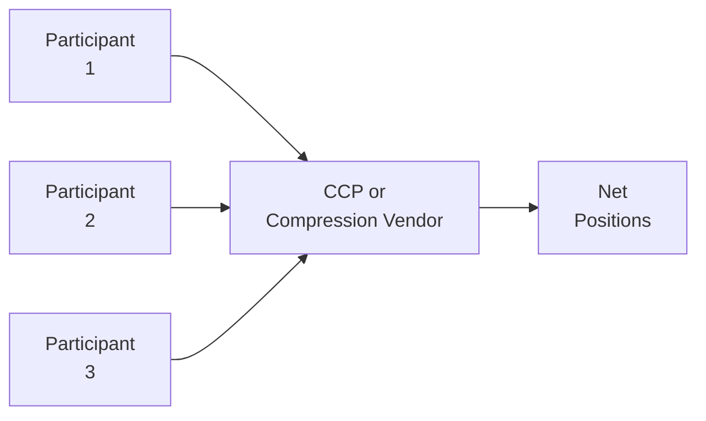

## Introduction

So, you’re studying swaps, and you’ve come across the concept of “multi-lateral swap compression.” It might sound like a super complex fancy term, but let me assure you: once you grasp the essentials, it feels almost intuitive—like we’re cleaning out the clutter in a giant closet full of half-used items.

Multi-lateral swap compression is that essential closet-cleaning process in the swap market. Remember that swaps are contractual agreements where counterparties exchange cash flows, typically to manage interest rate exposure, currency exposures, or even commodity exposures. Over time, different desks, banks, asset managers, or insurers pile up identical or offsetting trades. This duplication can be so pervasive that it becomes a huge drain on capital, margin, and just about everyone’s sanity.

The idea behind multi-lateral compression is to “tear up” those redundant, offsetting trades in batches—i.e., across multiple participants—and rebook (or simply remove) them in a way that leaves everyone’s net market exposure unchanged. If someone used the phrase “Marie Kondo for your derivative books,” well, that wouldn’t be too far off. Let’s dive deeper.

## Understanding the Basics of Multi-Lateral Swap Compression

Before we talk nuts and bolts, let’s define the usual suspects:

• Portfolio Compression: A process reducing duplicate or offsetting positions among market participants.  
• Central Counterparty (CCP): A clearing entity that stands between the buyer and seller, guaranteeing contract performance.  
• Regulatory Capital: The capital banks and regulated entities must hold in reserve, influenced heavily by a firm’s notional exposure to derivatives.  

When we say “multi-lateral,” we’re talking about compression involving multiple parties simultaneously—think of it as a group project. Each participant sends their trades to a centralized service. That service identifies trade pairs that offset, calculates net exposures, and eliminates or modifies the redundant trades.

The primary driver here is the reduction of gross notional outstanding. For anyone who’s reading this with an eye to capital efficiency, it’s a big deal: smaller notional means (usually) lower capital charges under Basel III or equivalent regulatory frameworks. Plus, fewer trades also means fewer operational complexities, and that can reduce the risk of back-office snafus.

## The Mechanism of Multi-Lateral Compression

How does it work in practice? Once the relevant CCP or specialized vendor obtains the portfolios from multiple participants, it uses an algorithmic engine. This engine identifies netting opportunities across the entire pool of trade data. There’s a bit of a puzzle-solving approach, rummaging for sets of trades that can offset each other. The system ensures that, once the compression cycle is complete, each individual participant retains the net economic exposure they started with—meaning if you were net long a certain interest rate or you had a certain DV01 (duration exposure) you needed, that doesn’t change.

Let’s illustrate with a simplified example:

1. Bank A has many interest rate swaps paying fixed and receiving floating.  
2. Bank B may have an opposite position—receiving fixed and paying floating—on nearly identical terms.  
3. Bank C may similarly hold positions that partially offset A’s and B’s trades.  

When you line up all these positions side by side, you might realize that a chunk of them is redundant. Instead of rolling them all forward, you can “compress” them into a smaller set while preserving net exposure.

### A Simple Numerical Example

Let’s imagine:

• Bank A is paying fixed (4.0%) and receiving floating on $50 million notional.  
• Bank B is receiving fixed (4.0%) and paying floating on $50 million notional (nearly identical maturity, same underlying reference rate).  

In a bilateral compression, you could simply net them out, leaving a net zero position. But in multi-lateral compression:

• Bank C might have partially offsetting positions, or a mismatch in coupon (paying 4.1%, receiving floating).  
• The compression engine tries to find a multi-party “swap matrix” that nets out as much as possible among A, B, and C.  

Ultimately, you might see a scenario where $50 million of A’s and B’s trades vanish, plus $20 million of A’s and C’s offset. Meanwhile, B’s leftover $10 million notional remains outstanding with C but at a new or adjusted rate, if needed, to keep net exposure consistent for each participant.

After it’s done, each bank holds the same net exposure (like net DV01 or net floating exposure), but the total notional is drastically reduced. That’s the power of multi-lateral compression.

## Diagram: Multi-Lateral Compression Flow

Below is a simplified mermaid diagram showing how participants typically interact with a CCP or compression vendor:

In essence:

1. Participants send all relevant swap data to the vendor or CCP.  
2. The vendor’s compression algorithm identifies netting opportunities.  
3. The final result is a set of net positions that maintain the same market exposure but reduce total notional.

## Key Stakeholders and Institutions

If you’re wondering who typically participates in these cycles, it’s a colorful cast:

• Global and regional banks (diverse derivative desks)  
• Insurance companies managing large liability-driven investment portfolios  
• Pension funds hedging long-dated obligations  
• Hedge funds or asset managers with offsetting strategies  
• Central counterparties (CCPs), themselves, who often coordinate post-trade services  

Multi-lateral compression is more efficient when you have bigger pools of trades because the odds of finding offsetting positions are higher. This is a big reason why central clearing mandates and strong industry adoption of compression tools have grown dramatically in the past decade.

## The Role of CCPs and Specialized Vendors

CCPs have an inherent vantage point: they know the positions of all clearing members. If all trades are centrally cleared, the CCP can see who’s paying fixed, who’s receiving fixed, the maturity date, the notional, the floating reference rate, etc. Because the CCP is the legal counterparty to all trades in a central clearing system, it can facilitate compression cycles with minimal friction.

Specialized vendors—like TriOptima (mentioned in the references)—can coordinate multi-lateral compression even for non-cleared swaps. They compile trade-level data from consenting participants, analyze netting opportunities, and then produce a tear-up or partial tear-up schedule. Participants then execute new risk-reducing trades or accept the vendor’s tear-up instructions. Because the entire exercise is done under binding rules and legal frameworks (everyone signs up, so they trust the process), it tends to run smoothly.

## Regulatory Requirements and Impact on Capital

Let’s face it—capital and regulatory constraints are a huge reason banks love compression. Under Basel III (and subsequent regulations like Basel IV), the rules make banks hold capital in line with the gross notional and risk weighting of derivative exposures. By compressing offsetting positions, the overall notional shrinks, which can reduce the capital burden.

• Lower notional → Lower leverage exposure measure → Less capital required.  
• Fewer trades → Possibly lower operational risk from back-office errors.  

There’s also the “regulatory compliance” bragging rights, if you will. Regulators want to see the global derivative markets become less entangled. By systematically removing redundant positions, you reduce interconnectedness—often considered a driver of systemic risk.

## Operational Efficiency Gains

If you’ve worked in a swap back office before, you know the painstaking detail: you reconcile confirmations, check daily valuations, margin, collateral, etc. Now imagine you have a thousand trades with small notional differences, each booked at slightly different rates. Compression helps you slash that number drastically. Managing 200 net trades instead of 1,000 can save a ton of time and reduce the chance of settlement errors. 

There’s also a liquidity benefit. By netting down positions, the overall margin requirements can go down. This frees up funding lines and liquidity for other uses. Besides, who wants to keep track of a thousand trades if you can get the same result from 50?

## Practical Example: Compressing Inter-Dealer Swaps

I once encountered a real-life scenario: we had a portfolio of interest rate swaps with half a dozen different dealers. Over time, we realized that some of the trades effectively canceled each other out. A multi-lateral compression cycle was arranged through a specialized vendor. We sent in all our trades, along with 10 other banks. The vendor found that over 40% of our total outstanding notional was redundant. Poof, gone. Our net exposure to rising or falling rates didn’t change at all. But the capital charges and margin costs definitely went down. It was like finding money on the sidewalk.

From the bank’s perspective, especially if you’re on a swap desk, participating in such compression cycles can become a routine part of your daily operations. If you skip too many cycles, you might end up paying more margin than your competitors.

## Real-World Case Studies

### TriOptima’s TriReduce

TriOptima runs a compression service (TriReduce) that organizes periodic compression cycles across major currencies and standardized swap products. It’s reported that, over the past decade, they’ve helped eliminate hundreds of trillions of dollars in gross notional—yes, trillions with a “T.” This shows how prevalent duplication in the system can be.

### Post-Financial-Crisis Surge

According to IMF’s Global Financial Stability Report, the notional outstanding in the over-the-counter (OTC) derivatives market has consistently declined for many asset classes since the financial crisis, partly due to widespread adoption of compression. Regulators worldwide have also championed compression as a risk mitigation tool. Where once multi-lateral compression was “nice to have,” it’s now borderline essential.

## Best Practices and Implementation Challenges

In principle, multi-lateral compression sounds straightforward. However, it can get complicated:

• Legal Documentation: All participants need standardized legal docs ensuring a tear-up is enforceable.  
• Data Integrity: Trade data must be accurate (think of trade mismatches and complicated resets).  
• Product Standardization: Compression works best if the swaps are relatively homogeneous (e.g., standard interest rate swaps referencing a major benchmark). Exotic swaps or heavily structured deals might not easily compress.  
• Timing and Coordination: With multiple participants, scheduling a compression cycle can be a headache.  

But the benefits usually outweigh these hurdles. If you’re a big bank, you may have entire teams dedicated to the operational side of compression and netting.

## Minimizing Systemic Risk

Regulators like to talk about “sysadmin risk,” though you might also see it written as “systemic risk.” The idea is that, if every bank is up to its eyeballs in complex positions, the potential for contagion in a crisis is huge. Compression helps reduce overall notional, which means in a super-stressed scenario, the system is a bit less tangled. While it’s not a complete panacea for meltdown scenarios, it’s at least a step in the right direction of simplifying those webs of connected exposures among big financial institutions.

In a sense, multi-lateral compression complements the broader push for central clearing and standardization of OTC derivatives. Combine that with daily margining, robust operational oversight, and you get a much more stable environment than we had pre-2008.

## Key Formulas and Concepts

Although multi-lateral compression doesn’t revolve around a single formula, you might see references to net notional or net exposure:

 \text{Net Notional} = \sum_{i=1}^{n} (\text{Notional of trade}_i) - \text{Offsets identified} 

In a perfect scenario, the “Offsets identified” can be quite large, leading to a big drop in the outstanding notional. The “economic exposure” remains the same because that’s typically measured by market risk parameters, such as duration, delta, or sensitivities to underlying interest or exchange rates.

## Linking Back to Other Topics

• 3.1 Swaps as a Series of Forward Contracts: Understanding how each swap can be viewed as a set of forward cash flows helps in evaluating combined net exposures.  
• 3.2 Interest Rate Swaps: Multi-lateral compression is especially common with plain-vanilla interest rate swaps, which are well-standardized.  
• 3.9 Asset Swaps and Applications: Even asset swaps can join the compression pool if they conform to standard terms.  

As you progress through the rest of Chapter 3, keep in mind that multi-lateral compression is a behind-the-scenes mechanism that can dramatically reduce the clutter of daily swap desks.

## Implementation Pitfalls

• **Market Data Consistency**: If different participants use slightly different forward rate curves or discount factors, reconciling valuations might cause disagreements.  
• **Exotic Flavors**: Some swaps embed optionality or specialized terms that do not easily net out.  
• **Legal Objections**: Each jurisdiction or participant might have unique rules. In certain places, legal frameworks are less developed, hindering compression possibilities.  
• **Participant Mistrust**: If participants don’t trust each other or the vendor’s compression algorithm, they might resist or hesitate to join.  

Still, the industry has developed robust solutions to tackle most of these. The ISDA standard definitions, for instance, help unify product specifications, so we’re all (mostly) speaking the same language.

## Diving Deeper: Processes and Cycles

A typical compression cycle might go like this:

1. **Data Gathering**: The CCP or vendor requests each participant’s book of eligible swaps.  
2. **Data Cleansing**: Participants cross-check the data to ensure trade matches are correct.  
3. **Compression Run**: The algorithm identifies feasible tear-ups.  
4. **Participant Approval**: A recommended compression schedule is distributed; each participant approves or rejects.  
5. **Execution of Tear-Ups**: The trades are terminated or partially terminated.  
6. **Post-Trade Reporting**: Everyone updates their books and records to reflect the new, compressed positions.

This entire cycle can repeat monthly or even weekly, depending on market conditions and the volume of trades.

## Conclusion and Key Exam Tips

• **Focus on the Rationale**: The test might ask you *why* multi-lateral compression is beneficial. Emphasize capital relief, operational efficiency, and systemic risk reduction.  
• **Understand the Mechanics**: You don’t need to memorize the algorithm, but you should be able to explain how net exposures remain constant while gross notional shrinks.  
• **Regulations Matter**: Don’t forget Basel III’s role in influencing banks’ decisions to compress.  
• **Bilateral vs. Multilateral**: One is a two-party netting arrangement, while the other involves multiple participants. This difference could pop up in a question.  
• **Exam Strategy**: If you see a scenario-based question, check whose positions offset each other. Then identify how a compression cycle would reduce notional without changing net exposure.

When faced with a constructed-response question, you might be asked to argue for or against participating in compression, or to calculate how the capital requirement changes after a hypothetical compression. Prepare to demonstrate that you get the “why” and “how” behind the tear-ups.

Remember: Multi-lateral swap compression is not just a theoretical exercise. It’s an active process used daily by major banks and financial institutions to keep derivative books more manageable and cost-effective.

## References

• International Swaps and Derivatives Association (ISDA) documentation on compression standards  
• TriOptima (trioptima.com) for practical insights into compression services  
• IMF Global Financial Stability Report, particularly sections on OTC derivative market trends  
• Basel III framework: bcbs.​bankforinternationalsettlements.​org  

And that’s it for multi-lateral compression! Happy compressing, and good luck on the exam. However you choose to remember these details, I hope the mental image of “tidying up your closet of swaps” sticks with you.

---

## Test Your Knowledge: Multi-Lateral Swap Compression Quiz



### Which of the following best describes the primary goal of multi-lateral swap compression?
- [ ] To increase the notional value of existing swaps for hedging.  
- [x] To reduce notional outstanding while preserving net exposures.  
- [ ] To create new exotic swaps that offset existing positions.  
- [ ] To convert bilateral swaps into cleared swaps.  

> **Explanation:** The essence of multi-lateral compression is to shrink the gross notional and trade count while keeping net market exposures intact.

### What is one major benefit of multi-lateral swap compression for financial institutions?
- [ ] It allows institutions to avoid regulatory capital rules entirely.  
- [ ] It eliminates the need for initial margins.  
- [x] It can lower capital requirements by reducing gross notional exposures.  
- [ ] It increases the complexity of back-office operations.  

> **Explanation:** Lower overall notional reduces the leverage exposure measure used in capital calculations, thereby trimming regulatory capital needs.

### How does multi-lateral swap compression differ from bilateral compression?
- [x] It involves more than two participants simultaneously.  
- [ ] It requires each participant to fully terminate all swap positions.  
- [ ] It only applies to currency swaps, not interest rate swaps.  
- [ ] It creates new positions that alter participants’ net exposures.  

> **Explanation:** Whereas bilateral compression involves just two parties netting their offsetting positions, multi-lateral compression brings multiple traders together in one consolidated process.

### Which entity typically facilitates multi-lateral compression across a wide range of counterparties?
- [ ] CFO of each participating firm.  
- [ ] Regulatory oversight committees.  
- [x] Central counterparties or specialized compression vendors.  
- [ ] Individual market makers.  

> **Explanation:** A CCP or specialized vendor (like TriOptima) organizes and runs compression cycles, harnessing data from multiple firms.

### After a compression cycle, which of the following should remain unchanged for each participant?
- [ ] Gross notional.  
- [x] Net economic exposure.  
- [ ] Number of trades.  
- [ ] Variation margin amounts.  

> **Explanation:** The cornerstone of compression is that net market risk stays the same, even as redundant trades are torn up.

### What is a potential challenge when implementing multi-lateral compression?
- [ ] It is illegal in most countries.  
- [ ] It always reduces systemic risk to zero.  
- [ ] Operations staff always have to trade new exotic derivatives.  
- [x] Data integrity and coordinating multiple legal frameworks can be difficult.  

> **Explanation:** Ensuring data consistency and handling different legal requirements can complicate compression cycles.

### Why might large institutions particularly favor regular compression cycles?
- [ ] They want to accumulate as many trades as possible.  
- [ ] They generate more trading fees by expanding notional.  
- [x] They reduce administrative burdens and lower capital costs on massive swap books.  
- [ ] They gain zero operational or capital efficiencies.  

> **Explanation:** For institutions with huge books of similar or offsetting swaps, compression can free significant capital and simplify daily processes.

### How does multi-lateral swap compression contribute to reducing systemic risk?
- [ ] It merges multiple CCPs into one global entity.  
- [x] It lowers notional interconnectedness among market players.  
- [ ] It forces banks to shift to equity financing.  
- [ ] It eradicates all possibility of default.  

> **Explanation:** By eliminating unnecessary tangled exposures, multi-lateral compression reduces the complexity and interconnected nature of derivative markets.

### Which swaps are most likely to be compressed successfully in multi-lateral cycles?
- [ ] Exotic swaps with embedded options and unique terms.  
- [x] Standardized swaps with common rates and maturities.  
- [ ] Swaps that have already matured.  
- [ ] Swaps that are exclusively cleared by bilaterally negotiated deals.  

> **Explanation:** Standardization of terms significantly increases the likelihood of finding offsetting positions, making compression more feasible.

### True or False: After a successful multi-lateral compression cycle, participants face a higher overall margin requirement.
- [x] True
- [ ] False

> **Explanation:** Technically, margin might actually go down because outstanding notional is lowered. However, depending on the exact portfolio changes, for certain participants in unusual scenarios, an unexpected margin rise can occur if the new net position changes the risk profile or rating agency haircuts. In most typical cases, margin costs fall, but the question states “participants face a higher overall margin requirement” could be true for some outlier cases. Always check the final net exposures.


