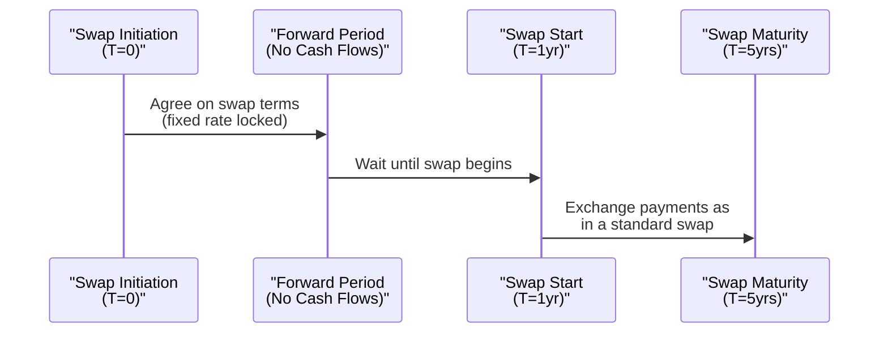
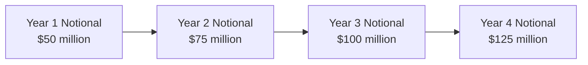

## Introduction

So, you know how sometimes you just wish you could lock in a great interest rate before you even need it, or maybe you need a swap structure that grows along with your financing needs? That’s exactly where forward start swaps and accreting swaps come in. These are specialized swap contracts that let you take advantage of future swaps markets (forward start) or tackle the challenge of an increasing notional (accreting). They are a bit more customized than your standard plain-vanilla interest rate swap, but they can be surprisingly intuitive once you understand the mechanics.

In this section, we’ll first explore forward start swaps—sometimes called deferred start swaps—and see why they’re often used to hedge future liabilities or assets on a balance sheet. Then, we’ll shift focus to accreting swaps, which help out when the notional amount of your underlying exposure steadily expands over time (for instance, in project finance). We’ll look at typical structures, real-world applications, pricing considerations, and some best practices to keep in mind. Given how specialized these swaps are, we’ll go fairly deep into some of their unique risks—hang on for the ride!

## Forward Start Swaps

### Defining a Forward Start Swap

A forward start swap is essentially a swap that is negotiated and priced today but starts at a specified future date. Also known as a deferred start swap, it allows parties to lock in a swap rate in anticipation of a future requirement. This is super handy if your organization expects to issue debt next year and you’re worried that interest rates could rise before you lock in your financing.

In a typical forward start interest rate swap:
- You agree on a notional principal, fixed rate, and floating rate index (e.g., a risk-free reference rate such as SOFR or EURIBOR).
- The swap’s official start date might be, say, one year from now (the forward period).
- From the start date until the maturity date, the swap functions like any standard interest rate swap. You would pay or receive fixed, and the other side would pay or receive floating.

If interest rates move in an unfavorable direction between now and your future start date, you’re essentially protected or “locked in.” Sure, you won’t benefit if rates move in a favorable direction, but at least you’ve removed the uncertainty. And for corporate treasurers, that kind of certainty can be priceless—especially if you’re planning a big funding operation.

### How They Are Used

I remember chatting with a friend at a local corporate treasury department: they had a hefty bond issuance slated for 18 months in the future. They wanted to hedge interest rate risk now, but they only needed the actual swap coverage after the issuance date (not right away). A forward start swap was the perfect fit. Here’s where it’s particularly beneficial:

• Hedging future debt issuance (e.g., a corporate bond).
• Locking in refinancing rates for a future period on existing debt.  
• Setting up a future swap position without tying up capital immediately.

One caution: if the market moves significantly in your favor (say rates plummet, so your future fixed swap rate is now “high”), you might experience an unrealized loss on the forward start swap. But that’s the tradeoff for effectively removing the risk of higher future rates.

### Diagram: Forward Start Swap Timeline

Below is a simple Mermaid diagram illustrating the timeline of a forward start swap:

## Accreting Swaps

### Defining an Accreting Swap

An accreting swap is an interest rate swap whose notional principal increases—or “accretes”—incrementally over the life of the contract. This structure is extremely common in scenarios where:
- The borrower’s debt obligations ramp up gradually (e.g., project finance).
- An investment manager expects their assets under management (AUM) to grow over time and wants to hedge a larger portion of interest rate risk as funds accumulate.
- A construction or capital-intensive project has scheduled capital expenditures that expand total financing requirements over multiple stages.

In a standard interest rate swap, the notional principal is typically fixed. But in an accreting swap, the notional might grow in steps according to a predefined schedule. One could see a schedule like:
• Notional: $50 million in year one  
• Notional: $75 million in year two  
• Notional: $100 million in year three  
And so on, until the swap matures or levels off.

Because the notional changes, the amounts of each interest payment change accordingly. The result is a swap that better matches the underlying liabilities or assets over time—valuable for a CFO who wants a direct hedge that lines up with real-world financing.

### Real-World Use Case

Imagine you’re the CFO of a large renewable energy project that requires funding in stages—phase one to build the initial infrastructure, phase two to expand capacity, and phase three to finalize distribution networks. Maybe you only need $30 million in the first year, $60 million in the second, and $90 million by the third. An accreting swap would let you hedge the interest rate costs on these cumulative borrowings without locking in an unnecessarily large notional from day one.

I once worked with a project finance team who discovered that a plain-vanilla swap left them paying for interest rate coverage on notional amounts they hadn’t even borrowed yet. They effectively had too much hedge in the early years, creating negative carry. Upon shifting to an accreting swap, their hedge ratio aligned almost perfectly with their actual outstanding amounts, resulting in a more efficient CFO-friendly solution.

### Diagram: Accreting Notional Structure

Here’s a quick depiction of how the notional evolves:

## Pricing and Valuation Considerations

Forward start and accreting swaps both share an extra layer of complexity relative to plain-vanilla swaps—mainly because of the future start date (in the case of forward starts) or the changing notional (in the case of accreting swaps).

### Forward Start Swaps: Using the Forward Curve

Pricing a forward start swap involves:
1. Determining the appropriate zero-coupon rates or discount factors for each relevant future date.  
2. Using these discount factors (or forward rates) to project the floating leg cash flows and discount them back to the present.  
3. Estimating the fixed rate that will make the present value of the fixed leg match the present value of the floating leg—similar to how you’d price a plain-vanilla swap, but starting at a future date.

Because you’re negotiating the swap today, you rely on the forward rates implied by today’s yield curve. In formula form (at a high level):

If \\( S \\) is the forward start swap fixed rate, then


\text{PV of Fixed Leg starting at T} = \text{PV of Floating Leg starting at T}


where “starting at T” means you only consider cash flows from T onward, and all discount factors follow from today’s yield curve. The timeline shift complicates discounting slightly, but the mechanics remain consistent with standard swap valuation.

### Accreting Swaps: Incorporating the Notional Schedule

For an accreting swap, you can think of it as a portfolio of mini-swaps, each with its own notional piece that “switches on” at specific times. For example, if your notional steps up by $25 million increments at the end of each year, you might conceptualize that as:
- A $25 million swap starting at year one  
- Another $25 million swap starting at year two  
- Another $25 million swap starting at year three  
…and so forth.

In practice, you combine these pieces into a single contract with a single net settlement. But for pricing, you can sum the present value of each incremental notional piece—each piece being priced similarly to a standard or forward start swap, depending on when the piece becomes active. The fixed rate for an accreting swap is set such that the total present value of the fixed leg equals that of the floating leg, taking into account the changing notional amounts over time.

One cautionary note: forecasting the floating leg on an accreting swap can involve dynamic notional schedules. If the notional growth depends on certain triggers or the completion of particular project stages, you might have to estimate the timing of growth carefully. That leads to potential mismatch if the schedule changes in reality (e.g., construction delays). Your actual hedge might shift out of alignment with your exposures.

## Hedging Applications and Strategies

### Forward Start Swap Strategies

• Future Bond Issuance Hedge: If you’re a municipality planning a bond issuance in 9 months, you can use a forward start swap to set the fixed rate now. Then, when the bond is issued, the swap effectively locks in your cost of funds.  
• Forward Liability Hedges: Pension funds might use forward starts to hedge interest rate risk associated with future liability streams.  

### Accreting Swap Strategies

• Project Finance Growth: As mentioned, if your project financing needs are ramping up, an accreting swap matches your scheduled drawdowns.  
• Managing Expanding AUM: Asset managers who anticipate incremental inflows can use an accreting swap to maintain a certain level of hedging relative to the total (and growing) assets.  
• Corporate Expansion Plans: Businesses that plan to scale operations over time and expect to take on incremental debt can ensure that the hedge coverage grows in tandem with borrowings.

## Potential Pitfalls and Risk Management

Both forward start and accreting swaps pose extra risk management challenges:

1. **Market Risk**: A forward start swap is vulnerable to changes in the forward yield curve. If your rationale for locking in a rate turns out to be wrong, you’re still obligated to the terms come the future start date.  
2. **Model Risk**: Accreting swaps depend heavily on accurate predictions of how quickly your notional needs will ramp up. If your project timeline changes, you could face mismatched hedges.  
3. **Liquidity Risk**: These structures are less standardized than plain-vanilla swaps, leading to potentially wider bid-ask spreads or less liquidity if you need to unwind.  
4. **Credit and Counterparty Risk**: Extending the swap’s effective horizon with forward start periods can increase credit exposures. With accreting swaps, your credit exposure escalates as the notional grows.  

Anyway, it’s wise to remember that proper documentation, robust forecasting, and ongoing adjustments are crucial. One strategy might be to incorporate break clauses or conditions that allow for partial unwinds or amendments if project schedules shift.

## Example: Combining Forward Start and Accreting Features

Sometimes, a party might require a swap that both starts in the future and accretes over time. Maybe you plan to break ground on a large infrastructure project next year, and your total borrowing needs escalate from $50 million in year one to $200 million by year four. You want to lock in interest rates now, but the actual swap coverage doesn’t begin until you break ground in 12 months. In such a scenario, you can set up a forward start, accreting swap: effectively, the swap “turns on” next year and the notional grows in scheduled increments.

From a pricing standpoint, you would piece the contract together by layering forward start mini-swaps for each increment in notional. While complicated, the structure can be a perfect fit for a carefully planned multi-year project.

## Best Practices

1. **Accurate Cash Flow Forecasting**: If your cash flow or liability schedule changes, you might be left with a mismatch. Keep your projections up-to-date and reevaluate the swap’s coverage.  
2. **Documentation and Collateral**: Because these are tailored swaps with longer or evolving exposures, ensure robust collateral agreements (e.g., variation margin) to manage credit risk.  
3. **Contingency Planning**: Consider how you’d exit or modify the swap if the underlying transaction (like a bond issuance) is canceled or postponed.  
4. **Regulatory Compliance**: Remember to check local rules regarding derivatives usage and reporting. In some jurisdictions, forward starts or notional schedules carrying uncertain increments might have specific documentation requirements.

## Further Reading

• Choudhry, Moorad. “The Bond & Money Markets: Strategy, Trading, Analysis.” This one has a deep dive into advanced swap structures you might find helpful.  
• Thomson Reuters Eikon User Guides: Tools and analytics to price forward start or accreting swaps in real time.  
• AFME (Association for Financial Markets in Europe): Visit their website for standardized swap term sheets and further insight into how capital markets handle such instruments.  

## Final Exam Tips

• Remember that a forward start swap’s value at initiation typically equals zero, just like a normal swap, but the timeline is “shifted out.”  
• For exam questions, carefully track the forward start period and the timeframe for discounting cash flows.  
• Understand how to break down an accreting swap into incremental notional “steps” for valuation.  
• Be ready to discuss reasons for using each structure: i.e., why a forward start vs. why an accreting.  
• Watch out for possible credit risk expansions as either the swap’s timeline extends or the notional grows.  

And hey, don’t stress if at first these seem complicated—everyone finds them a bit puzzling the first time around. But once you see how they tie to real-world financing needs, it all clicks into place.

---

## Test Your Knowledge: Forward Start and Accreting Swaps



### Which best defines a forward start swap?
- [ ] A swap with a decreasing notional principal over time  
- [x] A swap agreed upon today that starts at a specified future date  
- [ ] A type of swap that creates immediate net settlement  
- [ ] A swap used solely for currency hedging  

> **Explanation:** A forward start swap (or deferred start swap) is negotiated now but begins at a later date.

### Why might an institution use an accreting swap?
- [ ] To hedge FX exposures for a future currency transaction  
- [ ] To reduce credit risk in a declining interest rate environment  
- [x] To match increasing financing requirements with a growing notional  
- [ ] To lock in floating rates at today’s benchmark setting  

> **Explanation:** An accreting swap aligns with a project or loan whose outstanding notional increases over time, making hedging more precise.

### Which of the following is a primary risk associated with forward start swaps?
- [ ] High operational risk due to complex automation  
- [x] Market risk if interest rates move unexpectedly before the start date  
- [ ] Absolute elimination of credit risk  
- [ ] Instant settlement risk  

> **Explanation:** The key risk is that interest rates could move in an unfavorable direction during the time between now and the start date.

### In pricing an accreting swap, which of the following is most crucial?
- [ ] Assuming a flat yield curve to simplify calculations  
- [ ] Only considering the final notional principal  
- [x] Accurately specifying the notional schedule used to project cash flows  
- [ ] Valuing all incremental notional pieces at T=0 ignoring discounting  

> **Explanation:** You must know precisely how much the notional grows at each interval to project and discount the correct cash flows.

### How does a forward start swap compare to a typical plain-vanilla swap?
- [x] It locks in a future fixed rate but has no cash flow exchanges until the start date  
- [ ] Cash flows begin immediately but the notional ramps up over time  
- [ ] It involves real assets as collateral  
- [ ] It only trades on an exchange  

> **Explanation:** Forward start swaps act like standard swaps—just time-shifted to begin in the future.

### An accreting swap might be unsuitable if:
- [ ] A project has smoothly increasing funding  
- [x] Project funding needs are uncertain and prone to big schedule changes  
- [ ] The borrower needs an exact hedge for expansions  
- [ ] The floating rate environment is stable  

> **Explanation:** If the future notional requirement is uncertain, the swap may not match the actual debt exposure, creating hedging inefficiencies.

### What is a key difference in the reference curve used to price a forward start swap versus an immediate start swap?
- [x] Forward starts require the use of forward yield curves for valuation  
- [ ] Forward starts only use historical average rates for discounting  
- [ ] Immediate start swaps always use the 10-year Treasury yield  
- [ ] There is no difference  

> **Explanation:** Pricing a forward start requires analyzing future implied rates on the yield curve, not just the spot curve.

### Which best describes why forward start swaps could help hedge a future bond issuance?
- [x] They lock in the interest rate now, mitigating the risk of rising rates before issuance  
- [ ] They function as insurance against bond default  
- [ ] They convert fixed rates to floating immediately  
- [ ] They reduce the notional automatically if the issuance is smaller  

> **Explanation:** By starting the swap in the future to coincide with bond issuance, an issuer can lock in a fixed rate now.

### When layering an accreting swap into a hedge strategy, which factor is most critical for a CFO to monitor?
- [ ] The CFO’s personal credit score  
- [x] The target liability or asset schedule to ensure alignment of notional  
- [ ] The CFO’s year-end bonus calculations  
- [ ] Whether IFRS 9 demands daily posting of variation margin  

> **Explanation:** Proper alignment of the growing notional with the underlying liabilities or assets is crucial for an effective hedge.

### A forward start swap always begins at a future date. True or False?
- [x] True  
- [ ] False  

> **Explanation:** By definition, a forward start (or deferred start) swap is set up now but takes effect at a specified future date.


