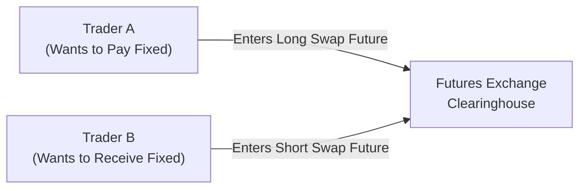

## Introduction

Sometimes when I think about derivatives, I recall a conversation with a colleague who used to handle interest rate swaps for a major asset manager. He once sighed, “You know, we basically spend a third of our time negotiating swap documentation and another third handling margin calls. We might as well move it all onto an exchange.” That casual observation, interestingly, gets to the heart of “futurization.” In essence, futurization is the process of converting the over-the-counter (OTC) swap world—where trades could be tailor-made but often came with hefty operational overhead—into the realm of standardized, exchange-traded futures. The idea is straightforward yet transformative: you package a swap’s payoffs so it can trade under the rules of a futures exchange, complete with standardized contracts and central clearing. This encourages transparency, reduces systemic risk, and sometimes even cuts margin costs for market participants.

Below, we’ll dig into the mechanics of swap futures, examine why regulators like them, explore how they handle final settlement, and survey the trade-offs between the convenience of standardized contracts and the inevitable basis risk that creeps in when a one-size-fits-all instrument tries to mimic bespoke OTC terms. We’ll keep it a bit conversational so you can follow each concept in a friendly, straightforward way. But stay tuned: we’re going to dive deep, because these newfangled “swap futures” are changing the global derivatives market in a big way.

## Key Drivers Behind Futurization

When you look back at the wave of reforms following the global financial crisis (like Dodd-Frank in the US, EMIR in the EU, and other regulatory frameworks worldwide), one common thread emerges: regulators wanted safer, more transparent markets. Traditional interest rate swaps (IRS), credit default swaps (CDS), and other OTC instruments historically involved bilateral agreements, leaving plenty of room for counterparty risk. Could central clearinghouses mitigate that risk? Absolutely. They step in between the two parties to a swap, collecting collateral (margin) and thus lowering the chance of a domino-like failure if one party defaults.

Futurization basically puts that entire clearing arrangement front-and-center on an exchange. That means participants deal with exchange-set margins, standardized debit/credit flows, and uniform margin calls. The impetus behind futurization, therefore, includes:

• Transparency. Exchanges publish price and volume data.  
• Counterparty Risk Mitigation. A central clearinghouse, subject to rigorous capital and operational requirements, manages default risks.  
• Operational Simplicity. Standardized contract terms, daily marking to market, margin efficiency, and minimal legal negotiation overhead.  
• Regulatory Compliance. Adoption of exchange-traded derivatives can help participants meet mandates that require central clearing whenever possible.

## What Swap Futures Are—and Are Not

Swap futures look, feel, and trade in many ways like standard futures on interest rates, equity indexes, or commodities. But the payoff structure is designed to replicate the net present value (NPV) profile of an interest rate swap or a CDS index swap. The contract usually references either a notional principal, a fixed rate, some underlying floating rate (e.g., SOFR, now that LIBOR is on its way out), and it might specify quarterly resets—just like a swap.

However, these instrument designs inevitably involve some standardization. For example:

• Notional Amount: Usually set in round figures, such as $100,000 or $1,000,000.  
• Maturity Dates: You might see standard maturities (e.g., a 2-year, 5-year, or 10-year maturity) with set quarterly cycles.  
• Coupon or Fixed Rate: Often specified by the exchange. Some are “Market Agreed Coupon” (MAC) swap futures with standardized coupon rates.  
• Day Count Conventions: Usually uniform across all participants (e.g., 30/360 or Actual/360).  

In many ways, that standardization is precisely the point: it allows the contracts to trade with high liquidity, with all participants using the same key parameters. But ironically, it means that if your enterprise or client demands more specialized terms—like a custom amortization schedule on a swap or an unusual day count convention—swap futures may only approximate that exposure. That mismatch is commonly called “basis risk.”

### Deliverable vs. Non-Deliverable Swap Futures

One interesting subset is “deliverable swap futures.” At maturity, the futures contract physically (or more precisely, contractually) converts into an actual OTC swap. This transformation can be quite direct. For instance, in certain interest rate deliverable swap futures listed on major exchanges, if you hold a long position and the contract expires, you take on the fixed-rate payer side (or receiver side) of a standard interest rate swap with the clearinghouse. In this sense, the futures contract “delivers” you an actual swap. Other structures, commonly known as “cash-settled” or “non-deliverable” swap futures, simply settle in cash based on the market value of a reference swap at expiry, effectively crystallizing a profit or loss.

## Regulatory Environment and Market Momentum

Regulators in the US, Europe, and elsewhere have consistently encouraged derivatives clearing on central counterparties (CCPs). Because futures are already designed for central clearing, swap futures exemplify regulators’ ideal scenario: a standardized contract easily cleared and transparent, thus removing the perceived shadows from the OTC market.

Many participants have hopped on board:

• Hedge Funds. They can replicate rates or credit exposures quickly with lower margin requirements than some bilateral swap arrangements.  
• Insurance Companies. With swap futures, they can achieve broad coverage of their interest rate exposures in a standardized format—often with easier capital treatment.  
• Corporations. Rather than forging custom bilateral swaps, some corporations pick standardized instruments if the underlying exposures align closely with their interest rate or credit risk management objectives.  
• Banks and Dealers. Large dealers, especially if they see less demand for certain customized swaps, may prefer the cost and capital efficiencies of a swap future.

At the same time, some market participants still prefer the flexibility of a tailor-made, bilateral swap. Hence, futurization is not about obliterating OTC markets; it’s about providing an extra, more standardized alternative.

## Margin Efficiency and Financial Implications

One key reason many traders love futures is the margin efficiency. In the OTC swap world (including cleared swaps at a CCP), margin can be significant, especially if your position is large or your credit rating is not top-tier. Exchanges typically set margin for futures based on standardized volatility and price risk metrics (with oversight from regulators). In some cases, the margin required for swap futures is lower than that for equivalent OTC swaps. This difference in margin requirements can stem from:

• Historical volatility calculations.  
• Liquidity differences in the underlying instrument.  
• Netting benefits in a portfolio that might also contain other futures contracts cleared by the same clearinghouse.  

When you reduce your margin usage, you free up capital that can be redeployed for other investments or trading activities. That capital efficiency can be a compelling driver behind the shift to swap futures—but also can add complexity when you are layering multiple instruments in your portfolio.

## Basis Risk: The Trade-Off in Standardization

Of course, as soon as you standardize something, you give up the ability to customize it. This mismatch between a single standardized contract and specific hedging needs is known as basis risk. Let’s say your firm is paying a floating rate tied to 1-month SOFR on a notional that declines over time due to principal payments. Meanwhile, the available deliverable swap future references 3-month SOFR, with a bullet notional that remains unchanged. Even if you’re nominally “hedged,” there’s a risk that the underlying rates or notional schedules won’t line up perfectly. If interest rate movements or actual cash flows deviate from the standardized contract’s assumptions, your hedge might leave you with gains or losses that differ from what you’d experience in a custom OTC swap.

This basis risk can be an acceptable trade-off if you’re primarily seeking to hedge large, fairly standard exposures or if you find the cost savings and operational ease of an exchange-traded contract offset those minor mismatches. But if you need super-specific terms—like an unusual start date, or something that features a seasonal notional pattern—swap futures alone might not do the trick. Some folks adopt a partial hedge with swap futures and then add smaller, customized swaps to fine-tune the exposure. Either way, evaluating basis risk is a crucial step in deciding whether to “futurize” your swap exposure.

## How Swap Futures Work in Practice

Below is a simple depiction of how “swap futures” could be structured (in a simplified, visual manner). We’ll imagine an interest rate swap future that references a fixed rate vs. a floating rate based on 3-month SOFR.

• Trader A takes a “long” position in the swap future, effectively representing the fixed-rate payer side of a standard swap.  
• Trader B takes the offsetting “short” position, representing the fixed-rate receiver side.  
• The clearinghouse sits in the middle, collecting margin from both parties.  

If it’s a deliverable swap future, the contract might roll into an actual interest rate swap at expiry. If it’s cash-settled, Trader A and Trader B will settle up the difference between the contract’s reference rate and the fixed rate at contract expiration.

### Example: MAC Swap Futures

MAC stands for “Market Agreed Coupon.” Here, the futures contract is designed to replicate an interest rate swap that has a coupon agreed by market participants (e.g., 2.5% or 3%). These coupons revolve around standard maturities, often aligned with quarterly resets. The payoff mirrors the net present value changes you’d see in a standard 5-year or 10-year fixed-for-floating swap. Over the life of the contract, daily settlement occurs—similar to any futures contract—based on changes in the underlying swap’s value. At expiration, the contract may either settle in cash or deliver into a cleared swap, depending on the specific exchange’s rules.

## Accounting and Regulatory Considerations

Right after the financial crisis, regulators realized that the murkiness of OTC derivatives was a big part of the meltdown’s confusion. Encouraging swap futures is a response to that concern, ensuring that trades happen in a more transparent, standardized environment. Accounting authorities, such as those behind IFRS or US GAAP, recognize that futures and swaps can be used for hedge accounting, but the specific classification (fair value hedge vs. cash flow hedge) and documentation may differ. Firms must pay close attention to hedge accounting rules, ensuring that the standardized contract meets the strict criteria for offsetting recognized exposures.

On the regulatory capital side, banks often find that holding exchange-traded instruments can result in lower capital charges than holding bilateral OTC swaps—especially if there’s no netting or if the internal credit rating of the counterparty isn’t pristine. That capital advantage, multiplied across large derivatives portfolios, can be substantial.

## Potential Pitfalls and Risk Management Tactics

No strategy is foolproof, and futurization has potential pitfalls:

• Liquidity Risk. Not all swap futures contracts are equally liquid. If a particular maturity doesn’t attract enough market participants, wide bid-ask spreads or difficulties entering/exiting a position can erode the benefits.  
• Margin Calls. Yes, futures have daily margin calls. Some institutions with choppy cash-flow patterns might find that incessant variation margin calls hamper operations.  
• Operational Complexity. Switching from OTC documentation to exchange-traded instruments streamlines some steps but can also introduce new workflows (e.g., new margin offsets, new technology systems for futures).  
• Product Nuances. For deliverable swap futures, final settlement might be more complicated if you actually end up “delivering” a swap (and you weren’t prepared for ongoing swap cash flows).

Risk managers often mitigate these issues by:

• Diversifying among multiple maturities or contract types.  
• Actively monitoring liquidity conditions before taking a large position.  
• Using specialized analytics to measure basis risk for each unique exposure.  
• Keeping enough short-term cash or liquid assets on hand to satisfy daily margin calls.  

## Real-World Adoption: A Quick Look

Let’s take a quick glance at how the major global exchanges have approached this:

• CME Group: Offers deliverable interest rate swap futures pegged to benchmark rates like SOFR. Final physical delivery turns into a cleared interest rate swap if you hold through expiration.  
• ICE: Has competing swap futures, including some focusing on LIBOR/ Euribor-based references, transitioning to risk-free rates as regulation evolves.  
• Eurex: In Europe, it has introduced swap futures referencing EUR rates, with the impetus of the EMIR framework.  

Firms that previously relied on custom swaps often do partial hedges with these exchange-traded instruments, adding or subtracting additional overlays using smaller, custom-form swaps. It’s not uncommon to see a large portfolio manager or corporate treasury use a combination approach: standardize as much as possible (for cost/performance reasons) and reserve specialized OTC trades for the leftover exposures that can’t be easily standardized.

## Case Study Example: A Corporate Treasurer’s Hedge

Imagine a corporate treasurer for a large utility company who typically enters into a 5-year plain vanilla interest rate swap to hedge floating-rate liabilities. The CFO notices that standard 5-year deliverable swap futures at an exchange offer roughly the same interest rate profile, with potentially lower margin requirements than the bespoke swap negotiated with a single bank dealer. They decide to use swap futures for the majority of the exposure. However, the utility has a slightly unique payment schedule—its notional declines after year 3. So, it enters a smaller custom swap at that 3-year mark to offset differences in notional schedules. Because the bulk of the position is now in standardized swap futures, the CFO enjoys improved liquidity and better margin efficiency. Meanwhile, that small custom swap is an add-on that tailors the final shape of the hedge. The trade-off is a bit of basis risk and additional administrative details. But in exchange, significant capital is freed up from margin accounts.

## Practical Tips for the CFA Exam

From a CFA’s perspective, expect questions asking you to compare the cost of carry between a swap future and an OTC swap, or about how basis risk arises in standardized instruments. It’s helpful to remember the following:

• Swap futures replicate the economics of a swap but trade on an exchange.  
• Lower margin requirements can sometimes be a major advantage, but it carries the daily settlement obligations.  
• Basis risk is the biggest “gotcha,” especially if the underlying exposure is not a perfect match.  
• Deliverable swap futures provide the possibility of turning into an actual swap at expiry, while cash-settled swap futures simply pay out a net amount.  
• Regulators encourage futurization to mitigate systemic risk, but it’s not an all-or-nothing replacement for custom swaps.

## References and Further Exploration

• CME Group (www.cmegroup.com) for details on Deliverable Swap Futures, MAC Swap Futures, and their margin guidelines.  
• ICE (www.theice.com) for competitor swap futures products and additional interest rate or CDS references.  
• International Swaps and Derivatives Association (ISDA, www.isda.org) for research on futurization, standardization, and how swap structures are evolving.  
• Regulatory frameworks such as Dodd-Frank, EMIR, etc., for understanding mandatory clearing and capital requirements.  
• Official CFA curriculum readings on derivatives clearing, settlement, and regulatory impacts.

---

## Test Your Knowledge: Futurization of Swaps and Swap Futures



### Which of the following best describes “futurization” in the context of swaps?

- [x] Converting OTC swaps into standardized, exchange-traded, and centrally cleared instruments.
- [ ] Eliminating all regulatory oversight of swap transactions.
- [ ] Replacing all interest rate derivatives with equity derivatives.
- [ ] Delisting all deliverable swaps from exchanges.

> **Explanation:** Futurization entails transforming the traditional bilateral (OTC) swap structure into exchange-listed futures, making them standardized and centrally cleared.

### Which of the following is a primary benefit of swap futures over standard OTC swaps?

- [x] Lower margin requirements in some cases.
- [ ] Unlimited customization of terms and notional.
- [ ] Exemption from central clearing mandates.
- [ ] Elimination of basis risk entirely.

> **Explanation:** Swap futures can sometimes offer lower margin requirements due to standardized initial margin rules and exchange clearing. However, customization is limited, and basis risk still exists.

### What is a deliverable swap future?

- [x] A swap future that converts into an OTC swap at expiry if the position is maintained.
- [ ] A forward contract that only references equity indexes.
- [ ] A swap with physical delivery of commodities like crude oil.
- [ ] A CDS index future with mandatory default settlement.

> **Explanation:** In a deliverable swap future, the futures contract physically or contractually “delivers” into a standard interest rate swap at maturity.

### One major risk in using standardized swap futures instead of customized OTC swaps is:

- [x] Basis risk due to differences in contract terms and the hedged exposure.
- [ ] Coverage under fewer regulatory guidelines.
- [ ] The inability to close the position early.
- [ ] The requirement to post no initial margin.

> **Explanation:** Because swap futures have standardized maturities, coupons, and other terms, a firm’s actual exposure might not align perfectly, leading to basis risk.

### From a regulatory standpoint, why do authorities encourage the use of swap futures?

- [x] They enhance transparency and reduce systemic risk through central clearing.
- [ ] They allow complete anonymity with no central counterparty.
- [ ] They eliminate the need to post variation margin.
- [ ] They completely abolish basis risk for end users.

> **Explanation:** Regulators push central clearing because it reduces counterparty and systemic risk, and futures exchanges inherently provide more transparency in pricing and trade reporting.

### MAC Swap Futures (Market Agreed Coupon) typically:

- [x] Feature a standardized coupon rate agreed among market participants.
- [ ] Allow custom day count conventions for each trade.
- [ ] Provide tailor-made notional schedules.
- [ ] Settle physically in gold bullion.

> **Explanation:** MAC Swap Futures have a fixed, standardized coupon agreed upon by the market, although many other terms remain standardized as well (maturity, day count, etc.).

### Which entity typically manages counterparty default risk in a swap futures contract?

- [x] A central clearinghouse associated with the futures exchange.
- [ ] Each individual dealer providing bilateral guarantees.
- [ ] A syndicate of global investment banks with no regulatory oversight.
- [ ] No one; default risk is unmitigated.

> **Explanation:** The central clearinghouse safeguards the market by requiring margin and guaranteeing performance, thus mitigating counterparty default risk.

### An advantage of swap futures in a large, diversified portfolio is:

- [x] Potential cross-margin offsets with other futures positions cleared at the same exchange.
- [ ] The guarantee of no margin calls under any market conditions.
- [ ] Immunity from price fluctuations because of standardization.
- [ ] Ability to match any unique corporate hedging requirement precisely.

> **Explanation:** Because positions are centrally cleared, futures exchanges often allow margin offsets if the trader holds offsetting positions in other futures, boosting capital efficiency.

### Which statement accurately contrasts cash-settled swap futures from deliverable swap futures?

- [x] Cash-settled futures pay the net difference on expiration, whereas deliverable swap futures convert into an actual swap.
- [ ] Cash-settled futures can only be traded by banks, whereas deliverable futures can be traded by hedge funds.
- [ ] Cash-settled futures never use a clearinghouse to manage margin requirements.
- [ ] Deliverable swap futures do not have standardized notional amounts.

> **Explanation:** Cash-settled swap futures close out in cash, while deliverable contracts transform into an actual swap at maturity if the holder keeps them until expiration.

### Swap futures replicate the economic exposure of an interest rate or credit default swap. True or False?

- [x] True
- [ ] False

> **Explanation:** While not always an exact mirror of every nuanced contract term, swap futures are designed to replicate the broad economic performance of the underlying swap, adjusting for standardization.


