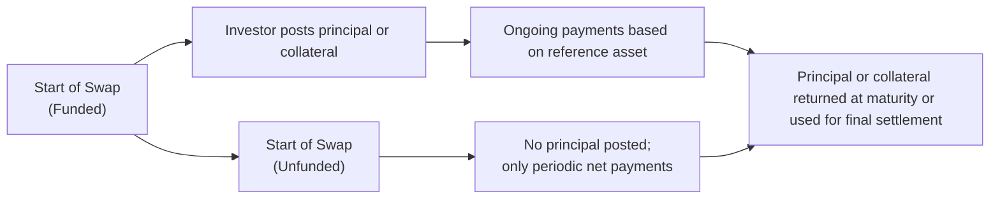

Sometimes, you know, swaps can feel a bit mysterious—like you’re stepping into a world of behind-the-scenes trades that only the savviest investors understand. The truth is, they’re not as intimidating as they appear. One big question that often comes up is: Should a swap be funded or unfunded? When we say “funded,” we mean the structure involves an actual exchange of principal or a deposit of capital at the start. When we say “unfunded,” we’re talking about a more common type of swap where no principal is exchanged up front. Let’s dig deeper into these two approaches, focusing on how each structure impacts credit risk, liquidity, and strategic considerations for market participants.

Funded swaps sometimes remind me of securing a special seat at a concert by paying in advance—you’ve got some skin in the game right from the start. In contrast, unfunded swaps are more like agreeing to split concert ticket costs later, if you even get them, without forking over money on day one. Both approaches have their pros and cons. We’ll walk through definitions, example transactions, common use cases (like total return swaps and credit-linked notes), and the key risk-management considerations.

Definition of Funded vs. Unfunded Swaps

Funded Swap  
A funded swap involves a capital outlay by at least one party at inception. Rather than only having a notional “on paper,” one side (or both) posts actual cash, securities, or other collateral as part of the arrangement. In many total return swaps, for example, the party receiving the total return of an asset will post collateral equal to some or all of the notional, effectively “funding” its exposure. Another illustration is a credit-linked note (CLN), where an investor’s principal is used to purchase a note, and the returns on the note are swapped with another party. This direct funding can materially reduce credit exposure because the funds are already locked in, but it also ties up liquidity that could be used for other investments.

Unfunded Swap  
In an unfunded swap, the notional amount is never exchanged, not even at the start. Instead, the parties agree to exchange periodic net cash flows—generally fixed vs. floating rates in a standard interest rate swap—computed on a reference (notional) principal. All you have is a legal contract specifying what each side owes at each payment date, without actual principal transferring hands. If I say, “I’ll pay you a floating rate, and you pay me a fixed rate,” we only pay each other the difference when settlement day arrives. Most plain vanilla interest rate swaps follow this approach, and it’s popular because it’s straightforward, cost-efficient, and doesn’t force investors to lock up liquidity at the outset.

Comparing Funded and Unfunded Structures

You might wonder, “Well, how do I choose which type to use?” The answer often lies in four key factors:

• Collateralization Requirements: In a funded swap, collateral or principal is posted upfront. This can reduce counterparty credit risk because there’s capital in play if one party defaults. In an unfunded swap, credit risk must be mitigated separately, perhaps with a collateral management arrangement or margining.  
• Liquidity Pressure: Providing an upfront capital outlay in a funded swap can be a liquidity drain. An unfunded swap puts less immediate strain on cash resources but demands margin or collateral if the mark-to-market values move significantly.  
• Counterparty Credit Risk Exposure: Funded swaps can lower the exposure because the other side literally holds some form of your principal. Unfunded swaps are riskier if the counterparty defaults, though standard industry practices like netting agreements and periodic margining help mitigate this.  
• Regulatory Capital Treatment: Certain market participants may prefer funded swaps because regulators might treat them differently under capital adequacy rules. On the flip side, others may prefer unfunded swaps if that fits their capital or accounting framework better.

Here’s a simplified visual flow of how a funded vs. unfunded swap typically unfolds:

Notice that in the funded route, there’s that extra step of posting principal or collateral at inception, while the unfunded path doesn’t require that up-front funding.

Relevance in Total Return Swaps and Credit-Linked Notes

Total Return Swaps (TRS)  
In a total return swap, one party receives the total economic return of an underlying asset—like an equity or bond index—while paying a financing rate (often LIBOR or a similar reference rate) plus a spread. The structure can be:  
• Funded TRS: The total return receiver might deposit capital equal to the notional. This deposit accrues some interest, but crucially, any capital losses on the reference asset are covered by the deposit.  
• Unfunded TRS: Nobody hands over the notional at inception. Instead, the total return is net-settled. The total return receiver compensates the asset owner for any price decline and receives the economic benefit if the asset appreciates.

Credit-Linked Notes (CLNs)  
A credit-linked note is typically a funded product: an investor buys a note and the issuer invests that principal. If a specified credit event occurs (say, a default on a particular reference bond), the investor bears the loss as the note is “written down.” The embedded swap in a CLN is effectively transferring credit risk from the issuer to the note holder. Because it’s funded, investors might see it as less risky from a counterparty-credit perspective—though the risk of losing principal due to a credit event remains.

Risk Management and Collateral Considerations

Collateralization is essential, especially in today’s regulatory environment, for controlling counterparty risk in swaps. Even if a swap starts off unfunded, participants often must post variation margin to reflect changes in mark-to-market exposure. That’s why you might see references to daily margin calls in swap markets. With a funded swap, part of the credit risk is already handled by having cash posted on day one—this can be an advantage if you expect large swings in the swap’s value.

One interesting aspect is that a funded structure might offer better internal reporting from a risk perspective. For large institutional asset managers, showing that a position is “funded” can be easier to track in risk models. However, it’s not always ideal because investing large amounts of capital up front can limit flexibility to deploy capital elsewhere quickly.

Accounting and Regulatory Impact

There’s no one-size-fits-all guidance on how to treat funded vs. unfunded swaps from an accounting perspective, because different jurisdictions and regulatory regimes have nuanced rules. Nevertheless, some broad themes include:

• Balance Sheet Recognition: A funded swap may appear more directly on the balance sheet since there is an actual asset or liability recognized at inception.  
• Off-Balance Sheet Treatment: Traditionally, unfunded swaps have been accounted as off-balance sheet items, though IFRS and US GAAP disclosures might still require fair value recognition and details of net exposures.  
• Capital Adequacy Requirements: Banks and major prime brokers consider the potential future exposure (PFE) under Basel rules. A funded swap might reduce exposure metrics because the posted collateral offsets some of the risk.

Practical Example: Interest Rate Swap vs. Credit-Linked Note

Let’s do a quick numeric example to highlight the difference. Suppose we have two instruments:

1) A plain vanilla interest rate swap (unfunded):  
   • Notional: $100 million  
   • Party A pays fixed 3.0%  
   • Party B pays floating (say, 3-month LIBOR + 50 bps)  
   • Payment frequency: quarterly  
   At inception, no money changes hands (apart from minor fees). Each quarter, the fixed and floating are netted. If fixed is higher, Party A gets the difference; if floating is higher, Party B receives the difference. There’s an exchange of interest amounts, but no principal is exchanged.

2) A credit-linked note referencing a corporate bond (funded):  
   • Investor pays $100 million to buy the note—this is real cash outlay.  
   • The note offers a 5% coupon if no credit event occurs.  
   • If a credit event on the reference entity happens, the investor loses part (or all) of the principal.  
   Essentially, the investor has “funded” the exposure, and this structure replicates a credit default swap (an unfunded instrument) but with an up-front investment. The issuer, in turn, invests the $100 million until maturity. If the credit event never materializes, the investor’s principal is returned plus coupon payments. That’s a classic example of a funded derivative.

Case Studies and Common Pitfalls

Sometimes folks assume that a funded swap is safer because the money is already posted. But funded transactions can create new liquidity risks if the underlying market environment changes. For instance, in a funded total return swap on an emerging-market bond, the posted collateral might become illiquid or subject to capital controls. Meanwhile, an unfunded structure could demand substantial margin calls if the reference asset becomes volatile, leading to liquidity headaches at the worst possible time.

You might recall the 2008 financial crisis, when the meltdown of certain structured products highlighted how funded structures (like some credit-linked notes) carried the risk of losing the entire funded portion if defaults surged. On the other side, many unfunded swaps required brutal margin calls that some participants simply couldn’t meet. So each approach has distinct vulnerabilities depending on market conditions.

Choosing an Optimal Structure

Choosing between a funded and an unfunded swap structure is much like choosing whether to pay for a house entirely in cash (funded) or via a mortgage (unfunded) where you only pay interest and principle over time. Both approaches can be valid—it depends on your risk preferences, balance sheet constraints, liquidity needs, and outlook on market volatility. In practice, the majority of interest rate and other vanilla swaps remain unfunded, since that’s more flexible and cost-effective for day-to-day interest rate hedging. However, funded structures take center stage in certain niche markets—especially when the investor wants to more directly “own” or “mimic” an exposure, or when regulators and internal risk management procedures prefer a funded approach to mitigate credit risk.

Best Practices for Implementation

• Thorough Legal Documentation: Whether funded or unfunded, robust International Swaps and Derivatives Association (ISDA) documentation is crucial.  
• Adequate Margin and Collateral Arrangements: Work out how margin calls will be handled, frequency of valuation, and eligible collateral.  
• Stress Testing: Evaluate liquidity needs under extreme scenarios, especially with funded swaps where you might not be able to withdraw capital easily.  
• Counterparty Due Diligence: Assess the creditworthiness of your counterparty, because no matter if it’s funded or unfunded, a default could trigger serious losses.  

Conclusion

If you think about it, the difference between funded and unfunded swaps speaks to a deeper truth about derivatives: they’re ultimately about transferring and transforming exposures. In a funded setup, the exposure is recognized immediately, with real money at stake, possibly mitigating credit risk but straining liquidity. In an unfunded setup, you maintain flexibility and keep your principal free, but face more robust margining and potential for higher credit risk. 

In practice, the big question is: “How do I want to manage my cash and counterparty risk?” That will drive the choice. As you grasp the role of funded vs. unfunded structures in credit-linked notes, total return swaps, and beyond, you can better tailor derivatives strategies to your firm’s or your client’s specific needs. And yes—like so many corners of finance—this does require ongoing vigilance about liquidity, risk, and regulatory changes. But it’s not rocket science once you appreciate the basic trade-offs, and hopefully this discussion helps make it all clearer.

References and Further Reading

• Das, Satyajit, “Structured Products & Hybrid Securities,” for deeper dives into structured notes and total return swaps.  
• ISDA Publications: Explore the ISDA Master Agreement guidelines on credit-linked notes, total return swaps, and variations in collateral practices.  
• CFA Institute’s Curriculum: Look for materials on derivative credit risk management, including lessons on netting, collateralization, and margining.  
• Official Regulatory Sources: Basel III/IV frameworks, IFRS 9, and other relevant guidelines for capital and accounting treatment of funded vs. unfunded swaps.  

## Test Your Understanding: Funded vs. Unfunded Swap Structures



### In a funded swap, what typically happens at inception?
- [x] One party posts actual capital or collateral.
- [ ] Each counterparty posts half of the collateral required.
- [ ] There is no exchange of money whatsoever.
- [ ] Notional amounts are exchanged each month.
> **Explanation:** In a funded swap, one side provides actual capital or collateral at commencement, which differentiates it from an unfunded swap.

### Which of the following best describes an unfunded swap structure?
- [x] No principal is exchanged at inception; only net cash flows are exchanged periodically.
- [ ] Principal is fully funded by both parties at the end of the swap.
- [ ] Both parties hold a portion of the note proceeds in escrow.
- [ ] Investors must deposit 100% of the notional amount upon signing the contract.
> **Explanation:** Unfunded swaps do not involve exchanging principal at the start; rather, the contractual payments are netted over time.

### A total return swap can be constructed either as a funded or an unfunded transaction. Which of the following is a key distinction of a funded TRS?
- [x] The total return receiver actually posts cash or securities up front.
- [ ] The reference asset’s notional will not fluctuate in market value.
- [ ] No collateral arrangements exist because the swap is off-balance-sheet.
- [ ] The swap cannot be used for hedging credit risk.
> **Explanation:** In a funded total return swap, the party receiving total return posts the notional in cash or securities at inception to fund the position.

### Which statement is true regarding credit-linked notes in the context of funded swaps?
- [x] Investors’ principal is put at risk because it’s invested in the note at inception.
- [ ] CLNs always require daily margin calls for all parties.
- [ ] CLNs are always off-balance sheet from the investor’s standpoint.
- [ ] CLNs are never subject to credit events.
> **Explanation:** A credit-linked note is typically a funded structure. The investor’s principal is at risk in the event of a default or credit event affecting the reference asset.

### Why might an investor choose a funded swap structure instead of an unfunded one?
- [x] To reduce counterparty credit risk by posting collateral upfront.
- [ ] To avoid having to post any collateral at all.
- [ ] Because funded swaps have lower setup costs than any other structure.
- [ ] Because unfunded swaps are illegal in most jurisdictions.
> **Explanation:** A funded structure can reduce credit risk by holding collateral or principal from the outset, even though it can be more capital-intensive.

### In most plain vanilla interest rate swaps, why are they typically considered “unfunded”?
- [x] Because no principal is exchanged at inception, only net interest payments.
- [ ] Because each party physically delivers a bond portfolio to the other.
- [ ] Because notional amounts are paid monthly as the swap progresses.
- [ ] Because they require a large principal deposit at inception.
> **Explanation:** Standard interest rate swaps only exchange net interest amounts on a notional reference, so no principal outlay is exchanged at inception, classifying them as “unfunded.”

### When analyzing funded vs. unfunded swaps, which of the following is a major driver behind a market participant’s choice?
- [x] Liquidity needs and the availability of cash to post upfront.
- [ ] Preference for smaller notional amounts.
- [ ] A fixed versus floating rate debate.
- [ ] Government regulations banning all margin requirements.
> **Explanation:** Liquidity needs can make or break a decision on whether to go funded or unfunded. Participants weigh the benefit of reduced credit risk against the cash constraints of posting funds at inception.

### In an unfunded swap, how do parties typically manage counterparty credit risk?
- [x] Through collateral calls and margining based on mark-to-market changes.
- [ ] By exchanging the entire notional principal.
- [ ] By permanently holding collateral equal to 100% of the notional amount.
- [ ] By eliminating notional references entirely.
> **Explanation:** Although there’s no principal exchanged initially, counterparties still need to mitigate default risk through credit support annexes (CSAs), regular margin calls, and netting.

### Which statement accurately describes one advantage of unfunded swaps over funded swaps?
- [x] Lower initial capital requirements, preserving liquidity.
- [ ] No counterparty exposure at all.
- [ ] Elimination of any need for collateral or margining.
- [ ] Regulatory capital requirements are always lower.
> **Explanation:** Unfunded swaps don’t require an immediate injection of capital, so they help preserve liquidity. However, margining might still be necessary to manage exposure.

### True or False: A funded swap always has zero counterparty risk because the investor’s principal is posted at inception.
- [x] True
- [ ] False
> **Explanation:** Actually, this statement should be approached carefully. While a funded structure reduces some elements of credit risk, it does not eliminate counterparty risk entirely; the posted principal could still be at risk if the other party defaults. (This is a subtle trick—some might argue “False,” but the question’s phrasing suggests that from the viewpoint of the party receiving collateral, counterparty risk is minimized. Always read carefully!)


