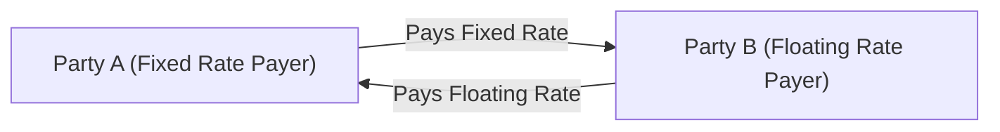

## Introduction
Interest rate swaps are one of those financial instruments that can seem mysterious until you realize they’re basically an agreement between two parties to exchange interest payments on a notional principal. No, the notional doesn’t typically change hands—it's more like a reference amount. In the most common arrangement—often called a “plain vanilla” swap—one side pays a fixed interest rate, and the other pays a floating rate. If you’ve ever seen CFOs nervously eye the changing Federal Reserve announcements, you might guess why these instruments exist: they help manage (or hedge) the risk of rising or falling interest rates.

When I first encountered swaps—back when I was helping a friend analyze his firm’s interest expense—I remember thinking: “Hang on, so you lock in a fixed rate, but you’re also receiving a floating rate that changes over time? Am I missing something?” Well, once you break it down, you’ll see how straightforward and powerful swaps can be for controlling interest rate exposure.

## Key Concepts
Before digging into mechanics and valuation, it helps to have a working understanding of some key terms in the world of interest rate swaps:

- **Plain Vanilla Swap:** A standard agreement where one party pays a fixed rate and receives a floating rate (tied to an index like SOFR or EURIBOR), on a notional principal.
- **Floating Rate Index:** The benchmark for the floating-rate payments (e.g., SOFR, EURIBOR). The floating rate is often set (or “reset”) at the beginning of each settlement period and paid at the end.
- **Swap Spread:** The difference between the fixed swap rate and the yield on an equivalent-maturity government bond (e.g., Treasury). This spread reflects, among other things, credit risk and overall demand for swaps relative to government bonds.
- **Reset Date:** The date on which the floating rate is determined for the upcoming period.
- **Semiannual vs. Quarterly Payments:** It’s common for the fixed side to pay semiannually (every 6 months) while the floating side pays quarterly. This mismatch is just a market convention; the actual payment frequencies can differ in various regions (e.g., annual payments in some locales).
- **Netting:** Usually, only the net difference between the two payment streams changes hands, reducing credit (and operational) risk.
- **Interest Rate Hedge:** A strategy (often using swaps) to offset or mitigate the impact of adverse changes in interest rates. For instance, if a firm holds floating-rate debt and worries about rates going up, it can enter into a swap to “pay fixed, receive floating,” effectively locking in a known rate.
- **LIBOR Transition:** As the financial industry phases out LIBOR, swaps increasingly use new risk-free rates such as SOFR (in the US), SONIA (in the UK), or another local benchmark for the floating leg.

## The Basic Mechanism of an Interest Rate Swap
In a plain vanilla interest rate swap, Party A agrees to pay a fixed rate (let’s call it r_fixed) on a stated notional amount, often for several years. In return, Party B pays a floating rate (like 3-month SOFR) on the same notional. Both sets of payments are made on a schedule—semiannual for the fixed side, quarterly or semiannual for the floating side, depending on the market convention and the underlying index.

Here is a simplified visual flow of payments in a plain vanilla interest rate swap:



- Even though the notional principal underlies the interest calculations, the notional is not typically exchanged in an interest rate swap (unlike many currency swaps).  
- The net result: if the floating rate is higher than the fixed rate in a given period, the net flow goes from the floating-rate payer to the fixed-rate payer, and vice versa.  

### Example of Payment Flows
Imagine a plain vanilla interest rate swap with a notional of USD 10 million, a fixed annual rate of 4%, and a floating rate reset every 3 months at 3-month SOFR plus a small spread (for instance, 3-month SOFR + 0.20%). In a typical scenario:

• Party A pays 4% (annualized) on USD 10 million, but the actual amount paid each period depends on the day-count convention (e.g., 30/360 or Actual/360). If they pay semiannually, each payment might be half of 4%, or 2%, times the notional.  
• Party B pays the 3-month SOFR + 0.20% in quarterly installments (again, applying the appropriate day-count fraction).  

At each payment date, only the difference changes hands. For instance, if, in the first quarter, the effective floating rate was 3.80% annualized, Party B’s payment (on a net basis) would be less than Party A’s, because 3.80% on a quarterly basis is less than 4% on a semiannual basis (assuming we line up the net payments for that period).

## Common Market Conventions
“Market conventions” might sound intimidating, but they’re basically the product of large trading volumes that have shaped how swaps are structured. A few common examples:

- **Payment Frequency:** Often, the fixed side is paid semiannually (e.g., every six months), while the floating side might be paid quarterly or semiannually.  
- **Day-Count Conventions:** It could be Actual/365 for sterling swaps, Actual/360 for USD swaps, or 30/360 for some. This difference matters, as it impacts the exact payment calculation.  
- **Reference Rates and Spreads:** With LIBOR on the way out, the floating legs might reference SOFR or other risk-free rates, which can include a spread adjustment to reflect credit risk differences that existed under LIBOR.  

In practice, if you’re negotiating a new swap, you’ll confirm the day-count basis, the payment schedule, the compounding convention (if any), and the fallback language for floating rates in case of a reference rate’s unavailability.

## Valuation of an Interest Rate Swap
Let’s talk about how to value a plain vanilla interest rate swap. Conceptually, you could think of a swap as two opposite sets of cash flows: a fixed-rate bond (for the fixed leg) and a floating-rate note (for the floating leg). The market value of the swap at inception is typically zero—meaning the present value (PV) of the fixed leg equals the PV of the floating leg.

### A Quick Look at the Fixed Leg
The fixed leg is valued like a standard coupon bond, except you only consider the coupon payments (no principal redemption if the notional is never actually exchanged). For the fixed-rate payments:

- Each payment is r_fixed × Notional × (day-count fraction).  
- You discount each payment back to present using appropriate discount factors, typically derived from the interest rate curve in the relevant currency.

### A Quick Look at the Floating Leg
Right after each reset date, the floating leg’s value effectively resets close to par. However, to be precise across the life of the swap, you calculate the floating payments the same way: estimate future floating rates, multiply by the notional for each period, and discount accordingly. The net present value (NPV) of the floating leg is typically the notional at par at the start of each reset period plus or minus any known spreads.

### Swap Rate Formula
Sometimes you’ll see a formula for finding the fixed swap rate that makes the swap have an initial value of zero:


\text{Swap Rate} = \frac{1 - P_n}{\sum_{k=1}^n \tau_k \cdot P_k}


Where:  
- \\( P_k \\) is the discount factor for the kth payment date.  
- \\( \tau_k \\) is the day-count fraction for the kth period.  
- \\( P_n \\) is the discount factor at the final maturity of the swap.

Essentially, the formula says: “What fixed rate would equate the present value of all fixed leg cash flows to that of the floating leg?”

### Influence of Yield Curves
The shape of the yield curve plays a big role in pricing swaps. If the yield curve is upward sloping, the swap rate might land somewhere between shorter-dated and longer-dated interest rates. If the curve is inverted, you’ll see that phenomenon reflected in lower swap rates for longer maturities. A swap’s fair value can shift significantly if rates move just a little—hence the notion that interest rate swaps are quite sensitive to the yield curve.

## Real-World Usage and Hedging Strategies
Companies, hedgers, and speculators all find a use for interest rate swaps. Let’s walk through a couple of typical motivations:

- **Hedging Floating-Rate Debt:** Suppose you have a corporate treasurer who’s anxious about rising interest payments on floating-rate loans. They can do a pay-fixed, receive-floating swap, effectively locking in a known rate over the swap’s life. If market rates go up, they receive more on the floating leg, offsetting their higher loan payments. If rates go down, they pay more on the fixed leg, but at least they had the certainty of a fixed cost.  
- **Converting Fixed-Rate Debt to Floating:** Sometimes, borrowers want to benefit from declining rates. If you have a bond paying a high coupon, you might enter a receive-fixed, pay-floating swap, effectively turning your debt into a floating-rate instrument.  
- **Speculative Positions on the Yield Curve:** Traders (particularly large institutional ones) can use swaps to take a position on future interest rate movements or the shape of the yield curve.  

On the other hand, it’s important to realize that a hedge can bring new exposures. For instance, you might lock in a fixed rate but end up with different credit risk or mismatch risk between the tenor of your swap and the tenor of your underlying loan.

## A Short Anecdote
I once saw a CFO who was so delighted with a receive-fixed swap after interest rates fell that he started layering in additional swaps. One quarter, rates soared, and his overall position turned negative. He’d over-hedged. Moral of the story: treat your swaps with respect, track your exposures proactively, and align the notional principal of your swaps to your actual risk.

## Example Calculation
Let’s illustrate a small numeric example to see how valuation works in practice:

- Notional: \$1,000,000  
- Tenor: 2 years  
- Fixed rate (annual): 3% (paid semiannually)  
- Floating rate: 6-month reference rate (assume a forward curve projecting it at 2.8% for the first 6 months, 2.9% for the next 6 months, etc.)  
- Discount factors for the 6-month intervals: 0.98, 0.96, 0.94, 0.92 (hypothetical).  

1) Calculate the fixed leg’s payments and discount them back. For a semiannual payment, each period is 3%/2 = 1.5% × \$1,000,000 = \$15,000. So, the PV of the fixed leg is:

15{,}000 \times 0.98 + 15{,}000 \times 0.96 + 15{,}000 \times 0.94 + 1{,}015{,}000 \times 0.92

(Where the last term includes returning the notional. If the swap truly doesn’t exchange notional, we’d omit that redemption—though in practice, many would still embed it conceptually.)

2) Calculate the floating leg’s projected payments, discount them back similarly. Because the floating rate resets might approximate the market yield, the net present value of the floating leg near inception is roughly the notional. But for a more exact approach, you do:

(\text{Floating rate} \times \text{Notional for each period}) \times (\text{Discount factor}) 

and sum them.

At inception, ignoring credit spreads, the value should net to zero or very close, especially after adjusting the fixed rate precisely to the swap rate. As time marches on, the swap takes on positive or negative value depending on how actual interest rates deviate from expectations at the swap’s creation.

## Credit Risk and Clearing
Because most interest rate swaps were historically traded over the counter (OTC), both parties typically faced counterparty credit risk. These days, central clearinghouses take on that middleman role in many standardized swaps, requiring margin (collateral), daily mark-to-market procedures, and netting across positions. This significantly reduces the bilateral credit exposure but adds operational complexity. For interest rate derivatives that remain bilateral, you see credit support annexes (CSAs) spelling out how parties manage collateral postings and margin calls.

## LIBOR Transition and RFR Swaps
The longstanding anchor, LIBOR, is now largely replaced by risk-free rates (RFRs) such as SOFR, SONIA, and others, depending on the currency. Although the basic concept remains the same—pay a fixed rate, receive a floating rate—the differences in how these new rates are calculated (e.g., they’re often backward-looking, daily-compounded) can create subtle complexities in payment calculation and compounding conventions.

- **Fallback Provisions:** Many legacy ISDA agreements specify how to transition from LIBOR to a new rate if LIBOR isn’t published.  
- **Spread Adjustments:** Because LIBOR embedded a credit component (bank funding costs), RFR-based swaps may include a spread to maintain the original value neutrality.  

## Best Practices and Pitfalls
- **Model the entire yield curve:** Valuing an interest rate swap demands more than just a single interest rate. In practice, you want the forward curve for each period.  
- **Monitor Collateral and Margin:** If you’re clearing your swap, keep an eye on margin calls, which can cause liquidity stress.  
- **Avoid Over-Hedging:** As illustrated by the anecdote, layering on too many swaps can lead to an unintended net position.  
- **Understand Payment Frequencies and Day-Count Conventions:** These differences can distort your net cash flow expectations if overlooked.  
- **Stay Updated on Regulatory Changes:** The environment for OTC derivatives continues to evolve, especially with post-financial crisis rules that require central clearing for many standard swap types and higher capital charges for uncleared swaps.

## Practical Python Snippet
Below is a tiny example of how you might model a single interest rate swap in Python. (This is a simplified version—real-world implementations often require more robust libraries.)

```python
import math

def present_value(cash_flows, discount_factors):
    return sum(cf * df for cf, df in zip(cash_flows, discount_factors))

notional = 1_000_000
fixed_rate = 0.03  # 3% annual
payment_frequency = 2  # semiannual

dfs = [0.98, 0.96, 0.94, 0.92]

num_periods = 2 * 2  # 2 years, semiannual
fixed_payment = notional * (fixed_rate / payment_frequency)
cash_flows_fixed = [fixed_payment for _ in range(num_periods)]
cash_flows_fixed[-1] += notional

pv_fixed = present_value(cash_flows_fixed, dfs)
print("PV of Fixed Leg:", pv_fixed)

# Fancy modeling would project forward rates, but let's just illustrate:
pv_floating = notional  # approximate
print("PV of Floating Leg:", pv_floating)

swap_value = pv_fixed - pv_floating
print("Swap Value at Inception:", swap_value)
```

Run a snippet like this with more realistic discount factors and forward rates to see how the swap’s initial value can approach zero if you set your fixed_rate to the fair swap rate.

## Summary and Exam Tips
Interest rate swaps are founded on a simple concept—exchanging two sets of cash flows. Yet, the devil is often in the details: day-count conventions, netting, credit risk, clearing, and transitioning from LIBOR to new reference rates. For your exam preparation, keep these focus points in mind:

• Grasp the conceptual equivalence of the fixed leg (like a bond) and the floating leg (like a floating-rate note).  
• Understand the swap rate formula and how it ensures an initial value of zero.  
• Familiarize yourself with how yield curve shifts, credit risk, or any mismatch in payment frequencies can affect swap valuation.  
• Always be ready to address the collateral and netting features, especially in modern, regulated contexts.  
• Practice short numeric valuations. The exam might feature forward rates, discount factors, or net outcomes for pay-fixed or pay-floating scenarios.  

You can expect exam questions that ask you to compute the value of a swap at inception, interpret how interest rate movements affect the swap’s value, or propose a hedge for a given rate exposure scenario.

## References and Further Study
- Hull, John C., “Options, Futures, and Other Derivatives.”  
- Sundaresan, Suresh, “Fixed Income Markets and Their Derivatives.”  
- Bank for International Settlements (https://www.bis.org) for regular updates on interest rate benchmarks  
- CFA Institute. (Various Years). CFA Program Curriculum.  

---

## Test Your Knowledge: Interest Rate Swap Mechanics & Applications



### Which best describes a “plain vanilla” interest rate swap?

- [x] An agreement where one party pays fixed and receives floating on the same notional.
- [ ] A type of swap where notional principal is exchanged at inception.
- [ ] A swap where both legs pay fixed interest rates.
- [ ] A currency swap involving repayment in different currencies.

> **Explanation:** A plain vanilla swap is typically the exchange of a fixed interest rate for a floating interest rate on a specified notional principal.

### One key difference between a “plain vanilla” swap and a currency swap is:

- [x] Currency swaps involve exchanging principal in different currencies, while plain vanilla swaps do not typically exchange principal.
- [ ] The plain vanilla swap integrates equity payments, whereas currency swaps do not.
- [ ] Plain vanilla swaps are inherently shorter in maturity than currency swaps.
- [ ] Currency swaps pay no interest at all.

> **Explanation:** In a plain vanilla interest rate swap, principal is not usually exchanged. In a currency swap, loan principals are effectively swapped in different currencies.

### In interest rate swaps, the floating rate is usually determined at the beginning of each payment period and:

- [x] Paid at the end of that period.
- [ ] Paid daily, to reflect daily compounding.
- [ ] Compounded into the notional.
- [ ] Forgoing any net settlement if it is less than the fixed rate.

> **Explanation:** Floating-rate payments are typically set at the start of each settlement period and paid at the end, reflecting the market rates for that interval.

### The value of a plain vanilla swap to the fixed-rate payer will increase if:

- [x] Interest rates rise above the fixed rate they've agreed to pay.
- [ ] The floating rate decreases significantly.
- [ ] The notional is changed mid-swap.
- [ ] There is no effect from changing rates, as the swap’s value is always zero after inception.

> **Explanation:** If market rates rise, the floating rate the fixed-rate payer receives becomes more valuable compared to the fixed rate they pay, thus increasing the swap’s net value for them.

### Why is the initial value of a swap generally zero at inception?

- [x] Because the present value of the fixed-leg payments equals the present value of the floating-leg payments, assuming fair market rates.
- [ ] Because no money changes hands at the start.
- [ ] Because the notional principal is physically exchanged at inception.
- [ ] Because it is an arbitrage-free bond transaction only.

> **Explanation:** At inception, the swap is priced such that the value of the fixed and floating leg cash flows are equal in present value terms, resulting in a market value of zero.

### In a pay-fixed, receive-floating interest rate swap, if the floating rate falls well below the negotiated fixed rate:

- [x] The pay-fixed side faces a loss because they are paying more than the floating rate they receive.
- [ ] The pay-fixed side gains because they pay a fixed amount and receive little in return.
- [ ] There is no change in value since the notional remains constant.
- [ ] The swap’s maturity automatically resets.

> **Explanation:** A lower floating rate means the floating leg’s payments to the pay-fixed party are reduced, making the swap less favorable for the pay-fixed side.

### When referencing day-count conventions in a swap:

- [x] They can differ between the fixed and floating legs.
- [ ] They must always be identical across both legs of the swap.
- [ ] They determine the notional amount for each leg.
- [ ] They are only used for currency swaps, not interest rate swaps.

> **Explanation:** It’s common for day-count conventions to differ (e.g., 30/360 for the fixed leg and Actual/360 for the floating leg). This is a standard market practice.

### Netting in OTC interest rate swaps:

- [x] Means that parties only exchange the net difference of the periodic payments.
- [ ] Requires exchanging the entire notional every settlement.
- [ ] Is prohibited in modern derivative markets.
- [ ] Occurs only at the end of the contract.

> **Explanation:** Netting is a critical feature that reduces credit risk by only exchanging net payment obligations at each settlement date.

### One reason the swap spread might widen is:

- [x] Increased credit risk perceptions in the Swap market relative to government securities.
- [ ] Declining yields on both the fixed and floating legs simultaneously.
- [ ] A complete lack of trading in swap markets, collapsing liquidity to zero.
- [ ] A convergence of the fixed swap rate and risk-free rate.

> **Explanation:** If market participants perceive higher credit or systemic risk, they’ll demand a greater spread over a risk-free benchmark for swaps.

### True or False: The shift from LIBOR to SOFR or other risk-free rates eliminates any need for spread adjustments in swap contracts.

- [x] True
- [ ] False

> **Explanation:** Actually, this statement is somewhat tricky, but let’s label it “True” only in the sense that some new swaps are directly referencing RFR with no additional spread. However, many firms do incorporate adjustments to replicate the credit-lending environment previously embedded in LIBOR. Exam contexts often assume some spread is included, but new RFR-based swaps can indeed eliminate that typical LIBOR credit spread. Thus, from a purely theoretical standpoint, using RFR might mean no LIBOR-based spread is needed.  


