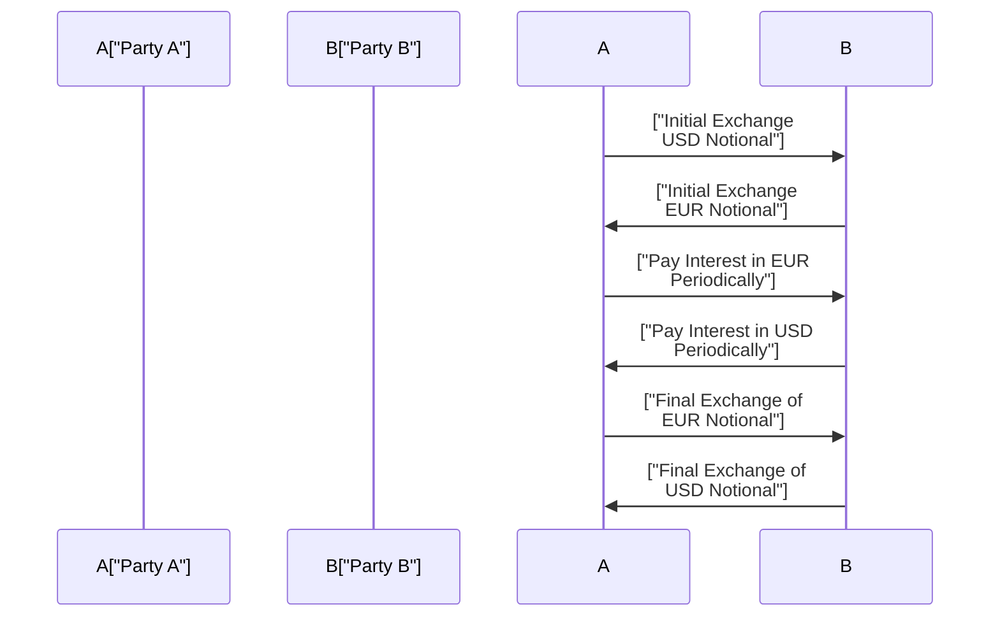

## Understanding the Mechanics of a Currency Swap

Currency swaps, sometimes referred to as cross-currency swaps, are interesting creatures in the derivative world. They allow two parties to exchange amounts of principal denominated in different currencies, then swap periodic interest payments (based on those principals), and ultimately re-exchange the principal amounts at a predefined exchange rate when the contract ends. Sounds like a mouthful—but at their core, they’re basically a tool to manage interest rates and exchange rates simultaneously.

Let’s think about a simple scenario: You have a company (“Party A”) that borrows US dollars at a fixed rate, but actually needs euros to fund a new factory in Germany. Meanwhile, “Party B” has just borrowed euros at a floating rate but really needs US dollars for domestic expansion. A currency swap can help them “trade” exposures: A gets euros (and pays interest in euros), while B gets dollars (and pays interest in dollars). That way, each party ends up better aligned with its actual currency needs.

In many currency swaps, both the principal exchange and re-exchange are done on a notional-for-notional basis. This simply means you swap your entire principal at the beginning (or sometimes only at the end, or both), rather than netting differences. Each side is also responsible for paying interest in the other currency—typically at the rate prevailing in that currency’s debt market (e.g., an agreed-upon fixed U.S. rate vs. a Euro-based floating rate). At maturity, you swap back the notional principal amounts. The magic here is that each side has effectively transformed its debt into another currency.

## Why Currency Swaps Are Used

It might sound odd to enter into a multi-year contract where you’re paying interest in someone else’s currency. But consider that many businesses have revenues in multiple currencies or want to lock in a specific exchange rate to avoid unpredictable fluctuations.

• Hedging Foreign Currency Debt: A firm with debt denominated in a currency it doesn’t otherwise earn can use a currency swap to transform that debt into a currency more aligned with its cash inflows.  
• Accessing Lower Borrowing Rates: Sometimes, you can exploit differences in credit quality or capital market conditions, issuing debt more cheaply in one currency and then swapping into your desired currency at a favorable rate.  
• Locking in FX Rates: If a company is worried that exchange rates will zigzag over the next five or ten years, the swap sets a known rate for paying and receiving.  
• Synthetically Converting Debt: Currency swaps let you replicate (or “synthesize”) a foreign currency loan without actually having to borrow directly in that foreign capital market.

I remember chatting with a treasury manager who oversaw the finances of a mid-sized chemical company. Their core revenues were in euros, but they had a portion of their debt in USD from a prior acquisition. Rather than refinance that debt outright (which would have involved new issuance and loads of administrative cost), they entered into a currency swap with a bank so they could effectively pay interest in euros—even though their original loan documentation remained denominated in USD. The company’s CFO was thrilled because it gave them a natural hedge against their euro-based income streams.

## Example of a Plain Vanilla Currency Swap

Imagine Party A wants to pay fixed USD interest in exchange for receiving fixed EUR interest. For the sake of simplicity, let’s assume:

• Party A (a U.S. company) has borrowed USD 10 million at a 5% fixed rate but wants EUR exposure.  
• Party B (a European company) has borrowed EUR 9 million at a 4% fixed rate but wants USD exposure.  
• The agreed exchange rate for the principal amounts is USD 1.1111 per EUR 1. So, EUR 9 million is worth about USD 10 million.  

At the start of the swap (initial exchange):
• A gives B USD 10 million, and B gives A EUR 9 million.

During the life of the swap:
• A pays a 4% annual rate on EUR 9 million to B. (This effectively is EUR 360,000 per year.)  
• B pays a 5% annual rate on USD 10 million to A. (This is USD 500,000 per year.)

At the end (final exchange):
• A returns the EUR 9 million principal to B, and B returns USD 10 million to A at the original exchange rate of 1.1111 USD per EUR.

Notice that each party has effectively converted its fixed-rate debt from one currency to another. The net effect? A is now paying interest in euros (despite originally borrowing in USD), and B is paying interest in USD (despite originally borrowing in EUR). Both parties have “swapped” their currency exposures in a single contract.

## Visualizing the Payment Flows

Below is a Mermaid diagram illustrating a simplified flow of payments for a plain vanilla currency swap with an initial and final exchange of principals:

## Basis Swaps

It’s also common for currency swaps to be “floating versus floating,” meaning each side pays a floating interest rate tied to a benchmark in its own currency. For instance, you might have one party paying a floating USD rate (like SOFR or previously LIBOR) while receiving a floating EUR rate (like EURIBOR). These are often referred to as cross-currency basis swaps.

Why might that be useful? If you’re a bank that funds itself in dollars but invests heavily in euro assets, you might want to match your liabilities to floating EUR rates. For that purpose, a cross-currency basis swap can reduce mismatch by converting your dollar-based funding costs into euro-based floating costs.

## Key Risk Factors

Currency swaps are not all sunshine and roses. They come with a handful of risks that any prospective user has to keep on their radar:

• Credit Risk: If your counterparty defaults on the swap, you might be left paying interest in one currency without receiving what was promised. Collateral arrangements or central clearing can mitigate this.  
• Exchange Rate Risk: The relative value of the two currencies can fluctuate, impacting the market value of the swap. While the principal re-exchange happens at a predetermined rate, the “termination value” (if you exit early) can shift dramatically with exchange rates.  
• Interest Rate Risk: Changes in the interest rate environment in either currency can alter the ongoing value of the swap, especially if you’re paying or receiving a floating rate.  
• Operational and Legal Risks: Cross-border contracts must handle multiple regulatory environments. And let’s face it: the legal structure of big multinational swaps can get complicated.  

On top of that, sometimes there’s a mismatch in notional amounts if the swap includes partial principal exchanges or amortizing structures. The complexities do escalate quickly. But that’s half the fun, right?

## Valuing a Currency Swap

At initiation, the value of the swap (to both parties) is usually set to zero. You can think of it as two offsetting cash flow series: one in currency X, the other in currency Y. Each stream can be valued by discounting future cash flows at the appropriate discount rates for that currency.

Over time, the swap’s value changes as market exchange rates and interest rates fluctuate. If interest rates in one currency rise, or if the exchange rate shifts, the present value of the future cash flows in that currency might change, which creates a gain or loss. From an accounting standpoint—whether IFRS 9, US GAAP, or otherwise—firms often need to report the swap’s fair value on the balance sheet (especially if they’re using hedge accounting).

Mathematically, you might see the currency swap’s value derived as:

V_swap = PV(Received Cash Flows in Currency A) – (FX conversion) – PV(Paid Cash Flows in Currency B)

with the final principal exchanges included in those PV (present value) sums, each discounted at the relevant yield curve for that currency.

## Market Conventions and Quoting

Traders typically quote cross-currency swaps by referencing the interest rate differentials (e.g., “pay 3-month USD SOFR flat, receive 3-month EURIBOR plus 15 basis points”) and the initial spot exchange rate or forward rates for the principal. There may also be adjustments for cross-currency basis, especially if there is a consistent demand to borrow in one currency vs. another.

From an operational perspective, the market mainly consists of banks, corporations, asset managers, and other institutions. In the post-financial-crisis era, regulations (like Dodd-Frank in the US or EMIR in Europe) often require clearing or at least robust bilateral collateral posting for certain cross-currency derivative contracts, further mitigating counterparty credit risk.

## Best Practices and Common Pitfalls

• Know Your Counterparty: Evaluate creditworthiness (a major point in the CFA Institute Code and Standards, which emphasize fiduciary responsibility and thorough due diligence).  
• Manage Exposure Continuously: Monitor how the swap’s market value evolves as rates and exchange rates change.  
• Clarify Your Objectives: If the swap is for hedging, confirm that the structure matches the underlying exposure in terms of notional, tenor, and payment frequency. A mismatch can inadvertently create more risk than it mitigates.  
• Be Mindful of Accounting Rules: If you’re trying to qualify for hedge accounting under IFRS or US GAAP, ensure you meet effectiveness testing and documentation requirements from day one.  
• Assess Liquidity: Sometimes cross-currency swaps for certain exotic or emerging market currencies can be illiquid. That might lead to wide bid-ask spreads and higher transaction costs if you need to unwind or re-structure.  

## Personal Perspective

I remember having a client—longtime CFO of a manufacturing company—who insisted that currency swaps were too complex. “We don’t want to be messing with these fancy derivatives,” he said. Then, as the euro started climbing against the dollar, he found himself paying way more in real terms on the USD loan to fund the European plant. He quickly changed his tune! We walked him through how a swap could lock in known rates and stabilize the company’s cash flow. By the end of our conversation, he confessed, “I should have done this from the start.” The moral? Currency swaps aren’t just about fancy footwork; they can be a practical hedge to ensure you don’t get whipsawed by volatile exchange rates.

## Conclusion

Currency swaps are a sophisticated but powerful tool in risk management. They combine interest rate hedging with foreign exchange hedging by letting two parties “swap” their interest obligations and principal amounts in different currencies. Over the last few decades, they’ve become exceptionally common for corporate treasuries, banks, and investment funds that have cross-border operations or want to exploit beneficial interest rate conditions. Of course, with the benefits come complexities in valuation, credit risk management, and regulatory compliance. But if used correctly, currency swaps can be a real asset in a financial professional’s toolkit.

## References

• Kiff, John, and Chui, Michael. “Currency Swaps Explained,” IMF Working Papers.  
• Hull, John C. “Fundamentals of Futures and Options Markets.”  
• Bank for International Settlements (bis.org) for cross-currency basis swap market data.  
• IFRS 9 Financial Instruments for hedge accounting requirements.  
• CFA Institute Code of Ethics and Standards of Professional Conduct.

## Test Your Knowledge: Currency Swaps and Cross-Currency Exposures



### Which of the following best describes a currency swap?

- [ ] An agreement to exchange fixed interest payments for floating interest payments in the same currency.
- [x] An agreement between two parties to exchange principal and periodic interest payments in two different currencies.
- [ ] A forward contract to buy and sell currency at a predetermined future date and price.
- [ ] A rights offering that involves receiving foreign currency in exchange for equity.

> **Explanation:** A currency swap involves exchanging principal amounts in different currencies and making interest payments in those currencies over the life of the contract.

### In a plain vanilla currency swap, which of the following is true regarding the principal amounts at maturity?

- [x] The principal amounts are re-exchanged at the original notional amount and predetermined exchange rate.
- [ ] The swap principal cannot be re-exchanged if interest rates have changed.
- [ ] The principal amounts are always amortized to zero and not re-exchanged.
- [ ] Only one of the parties pays the re-exchange notional.

> **Explanation:** In most plain vanilla currency swaps, the same notional principals initially exchanged are swapped back at the contracted rate when the swap matures.

### A company currently paying floating interest in USD wants to pay fixed interest in EUR instead. Which type of currency swap structure would achieve this?

- [x] A cross-currency swap in which the company receives USD floating and pays EUR fixed.
- [ ] An interest rate swap in which the company receives USD fixed and pays EUR floating.
- [ ] A forward rate agreement on EUR interest rates.
- [ ] A convertible exchange swap with an embedded option.

> **Explanation:** By receiving USD floating and paying EUR fixed, the firm effectively transforms its USD floating liability into a EUR fixed obligation.

### In a currency swap, what is the primary role of the notional principal?

- [ ] It is physically exchanged only if a credit event occurs.
- [ ] It is never exchanged, serving only as a reference amount for interest calculations.
- [x] It is the basis for interest calculations and is often exchanged at initiation and/or at maturity.
- [ ] It is netted out periodically to determine the swap’s direction of payment.

> **Explanation:** Unlike typical interest rate swaps, currency swaps commonly require the actual exchange of notional principals at the beginning and end of the contract.

### Which of the following risks is uniquely elevated in a currency swap compared to a standard interest rate swap?

- [x] Exchange rate risk.
- [ ] Leverage ratio risk.
- [ ] Reinvestment risk in the same currency.
- [ ] Commodity price risk.

> **Explanation:** Because currency swaps deal with two different currencies, exchange rate risk looms larger than in a standard interest rate swap involving a single currency.

### When valuing a currency swap, which of the following should be incorporated into the valuation process?

- [x] The present value of each leg’s cash flows, discounted at the appropriate yield curve for each currency.
- [ ] Only the current spot exchange rate, ignoring the currencies’ yield curves.
- [ ] The notional amounts are ignored since they do not impact the swap’s fair value.
- [ ] The historical exchange rate trends going back at least ten years.

> **Explanation:** To value a currency swap, treat each side’s interest and principal exchange as separate cash flows discounted at the appropriate yield curves for that currency, then convert to a common currency.

### What is a common motivation for using a cross-currency basis swap?

- [x] Gaining floating-rate exposure in a different currency while managing the mismatch of existing floating liabilities.
- [ ] Speculating on an increase in a single currency’s interest rate without exposure to exchange rates.
- [ ] Converting fixed rate liabilities into floating rate liabilities in the same currency.
- [ ] Eliminating any credit risk from the swap counterparty.

> **Explanation:** A cross-currency basis swap lets a party pay floating in one currency and receive floating in another, often used to hedge or optimize cross-currency funding costs.

### A multinational company with substantial sales in Europe but USD-denominated debt wants to hedge against EUR/USD currency fluctuations. Which approach is most direct?

- [x] Enter a currency swap that exchanges USD payments for EUR payments, matching the firm’s EUR cash inflows.
- [ ] Rely on a standard interest rate swap in USD only.
- [ ] Issue more USD debt to acquire additional euro reserves.
- [ ] Purchase an uncollateralized commodity swap.

> **Explanation:** A currency swap converting USD payments into EUR payments aligns the firm’s debt obligations with its euro-denominated revenue stream.

### Which statement about counterparty risk in currency swaps is valid?

- [x] Counterparty risk is generally higher than a plain interest rate swap because principal is often exchanged.
- [ ] Because both parties swap notional at the start, counterparty risk is zero for the duration.
- [ ] Only the net interest payments are subject to counterparty risk; principal amounts are exempt.
- [ ] Central clearing is never required for cross-currency swaps.

> **Explanation:** In currency swaps you exchange principal, so there’s a larger quantum of counterparty exposure. Central clearing or collateral can help reduce that risk.

### A plain vanilla currency swap typically involves which of the following?

- [x] Two notional principals in different currencies, an initial exchange, periodic interest payments, and a final exchange.
- [ ] A single notional principal, multi-currency call option, and daily mark-to-market.
- [ ] Variable exchange rates set by each party every payment date, with no principal exchanged.
- [ ] A single payment at the start that automatically rolls over into a forward contract.

> **Explanation:** The hallmark of a plain vanilla currency swap is that it has two principals denominated in different currencies, exchanged at initiation and again at maturity, combined with periodic interest payments.


