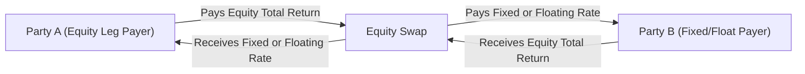
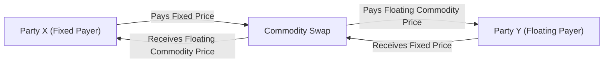

## Introduction

So—let's take a moment to think about how we can gain exposure to the equity or commodity markets without actually owning the stock shares or the barrels of oil. Imagine you’re talking to a friend who desperately wants in on a new equity trend but prefers not to buy anything directly. Or picture a company that uses large amounts of crude oil and wants to manage the risk that oil prices might skyrocket. In both cases, a swap can be a straightforward solution.

In this section, we’re focusing on two specific types of swaps: equity swaps and commodity swaps. You’ll recall from previous sections (such as Interest Rate Swaps and Currency Swaps) that a swap is basically an agreement to exchange one set of payments for another. Here, though, the twist is that the notional amounts reference equity indexes (like the S&P 500) or commodity prices (like oil or gold). Because these underlying markets can be more volatile than interest rates, they sometimes require a deeper appreciation for market behavior, event risks, and—well—just how unpredictable the real world can be.

This topic is crucial if you ever find yourself working at an investment firm that deals with equity or commodity exposures. It also frequently appears on CFA exams in the context of risk management, portfolio construction, or even curiosity-piquing scenario examples.

## Equity Swaps: Key Concepts

An equity swap is a bilateral contract where one party agrees to pay cash flows based on the performance of an equity index or an individual/basket of stocks, while the other party usually pays a fixed or floating rate of interest on the same notional principal. Let’s say you represent Party A:

• Party A pays: Total return on some underlying equity index (often the S&P 500).  
• Party B pays: A fixed or floating interest rate on a notional amount.  

The total return portion usually includes both capital gains/losses plus any dividends (unless otherwise stated). It’s a neat way to gain synthetic equity exposure without physically owning the shares. This means no direct voting rights in the stocks themselves, but sometimes it also allows circumventing certain restrictions or transaction costs.

### Structure of an Equity Swap

The actual mechanics? Think of a table with two columns. One column is the “Equity Leg,” the other column is the “Interest Rate Leg.” For each settlement period—monthly, quarterly, or as agreed upon—one side calculates what the equity index or underlying stock basket has returned (including dividends if specified), while the other side calculates interest on the notional at either a fixed rate or a floating benchmark like LIBOR (or more recently, SOFR for USD). At the end of each period, these amounts are netted, and the party that owes the difference pays the other.

Below is a simple Mermaid diagram illustrating an equity swap structure. Party A pays the equity index return, and Party B pays a fixed rate on the same notional.

### Rationale for Using Equity Swaps

Equity swaps became popular among institutional investors who want to:

• Hedge or gain exposure to equity markets without trading underlying stocks.  
• Avoid certain market-access restrictions, especially for cross-border transactions.  
• Optimize tax treatments or cash allocations (in some jurisdictions, receiving synthetic exposure might offer different tax implications compared to direct ownership of equities).  
• Manage leverage more discreetly (swaps often require smaller initial cash outlays compared to direct positions).  

Personally, the first time I encountered an equity swap was at a small hedge fund where the portfolio manager wanted immediate exposure to a European market without opening accounts in each individual country. Equity swaps helped him sidestep multiple custodial charges and got him the performance of the index overnight.

### Example: Total Return Equity Swap

Let’s say Party A wants exposure to the S&P 500 but doesn’t feel like (or isn’t permitted to) buy hundreds of stocks directly. Party B, a financial institution, agrees to pay the total return on the S&P 500 over three months on a $10 million notional. In exchange, Party A pays a fixed rate of, say, 3% per annum on that notional (prorated for the quarter). If the S&P 500 total return goes up by 5%, Party B pays 5% of $10 million = $500,000 to Party A. Simultaneously, Party A owes 3% annualized on $10 million for a quarter, which is (3% / 4) * $10 million = $75,000. The net result? Party A receives $425,000.

Of course, if the S&P 500 had dropped by 2%, the equity leg is negative, so Party A would owe Party B the difference, net of the 3% interest cost. That’s the beauty—and risk—of swaps. Gains and losses can be realized without ownership.

## Commodity Swaps: Key Concepts

Now, commodity swaps are cousins of equity swaps, except the underlying is a physical commodity or a commodity index. Common examples include crude oil, natural gas, and metals. Commodity swaps, in many ways, function similarly to equity swaps:

• One side pays a fixed price on a notional quantity of the commodity.  
• The other side pays a floating price linked to a spot or index-based price of that commodity.  

### Why Commodity Swaps?

Unlike some equity indices, commodity markets can be extremely volatile and often prone to supply-demand shocks, geopolitical tensions, or weather disruptions. A large airline might want to fix its costs for jet fuel. A commodity producer might want certainty about its revenues. A speculator might see a mismatch in short-term vs. long-term crude price expectations. Commodity swaps enable these parties to transfer commodity price exposure in a way that can be more customizable than standardized futures contracts.

### Mechanics of a Typical Commodity Swap

Let me illustrate a straightforward structure:

• Party X (often an industrial end-user) agrees to pay a fixed price for oil on a notional volume (e.g., 10,000 barrels per month).  
• Party Y (often a swap dealer) agrees to pay the floating market price of oil on that same notional volume.  

Settlement might be monthly, with reference to an average daily spot price or the price on a single day. Payment is netted—whoever is “underwater” compensates the other. By doing so, Party X essentially locks in an effective purchase price for oil. If the actual spot price is higher than the fixed price, Party X receives money from Party Y (offsetting the higher physical purchase cost in the open market). If the spot price is lower, Party X pays Party Y (but at least it’s buying cheaper oil physically).

We can visualize it in a similar Mermaid diagram:

### Synthetic Exposure vs. Physical Ownership

Equity or commodity swaps often provide “synthetic exposure” to the underlying market. That means you’re effectively long or short the performance of the asset, but you don’t actually own it. This synthetic exposure:

• Lets you avoid certain logistical hassles of holding physical commodities (storage, transportation, insurance, etc.).  
• Can reduce or eliminate the need for physical settlement for equity shares.  
• Potentially lowers upfront capital requirements, since many swaps only need collateral or margin requirements instead of full purchase amounts.

## Pricing and Valuation Foundations

Just like interest rate swaps, these instruments are often viewed as series of forward contracts on the underlying. At the start of a swap, the value is typically zero (assuming fair market terms). Over time, the value shifts for each party as prices move and each leg accumulates gains or losses.

For equity swaps, you might incorporate factors like:

• Dividend yields on the underlying.  
• Volatility and expected returns on the stock/index.  
• The risk-free interest rate.  

For commodity swaps, you also worry about:

• Convenience yields (for commodities where holding the physical asset confers benefits).  
• Storage costs (especially relevant for agricultural products or natural gas).  
• Seasonality patterns in commodity prices.  

A general cost-of-carry approach for commodities can be summarized (in a simplified form) by:

p(t) = S(t) e^(r + u − y)(T − t)

Where:  
• S(t) is the current spot price.  
• r is the risk-free rate.  
• u is the storage or financing costs.  
• y is the convenience yield.  
• (T − t) is the time to maturity.  

Swaps then effectively exchange the difference between the fixed rate (or fixed price) derived from this cost-of-carry model and the realized price or index performance.

## Managing Risks

### Market Risk

Equity prices can fluctuate daily, sometimes wildly. Commodities can see even bigger spikes, especially under supply constraints or macro shocks. If you’re paying the floating commodity price, for example, you’re effectively long the commodity. If you’re receiving the total return on an equity basket, you’re effectively long the equities. If the market goes against your position, your swap’s value declines.

### Credit (Counterparty) Risk

Swaps are bilateral contracts. Particularly for over-the-counter (OTC) swaps, there’s always the question: what if the other party fails to pay? Regulators and clearinghouses have introduced central clearing for many types of swaps precisely to reduce this risk. Some commodity swaps still remain outside central clearing, so risk managers must watch margin requirements, netting agreements, and potentially rely on collateral to mitigate credit exposure.

### Liquidity and Funding Risk

Equity or commodity swaps can require posting collateral, especially if your mark-to-market exposure grows large. In a highly volatile environment, you might face bigger and more frequent margin calls, so you need to position your cash or liquidity carefully. That can be a real headache if you’re not prepared.

## Practical Applications and Case Studies

1. Hedging Equity Portfolios  
   A fund holding a large block of equities can enter an equity swap paying the total return on those stocks but receiving a fixed rate. Essentially, it “locks in” the current value if it’s worried the stock might tumble. This is akin to an insurance strategy, though there is a cost (the swap’s fixed rate) to consider.

2. Gaining Quick Market Exposure  
   If an investor guesses that a certain commodity (like natural gas) will rise in price during the winter, but physical markets or futures might be inconvenient, a swap with a dealer can provide the same payoff profile with fewer operational hurdles.

3. Reducing Capital Outlays  
   A manager wanting to be “long” an international equity index can do so via an equity swap. This avoids opening multiple accounts, dealing with foreign exchange conversions for multiple stocks, and incurring potentially higher transaction costs. Swaps simplify the process.

4. Accounting or Regulatory Constraints  
   Some institutions prefer swaps for off-balance sheet exposures, or to meet regulatory constraints that might discourage direct physical holding of certain assets.

### Personal Anecdote on Commodity Swaps

I once had a buddy who worked at an airline, and every time oil prices started moving, the CFO would panic over how it might wreck their quarterly earnings. The airline’s treasury department eventually entered commodity swaps where they paid a fixed price and received the floating price of jet fuel. That gave them so much more predictability in their expenditures, which is particularly nice in an industry with thin margins.

## Common Considerations and Pitfalls

• Failing to read the fine print about how dividend or coupon-like payments are handled in equity swaps.  
• Not appreciating that commodity markets can be extremely illiquid or subject to daily price limits, which can cause significant volatility in the swap’s mark-to-market value.  
• Overlooking cross-currency aspects. If you’re receiving the total return on a foreign equity index but paying a floating rate in your home currency, you might inadvertently create a currency risk exposure.  
• Collateral and margin calls can add significant operational complexity.  

## Best Practices

• Conduct thorough due diligence on the counterparty or use a central clearing mechanism if possible.  
• Monitor daily or intra-day net exposures, especially when commodity volatility is high.  
• If using equity swaps for short-term trading and speculation, keep an eye on accrued dividends and corporate actions: these factors can unexpectedly affect swap payments.  
• Align the maturity of your swap contract with the horizon of the underlying hedging or speculative need.  

## Conclusion and Exam Tips

Equity and commodity swaps give you an alternative path to gain or shed exposure to markets, often more flexibly than the physical or exchange-traded markets. They come with unique sets of terms and risk factors (like higher volatility, physically linked supply disruptions, or dividend adjustments) that you might not confront in interest rate or currency swaps.

For the CFA exam, you should be ready to:

• Identify the cash flow structures for each leg of an equity or commodity swap.  
• Evaluate how a swap’s payoff changes if the underlying equity index or commodity price fluctuates.  
• Understand the role of dividends, convenience yields, storage, and seasonality in pricing.  
• Provide rationales for when to hedge or seek synthetic exposure vs. a direct physical (or direct stock) position — exam questions often emphasize comparing the advantages and disadvantages of using swaps.  
• Calculate net settlements based on example scenarios of market price changes and interest rates.  

Time management in exam scenarios is key. If you see a question about equity or commodity swaps, double-check you’re capturing both legs of the swap correctly and that you understand how net settlement is computed. Also, pay attention to whether the question includes an expression about dividends or storage costs. Those details can change the final answer significantly.

## References

• Chance, Don M. “Analysis of Derivatives for the CFA Program.”  
• Reuters/Bloomberg terminals: Real-time quotes on equity & commodity swap structures.  
• CME Group (cmegroup.com): Extensive information on commodity markets and derivative resources.  
• CFA Institute Level I & II Curriculum: Foundations of derivative pricing and risk management.  
• For advanced coverage of pricing nuances: Hull, John. “Options, Futures, and Other Derivatives.”  

## Test Your Knowledge: Equity and Commodity Swaps



### Which of the following statements best describes an equity swap?  
- [x] A contract where one party pays the total return on an equity index and receives a fixed or floating payment.  
- [ ] An exchange of one equity for another, typically to facilitate mergers.  
- [ ] A bond-like instrument that pays fixed dividends in return for an equity payment.  
- [ ] A short-term forward contract on a single stock.  

> **Explanation:** An equity swap involves exchanging the returns on an equity index (or stock basket) for a fixed or floating rate.

### In an equity swap where Party A pays total return on the S&P 500 and receives a floating interest rate, what position in the equity market does Party A effectively hold?  
- [ ] Long position in the equity index.  
- [x] Short position in the equity index.  
- [ ] Neutral position in the equity index.  
- [ ] Party A is neither long nor short; the swap is purely a financing arrangement.  

> **Explanation:** If Party A is paying the total return on an index, it’s effectively short that index.  

### One major reason a large institution might utilize a commodity swap instead of purchasing the commodity outright is:  
- [ ] They neutralize interest rate risk entirely.  
- [ ] They avoid foreign exchange translation costs.  
- [x] They avoid physical storage and handling costs.  
- [ ] They can guarantee no mark-to-market adjustments.  

> **Explanation:** Commodity swaps provide synthetic exposure and thus avoid actual storage and handling costs of physical delivery.

### The floating leg of a commodity swap typically references:  
- [ ] A constant daily settlement price published by the SEC.  
- [x] The daily or monthly spot price or index price of the commodity.  
- [ ] A government-mandated official commodity price.  
- [ ] A discount rate derived from interest rate markets.  

> **Explanation:** The floating commodity leg is based on a recognized spot price or a pricing index for the commodity.

### In a total return equity swap, the total return leg typically includes:  
- [x] Capital gains or losses plus dividend distributions.  
- [ ] Capital gains or losses only.  
- [ ] Dividend distributions only.  
- [ ] Fixed coupon payments but no capital gains.  

> **Explanation:** “Total return” means the sum of price appreciation (or depreciation) plus dividends.

### One advantage of using equity swaps for market exposure is that they:  
- [x] Allow synthetic market access without directly holding the physical shares.  
- [ ] Require zero collateral regardless of price movements.  
- [ ] Eliminate counterparty credit risk automatically.  
- [ ] Guarantee profit in a rising market.  

> **Explanation:** By using equity swaps, the investor gains exposure to an index or basket without physically purchasing the shares.

### Which of the following factors is most relevant to the pricing of a commodity swap but not usually relevant for a plain-vanilla interest rate swap?  
- [x] Storage costs and convenience yields.  
- [ ] LIBOR or SOFR floating rates.  
- [ ] Net present value of fixed coupon payments.  
- [ ] Tenor matching of principal schedules.  

> **Explanation:** Commodity swaps often incorporate storage costs (carrying costs) and convenience yields, which you typically don’t see with interest rate swaps.

### A swap where Party A pays a fixed price for crude oil and receives the floating market price from Party B each month primarily hedges which risk for Party A?  
- [ ] Equity market risk.  
- [ ] Interest rate risk if oil is financed with short-term debt.  
- [ ] Credit default risk of the oil producer.  
- [x] Rising oil prices (commodity price risk).  

> **Explanation:** By paying a fixed price and receiving floating, Party A is hedged against increases in oil prices.

### If an equity swap is not cleared through a central clearinghouse, the primary incremental risk is:  
- [x] Counterparty credit risk.  
- [ ] Liquidity risk disappears.  
- [ ] No risk–equity swaps are always guaranteed.  
- [ ] Government-mandated payouts.  

> **Explanation:** In OTC markets, there is always a risk that the counterparty might fail to meet future obligations.

### True or False: Commodity swaps are less volatile than interest rate swaps because commodity markets are regulated more strictly.  
- [x] False  
- [ ] True  

> **Explanation:** Commodity markets can be highly volatile, often more so than interest rates. While they are regulated, that doesn’t inherently reduce their price volatility.


