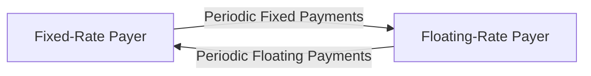

## Introduction

Swaps, in many ways, remind me of that moment when you and a friend agree to trade baseball cards every few weeks—except these trades keep going on for months or even years. You lock in the terms at the start, you both anticipate fair exchanges, and you hope that the arrangement stays equitable over time. In the world of derivatives, a swap can be viewed similarly: at inception, it usually looks like a fair deal, with equal value on both sides. But as market conditions shift, the swap’s value can tilt favorably to one party and become a liability to the other.

In this section, we’ll explore how we value swaps at initiation (when the swap typically has zero net present value) and then how we continue to assess their value as market conditions change. We’ll focus on interest rate swaps, but we’ll also look at conceptual carryovers for currency, commodity, and even equity swaps. This discussion builds on concepts of discounting, zero-coupon curves, and forward rates—some of which you might have already seen in futures and forward contract valuation.

Swaps have become essential tools for institutions and corporations wanting to manage interest rate risk, lock in currency exposures, or gain exposures to equity and commodity markets without actually holding those assets. Although the concept seems straightforward—one party pays a fixed rate and receives a floating rate—valuing these deals can get a little tricky. But fear not: we’ll unpack each piece step by step.

## Key Concepts

Before diving in, let’s examine some core terms that will frame our discussion:

• Mark-to-Market (MTM): The process of assigning a current market value to each swap position.  
• Present Value of the Floating Leg: The discounted sum of future floating payments, which typically resets near par value right after a payment is determined.  
• Discount Factor: A rate used to convert a future cash flow to its present value. These come from the term structure of interest rates (the yield curve) or from zero-coupon bond prices.  
• Yield Curve Shift: A movement in interest rates across maturities, altering the valuation of interest rate swaps.  
• Spot vs. Forward: Pertinent in determining future floating rates or exchange rates for currency and commodity swaps.  
• Credit Valuation Adjustment (CVA): An adjustment reflecting the counterparty’s creditworthiness, more relevant in over-the-counter (OTC) swaps.  

## Why Value a Swap?

You might ask, isn’t a swap’s value only important at maturity, when the final payments are swapped? Actually, it matters a lot throughout the contract’s life:

• Counterparty Credit Risk: If your swap has a large positive value, you bear the risk that your counterparty might default (especially with OTC contracts).  
• Balance Sheet and Regulatory Requirements: Financial institutions must mark their swap positions to market and maintain capital against potential losses.  
• Risk Management: Daily risk monitoring and hedging activities typically require revalued positions to make sure exposures don’t exceed limits or cause portfolio imbalances.  

So yes, even though you might not be exchanging physical assets under a swap (except in a currency swap), the daily or periodic mark-to-market updates are vital.

## Valuation at Initiation

When an interest rate swap (IRS) is created, the standard assumption is that its value is zero to both parties. But why is that the case? We set the fixed rate on the swap such that the present value (PV) of the expected fixed leg cash flows equals the PV of the expected floating leg cash flows. Let’s walk through this logic:

• The fixed leg typically involves a series of fixed payments, each calculated as (swap fixed rate × notional × day count fraction).  
• The floating leg’s payments vary according to a specified reference rate (e.g., LIBOR, or more recently a risk-free rate like SOFR), reset at set intervals.  
• We discount both sets of cash flows using the appropriate discount factors derived from the current yield curve.  

### Setting Fixed Rate to Achieve Zero Initial Value

Imagine you’re paying fixed and receiving floating. The swap’s initial fixed rate is set so that:

( Present Value of Fixed Leg ) = ( Present Value of Floating Leg )

If these two are equal, then each side enters the swap at par, so to speak. A typical formula for the fixed rate (Rᵧ) at swap initiation is:

Rᵧ ≈ (1 – Discount Factor at maturity) / Sum of Discount Factors  

(This formula can vary slightly by day count conventions and payment frequencies, but you get the point.)

So, at the start, the net PV is zero—like exchanging baseball cards of equal value. If forward curves or discount rates shift the next day, that initial equilibrium can break.

## Valuation During the Life of the Swap

The second we get past initiation, the world keeps spinning, rates change, floating resets occur, and the swap’s value typically migrates away from zero. If you’re paying 5% fixed and floating rates shoot up to 7%, you’ll soon be on the losing end of that swap. Conversely, if interest rates drop, the fixed-rate payer might see the swap become an asset.

From a purely mechanical standpoint, you’d do something like this:

1. Project the Floating Leg Cash Flows: For each payment date, estimate what the floating rate will be. This might involve forward curve data for interest rates or forward FX rates for currency swaps.  
2. Calculate the Fixed Leg Cash Flows: That’s simpler; the rate is already set.  
3. Determine the Present Values: Discount each projected cash flow back to the present using appropriate discount factors.  
4. Net Them Out: The difference between the PV of what you receive and the PV of what you pay is your swap’s value.  

If you recall from forwards: “Value” can be negative or positive. If the net present value is positive, the swap is an asset to you; if it’s negative, it’s a liability. 

### Why Does the Floating Leg Reset to Par?

Right after a floating payment resets, the floating leg theoretically becomes “par” again, because the floating rate is aligned with the current short-term interest rate for that payment period. In simpler terms, you’ve got as fair a floating rate as the market can provide at that moment. Over time, though, as the yield curve changes or you move further into the accrual period, that leg deviates from par—leading to a non-zero swap value.

## Mark-to-Market and Net Gains or Losses

MTM ensures we’re always measuring how the swap’s fair value moves with changes in the yield curve, credit spreads, or the underlying reference asset (for equity or commodity swaps). If you’ve ever been comfortable with the idea of marking a stock portfolio to market daily, you can think of swaps similarly: each day, we recalculate the expected future cash flows and discount them.

Banks use these MTM values in their profit-and-loss (P&L) statements. Clearinghouses, if the contract is exchange-traded or cleared through a central counterparty, also use daily mark-to-market to set variation margin requirements. This helps reduce credit risk because any significant shift in your swap’s value might call for immediate margin top-ups.

## Practical Steps to Valuing an Interest Rate Swap

Here’s a short rundown, in case you want a crisp to-do list. Let’s assume you’re paying fixed, receiving floating:

1. Identify Payment Dates: Suppose the swap matures in 5 years, with semiannual payments.  
2. Project Floating Rates: Use the forward interest rates derived from the relevant yield curve.  
3. Evaluate Fixed Payments: These are already set.  
4. Discount Each Leg: Sum the present values of the fixed leg and the floating leg separately.  
5. Compute the Net Value: (PV of Floating Leg – PV of Fixed Leg).  

Incidentally, if you’re receiving fixed and paying floating, it’s simply the other way around (Fixed – Floating).

### Example

Let’s do a miniature example. Suppose on Day 1, you agree to pay 5% fixed, receive 6-month LIBOR. The notional is $1 million. Semiannual payments for 2 years. The discount factors for the next four semiannual periods are:

• 0.5-year discount factor: 0.98  
• 1.0-year discount factor: 0.95  
• 1.5-year discount factor: 0.92  
• 2.0-year discount factor: 0.88  

Now, if you were to set the swap at a fair rate (just hypothetical numbers here), you’d solve for that rate so that the present value of fixed cash flows = present value of floating. Maybe your solution is around 5%. So at inception, the net value is $0. Great.

But let’s say 3 months into the swap, interest rates spike upward. Now the 6-month LIBOR forecast is higher than it used to be. The PV of your floating receipts might exceed the PV of your fixed payments. You’d then have a positive value if you’re receiving floating. Good for you, but that also increases your counterparty’s credit risk to you.

## Currency Swaps and Commodity Swaps

The same broad valuation principles apply to currency and commodity swaps, though the details can differ a bit:

• Currency Swaps: You discount each currency’s cash flows at its own yield curve, forecast the currency exchange rate as needed, and net out the present values.  
• Commodity Swaps: You project commodity prices (often referencing forward commodity curves) and discount at the appropriate interest rates.  

In both cases, the floating leg might be pegged to an index (like WTI for crude oil or an FX rate), while the fixed leg is a predetermined price or exchange rate.

## Diagram of Swap Cash Flows

It often helps to visualize the flow of payments in a vanilla interest rate swap. Here’s a quick mermaid diagram:



You can see that the floating-rate payer (on the right) sends floating-rate payments to the fixed-rate payer (on the left). The fixed-rate payer sends fixed-rate payments in return.

## Credit Valuation Adjustment (CVA)

In an OTC environment, you might come across CVA. Maybe you’re familiar with me moaning about how complex it used to feel. In essence, CVA adjusts the fair value of the swap to account for the probability that the counterparty won’t fully meet its obligations. If I have $10 million in net gains on a swap that’s all bilateral, I need to discount that with a probability factor or a spread measure to reflect the risk of default. Similar logic applies to Debit Valuation Adjustment (DVA) on your own credit risk, but that’s a separate conversation.

## Key Drivers of Swap Value Changes

• Interest Rate Movements: Shifts in the yield curve alter discount factors and forward rates.  
• Credit Spread Changes: If your counterparty’s creditworthiness deteriorates, your swap’s net value might be adjusted for CVA.  
• Market Expectations: If the floating reference rates for future periods are expected to move significantly, your floating leg’s projected payments can jump.  
• Underlying Asset Prices: For equity or commodity swaps, the price of the underlying reference influences how future cash flows are calculated.  

## Common Pitfalls and Best Practices

• Improper Discounting: Some practitioners forget that each cash flow might require a different discount factor because it occurs at a different time.  
• Day-Count Conventions: Failing to handle these properly can cause minor (or sometimes glaring) valuation errors.  
• Ignoring the Floating Leg’s Reset Features: Right after the floating rate is reset, it’s crucial to treat that portion of the swap at par.  
• Overlooking Credit Adjustments: If evaluating an OTC swap in a real-world environment, ignoring credit risk can overstate your asset’s value.  

## Real-World Example: Corporate Hedging

I once consulted for a mid-sized energy company that entered a 5-year pay-fixed, receive-floating interest rate swap to hedge its floating-rate debts. At initiation, the swap was an even trade, adding no immediate gain or loss. Two years later, interest rates had dropped. Because the company was paying a relatively higher fixed rate, the swap had become a liability. In effect, the company was locked into paying 5% when new loans were going for 3%. But from a hedging perspective, that was okay—although the swap itself lost value, the company’s floating-rate debt costs had come down, offsetting the loss on the swap. This is a classic demonstration of hedging synergy.

## Computational Approaches

If you’re curious about actually coding the valuation, you’d typically do something like this in Python (a snippet):

```python
import math

def present_value(cash_flows, discount_factors):
    # cash_flows and discount_factors are lists of the same length
    # each item in discount_factors is the DF for that period
    pv_val = 0
    for cf, df in zip(cash_flows, discount_factors):
        pv_val += cf * df
    return pv_val

fixed_leg_cf = [50000, 50000, 50000, 1050000]  # last includes principal if needed
disc_factors = [0.98, 0.95, 0.92, 0.88]

pv_fixed_leg = present_value(fixed_leg_cf, disc_factors)
print("PV of Fixed Leg:", pv_fixed_leg)
```

In reality, the logic for computing the floating leg is a bit more advanced, since you’d forecast each floating rate payment from the forward curve. But the structure, discount, and sum approach remain consistent.

## Exam Tips

• Practice: Know how to set up your discount factors and how to handle day counts.  
• Draw Timelines: Sketch out payment schedules to keep track of each leg’s cash flows.  
• Watch for Netting: Real-world swap documentation often includes netting provisions.  
• Understand Revaluation Events: Right after the floating rate resets, the floating portion might revert to near par.  
• CVA Considerations: Take note of how credit risk might impact the swap’s fair value—some exam questions might include mention of credit spreads or default probabilities.

## References

• Hull, John C. “Options, Futures, and Other Derivatives.”  
• Duffie, Darrell and Kenneth J. Singleton. “Credit Risk: Pricing, Measurement, and Management.”  
• Clearinghouse Documents: LCH, CME Clearing for daily swap valuation procedures.  

## Practice Quiz: Valuation of Swaps at Initiation and During the Contract



### For a plain vanilla interest rate swap, what is the typical value of the swap at initiation?

- [ ] Positive, because the fixed-rate payer is at an advantage if interest rates fall.  
- [ ] Negative, because the floating-rate payer is at an advantage if interest rates rise.  
- [x] Zero, because the present value of both legs is set to be equal.  
- [ ] Always positive, because the fixed leg is preferable in a rising rate environment.  

> **Explanation:** At initiation, the fixed rate is set such that the PV of the fixed leg equals the PV of the floating leg, resulting in a zero initial value.

### When valuing an interest rate swap during its life, which of the following steps is least important?

- [x] Estimating historical floating rates over the past year.  
- [ ] Discounting each estimated future cash flow to the present.  
- [ ] Calculating the present value of the floating leg.  
- [ ] Calculating the present value of the fixed leg.  

> **Explanation:** Historical floating rates are not as relevant as future projected floating rates. Valuation uses forward rates and discounting future payments to present value.

### Which best describes the primary driver behind changes in a swap’s value during its term?

- [ ] The original notional amount, which declines over time.  
- [x] Shifts in the underlying yield curve or index that influence expected future cash flows.  
- [ ] The reset frequency, which accelerates discount factors.  
- [ ] The day-count convention’s year fraction adjustments.  

> **Explanation:** The swap’s value primarily changes due to shifts in the reference rates and discount factors, reflecting changes in expectations and the time value of money.

### Immediately after a floating rate reset date, the floating leg typically:

- [ ] Has negative value because floating rates lag.  
- [x] Resets to near par value.  
- [ ] Matches the fixed leg in all scenarios.  
- [ ] Loses all accrued interest.  

> **Explanation:** By design, the floating rate is reset to the market rate, effectively resetting the floating leg to par.

### If interest rates decrease significantly over the life of a pay-fixed, receive-floating interest rate swap:

- [ ] The value to the fixed-rate payer increases.  
- [ ] The swap’s value remains zero.  
- [x] The fixed-rate payer typically sees a negative value.  
- [ ] The floating leg also decreases in value, leading to a net zero effect.  

> **Explanation:** When rates fall, the receive-floating side is at a disadvantage, but the pay-fixed side sees the higher fixed rate become more expensive relative to market rates.

### Which of the following is the most direct method to value a swap during its life?

- [x] Discounting each future net cash flow at an appropriate discount factor.  
- [ ] Using only the forward floating rates without discounting.  
- [ ] Adding the notional value to the difference between the fixed and floating rates.  
- [ ] Calculating the historical yield curve shift.  

> **Explanation:** The standard approach is to estimate each future net cash flow (fixed minus floating or vice versa) and discount it back to present value.

### In a currency swap, how are the discount factors determined?

- [ ] They are assumed to be identical in both currencies.  
- [x] Each currency’s cash flows are discounted at its respective yield curve.  
- [ ] The discount factors are irrelevant because currencies offset.  
- [ ] The discount factors are taken only from the domestic yield curve.  

> **Explanation:** Currency swaps require discounting in each respective currency, reflecting different yield curves and interest rate environments.

### When conducting a mark-to-market valuation for a derivative position, which factor is most critical to incorporate?

- [ ] Past realized gains or losses.  
- [ ] The contract’s settlement cost at maturity only.  
- [x] The current discount rate or zero-coupon yield curve.  
- [ ] The margin balance in the clearing account.  

> **Explanation:** Mark-to-market valuation focuses on the present value of future cash flows, requiring up-to-date discount rates or yield curves.

### A swap’s value can become positive to one counterparty primarily because:

- [ ] The other counterparty forgot to net offsetting payments.  
- [x] Changes in the underlying market rates or prices tilt the expected future cash flows.  
- [ ] The notional principal was paid at inception.  
- [ ] Swaps never actually change in value to either party.  

> **Explanation:** As market conditions evolve, the net present value of future cash flows can shift, favoring one side.

### Under normal conditions, is the credit valuation adjustment (CVA) for a swap always zero?

- [x] True  
- [ ] False  

> **Explanation:** Actually, this is a tricky question. Typically, CVA is not necessarily zero; it adjusts the fair value to reflect counterparty default risk. The statement is often false in real-world scenarios. But on an exam, watch for context—CVA might be omitted in simplified problems.  


