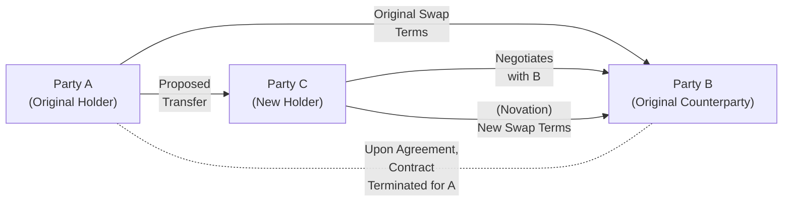

## Overview

Swaps may be binding contracts with a set maturity date, but that doesn’t mean you’re always stuck with them until the end of time. Sometimes market conditions shift so drastically, or risk objectives change so fast, that you need to close out your position sooner rather than later. Knowing how to terminate a swap––or hand off your position to someone else––is a vital skill for effective risk management and capital deployment.

In previous sections on swaps (particularly those covering interest rate swaps, currency swaps, and valuation methods), we explored how these contracts help in risk mitigation, yield enhancement, or cost reduction. Here, we focus on the exit door. By understanding the methods, motivations, and mechanics of ending or transferring a swap position, you’ll be better able to adapt your portfolio when circumstances demand flexibility.

## Key Methods of Early Termination

Early swap termination is typically achieved in one of three ways: via close-out (also called a termination payment), using an offsetting swap, or through novation. Each has nuances in terms of accounting, legal documentation, counterparty credit risk, and cost implications. Let’s walk through these in more detail.

### Close-Out/Termination Payment

One direct approach is the close-out/termination payment. It’s a bit like deciding you don’t want to keep your portion of a car lease anymore and so you pay your leasing company a fee to finalize your obligations. In the context of swaps, a close-out payment involves one party compensating the other in cash for the current market value of the contract. This is effectively the net present value (NPV) of all expected future cash flows in the swap, discounted to reflect current market interest rates, credit risk, and other relevant parameters. 

• The terminating party may owe the other side if the swap has positive value for that other side.  
• Conversely, if the swap has a negative value for the terminating party (i.e., a positive value for the other side), then the terminating party must pony up a lump sum.  

In many standardized agreements, such as those drafted under the International Swaps and Derivatives Association (ISDA), the calculation of this payment is spelled out in detail, minimizing the chance of protracted disputes. But in reality, negotiations still arise—especially if the parties disagree on the discount rate or other assumptions used in the valuation model.

Some folks prefer a close-out approach if they value administrative simplicity. Once you write that check (or receive one), your obligations are met. You’re out. This route can, however, be costly if your counterparty is deeply in-the-money. It’s not uncommon for the termination fee to be large, so you’ll want to assess whether you’re ready to handle that immediate cash outflow.

### Offsetting Swap

An offsetting swap is a bit like taking a second bet that counters your first. Imagine that, earlier, you entered a pay-fixed, receive-floating interest rate swap and you now regret it (maybe you expect rates to fall instead of rise, or your liability structure changed). You could enter a new swap where you receive fixed and pay floating in the same notional amount, effectively canceling your net cash flow exposure over time.

• Legally, the first swap is still on your books––you haven’t severed that contractual obligation. You’re just layering another swap.  
• Economically, the new swap offsets your net interest rate exposure, so you’re effectively “flat” regarding the original risk factor.  

Offsetting is, by far, a common route in practice because you don’t need the original counterparty’s permission. You just enter a new contract with either the same counterparty or a different one. However, keep in mind that your credit exposure might effectively double, in the sense that you owe obligations to both your old and new counterparty. Netting agreements can help reduce that real economic credit exposure, but from a strictly contractual standpoint you have two separate deals.

Offsetting swaps also leave the original swap contract in place, which, for better or for worse, can maintain complexities around documentation and potential netting sets. On the plus side, because you’re not unwinding the first contract, you often avoid paying or receiving a termination fee. Instead, your cost (or benefit) is captured through the terms you negotiate for the new swap, potentially at the prevailing market rates.

### Novation

Novation is more than a fancy legal term. It’s the formal process of transferring one party’s rights and obligations under the swap to a new party, subject to the consent of all original signatories. Think of it like you’re handing the keys to your lease to a friend who’s willing to take over the car payments, but the car dealership (i.e., your financing bank) must approve it. Once the novation is complete, you’re out of the contract, and your friend steps into your shoes entirely.

• A new swap contract is formed between the remaining original counterparty and the new entrant.  
• The new entrant assumes the credit risk for performing the obligations, and you, the outgoing party, are released from future claims.  

For instance, if you’re a corporate treasurer who originally entered a swap with Bank A, and you want to unwind your position by passing it to Company C, then Bank A and you must sign a novation agreement that all three parties stipulate. After the novation, your exposure to Bank A disappears, and Company C now faces Bank A under the same or substantially similar swap terms.

It’s important to note that novation can involve a fee if the swap is in the money, so the outgoing party might receive compensation from the new entrant (or pay, if the contract is out-of-the-money). In addition, completing a novation often involves more documentation, internal credit reviews (for the new entrant), and time. That said, if you truly want to be off the hook legally, novation is the only definitive way to pass all future exposures and responsibilities to someone else.

## Motivations for Early Termination

Market participants might want to terminate or transfer their swaps for various reasons:

• Changing risk objectives: A treasury manager’s view on interest rates might flip, or a corporate strategy might shift.  
• Balance sheet management: Closing or transferring a swap can reduce recognized liabilities and fix certain financial ratios.  
• Regulatory or capital requirements: Banks often unwind swaps to meet new capital or liquidity rules.  
• Mergers and acquisitions: After a corporate restructuring, you might not need that old currency swap.  
• Credit concerns: If you’re worried about your counterparty’s solvency, you might prefer to terminate or novate rather than risk default.  

In practice, these motivations can accumulate over time, so it’s common to see waves of swap terminations––particularly in times of economic upheaval or regulatory reform.

## Valuing the Swap for Termination or Novation

In section 3.5, we covered how to determine a swap’s fair value using discount factors, projection curves, and other modeling techniques. Those same methods apply here, but with nuances:

1. Establish the net present value (NPV) based on the current yield curve and implied forward rates (for interest rate or currency swaps).  
2. Adjust for credit risk if applicable (the discount rate can depend on the specific bank or corporate credit rating).  
3. Factor in any special agreement or overhead costs, such as administrative or legal fees.  
4. In negotiations, consider that if your counterparty expects a different future interest rate environment, they might claim a different “fair” NPV.  

Ultimately, the “termination value” or “novation value” of a swap is the consensus of both sides, usually anchored by theoretical market values but with potential adjustments for credit or other intangible factors.

## Steps in the Novation Process

Below is a simplified depiction of how parties and cash flows re-align when a novation occurs:

1. Party A (the original holder) identifies Party C as a potential replacement.  
2. Party A approaches Party B (the original counterparty) to request consent to novate.  
3. Party B reviews Party C’s creditworthiness.  
4. All three parties sign a novation agreement, specifying the effective date and the final settlement amounts.  
5. Party A pays or receives any necessary termination fee.  
6. Party C becomes the new contract holder, stepping fully into the obligations of Party A.  
7. Party A is legally released from the swap.  

## Common Pitfalls and Practical Considerations

• Incomplete documentation: If your ISDA Master Agreement doesn’t have a robust novation clause, the process is more complex.  
• Credit risk changes: The original counterparty might demand additional credit protection if the new entrant’s credit rating is lower.  
• Hidden fees: Watch out for early termination charges or administrative fees that can erode your expected gains.  
• Legal formality: A new swap with offsetting terms does not necessarily discharge your original liabilities. Check whether you want true legal release (novation) or just an economic offset.  
• Market uncertainty: If interest rates or foreign exchange rates are volatile, the swap’s market value can shift drastically between the start of negotiation and the finalized agreement.

## Real-World Example

Let’s say you’re the CFO of a mid-sized tech firm. You originally entered a 5-year interest rate swap to pay fixed at 3% and receive floating 3-month LIBOR + 0.5%. You intended to hedge your variable-rate debt. Times change, though, and you refinance your loan into fixed-rate debt at a more competitive rate. Suddenly, your interest rate swap is redundant.

You evaluate your options:

• A close-out payment to your counterparty might cost you $500,000, reflecting that pay-fixed is losing relative to current lower rates.  
• An offsetting swap where you receive fixed at 3% and pay floating might have a smaller up-front cost—instead, you effectively lock in some new floating rate exposure (which you might or might not be comfortable with).  
• A novation might be possible if there’s another company that wants a pay-fixed swap at 3%. That new party might pay you a small sum to step into the swap, but only if your counterparty and that new party’s credit profile align.

After some scurrying around (and perhaps a few phone calls to your banking contacts), you find that a sister company in your corporate family wants the exact pay-fixed position. A novation gets hammered out, and you’re able to exit your swap for a net settlement of $480,000 instead of the $500,000 initial termination quote.

## Best Practices for Swap Termination or Novation

• Maintain open communication: Talk early and often with counterparties if you foresee changes in your hedging strategy.  
• Use standardized documentation: Adopting ISDA protocols streamlines negotiations.  
• Monitor market conditions: The cost of early termination can fluctuate quickly with yield curve changes.  
• Weigh the legal release benefits vs. offset simplicity: If you really need it off your books, push for novation; if an offset is enough, you might prefer the speed and convenience of a new swap.  
• Check portfolio correlations: If you’re offsetting one swap with another, ensure you’re not inadvertently introducing new basis risks.

## Exam Relevance

For your CFA exam, you might see scenario-based questions that test your comprehension of swap termination alternatives and associated costs. You could face item-set or constructed-response questions where you must calculate the termination payment, compare offsetting vs. novation, or analyze how changes in the term structure impact a swap’s fair value. Key exam scenarios often include:

• Calculating the cost of terminating a swap with a marked-to-market approach.  
• Determining which method (close-out, offset, or novation) is most suitable given a firm’s risk tolerance.  
• Explaining the consequences of credit risk and valuation assumptions on early termination fees.  
• Showcasing understanding of contractual mechanics when transferring obligations to another party.

Time management is always critical in the exam environment. If you’re presented with multiple steps, such as discounting future cash flows, factoring in credit charges, or referencing different yield curves, tackle them systematically and watch out for small details that can lead to big differences in final numbers.

## References and Further Exploration

• ISDA Master Agreement Documentation: For standardized termination and novation provisions.  
• Johnston, Jack. “Financial Markets and Institutions.” Provides practical use cases and real-world examples.  
• Sections 3.1 and 3.5 of this volume: Offer deeper insight into how swaps are constructed and valued at different stages of their life cycle.

## Final Thoughts

I once saw a colleague manage a complicated swap strategy through an acquisition––there were multiple parties, shifting interest rate expectations, and a boatload of paperwork. They ended up novating the entire position to a newly formed financing arm, which turned out to be the best solution once they crunched the numbers. It’s a reminder that, yeah, the process can be a bit hectic, but having these termination tools in your back pocket can save you headaches (and money) when the winds of the market start blowing in unexpected directions.

---

## Test Your Knowledge: Swap Termination and Novation



### A company wishes to remove its swap from its books entirely and avoid any potential future claims. Which termination method is most appropriate?

- [ ] Offsetting swap
- [ ] Close-out via termination payment
- [x] Novation
- [ ] Extension of swap maturity

> **Explanation:** Only a novation transfers obligations to a new party and releases the original holder from further contractual claims and credit risk.

### When a party enters into an offsetting swap to neutralize its exposure from a prior swap, what is the main drawback?

- [ ] It increases legal obligations for the original swap.
- [x] The party still retains the original swap’s liabilities in a legal sense.
- [ ] It immediately terminates the first swap and absolves future claims.
- [ ] It automatically reduces the need for collateral.

> **Explanation:** An offsetting swap provides an economic hedge but does not legally discharge the original contractual obligations.

### In a close-out or termination payment, the key determinant of the payment amount is:

- [x] The fair market value of the existing swap’s net cash flows.
- [ ] The floating interest rate set by the counterparty’s bank.
- [ ] A fixed termination fee dictated by standard ISDA guidelines.
- [ ] The difference between the notional amounts of both legs.

> **Explanation:** Termination payments typically reflect the net present value of expected future cash flows, adjusted for current market conditions.

### Which of the following factors is most likely to complicate the novation of a swap?

- [ ] Absence of any legal framework.
- [ ] The new counterparty’s greater creditworthiness.
- [ ] An offsetting swap is easier to arrange.
- [x] The original counterparty’s reluctance due to the new entrant’s credit risk.

> **Explanation:** During novation, the original counterparty must vet the new party’s creditworthiness, which can slow or hinder the process if concerns arise.

### A firm is paying fixed at 2.5% and receiving LIBOR on a swap that currently has negative value for the firm. If market fixed rates are now 3.0%, which statement is correct regarding a termination payment?

- [x] The firm might receive a payment if their locked-in fixed rate is lower than the market rate.
- [ ] The firm will be indifferent to termination costs since it pays a fixed rate anyway.
- [ ] The firm will owe a substantial termination fee because the swap is out-of-the-money for them.
- [ ] The swap has no market value under these conditions.

> **Explanation:** Since the firm’s fixed rate of 2.5% is below the current market rate of 3.0%, that pay-fixed position is advantageous and holds a positive market value from the firm’s perspective, meaning they might receive a payment upon termination.

### Offsetting a swap involves:

- [x] Entering a new swap with mirror terms that effectively cancel out the original position’s exposure.
- [ ] Using the same notional but exchanging floating legs for fixed legs to lower costs.
- [ ] Immediately dissolving all legal obligations through a novation agreement.
- [ ] Merging two existing swaps to reduce the notional amount.

> **Explanation:** An offsetting swap is mainly about mirroring the cash flows and neutralizing the risk, even though the original swap legally remains in force.

### If a swap transaction is deep in-the-money for one party, and a novation is sought, which outcome is most likely?

- [x] The existing in-the-money party may demand a compensation from the incoming party.
- [ ] The new counterparty will pay the original out-of-the-money counterparty to take on the swap.
- [ ] The novation process becomes impossible.
- [ ] The original party’s credit risk remains with the original counterparty.

> **Explanation:** In a novation of an in-the-money swap, the original holder typically seeks compensation due to the positive market value.

### Which statement best describes the difference in credit exposure between an offsetting swap and a novation?

- [x] An offsetting swap leaves the original party facing both the original and the new counterparty.
- [ ] A novation does not affect credit obligations.
- [ ] Both have identical credit exposures.
- [ ] Offsetting swaps eliminate all credit risk for the original party.

> **Explanation:** With an offset, you now have two positions in place (the original swap plus the offset) and remain on the hook to each counterparty. In a full novation, you are released from the original contract.

### Prior to executing a termination or novation, counterparties typically:

- [x] Determine a swap’s market value via recognized valuation models.
- [ ] Waive standard legal clauses to expedite the process.
- [ ] Swap new notional values without negotiation.
- [ ] Transfer all counterparties’ obligations to an external clearing house.

> **Explanation:** Accurately determining the swap’s fair market value is crucial to figure out the payment or the terms of novation.

### True or False: When a swap is novated, the original party typically retains legal liability for future claims.

- [ ] True
- [x] False

> **Explanation:** In novation, the original party’s obligations are transferred to the new party, releasing the original counterparty from future liability.


