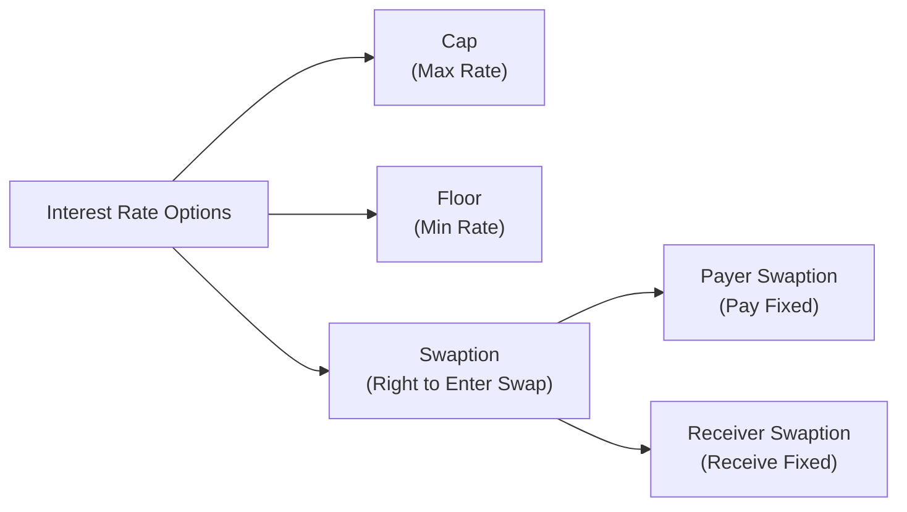

## Overview

Interest rate caps, floors, and swaptions are critical tools in the interest rate derivatives toolkit. They provide ways for market participants—such as corporate treasurers, portfolio managers, or even risk-averse homeowners—to hedge against unfavorable movements in interest rates or, conversely, to gain from anticipated rate shifts. Unlike vanilla swaps (discussed in earlier sections), these derivatives embed optionality, conveying the right but not the obligation to receive a certain payoff. In other words, they carry option-like features that can protect you from rising or falling rates or give you flexibility about entering a future swap. 

I once heard a corporate treasurer say, “We just want to sleep at night, knowing our interest expense won’t run away from us.” That sums up the appeal of caps, floors, and swaptions pretty neatly. They let you lock in a maximum or minimum interest rate or ensure you have the right to enter a swap under favorable conditions. Let’s walk through the essential mechanics, valuation angles, and uses of these instruments, tying them to real-world scenarios and best practices.

## Key Concepts in Interest Rate Caps

An interest rate cap sets an upper limit on a floating rate. If the underlying reference rate (often something like 3-month LIBOR, historically, or now more often SOFR—a risk-free reference rate) stays below your agreed strike rate, the holder receives no payoff. But if the reference rate exceeds the cap’s strike rate, the holder is compensated for the difference. This instrument typically benefits a floating-rate borrower who wants to prevent their interest expense from soaring if rates spike.

Though the term “cap” sounds singular, a cap is actually made up of multiple individual optionlets (commonly called “caplets”)—one for each interest-payment period. Each caplet pays off independently. So, if interest rates exceed the cap strike in one period, the holder gets a payoff for that period, even if rates fall below the strike the next time around.  

### Mechanics of a Cap

• Strike Rate: The agreed-upon interest rate threshold, often denoted K.  
• Reference Rate: The floating rate observed at the beginning of or during each caplet period (e.g., 3-month LIBOR, 1-month SOFR).  
• Payoff Calculation: The payoff for each caplet is:


\text{Caplet Payoff} = \max(\text{Reference Rate} - K, 0) \times \text{Notional} \times \tau


where τ is the day-count fraction for the accrual period.

Once each caplet’s payoff is known, the sum of discounted payoffs across all periods—discounted back to present value—represents the overall cap value.

### Typical Users

• Floating-Rate Borrowers: Corporations (or municipalities) with exposure to rising rates. A cap ensures their debt cost doesn’t exceed a certain level.  
• Portfolio Managers with Floating-Rate Liabilities: Managers might use caps to control liabilities pegged to market rates.  

For instance, say a real estate developer has a large project financed with a floating-rate loan. They’re worried that rates might rise in the next 12 months. Buying a cap is like paying an insurance premium—maybe the developer never claims on it, but if rates spike, they’re glad they had the coverage.  

## Interest Rate Floors

An interest rate floor, on the other hand, sets a lower bound on rates. It might initially sound odd to want a minimum interest rate, but it’s very valuable for investors who receive floating-rate payments. If the reference rate disappears beneath the strike, the floor compensates them for the shortfall.

Like caps, floors are composed of multiple “floorlets,” each of which may pay off if the reference rate for that accrual period falls below the strike.

### Mechanics of a Floor

• Strike Rate: The agreed-upon lower interest rate threshold.  
• Reference Rate: The floating rate measured against the strike.  
• Payoff Calculation:


\text{Floorlet Payoff} = \max(K - \text{Reference Rate}, 0) \times \text{Notional} \times \tau


Because the payoff is positive when the market rate is below the strike, a floor effectively works like an interest rate put option, ensuring a minimum return on floating-rate instruments.

### Typical Users

• Floating-Rate Bondholders: They rely on interest income pegged to short-term rates, so they want protection from a drastic drop in interest rates.  
• Lenders in a Floating-Rate Loan: A bank might purchase a floor if it suspects rates could fall, adversely impacting interest income on its floating-rate portfolio.

## Pricing Considerations for Caps and Floors

Caps and floors rely on option-style pricing. Each caplet or floorlet can be priced using models similar to those employed for interest rate options. Depending on the complexity, practitioners might use a Black model, a Hull–White model, or more sophisticated short-rate (or forward-rate) approaches.

Key Drivers of Cap/Floor Pricing:  
• Time to Expiration (for each caplet/floorlet).  
• Volatility of the underlying reference rate.  
• Strike Rate relative to the forward curve.  
• Discount Factors used to bring future payoffs to present value.  
• Interest Rate Environment: For example, if the yield curve is upward sloping or extremely flat, that changes the cost of buying cap/floor protection.

In periods of heightened rate volatility, cap premiums can become surprisingly hefty. I recall a conversation in 2022 with a risk manager who was stunned at how the cost of caps had quadrupled within a couple of months because of intense market expectation shifts. That’s typical—volatility sets option premiums ablaze.

## Swaptions

Swaptions are options on swaps. A swaption grants the holder the right, but not the obligation, to enter into an interest rate swap at a specified future date under pre-agreed terms (fixed rate, notional, etc.). There are two main types:

• Payer Swaption: Gives its holder the right to enter a swap as the fixed-rate payer (and floating-rate receiver).  
• Receiver Swaption: Gives its holder the right to receive fixed and pay floating.

Interestingly, each type of swaption can be seen as a call or put on the fixed leg of the swap. Think of a payer swaption as a “call on rates,” giving you the right to “lock in” paying a fixed rate if you believe rates might move in your favor. Meanwhile, a receiver swaption is like a “put on rates,” giving you the right to lock in receiving a fixed rate.

### Mechanics of a Payer vs. Receiver Swaption

Let’s illustrate with a simple example. Suppose a corporate treasurer knows they might need to borrow at a floating rate in 6 months, but they suspect rates could jump. By purchasing a payer swaption, they effectively secure the right to pay a predetermined fixed rate. If rates do soar, they can exercise the swaption and lock in that fixed rate, offsetting the borrowing cost. If rates remain tame, they let the swaption expire and borrow at the then-lower (or moderate) floating rate.

For a receiver swaption, the logic flips. An investor might want to ensure they can receive a certain fixed rate if they think rates will plunge. If the market fixed rate goes down, the receiver swaption is valuable because the investor can enter the swap at the old, higher fixed rate and effectively earn more.

### Cash-Settled vs. Physically Settled

A swaption can be physically settled (you actually enter into the swap) or cash-settled (you receive the economic equivalent in cash, with no ongoing swap). In practice, physically settled swaptions are common among banks and corporates looking to manage real exposures, whereas cash-settled swaptions can be more convenient for traders.

## Risk Management Applications

Caps, floors, and swaptions all revolve around managing future interest rate risk. They let you respond to an uncertain rate environment by paying a premium today for optional protection or an optional ability to enter a swap. Here are some typical use cases:

• Hedging Future Debt: A firm anticipating a floating-rate loan can buy a cap (or a payer swaption on a swap) to limit upward rate risk.  
• Hedging Future Investments: A manager expecting to invest in floating-rate securities might purchase a floor or a receiver swaption if they fear lower interest rates will reduce income.  
• Speculative and Trading Strategies: Some sophisticated strategies involve selling caps, floors, or swaptions to collect premiums if you believe rates won’t move. However, selling options comes with significant tail risk if you guess incorrectly.  
• Locking in Credit Spreads: Combine swaptions with credit derivatives if you need integrated hedging for interest rate risk and spread risk (though that’s edging into more advanced territory).

## Practical Structuring with Caps and Floors

Let’s say you are a CFO with a large floating-rate loan that resets quarterly. You want to create a “worst-case scenario” for your interest cost. You could:  
1. Buy a 3-year cap with a strike near your company’s desired maximum rate.  
2. Pay a premium upfront.  
3. At each quarterly reset, if your reference rate is above the strike, you receive a payment offsetting the higher interest cost on the loan.  

Alternatively, if you are the lender (e.g., a bank) for that same loan, you might buy a floor to ensure the interest income you receive never sinks below a certain level. For a real estate investment trust (REIT) or similar entity heavily reliant on floating-rate funding, these strategies can be a lifesaver if rates move drastically.

## Valuation Approaches and Models

### Black Model for Caplets/Floorlets

A well-established framework for caplets/floorlets is the Black model (a variant of Black–Scholes for interest rates). You treat each caplet as a call on the underlying forward rate:


\text{Caplet Value} = P(t, T) \times [F_{cap} \times N(\text{d}_1) - K \times N(\text{d}_2)] \times \tau \times \text{Notional}


where:  
• \\( P(t, T) \\) is the discount factor to time T,  
• \\( F_{cap} \\) is the forward rate for the relevant period,  
• K is the strike,  
• \\( N(\cdot) \\) is the cumulative distribution under a lognormal assumption,  
• \\( \text{d}_1 \\) and \\( \text{d}_2 \\) are standard Black–Scholes terms depending on volatility, time, etc.  
• \\( \tau \\) is the accrual fraction of the year.

You would sum up all the individual caplets’ values to get the entire cap’s present value.

### Option Pricing for Swaptions

For swaptions, a typical approach involves:  
1. Determining the forward swap rate (the rate that would make the swap fair at the expiry of the swaption).  
2. Plugging that into a Black or Bachelier formula specifically adapted for swaptions.  
3. Multiplying by the present value of a basis point (PVBP) or notional-based factor.  

The unique twist in swaptions is that the underlying is the swap rate, which itself depends on multiple forward rates. This can lead to more advanced multi-factor interest rate models—like Hull–White, SABR, or LMM (the Libor Market Model)—to capture the dynamics. However, for many CFA Level III exam scenarios, a simplified one-factor approach or the conceptual understanding of how a swaption is priced is more likely tested.

## Diagram: Relationship Among Interest Rate Options

Below is a simple Mermaid diagram illustrating how interest rate caps, floors, and swaptions relate to each other in a conceptual flow. Think of it as a map of optional payoffs or rights.

Reading the diagram from left to right:  
• You start with the universe of “Interest Rate Options.”  
• This branches into either capping a floating rate, flooring a floating rate, or creating an option to enter a swap (swaption).  
• The swaption can be subdivided into the two main types (payer vs. receiver).

## Case Studies and Real-World Scenarios

### Case Study 1: Corporate Borrower Hedging

A mid-sized manufacturing firm, with a loan tied to 3-month LIBOR + 200 bps, is concerned that rates might increase drastically in the next year. The CFO buys a 1-year interest rate cap at a strike of 5%. The cap’s annualized premium costs 1% of the notional. After 6 months, 3-month LIBOR jumps to 5.5%. The CFO recovers the difference (0.5%) on that notional for that interest period. The next quarter, LIBOR drops to 4.8%, so no payoff occurs. But that’s okay—payment is only triggered when they need it most.

### Case Study 2: Insurance Company Protecting a Variable Annuity Portfolio

Insurance firms often have variable annuities tied to floating rates, but they want minimum guaranteed crediting rates. To hedge that exposure, an insurer might buy a power of floors (a series of floors matching the liability durations) ensuring that even if rates plummet, they can still meet contract guarantees. 

### Case Study 3: Payer Swaption for a Future Debt Issuance

A technology startup plans a debt offering in six months. Fearing an uptick in interest rates, they buy a payer swaption. If yields spike, they’ll exercise and lock in paying a lower fixed rate than what the market might otherwise demand at issuance time. This approach provides flexibility: if yields remain benign, the startup lets the swaption expire. Yes, they forfeit the premium, but they avoided a big headache if rates had soared.

## Best Practices and Common Pitfalls

• Identify the Correct Instrument: Sometimes, a cap is the simplest hedging tool for a floating-rate liability, while other times a payer swaption is more cost-effective. Evaluate both.  
• Premium Cost vs. Potential Benefit: Options cost money. Watch for situations when the market is extremely volatile—option premiums might be very high, making it more cost-effective to consider a plain-vanilla swap.  
• Model Risk: If you’re using advanced valuation models, small changes in volatility assumptions can significantly affect option prices. This is a common exam theme: you should know how implied volatility influences an interest rate option’s value.  
• Liquidity Issues: Certain maturities or strikes might lack liquidity. Large positions can move the market.  
• Handling Negative Rates: With reference rates sometimes venturing into negative territory, ensure your option model can handle or interpret floor calculations properly.

## Exam Relevance for CFA Level III

On the Level III exam, caps, floors, and swaptions frequently appear in the context of portfolio hedging or asset liability management. You might see:

• An item-set question with a scenario about a corporate borrower deciding between a cap and a swaption.  
• An essay-style question that tests your ability to calculate the payoff or value given certain interest rate movements.  
• Strategy-based prompts where you must explain the rationale for choosing a receiver swaption rather than a forward rate agreement or a bond futures hedge.

Remember: exam questions often combine multiple derivative concepts. For instance, you might see a question about an asset-liability mismatch where the portfolio manager debates interest rate futures, caps, and swaptions. Understand how each derivative’s payoff structure lines up with the manager’s exposures.

## References and Further Reading

• Hull, John C. “Options, Futures, and Other Derivatives.” Chapters focusing on interest rate derivatives detail the pricing mechanics and market conventions.  
• ISDA (International Swaps and Derivatives Association), http://www.isda.org, provides valuable insights into standardized documentation and industry best practices.  
• Brigo, Damiano, and Fabio Mercurio. “Interest Rate Models: Theory and Practice.” Offers a deep dive into cutting-edge interest rate modeling, from short-rate to forward-rate frameworks, suitable for advanced readers.  

If you find these resources dense, fear not—these topics grow more intuitive with practice, especially as you see real-life uses. And if you ask me, there’s nothing quite like the relief of having an interest rate option in place when markets go haywire.

## Test Your Knowledge: Interest Rate Caps, Floors, and Swaptions



### When might a borrower choose an interest rate cap?
- [ ] When they want to lock in a minimum interest rate on a floating-rate asset.
- [x] When they want to keep their floating-rate payments from exceeding a certain level.
- [ ] When they expect to receive fixed payments and pay floating.
- [ ] When they need the right to pay fixed in a future swap.

> **Explanation:** A borrower with a floating-rate loan might buy a cap to ensure that their interest costs do not exceed a certain maximum rate.

### Which statement best describes a floor?
- [ ] A series of call options on an interest rate.
- [x] A series of put options on an interest rate.
- [ ] A single forward rate agreement.
- [ ] A derivative that forces the holder to receive floating.

> **Explanation:** A floor is effectively a series of interest rate puts (floorlets) that compensates the holder when rates fall below the strike.

### What is a payer swaption?
- [ ] An option to receive fixed and pay floating on a future swap.
- [ ] An agreement to fix the interest rate for a future deposit.
- [x] An option granting the holder the right to pay fixed and receive floating on a future swap.
- [ ] A guarantee that a loan will not exceed a certain interest rate.

> **Explanation:** A payer swaption allows the holder to become the fixed-rate payer (and floating-rate receiver) in the underlying swap.

### Why might a receiver swaption make sense for an investor?
- [ ] Because it forces them to accept a high fixed rate in the future.
- [ ] Because it reduces the need for any premium payment.
- [x] Because it grants the option to lock in receiving a fixed rate if the investor anticipates lower interest rates in the future.
- [ ] Because it always provides a guaranteed payoff irrespective of rate movements.

> **Explanation:** A receiver swaption allows the holder to benefit if fixed rates decline. If rates drop, receiving a higher fixed rate is advantageous.

### In valuing caplets using the Black model, which of the following does NOT directly impact the payoff calculation?
- [ ] The strike rate relative to the forward rate.
- [x] The passing of a credit event schedule.
- [ ] The discount factor to bring future payoffs to present value.
- [ ] The volatility of the underlying interest rate.

> **Explanation:** Credit event schedules are typically not part of standard interest rate caplet valuation. The key factors are strike vs. forward rate, discounting, and volatility.

### Which user scenario aligns best with buying a floor?
- [ ] A bank that wants to cap its borrowing cost on a floating-rate loan it owes.
- [ ] A corporate financing inventory with a fixed-rate bond issuance.
- [x] An investor receiving a floating rate on a note, concerned about falling interest rates.
- [ ] A fraction of a portfolio wanting a guaranteed future swap rate.

> **Explanation:** A floor is typically bought by someone who receives floating payments and wants protection against falling rates.

### What is the main difference between a swaption and a standard interest rate swap?
- [x] A swaption is an option on a future swap, while a swap is an agreement to exchange payments.
- [ ] A swaption bundle is always cheaper than a standard swap.
- [x] A swaption can be exercised or not, while a swap must be executed as agreed.
- [ ] A swaption is always credit risk–free, but a swap is not.

> **Explanation:** A swaption confers the right (but not the obligation) to enter a swap, whereas a swap is a contractual obligation. Also, both carry credit risk, though the swaption’s credit exposure is different from that of a live swap.

### Which of the following best describes a “caplet”?
- [x] A single-period interest rate call option within a cap.
- [ ] A multi-year contract guaranteeing a maximum interest rate.
- [ ] A portion of a swap that pays fixed and receives floating.
- [ ] A fraction of a loan whose interest rate is fixed.

> **Explanation:** A cap is composed of multiple caplets, each of which is a separate interest rate call option.

### How can a payer swaption hedge rising interest rates for a future borrowing need?
- [x] If market fixed rates rise, the holder can exercise the swaption and lock in paying the original fixed rate.
- [ ] If floating rates fall, the holder receives a payment from the swaption.
- [ ] The holder is obligated to pay fixed if the swaption is exercised by the seller.
- [ ] It forces the holder to take on floating-rate liabilities.

> **Explanation:** By exercising a payer swaption in a higher-rate environment, the borrower locks in what is effectively a lower fixed rate, offsetting the rising cost of floating-rate borrowing.

### True or False: A floor can protect a lender that holds floating-rate assets against steep declines in interest income.
- [x] True
- [ ] False

> **Explanation:** A floor ensures the lender (receiving floating payments) does not face drastically lower payments if the reference rate drops below the strike.


