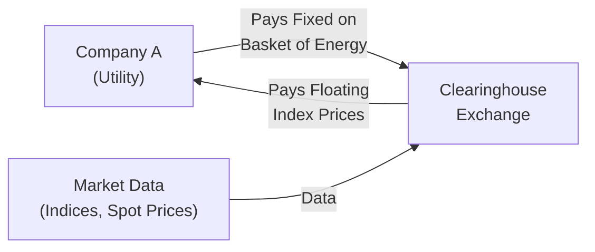

## Introduction
Freight and commodity swaps hold a central place in the modern derivatives landscape, especially for organizations wrestling with volatile shipping costs and resource prices. They can be powerful, and sometimes underappreciated, tools for mitigating risk. If you’ve ever chatted with someone in the shipping business—say a dry bulk shipping operator or a tanker specialist—you’ve likely heard them joke about how freight rates can skyrocket or plunge overnight. I remember meeting a risk manager who was at his wits’ end when a sudden uptick in freight prices completely upended his quarterly budget. This was precisely the kind of situation that freight swaps aim to control.

In simpler terms, freight swaps involve exchanging a floating freight rate (often linked to an index like those from the Baltic Exchange) for a fixed rate. It’s like telling your shipping partner, “You know what, I’d rather just pay (or receive) a fixed rate over the next quarter or year, so I can budget without surprises.” Commodity swaps, meanwhile, operate on a similar principle—swapping fixed for floating—but they focus on energy, metals, or agricultural prices. Together, they help end users lock in stable operating margins or production profits. Below, we’ll dive into the mechanics, uses, and risk considerations of both freight and commodity swaps, highlighting practical examples along the way.

## Freight Swaps: A Deeper Dive
Freight swaps are often referred to as Forward Freight Agreements (FFAs). In each case, the main purpose is to transform a floating freight exposure into something more predictable. Imagine you’re a large shipping company responsible for transporting iron ore between major global ports. If spot freight rates double due to a spike in demand or a shortage of vessels, your shipping costs escalate quickly. On the flip side, if you’re receiving freight revenue and a sudden glut of vessels drives down freight rates, your earnings can plummet. Freight swaps allow you to mitigate these unexpected twists.

### Market Participants
• Shipping Companies: Naturally, shipping giants may use freight swaps to stabilize cash flows.  
• Commodity Producers: Mining firms or energy companies that hold shipping commitments often hedge forward freight costs.  
• Trading Houses: Trade houses or banks might use freight swaps to speculate on freight rate movements or to structure hedging solutions for clients.  
• Financial Intermediaries: Investment firms sometimes seek alpha in freight rate fluctuations, though that’s more about speculative approaches.

### Freight Rate Indices
Most freight swaps settle against well-known industry indices. You might have heard folks in the maritime world refer to the “Baltic Exchange” daily. The Baltic Exchange publishes widely followed benchmarks like the Baltic Dry Index (BDI) for dry bulk and other indices for tanker rates. Because these indices reflect real shipping activity, they serve as the floating reference rate in freight swap agreements.

### How Freight Swaps Work
In a freight swap, one party pays a fixed rate, while the other pays a floating rate linked to an index. Settlements may occur monthly, quarterly, or on some agreed schedule. Let’s say we’re dealing with a shipping route from Brazil to China for iron ore. Party A, the shipping operator, expects to transport iron ore in the upcoming quarter but wants to lock in a known rate. Party B, a counterparty, might be willing to take the opposite side of that trade.

Below is a simple diagram of how payments might flow in a typical freight swap:

```mermaid
sequenceDiagram
    participant A["Party A <br/> (Shipping Company)"]
    participant B["Party B <br/> (Counterparty)"]
    A->>B: Pays Floating Index <br/> (based on the Baltic Exchange)
    B->>A: Pays Fixed Rate  <br/> (agreed in the swap)
```

This structure effectively transforms Party A’s shipping cost or freight revenue exposure from floating to fixed. If the market freight rate moves above the fixed rate, they gain on the swap (receiving net payments from the counterparty). If the market rate drops below the fixed rate, they’ll make net payments to the counterparty. In theory, that loss on the swap is offset by cheaper freight rates (if you’re a buyer of freight services) or an unfavorable realized shipping price (if you’re a provider).

### Forward Freight Agreements (FFAs) vs. Freight Swaps
You might see the terms FFAs and freight swaps used somewhat interchangeably. FFAs are conventionally described as over-the-counter (OTC) derivates that settle in cash. They are usually cleared on recognized platforms to reduce credit risk. In practice, they function very similarly to any other swap, with final settlement based on referenced indices like those from the Baltic Exchange.

### Freight Volatility and Seasonality
Freight rates can be more volatile than folks outside the shipping world might imagine. Factors driving volatility include weather disruptions (think major storms closing ports), geopolitical tensions (like shipping route restrictions), or shifts in mining production. And trust me, when you see a 50% freight rate spike in a few weeks, it’s enough to leave you breathless.

Seasonality also plays a role. Demand for certain commodities can jump in specific months, or shipping routes may become more expensive in winter. These cyclical patterns directly influence how you’d price your freight swaps and which months you might choose to hedge.

## Commodity Swaps: Broader Applications
Commodity swaps are somewhat analogous to freight swaps but focus on the prices for resources such as crude oil, natural gas, base metals, precious metals, or agricultural products (corn, wheat, soybeans, etc.). You may recall from Section 3.4 (Equity and Commodity Swaps) that a “vanilla” commodity swap will often exchange a fixed price for a floating reference price. However, the real world can be a bit more complex: many commodity swaps reference a basket of prices or an index that’s a weighted combination of multiple commodities.

### Indices or Baskets
One reason for referencing baskets is that commodity producers may have diversified exposures or require a hedge covering multiple underlying products. For instance, an oil company might want to hedge exposure to multiple qualities of crude, along with natural gas, to stabilize integrated margins.

### Key Players
• Producers: Oil producers, metal miners, or farmers who hedge to protect revenues or offset costs.  
• Refiners and Processors: Entities that buy raw commodities and convert them into finished goods (like gasoline or processed metals) might want to lock in input costs.  
• Financial Institutions and Hedge Funds: These participants either provide liquidity or seek speculative opportunities.  

### Valuation Considerations
Pricing a commodity swap requires analyzing the forward curve of the underlying commodity, which often includes storage costs and convenience yields (see Chapter 8 for more details on forward and futures pricing). For instance, oil swaps will incorporate factors such as regional supply/demand, storage constraints, and seasonal demand for heating oil or gasoline.

### Settlement and Clearing
Many commodity swaps are cleared through major exchanges (such as CME Group or ICE) to reduce default risk. Clearinghouses become the counterparty to both sides, ensuring margin requirements and daily valuations keep credit risk at bay. OTC deals remain common for tailor-made hedges, but the impetus for clearing or standardizing these swaps has grown significantly in recent years, particularly after various regulatory changes.

## Risk Management with Freight and Commodity Swaps
Both freight and commodity swaps can be invaluable for smoothing out earnings and cash flows. A shipping operator with high intolerance for volatility might be comfortable paying a slight premium in the swap market for the peace of mind that a known, stable price or cost provides. Commodity-intensive businesses—like airlines for jet fuel or steel producers for iron ore—may similarly benefit from using commodity swaps to hedge input costs.

### Basis Risk
A major consideration is basis risk, which arises if the index used in the swap doesn’t perfectly match the actual exposure. In freight markets, a shipping route from the Arabian Gulf to Japan might behave differently than the broader index, so a hedger either chooses an index that correlates closely or manages the mismatch carefully. With commodities, the mismatch might stem from hedging with a widely quoted index (e.g., Brent Crude) when the firm’s actual supply is priced off a different benchmark (e.g., WTI or a local-grade crude).

### Operational Risk and Liquidity
It’s also worth mentioning operational and liquidity concerns. Not all freight routes or commodities are equally liquid. Some specialized shipping routes, or certain niche commodities, might have limited swap liquidity, leading to wider bid-ask spreads and potential difficulty closing out positions. And let’s face it, even the best hedge is useless if you can’t gracefully enter or exit the position when you need to.

## Real-World Example: Hedging Freight Rates for Iron Ore
Let’s walk through a quick illustration. Suppose StarBulk Shipping expects to ship iron ore from Brazil to Eastern Asia over the next six months. Current freight rates, based on a relevant Baltic Exchange route index, are around \$15 per metric ton. StarBulk is worried rates might climb above \$20 during peak demand.

• StarBulk enters a freight swap to pay a fixed rate of \$16 per metric ton.  
• In return, it receives the floating rate that references the monthly average of the Baltic index.  
• If the floating rate spikes to \$22, StarBulk pays \$16 and receives \$22 from the swap, netting \$6. That compensates for the higher spot cost they face when actually booking the physical freight for that month.  
• If freight rates tumble to \$13, StarBulk receives \$13 but pays \$16, effectively losing \$3 on the swap—though physical shipping costs are cheaper.  

In this scenario, StarBulk’s overall shipping cost is kept near \$16. They are effectively budgeting and hedging that outflow, at the expense of not benefiting fully if rates stay low. That’s the standard trade-off in hedging: you reduce your upside in exchange for limiting your downside.

## Complex Commodity Swaps and Indices
While we typically picture a simple commodity swap referencing a single underlying, many players prefer more sophisticated multi-commodity indices that capture the movement of several related products. For example, a utility might lock in both natural gas and electricity prices in one composite swap. Another advanced approach might incorporate seasonal factors—perhaps a weighting that intensifies coverage in winter months if the primary risk is heating demand.

In addition, some parties embed optionality in their swaps, such as caps and floors (covered in 3.7: Interest Rate Caps, Floors, and Swaptions, but also relevant in commodity markets). These can ensure maximum or minimum cost levels if certain triggers are hit. Keep in mind, the more customized your swap, the more you often pay in terms of premium or the less liquidity you might find.

## Diagram: A Commodity Swap on an Energy Basket
Below is a simplified representation of a multi-commodity swap, where fixed and floating payments are exchanged for a basket of energy products:



• Company A pays a fixed rate on a basket of energy (gas + electricity), locked in for one year.  
• The clearinghouse collects floating market index data from various sources.  
• Each month, a settlement occurs where Company A receives the floating index price.  

This process aims to stabilize the cost that Company A pays to acquire the underlying products, preserving profitability or predictability in utility operations.

## Documentation, Legal, and Regulatory Starting Points
Like other swaps, freight and commodity swaps are typically governed by ISDA (International Swaps and Derivatives Association) master agreements. Regulatory requirements—like margin posting and clearing mandates—vary by jurisdiction. Although shipping routes or certain niche commodities historically lurked in relatively unregulated corners, post-crisis reforms (in the US, Europe, and elsewhere) pushed more swaps towards central clearing to reduce systemic risk. 

## Best Practices and Common Pitfalls
• Conduct Correlation Analysis: Before choosing an index for your freight or commodity swap, evaluate how closely it tracks your actual exposure.  
• Monitor Counterparty Credit Risk: Even cleared swaps have potential risk if large market disruptions occur. For OTC deals, it’s critical to evaluate the creditworthiness of your counterparty.  
• Account for Seasonality: Both the shipping and commodity markets can have marked highs and lows. Price your swaps to reflect these seasonal patterns.  
• Continuously Update the Hedge Ratio: Your shipping or commodity volumes could change, or your expected production might shift. Adjust your hedges accordingly to avoid being under- or over-hedged.  
• Beware of Overly Complex Swaps: While combining multiple commodities or including embedded optionality can be tempting, it can also create a labyrinth of settlement terms and exposures.  

## Personal Reflection
I recall working on a transaction years ago for a regional shipping firm that transported coal. They were about to sign a major contract for two years of shipments. Their CFO was losing sleep over the possibility that freight costs could balloon. We hammered out a straightforward freight swap: they locked in a fixed rate close to the then-current market average, with monthly settlements. Even though rates ended up dipping slightly a few months later—meaning they had to make net payments on the swap—the CFO was happy because it brought them consistency and validated their budgeting strategy. Sometimes the peace of mind alone is worth the swap’s cost.

## Interplay with Other Derivatives
Freight and commodity swaps don’t exist in isolation. Firms might combine them with exchange-traded futures or use them in tandem with option-based instruments like collars, caps, or floors. For instance, a company might hedge 50% of its exposure using a swap (to lock in a base level) and then buy an out-of-the-money call option to preserve some upside potential if prices move favorably. This broad approach is part of a holistic risk management program.

## Tying It Back to the Bigger Picture
In the context of portfolio management, these swaps can significantly alter the risk-return profile of a firm’s balance sheet or an investment vehicle’s commodity portfolio. They’re integral to corporate finance decisions when you’re rolling out capital plans that depend on stable shipping or input costs. From a macro perspective, freight derivatives have even been studied as indicators of global trade health, which ties into fundamental analysis for other asset classes—think equities or foreign exchange markets.

## Exam Tips for Freight and Commodity Swaps
1. Remember that freight swaps function similarly to other swaps, but the underlying is a freight rate index.  
2. Grip the concept of basis risk by analyzing correlation between the chosen index and the actual route or commodity exposure.  
3. Be ready to discuss how clearinghouses mitigate counterparty risk and how margin requirements come into play.  
4. Often, questions on the exam center on explaining the payoff of a swap or the net settlement if the index ends above or below the fixed rate.  
5. Show an understanding of how seasonality affects swap pricing, particularly for energy products and shipping routes with known cyclical demand.  

## References
• Alizadeh, A. H. and Nomikos, N. K., “Shipping Derivatives and Risk Management.”  
• Baltic Exchange. Retrieved from https://www.balticexchange.com  
• CME Group. Retrieved from https://www.cmegroup.com  
• ICE (Intercontinental Exchange). Retrieved from https://www.theice.com  

---

## Freight and Commodity Swaps Knowledge Check

```markdown


### 1. Which of the following best describes the primary purpose of a freight swap?

- [ ] To speculate on government-issued shipping subsidies.
- [x] To hedge against volatility in freight rates by swapping a fixed rate for a floating index.
- [ ] To exchange time-charter routes for spot shipping routes.
- [ ] To obtain regulatory approval for maritime operations.

> **Explanation:** Freight swaps enable participants to hedge freight rate movements. One party pays a fixed rate, while receiving a floating index-based rate, effectively stabilizing shipping costs or revenues.

### 2. In a typical freight swap referencing the Baltic Exchange indices, which statement is true?

- [ ] Settlement is determined by interest rate differentials.
- [ ] There is no need for margin since it is a spot transaction.
- [x] The swap’s floating leg is linked to a published benchmark of freight rates.
- [ ] The swap must be denominated in euros.

> **Explanation:** Freight swaps often settle against an index from the Baltic Exchange, which provides widely followed shipping rate benchmarks.

### 3. An iron ore shipping company is worried about significant increases in freight rates. It enters a swap to pay a fixed rate of $18/ton and receive the floating rate. If the floating rate climbs to $25/ton, what is the likely outcome for the company?

- [x] The company gains $7/ton on its swap.
- [ ] The company loses $7/ton on its swap.
- [ ] The company’s fixed payment is replaced with a spot transaction.
- [ ] The freight rate has no effect on the swap settlement.

> **Explanation:** If the floating rate is higher than the fixed rate, the company receiving the floating rate gains on the difference.

### 4. Which of the following represents a key distinction between freight swaps and standard commodity swaps?

- [x] Freight swaps involve an index related to shipping routes and vessel costs, while commodity swaps typically reference a physical commodity’s price.
- [ ] Commodity swaps cannot be cleared, whereas freight swaps always must be cleared.
- [ ] Freight swaps have no basis risk.
- [ ] Commodity swaps never incorporate seasonality adjustments.

> **Explanation:** Freight swaps use shipping-related indices such as those published by the Baltic Exchange. Commodity swaps track prices of physical commodities (e.g., crude oil). Clearing might apply to both, and both can exhibit seasonality and basis risk.

### 5. For a company hedging with a commodity swap on natural gas, which factor is crucial to consider for accurate hedging?

- [x] The correlation between the reference index and the company’s actual gas supply contract.
- [ ] Elimination of any margin requirement by using only OTC derivatives.
- [x] Seasonal demand fluctuations in gas prices.
- [ ] All commodity swaps remain in effect indefinitely.

> **Explanation:** Accurately matching the reference index to the actual underlying exposure is critical to minimize basis risk. Seasonal changes in demand (winter vs. summer) also play a big role in natural gas pricing.

### 6. Which term describes the mismatch between a firm’s actual exposure and the index or reference price used in a swap?

- [x] Basis risk
- [ ] Credit risk
- [ ] Capital risk
- [ ] Settlement risk

> **Explanation:** Basis risk is the difference between the exposure being hedged and the reference price used in the swap.

### 7. Which of the following is a common advantage of central clearing for freight and commodity swaps?

- [x] Improved credit risk management through daily margining.
- [ ] Elimination of variation margin requirements.
- [x] Enhanced liquidity for standardized contract terms.
- [ ] Guaranteed profit for the clearinghouse.

> **Explanation:** Central clearing helps reduce counterparty credit risk by requiring both parties to post margin and mark positions to market.

### 8. A shipping firm chooses a freight swap indexed to a route that only partially overlaps its actual shipping route. What risk might it be most exposed to?

- [x] Basis risk, because the chosen index may not track the firm’s actual shipping costs accurately.
- [ ] Currency risk, because the route is quoted in a different monetary unit.
- [ ] Commodity price risk, because it references an unrelated commodity.
- [ ] Liquidity risk, because freight swaps never have bid-ask spreads.

> **Explanation:** If the swap’s reference route differ from the firm’s actual route, the firm faces basis risk due to imperfect correlation with its actual operational costs.

### 9. What could cause a commodity swap to become more expensive for a hedger over time?

- [x] Rising expectations of future spot prices, leading to a higher fixed rate.
- [ ] The clearinghouse’s policy of negative margin rates.
- [ ] Peak winter demand is always included in the fixed leg.
- [ ] Commodity swaps are never repriced after initiation.

> **Explanation:** If forward markets forecast rising prices, the fixed rate demanded by swap counterparties often increases. The hedger might have to pay a premium to lock in that fixed rate.

### 10. True or False: Freight swaps only settle in physical delivery of shipping capacity.

- [ ] True
- [x] False

> **Explanation:** Freight swaps typically settle in cash, referencing published freight rate indices, rather than delivering physical shipping capacity.


```
