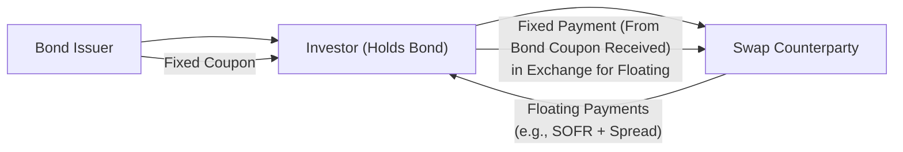

## Overview

Asset swaps combine fixed-income securities—most commonly bonds—with an interest rate swap to alter the character of the bond’s coupon payments. Typically, this transformation is from a fixed coupon to a floating rate or vice versa. The result? A customized cash flow profile that can be used to reflect your portfolio’s market view or to hedge interest rate risk.

I remember the first time I came across an asset swap. I was consulting for a small insurance company that wanted to hold a particular corporate bond (because they liked the credit) but also needed floating-rate payments in tune with short-term rates. Instead of searching for a floating-rate note from the same issuer (something that didn’t even exist), we used an interest rate swap attached to the bond. The CFO was excited because it was cost-effective, relatively easy to set up, and suddenly gave them the cash flow they wanted. That small “aha!” moment is the essence of asset swaps.

Let’s unpack how these structures are built, what they’re used for, and why they matter in practice.

## Conceptual Foundations

An asset swap is normally structured around two main building blocks:

1. A bond (or other fixed-income security—could even be structured notes or some niche issue).
2. A standardized interest rate swap (IRS), typically referencing a floating-rate index such as LIBOR in the past or SOFR (Secured Overnight Financing Rate) as the reference has shifted, as discussed earlier in 1.13 LIBOR Transition and Risk-Free Reference Rates.

### Mechanics in Brief

• You purchase a fixed-rate bond that pays a coupon of, say, 5% annually.  
• At the same time, you enter an interest rate swap in which you receive the fixed rate (close to 5%) and pay a floating rate (e.g., SOFR plus a spread).  
• Overall, your net result is that you owe a floating rate on the bond’s notional principal (and you collect the bond’s fixed coupon but pay it away on the swap). 

In effect, these steps transform the bond’s fixed coupon into floating payments. The difference in spreads will determine how profitable—or expensive—this transformation is.

## How Asset Swaps Work

Below is a simplified visual representation of a “plain vanilla” asset swap structure:



• “Bond Issuer” makes regular fixed coupon payments to the Investor (bondholder).  
• The Investor, in turn, enters a swap with a Swap Counterparty. The Investor agrees to pay the fixed coupon they receive (or very close to it) to the Counterparty and then receives floating payments (SOFR + spread).  
• By combining these two flows, the Investor has essentially turned a fixed-rate bond into a floating-rate note (plus or minus any basis differences).

### Par Asset Swaps vs. Non-Par

An asset swap might be structured at par value (known as a Par Asset Swap) or at market value. In a Par Asset Swap, the buyer pays par (100% of face value) for the bond, and the swap is initiated such that the net present value (NPV) of the swap is zero at initiation. If the bond is trading away from par, then the economics get structured so that the total cost or gain from purchasing the bond at a discount (or premium) is factored into the swap terms.

### Reverse Asset Swaps

While the more common approach transforms a fixed-rate bond into a floating-rate liability (or asset from the investor’s perspective), the structure is reversible. A Reverse Asset Swap is effectively turning a floating-rate note into a fixed-rate note. The idea is symmetrical: you have a floating bond but you’d rather end up with fixed payments. That can happen if you currently expect rates to rise and desire the stability of a locked-in coupon.

## Reasons to Use Asset Swaps

### 1. Desire for Floating vs. Fixed Income

If you’re holding a fixed-coupon security but your liabilities are sensitive to short-term interest rates, you might prefer matching those liabilities with floating coupons. This is super common for financial institutions with variable-rate obligations or for an investor who thinks interest rates might rise in the near future.

On the other side, perhaps you own a floating-rate security, but you anticipate rates could decline in the future. In that scenario, you’d prefer to lock in a higher rate now. A reverse asset swap could help.

### 2. Liquidity Enhancement

Corporate or structured bonds might be less liquid if they come with unusual coupon structures. But bundling these with an interest rate swap makes the effective coupon more standardized (like SOFR + a spread). That can broaden the potential investor base and possibly improve the bond’s liquidity in the market.

### 3. Basis Spread Opportunities

Often, there’s a spread mismatch between the bond’s yield and what’s implied by the swap curve. If you have a bond that’s, say, cheap relative to the swap spread, you can buy the bond and swap out its coupon. You then effectively lock in that difference. This approach is handy when you sense mispricing in the bond market or the swap market and want to capture that arbitrage-like gain. 

### 4. Credit Risk Management

Let’s be clear: the investor in an asset swap still faces the default risk of the underlying bond. You’re not removing credit risk from the bond issuer by layering on a swap. You’re simply altering the interest rate exposure. Also, you add a second dimension of counterparty risk from the swap. If the swap counterparty defaults, the investor might be stuck with the original bond’s coupon structure, possibly losing the advantage of receiving floating payments.

When I was at a large macro fund, we used asset swaps on some emerging-market sovereign bonds. We liked the sovereign credit story but didn’t want the fixed-coupon interest rate risk. We’d hedge with an interest rate swap overlay. It worked nicely—until we discovered that local interest rate volatility and credit events can drastically change swap valuations. That’s why proper collateral arrangements and robust risk management systems are crucial.

## Basic Valuation Concepts

To price an asset swap, you need to combine:

• The price or yield of the underlying bond, with emphasis on its credit spread over a risk-free curve.  
• The market swap curve for the same maturity.  
• Any differences in the day-count, payment frequency, or market conventions that create a basis spread.

The key output is often referred to as the Asset Swap Spread (or sometimes the “ASW spread”). It roughly indicates how much you earn (or pay) above (or below) the reference floating rate when you do the trade at par.

A simplified arrangement to find an asset swap spread might look like this:

(1) Identify the bond’s yield (Y_bond).  
(2) Identify the swap’s floating-rate index (e.g., SOFR) and the current swap rate for the matched maturity (S_fixed).  
(3) Solve for the spread “s” that sets the net present value of the bond + swap combination to zero.  

A generalized formula for the asset swap spread pays attention to each cash flow’s present value. Conceptually, if we let:

• PV(Fixed Bond Cash Flows) = B (the present value of the bond’s coupons + redemption)  
• PV(Floating Leg of Swap) = F_float  
• PV(Fixed Leg of Swap at S_fixed + s) = F_fixed  

…the asset swap spread s is found by equating the value of receiving the bond’s coupon flows and paying the fixed swap leg while receiving floating. In many references, you’ll see that the final arrangement is:

B – Par = ∑(s × Δt_i × DF_i),

where DF_i are discount factors and Δt_i are time fractions for each period. It’s beyond the scope here to show every step of the final integral, but that’s the gist.

## Practical Example

Imagine you find a corporate bond currently trading at par (100), paying a 6% coupon, and you see that the corresponding swap rate for the same maturity is 5.5%. If you do an asset swap at par, you might receive the 6% from the bond, pay roughly 5.5% in the swap, and net 0.5%—although the final “asset swap spread” might get adjusted for differences in day-count conventions, credit risk, and so forth.

For instance, if the bond was trading below par at 98, yet the yield was effectively 6.3%, your asset swap might then incorporate a different floating rate plus or minus a spread reflecting that 6.3% minus the pertinent swap rate. If your final net is, say, 6.3% – 5.5% = 0.8%, that could be your extra margin. This is obviously a simplified depiction: real trades have more nuance.

If you wanted to play with some quick calculations in Python, you might do something like:

```python
import math

bond_price = 98.0
par_value = 100.0
bond_yield = 0.063  # 6.3%
swap_fixed_rate = 0.055  # 5.5%
years = 5
spread_guess = 0.0

def npv_asset_swap_spread(bond_price, par_value, bond_yield, swap_fixed_rate, years):
    # This is a simplified approach, ignoring coupon frequency, day counts, etc.
    # We'll just highlight the concept.
    # The 'spread_guess' approach would solve for s that sets NPV = 0.
    # For brevity, let's do a direct approximation:
    
    # Let’s assume a single payment at maturity (oversimplification).
    # NPV of bond: bond_price
    # We want the net outflow or inflow from the swap to = 0 at inception.
    # If we guess a spread, we can see the difference in PV.
    
    # For demonstration only:
    pass  # In real usage, you'd do a root-finding for the correct 'spread'.

npv_asset_swap_spread(bond_price, par_value, bond_yield, swap_fixed_rate, years)
```

## Credit Considerations and Risk Management

Remember, the investor in an asset swap is holding the bond. If the issuer defaults, the investor faces a potential principal loss and missed coupons—no matter the swap arrangement. Meanwhile, the investor also has the swap contract; if the counterparty in the swap defaults, the investor might revert to a normal bond position (i.e., the original bond’s fixed rate).  

In practice, most swap contracts are governed by an ISDA Master Agreement that sets guidelines for collateral, netting, and procedures in default scenarios. For large trades, daily or even intraday margining can be in place, depending on the volatility of the underlying instruments.

### Counterparty Risk

• **Collateral:** Typically, you post or receive collateral daily to adjust for changes in the mark-to-market value of the swap.  
• **Netting Arrangements:** In the event of a default, netting allows you to offset positive and negative exposures across multiple trades with the same counterparty.  
• **Exposure Limits:** Many institutions set internal credit limits for each counterparty and will not exceed them without additional approvals or hedges.

### Market Risk

Although you’ve swapped the bond’s coupon to a floating payment, you’re still holding the bond’s principal. If rates rise drastically, the market value of that bond may decline (though you do have floating coupons). If you plan to hold the bond to maturity, that principal move might not matter. But if you’re marking your portfolio to market, the bond’s price fluctuations become relevant.

## Common Pitfalls

1. **Ignoring Payment Frequencies:** A fixed bond might have semiannual coupons, while the floating leg might reset quarterly. That mismatch can create complexities in cash flow timing.  
2. **Underestimating Basis Risk:** If you have an unusual bond coupon (maybe referencing an inflation index or a proprietary benchmark), the standard interest rate swap might not perfectly offset your rate exposure.  
3. **Credit Deterioration:** If the bond issuer’s credit quality declines, your asset swap might illustrate mark-to-market losses despite your attempts to hedge rate risk. You’re not hedging credit risk unless you also use a credit default swap (CDS).  
4. **Misalignment with Investment Objectives:** Sometimes you might do an asset swap to “benefit from a spread.” But if it’s purely an arbitrage strategy, you need to be absolutely sure you can finance the bond purchase, handle margin calls, and manage the potential unwinding cost.  

## Applications in Portfolio Management

Asset swaps appear in a variety of settings:

• **Insurance and Pension Funds:** They hold longer-term bonds but may want to match short-term floating liabilities or vice versa.  
• **Bank Balance Sheet Management:** Banks can use asset swaps to manage their interest rate gap—receiving floating rates if they have variable deposit obligations.  
• **Asset-Backed Securities:** Some structured securities come with fixed coupons, but the end-investor might want a floating exposure. By layering on a swap, you essentially “unlock” the collateral’s structural features while managing interest rate risk.  
• **Trading Desk Arbitrage:** A trading desk that perceives a bond is priced too cheaply relative to swap spreads can buy the bond, swap out the coupon, and earn the difference.  

## Case Study: Using an Asset Swap for a Corporate Bond

Let’s say you have a corporate bond from Company XYZ, rated BBB, with 7 years to maturity, a 5% annual coupon, and current market price of 99. The 7-year swap rate in the market is around 4.6%, referencing a floating index (e.g., 3-month SOFR). You decide to do an asset swap to receive 5% fixed and pay floating (SOFR + X). If the bond was exactly at fair value with respect to the swap curve, X might be around +40 basis points. If the bond was undervalued, you might see X come out to +70 basis points, meaning you effectively earn 30 basis points of “extra” spread due to mispricing.  

But suppose after one year, credit spreads widen for the BBB sector, and the market moves from +70 to +120 basis points. Your bond might be worth 95 now. Meanwhile, the swap has changed in value as well—your floating payments might be higher or lower, depending on how rates have moved. The net effect on your portfolio’s mark-to-market might be negative, particularly if the credit spread widening dwarfs any advantage from the swap. The key takeaway is that an asset swap is not a bulletproof solution for credit spread risk.

## Documentation and Legal Framework

As with any OTC derivative, an asset swap typically sits under an ISDA Master Agreement. This contract sets the terms for:

• **Trade Confirmation:** Specific details of the bond, its notional, the floating index.  
• **Collateral Support Annex:** Margining rules.  
• **Termination Events and Default Provisions:** What happens if either party becomes insolvent or fails to post collateral?  

In the post-financial crisis world, there’s been a push toward central clearing for standardized interest rate swaps. Asset swaps that reference standardized indices might require or benefit from central clearing, though the bond portion remains an outright position.

## Best Practices and Strategies

• **Hedging with CDS:** If you’d like to remove credit exposure from the bond, you could add a credit default swap to offset default risk. Then you might have a “pure” interest rate trade.  
• **Monitor the Swap Curve:** Because your floating payments are tied to a swap curve, changes in that curve shape or level can affect your net position, particularly if the bond has unusual coupon structures.  
• **Evaluate Liquidity Impact:** If the bond is illiquid, the swap can help, but during stressed market conditions, both the bond price and the swap market liquidity can dry up.  
• **Tax Considerations:** Depending on local regulations, the combination of bond coupons and swap receipts might be taxed differently than just holding a floating-rate note. Make sure to evaluate after-tax returns.

## Final Thoughts

Asset swaps offer a nifty way to convert a fixed-coupon bond into a floating-rate instrument—or vice versa—without having to buy and sell separate securities. They open possibilities for managing interest rate risk, capturing mispriced spreads, or improving liquidity. But they come with their own complexities, especially around credit exposure, basis risk, and the intricacies of the swap market.

In my experience, the most successful asset swap trades are the ones that connect a clear macro or credit market view—“I think this issuer’s spread is undervalued, but I don’t want the interest rate risk”—with a well-documented plan for managing potential pitfalls. If done correctly, an asset swap can be a powerful tool, whether you’re a big insurance company or a nimble hedge fund. Just remember: the bond’s name might matter as much as the rate environment, because you can’t swap away default risk without a separate credit derivative.

## References and Further Reading

• Fabozzi, F. J. (2021). Bond Markets, Analysis, and Strategies.  
• ISDA (International Swaps and Derivatives Association). Documentation Library.  
• CFA Institute (Various Articles). “Global Fixed Income and Derivative Strategies.”  
• Hull, J. (2022). Options, Futures, and Other Derivatives.  
• Official CFA Curriculum for Derivatives, especially Chapters on Swap Structures.  

## Test Your Knowledge: Asset Swaps and Applications



### An investor holding a fixed-rate corporate bond but wanting floating payments would typically:

- [ ] Buy the same issuer’s floating-rate note.
- [ ] Sell the bond outright in the open market.
- [x] Enter an asset swap receiving fixed and paying floating.
- [ ] Enter a reverse repo transaction with the bond as collateral.

> **Explanation:** An asset swap allows the investor to continue holding the corporate bond for its credit exposure while transforming the fixed coupon into floating payments through a receive-fixed/pay-floating swap structure.

### In a par asset swap, the trade is structured so that:

- [ ] The investor pays the bond at a premium.
- [x] The investor pays par for the bond and the swap value is zero at inception.
- [ ] The investor makes an upfront payment to the swap counterparty.
- [ ] The investor must post additional collateral equal to the bond’s accrued interest.

> **Explanation:** A par asset swap involves buying the bond at par value, accompanied by a swap that is initialized with zero net present value. Any discount or premium is usually reflected in the swap spread.

### Which of the following is NOT a potential benefit of an asset swap?

- [ ] Converting fixed coupon payments into floating ones.
- [x] Completely eliminating the bond’s default risk.
- [ ] Capturing mispricing in credit spreads relative to swap spreads.
- [ ] Enhancing liquidity for less standard bond issues.

> **Explanation:** Asset swaps do not eliminate default risk because the investor still holds the underlying bond.

### An asset swap package consists of:

- [ ] A bond, stock options, and a loan agreement.
- [x] A bond combined with a corresponding interest rate swap.
- [ ] A currency swap combined with an equity index futures contract.
- [ ] A floating-rate note plus a forward rate agreement.

> **Explanation:** The defining feature of an asset swap is combining a fixed-income security (usually a bond) with an interest rate swap that transforms the coupon.

### One key justification for performing a reverse asset swap is:

- [x] You hold a floating-rate bond but want a fixed-rate payment profile.
- [ ] You are seeking to reduce credit risk in a bond portfolio.
- [x] You speculate on a drop in interest rates to lock in a higher fixed rate.
- [ ] You believe the bond’s coupon is insufficient to cover short-term liabilities.

> **Explanation:** A reverse asset swap is generally performed to convert floating coupons into fixed coupons, which can be desirable if you expect interest rates to fall or want stable payments.

### When structuring an asset swap:

- [x] The investor remains exposed to the corporate issuer’s default risk.
- [ ] The investor transfers all credit exposure to the swap counterparty.
- [ ] The swap eliminates both interest rate risk and credit risk.
- [ ] The floating rate is always 100% correlated with the issuer’s spread.

> **Explanation:** While the investor changes the interest rate nature of the bond coupon, the credit risk of the bond’s issuer remains. The swap counterparty only provides interest rate transformation, not credit protection.

### Which of the following best describes an asset swap spread?

- [x] The yield difference between the fixed-rate bond and the corresponding swap curve.
- [ ] A measure of the investor’s total leveraged exposure to the bond market.
- [x] A constant that, when added to the floating index, makes the swap’s NPV equal to zero.
- [ ] A government-regulated fee for using interest rate swaps.

> **Explanation:** The asset swap spread is the difference between the bond yield and the matching maturity swap rate, effectively the spread that makes the package trade at par at inception.

### A major pitfall in asset swaps is:

- [ ] Perfect hedging of credit risk at no additional cost.
- [x] Basis risk when the bond’s coupon payment frequency does not match the swap’s floating resets.
- [ ] Full offset of the bond’s interest rate sensitivity.
- [ ] Guaranteed improvement in bond liquidity.

> **Explanation:** One of the tricky issues in asset swaps is that differences in payment frequency or index mismatch can create residual risk, known as basis risk.

### If a bond’s credit quality deteriorates after entering an asset swap:

- [ ] The asset swap will automatically compensate by increasing floating payments.
- [x] The bond’s price may fall, causing mark-to-market losses for the investor.
- [ ] The swap counterparty assumes the bond’s credit risk and is liable for any losses.
- [ ] The investor’s credit exposure is fully offset by the floating leg.

> **Explanation:** Asset swaps only transform rate exposure; they do not remove default or event risk. If the bond issuer’s credit worsens, the bond price usually decreases, impacting the investor’s P&L.

### True or False: An asset swap can be “unwound” by terminating the swap and selling the bond, but any gain or loss depends on market conditions at that time.

- [x] True
- [ ] False

> **Explanation:** To exit an asset swap, the investor can close the swap (usually incurring a termination cost or benefit, depending on the swap’s market value) and sell the bond. The final P&L is determined by bond price movements, swap valuation changes, and credit spread shifts over the holding period.


