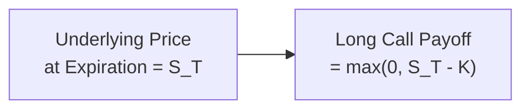
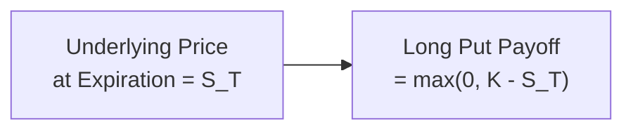

## Introduction

I still remember the first time I heard someone mention “calls” and “puts” in a trading room—my mind immediately went, “Calls? Puts? Are we talking about phone calls and some random ‘put’ function in a programming language?” Um, it sounded mysterious and a bit intimidating. Well, hopefully by the end of this discussion, you’ll find options more welcoming. Even if they still remain a bit tricky, you’ll have the core ideas solidly in hand.

Options can be powerful tools in a portfolio. They offer opportunities for hedging, speculating, or generating income—though they can also cause headaches if not understood. Here, we’ll focus on the fundamental definitions and payoff profiles for both calls and puts, ensuring you walk away with a strong foundation.

## Key Building Blocks

It helps to have a few definitions front and center:

• Call Option: Grants the buyer (long call) the right, but not the obligation, to buy a specific underlying asset (such as a stock, an index, or a commodity) at a predetermined strike price.  
• Put Option: Gives the buyer (long put) the right, but not the obligation, to sell the underlying asset at the strike price.  
• Strike Price (K): The price at which the underlying asset can be bought or sold if the option is exercised.  
• Expiration (Maturity): The date on or before which the option can be exercised.  
• Long Position: Owning an option. The holder has rights but no obligations.  
• Short Position: Writing (selling) an option. The writer has an obligation if the option buyer decides to exercise.

A lot of confusion arises between the buyer’s right and seller’s obligation. In short (no pun intended!), when you buy a call, you do not have to purchase shares at the strike; you can if it makes financial sense at expiration. Meanwhile, the person who sells you that call is obligated to deliver the underlying if you exercise.

## Call Option Payoff

A call option payoff can be represented with a simple formula at expiration:


\text{Payoff}_{\text{long call}} = \max (0, S_T - K)


where  
• \\( S_T \\) = Price of the underlying asset at expiration  
• \\( K \\) = Strike price

Why is it \\(\max(0, S_T - K)\\)? Because you wouldn’t exercise the option if the market price \\( S_T \\) is below \\( K \\). After all, who wants to buy something at a higher strike price if you could just go to the market and get it cheaper? If \\( S_T < K \\), the payoff is 0—meaning you choose not to exercise. Once \\( S_T \\) grows above \\( K \\), you’d exercise the option to buy at \\( K \\) and have an immediate notional profit of \\( S_T - K \\).

### Visualizing a Long Call Payoff

A payoff diagram often helps. Here’s a simple Mermaid diagram illustrating the idea that if the underlying price is above \\(K\\), the payoff increases linearly:



At prices below \\(K\\), the payoff is zero (the option expires worthless). Above \\(K\\), the payoff goes up one-to-one with the underlying’s price.

### Short Call Payoff

The short call is just the opposite side of the trade. If you write (sell) a call, you collect a premium up front. But if the underlying rockets upward, you have the obligation to provide the asset at the strike price, no matter how high the market has climbed. Hence, the short call’s payoff at expiration is:


\text{Payoff}_{\text{short call}} = - \max(0, S_T - K).


There’s a potentially unlimited loss if \\(S_T\\) surges, which can be downright scary if you’re short a call without hedging. In practice, professional writers of calls often hedge their positions to limit that upside risk.

## Put Option Payoff

Shifting from calls to puts:


\text{Payoff}_{\text{long put}} = \max(0, K - S_T).


Here, the underlying asset’s price is subtracted from the strike. If the market price \\( S_T \\) is above \\( K \\), you wouldn’t exercise your right to sell at \\(K\\) because you could sell it at a higher price in the open market. If \\( S_T\\) is below \\( K \\), you can exercise the put and sell the underlying at \\(K\\), generating an intrinsic value of \\(K - S_T\\).

### Visualizing a Long Put Payoff

The payoff diagram for a long put also can be depicted in Mermaid:



Below the strike price, a put’s payoff grows, because you can sell the asset at \\(K\\) while it’s cheaper in the market. If \\( S_T > K\\), payoff is zero at expiration.

### Short Put Payoff

As a short put writer, you receive the option premium but might be forced to buy the underlying asset at the strike price if the buyer of the put option exercises. If the market price plunges, you end up buying at \\(K\\), which could be significantly higher than the asset’s new market price. So:


\text{Payoff}_{\text{short put}} = - \max(0, K - S_T).


If \\(S_T\\) is much lower than \\(K\\), the short put is in trouble, as you must buy the asset at \\(K\\).

## The Role of Premium

All these payoffs we’ve shown are at expiration. In practice, the buyer of an option pays a premium up front to the seller. That premium is often referred to as the option’s price, and it reflects factors such as:

• Time to expiration (longer time, higher premium)  
• Volatility of the underlying (greater volatility, higher premium)  
• Dividend yield (for equity options)  
• Risk-free rates  
• Supply and demand conditions

In the real world, you can think of the premium as the cost of “insurance.” When you buy an option, you pay that cost to have the right without the obligation. When you sell an option, you’re effectively playing the role of an insurance underwriter: you collect the premium, but you could face large losses if the “catastrophic event” (i.e., extreme price move) occurs.

## Common Underlyings

Options are versatile, existing on a range of underlyings:

• Equities (single stocks and stock indexes)  
• Currencies (exchange rates)  
• Commodities (metals, energy, agricultural products)  
• Interest rates (via options on bonds or short-term interest rate instruments)  

The payoff logic—calls or puts—remains the same regardless of the underlying. But each underlying comes with idiosyncrasies like storage costs (in commodities), dividend schedules (in equities), or global macro factors (in currencies).

## Real-World Perspective

Try to imagine you’re a farmer (like my family used to be). You’ve grown a field of soybeans you plan to sell in three months. You might want to buy a put option on soybeans to lock in a minimum sell price. If prices fall, your put gains and offsets the lower sale price in the physical market. If prices rise, you simply don’t exercise the put and happily sell your harvest at higher prices. This is the classic protective hedge.

On the flip side, you might be a processor of soybeans—someone who needs to buy them as an input. You could buy a call option to lock in a maximum purchase price. If soybeans get more expensive, your call gains value, compensating for the increased cost in the physical market.

## Simple Numerical Example

Let’s say we have an option on stock XYZ with a strike \\( K = \$50 \\), expiring in one month. Suppose we are the buyer of a call option that costs \\(\$2\\) per share in premium. What happens at expiration?

• If \\( S_T = \$45 \\), payoff of the call is \\(\max(0, 45 - 50) = 0\\). The call expires worthless, and we lose our premium of \\(\$2\\).  
• If \\( S_T = \$53 \\), payoff is \\(\max(0, 53 - 50) = \$3\\). You gained \\(\$3\\) from exercising, but remember you initially paid \\(\$2\\) for the premium. Net profit is \\(\$1\\).  
• If \\( S_T = \$60 \\), payoff is \\(\max(0, 60 - 50) = \$10\\). After subtracting \\(\$2\\) premium, net profit is \\(\$8\\).

For the put case, assume everything is the same except it’s a put option with premium \\(\$2\\), strike \\(\$50\\).

• If \\( S_T = \$45 \\), payoff is \\(\max(0, 50 - 45) = \$5\\). After the \\(\$2\\) premium, net profit is \\(\$3\\).  
• If \\( S_T = \$53 \\), payoff is \\(\max(0, 50 - 53) = 0\\). The put expires worthless, and you lose the \\(\$2\\) premium.  

Either way, the beauty of being the buyer is you can’t lose more than the premium. The risk is capped. The upside varies depending on call vs. put. Sellers face the opposite outcomes and potentially large losses if the underlying moves against them.

## Influence of Key Factors on Option Pricing

A handful of variables drive the option’s premium and, therefore, the final profit/loss:

1. Time to Expiration: The longer the time, the more expensive the option—generally speaking—because there’s more time for the underlying to make a favorable move.  
2. Underlying Price: If you’re trading equity options, the current stock price heavily influences option values.  
3. Strike Price: Deep in-the-money or deep out-of-the-money strikes can lead to very different premium behaviors compared to near-the-money strikes.  
4. Volatility: Quite possibly the biggest determiner (next to time) of option pricing. Higher volatility means the underlying can swing widely, increasing the odds you’ll end up in-the-money. Consequently, that drives up the option’s cost.  
5. Risk-Free Interest Rate: Often has a smaller effect for short-term options but it becomes more significant for longer-dated options or periods of rising rates.  
6. Dividends (for stock options): A stock that pays a dividend can reduce call value (somewhat) and increase put value, in part because of how the ex-dividend price drop influences potential option payoffs.

## A Quick Python Calculation Example

Below is a small snippet (purely illustrative) you might run in a Python shell to compare payoffs for calls and puts at different final prices \\( S_T \\). Don’t worry if coding isn’t your thing; it’s just here to show one way people explore payoffs.

```python
import numpy as np

strike = 50
call_premium = 2
put_premium = 2
stock_prices = np.arange(40, 61)  # Underlying from $40 to $60

call_payoffs = [max(0, s - strike) - call_premium for s in stock_prices]
put_payoffs = [max(0, strike - s) - put_premium for s in stock_prices]

print("Stock Price | Call Payoff | Put Payoff")
for sp, cp, pp in zip(stock_prices, call_payoffs, put_payoffs):
    print(f"${sp:<11} | ${cp:<10.2f} | ${pp:<10.2f}")
```

You’ll see how the call payoff remains negative (i.e., a loss of premium) until the underlying price crosses the strike plus premium, while the put payoff is most valuable when the underlying price is well below the strike.

## Best Practices & Common Pitfalls

• Understand All Obligations: If you’re writing (selling) a call or put, you must fully appreciate the potential losses. Don’t be the person who sells a naked call without any hedge, only to watch the asset price skyrocket. That can be disastrous.  
• Avoid Over-Leverage: While options are leveraged instruments, too much reliance on them for speculation can cause large percentage losses if the market moves unfavorably. It’s easy to buy a lot of option contracts, but risk management is crucial.  
• Be Mindful of Expiration Dynamics: Options lose time value quickly as they approach expiration, a phenomenon called “time decay.” Some new traders are startled by how rapidly their calls or puts can lose value if the underlying isn’t moving in a favorable direction.  
• Factor in Volatility: Don’t just look at the option’s price in isolation. Check implied volatility. If it’s extremely high, you might be overpaying for an option. Conversely, extremely low implied volatility may reduce potential premium income for sellers.

## Ethical and Regulatory Context

From a regulatory standpoint, IFRS and US GAAP both treat purchased options as financial assets (if for hedging or speculation) and written options as financial liabilities. Also, professional standards—like those of the CFA Institute—stress that you disclose the nature of derivative positions to clients and avoid misrepresenting risks. Always keep in mind your duty to investors and the overarching code of ethics that requires fair dealing and prudence.

## Exam-Day Advice

• Memorize the Basic Payoffs: You’ll likely see a question that directly references “max(0, S_T - K)” for calls or “max(0, K - S_T)” for puts.  
• Watch for Premium Adjustments: The net profit or loss at expiration includes premium. Some exam questions try to trip you up by ignoring the premium in the final calculation. Don’t forget to subtract that premium for the buyer (or add it for the seller).  
• Grasp Concepts Visually: Options payoff diagrams can quickly help you solve scenario-based questions.  
• Stay Focused on Implementation: The CFA exam might give a real-world scenario: “A portfolio manager wants to limit downside risk to 5%.” Then they might ask which option strategy is most appropriate. Understanding how calls and puts behave is essential for answering those questions.  
• Identify Potential Hedge vs. Speculative Use: The exam might test your ability to differentiate hedging from speculative behavior. If a manager has an existing equity position and buys a put, that’s a hedge. If a manager has no position and buys a call, that’s speculation (or a synthetic way of going long).

## References

• Hull, John C. “Options, Futures, and Other Derivatives.” Pearson  
• Chance, Don M. “Essentials of Derivatives.” Harcourt  
• CFA Institute. “Derivatives and Risk Management.”  
• Options Clearing Corporation (OCC): https://www.optionseducation.org  

## Test Your Knowledge: Call and Put Options Essentials



### Which of the following statements about a long call option is most accurate?

- [ ] It obligates the holder to buy the underlying at the strike price.
- [x] It grants the right to buy the underlying but does not impose an obligation.
- [ ] It has a payoff equal to max(0, K - S_T).
- [ ] It only has intrinsic value.

> **Explanation:** A long call provides the holder the right (but not the obligation) to buy the underlying asset at the strike price.  


### What is the payoff at expiration for a long put option?

- [ ] min(0, K - S_T)
- [ ] max(0, S_T - K)
- [ ] -max(0, S_T - K)
- [x] max(0, K - S_T)

> **Explanation:** For a long put, the payoff is max(0, K - S_T).  


### Which factor generally increases the value of a call option?

- [ ] Decreasing volatility of the underlying asset
- [x] Longer time to expiration
- [ ] Higher dividend payouts
- [ ] Lower underlying price

> **Explanation:** Longer time to expiration typically increases the premium because there is more time for the underlying price to move favorably.  


### A short call position has:

- [ ] Limited profit potential and limited downside risk
- [ ] Unlimited profit potential and limited downside risk
- [x] Limited profit potential but potentially unlimited downside risk
- [ ] Unlimited profit potential and unlimited downside risk

> **Explanation:** A short call receives a fixed premium upfront but can face unlimited losses if the price of the underlying rises sharply.  


### If an investor buys a call for a premium of $4, with a strike of $50, and the underlying asset trades at $56 at expiration, what is the investor’s net profit?

- [ ] $0
- [ ] $4
- [x] $2
- [ ] $12

> **Explanation:** The payoff from the call is $6 ($56 - $50). Subtract the premium of $4, leaving $2 net profit.  


### Which situation is best described as a protective put?

- [x] An investor owns the underlying stock and also buys a put option on that stock.
- [ ] An investor owns the underlying stock and sells a put option.
- [ ] An investor sells the underlying stock short and buys a put option.
- [ ] An investor sells the underlying stock short and sells a put option.

> **Explanation:** A protective put involves owning the underlying while simultaneously buying a put to hedge downside risk.  


### How does an increase in implied volatility generally affect an option’s premium?

- [x] It increases both call and put premiums.
- [ ] It decreases both call and put premiums.
- [x] It increases call premiums but decreases put premiums.
- [ ] It has no influence on option prices.

> **Explanation:** A rise in implied volatility increases the range of possible outcomes for the underlying price, which raises the premium of both calls and puts.  


### What is the primary reason a put contract with a so-called “insurance-like payoff” might be preferred by a portfolio manager?

- [x] It limits downside risk while allowing upside participation if the underlying rises.
- [ ] It eliminates the possibility of any loss on the portfolio.
- [ ] It generates premium income for the manager.
- [ ] It reduces volatility by short-selling the underlying asset.

> **Explanation:** A put option can offer downside protection while leaving upside exposure intact.  


### All else being equal, which statement is correct regarding a call option on a stock with high dividends?

- [ ] The call option is always more valuable.
- [ ] Dividends have no effect on call prices.
- [x] A higher dividend yield typically reduces the call’s value.
- [ ] A higher dividend yield typically increases the call’s value.

> **Explanation:** Stocks that pay higher dividends generally reduce call values because the stock price drops by the dividend amount on ex-dividend dates, lowering the potential for large upward moves within some time frames.  


### Buying a put rather than short selling the underlying often appeals to investors because a put:

- [x] Offers a known, limited downside cost (the premium).
- [ ] Involves no premium cost.
- [ ] Always results in a fixed profit at expiration.
- [ ] Eliminates all downside risks in any portfolio.

> **Explanation:** Buying a put has a cost (the premium) but caps the maximum loss to that premium, unlike short selling, which can incur unlimited losses if the asset’s price rises.  


