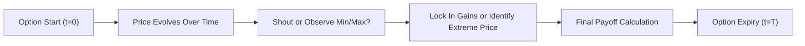

Let’s explore a fascinating branch of options that go beyond the plain vanilla realm—Lookback, Shout, and Cliquet options. These instruments are often wrapped into structured products, and they illustrate the ingenuity of financial engineering when it comes to managing market exposure and providing innovative payoff profiles. You’ll see that these options rely heavily on path-dependent features, so advanced pricing approaches like Monte Carlo simulation usually come into play. 

## Introductory Perspective

I remember when I was first introduced to “exotic options”: I thought the name alone sounded intriguing, like they were some secret recipe for capturing huge gains in uncertain markets. In reality, exotic options can range from mildly complex to extremely intricate. Lookback, Shout, and Cliquet options are superb examples of how derivative markets constantly evolve in response to investor needs for specific payoff patterns and risk exposures.

From a CFA exam perspective, these exotics are testable because they illustrate fundamental derivative concepts—like path dependency and dynamic hedging—that build upon the standard option frameworks. We’ll look at how each structure works, how they’re commonly priced, and where you might see them in practice.

## Lookback Options

A Lookback option grants you the right to exercise at the most advantageous (maximum or minimum) underlying price observed during the option’s life. So, in a sense, you get to “look back” over the path of the underlying and choose the best point for payoff calculation.

### Types of Lookback Options

• Fixed Strike Lookback Call: The strike is known upfront, but the payoff is based on the difference between the underlying’s maximum price during the option’s life and that fixed strike.  
• Float Strike Lookback Call: The strike itself is set to the minimum underlying price during the life, so at maturity your payoff is simply the difference between the final price and that lowest price.  
• Corresponding put structures also exist, reversing the roles of maximum vs. minimum reference points.

### Payoff Overview

For a floating-strike lookback call, if we let S(t) be the price of the underlying at time t and T be the maturity:

Payoff = Max[S(T) – min{S(u)} for 0 ≤ u ≤ T, 0]

The payoff for the floating-strike put would be:

Payoff = Max[max{S(u)} for 0 ≤ u ≤ T – S(T), 0]

Essentially, the payoff references the extreme points of the underlying during the option’s lifetime.

### Why Investors Like Them

Lookback options can be especially appealing for highly volatile underlying assets. You’re effectively removing or drastically reducing regret risk (“If only I had bought/sold at that highest/lowest price!”). Insurance companies sometimes use them in variable annuity products where they tie returns to equity markets yet offer a minimum guaranteed redemption based on the best historical prices.

### Pricing Implications

Because the payoff depends on the path (the option’s entire price history up to maturity), we cannot price it merely using a straightforward Black–Scholes–Merton closed form (although certain lookback variations do admit closed-form solutions under specific assumptions). In practice, if you face a more complex version or you factor in discontinuities like jumps or varying volatility, a Monte Carlo simulation approach is often used:

```python
import numpy as np

def monte_carlo_lookback_call(S0, r, sigma, T, simulations, steps):
    dt = T / steps
    disc_factor = np.exp(-r * T)
    payoffs = []
    
    for _ in range(simulations):
        prices = [S0]
        for _ in range(steps):
            z = np.random.normal()
            prices.append(prices[-1] * np.exp((r - 0.5*sigma**2)*dt + sigma*np.sqrt(dt)*z))
        payoff = max(prices[-1] - min(prices), 0)  # floating-strike lookback call
        payoffs.append(payoff)
    return disc_factor * np.mean(payoffs)

```

## Shout Options

A Shout option allows you to “shout” at one or more times during the life of the option to lock in part of the gain—sort of like calling out, “I want to fix this price now!”—while still keeping the rest of the option alive for further upside. It’s a neat way to hedge against the fear of giving back profits in future market downturns.

### Mechanics of a Shout

Say you hold a Shout call option with a single shout. If the underlying has risen significantly above the strike, you can “shout” to lock in those gains. At expiration, you get the maximum of (1) the locked-in level or (2) final payoff if the market goes even higher. If it dips, you’re still assured that locked-in payoff. So it’s like having a partial “early exercise” feature, but without giving up the time value on the remainder of the contract.

### Real-World Uses

• Structured Deposits: A bank might wrap a Shout feature into a deposit or note so that the investor can lock in a certain interest or equity-linked payoff at least once if markets move favorably.  
• Risk Management: A single shout or multiple shouts reduce the psychological stress of deciding exactly when to lock in profits. For instance, a retirement product might allow the policyholder to shout at the year’s high so that the policy accumulates a guaranteed locked-in value.

## Cliquet (Ratchet) Options

A Cliquet option, often called a Ratchet option, resets at periodic intervals (e.g., monthly or annually). Each reset effectively sets a new strike at the then-current underlying price (or an agreed-upon formula), guaranteeing any accrued gain up to that point. It’s like owning a series of at-the-money calls that get “ratcheted” to new levels as you go.

### How Cliquet Resets Work

Let’s imagine a Cliquet call with monthly resets over one year. Each month, the underlying price is noted, and if the underlying ended higher than the strike set at the last reset, you lock in a portion of that gain. Then for the next month, the option’s strike resets to this new underlying price. By the end of the year, your total payoff is often the sum of these monthly gains, possibly subject to certain caps or floors.

A simplified timeline might look like this:

```
Time 0 --- Month 1 --- Month 2 --- ... --- Month 12
```

• At each month’s end, a local payoff or gain is calculated.  
• The option “ratchets” up to the new underlying level.  
• Final payoff sums or averages the series of locked-in increments.

### Common Applications

Insurance products like equity-indexed annuities often use Cliquet structures. Policyholders see their account values reset periodically to the current market level, ensuring that gains are locked in. The insurer can place caps on monthly returns (e.g., no more than a certain percentage per reset), and set a floor to protect from negative results. This structure balances the desire for upside with the need for downside protection.

## Path Dependency and Pricing Considerations

Whether we’re dealing with Lookbacks, Shouts, or Cliquets, these options strongly depend on the entire price path, not just a single final point. This complicates pricing:

• **Monte Carlo**: Probably the go-to method for exotic path-dependent options, especially under realistic modeling assumptions (stochastic volatility, interest rate fluctuations, etc.).  
• **Binomial or Trinomial Trees**: Feasible but can become large to accommodate the required memory and time for frequent resets or potential shout dates.  
• **Finite Difference Methods**: Possible, but similarly complex, especially if the payoff involves multiple path-dependent features.

From a risk management perspective, delta, gamma, and other “Greeks” can vary significantly over the life of these contracts because the chance to lock in or reset changes the risk profile in mid-flight.

## Diagram: Path-Dependent Flow

Below is a simple mermaid diagram illustrating how a path-dependent payoff might be determined in a Lookback or Shout scenario:



## Practical Observations and Best Practices

• **Hedging Complexity**: Dealers who sell these options must dynamically hedge because any large movement or “shout event” can cause rebalancing.  
• **Early Termination**: Some structured products using Cliquet or Shout features include early termination clauses if the underlying hits certain levels.  
• **Regulatory Aspects**: Under IFRS or US GAAP, the embedded derivative (exotic features) might be separated or accounted for differently from the host (e.g., in structured deposits). It’s vital to keep up with local regulations on how to record and report these derivatives on financial statements.  
• **Ethical and Suitability Concerns**: The CFA Institute Code and Standards emphasize that investment managers must ensure these products are suitable for clients’ risk tolerance and fully explained in terms of potential complexities. 

## Real-World Example (Anecdote)

I had a colleague who once purchased a Shout option on a volatile tech stock right before a major product announcement. The stock shot up a few weeks later; they locked in that price with the single shout. The stock’s volatility soared but eventually ended below the locked-in level. In the end, they ended up capturing that mid-lifecycle gain, which offset the subsequent decline. They were pretty pleased—and it was a perfect demonstration of how Shout options can reduce the stress of market timing.

## Exam Tips and Conclusion

From a CFA Level I vantage point, you don’t need to memorize every advanced pricing formula in detail. Instead, focus on understanding:

• The unique payoff structures (Lookback uses max or min over the life, Shout locks in an intermediate gain, Cliquet resets regularly).  
• Why path dependency significantly influences valuation and hedging.  
• How these options commonly appear in structured notes and insurance-like products. 

When you see question stems referencing profits automatically locked in mid-term, or payoffs referencing historical extremes, that’s your cue to think about Shout or Lookback features. Whenever the phrase “periodic reset” or “ratchet” appears, you’re probably looking at a Cliquet structure.

To tackle essay or item set questions, outline the key mechanical steps (e.g., “the payoff is the sum of monthly increments...”; “the option resets the strike to the new price...”). Then identify how you’d approach valuation in principle (likely referencing Monte Carlo or path-dependent modeling). 

## References

• Bouzoubaa, M., and A. Osseiran. “Exotic Options and Hybrids.”  
• Glasserman, P. “Monte Carlo Methods in Financial Engineering.”  
• Journals on path-dependent options in the Journal of Computational Finance.  
• Structured Products discussions in mid-level finance texts covering exotic derivatives.

---

## Test Your Knowledge: Lookback, Shout, and Cliquet Options Quiz



### Which best describes a Lookback option?
- [ ] It lets you lock in a single intermediate payoff and continue holding.  
- [x] Its payoff depends on the extreme (max or min) price of the underlying over the life of the option.  
- [ ] Its strike is periodically reset based on the underlying price.  
- [ ] Its payoff depends only on the price at maturity.  

> **Explanation:** Lookback options compute the payoff based on the maximum or minimum price observed during the entire life of the option. This is the key path-dependent feature.

### For a “shout” option with one shout opportunity, what happens after you “shout”?
- [x] Part of the payoff gets locked in, while the option continues for additional upside.  
- [ ] The option immediately terminates, paying out whatever the lock-in level was.  
- [ ] The strike is reset to zero.  
- [ ] The underlying price is ignored for the rest of the contract.  

> **Explanation:** In a shout option, when you shout, you lock in a payoff based on the current (underlying - strike) but still keep the option alive if the underlying moves higher in the future.

### Cliquet (Ratchet) options typically involve:
- [ ] No resets at all during the contract period.  
- [x] Periodic strike resets that lock in gains incrementally.  
- [ ] The right to lock in an intermediate payoff once.  
- [ ] Replacing the underlying with a new asset halfway through.  

> **Explanation:** Cliquet or Ratchet options reset the strike periodically, allowing incremental gains to be locked in at each reset period.

### A floating-strike lookback call option’s payoff at maturity can be expressed as:
- [ ] (Spot Price at Maturity – Spot Price at Initiation).  
- [x] (Spot Price at Maturity – Minimum Spot Price Over the Option’s Life).  
- [ ] (Maximum Spot Price Over the Option’s Life – Strike).  
- [ ] (Average Spot Price Over the Option’s Life – Strike).  

> **Explanation:** With a floating-strike lookback call, the strike is set to the minimum underlying price across the life of the option. Hence, the payoff is the final price minus that minimum.

### What is the primary reason path-dependent options often require Monte Carlo simulation for pricing?
- [x] Their payouts depend on the entire price trajectory rather than a single endpoint.  
- [ ] They are only available over the counter.  
- [x] They have no known closed-form solutions in all market conditions.  
- [ ] They cannot be valued using any numerical method besides Monte Carlo.  

> **Explanation:** Path-dependent structures rely on the underlying’s full price path, making closed-form approaches more complicated or impossible. Monte Carlo is flexible in handling these path dependencies.

### Which product is most likely to incorporate a Cliquet option payoff mechanism?
- [x] Equity-indexed annuity with annual resets.  
- [ ] Short straddle on an equity index.  
- [ ] Zero-coupon bond.  
- [ ] One-year at-the-money call.  

> **Explanation:** Equity-indexed annuities commonly use periodic reset features, i.e., the hallmark of Cliquet designs.

### In a Shout option with multiple shouts allowed, how would the payoff be typically determined at expiration?
- [x] It will be the best locked-in value from any shout or the final intrinsic value, whichever is higher.  
- [ ] It only pays out the sum of all locked-in values.  
- [x] It is always the final underlying price minus the initial strike.  
- [ ] It reverts back to the earliest locked-in shout if that was highest.  

> **Explanation:** Multiple shouts allow multiple lock-in points, and the final payoff is often the maximum of those locked-in payoffs or intrinsic value at maturity.

### Which of the following is a key challenge for dealers hedging Lookback options?
- [x] The dynamic nature of extremes (max or min) sets unpredictable exposures over time.  
- [ ] The premium is paid in continuous time.  
- [ ] The underlying’s price is not publicly observable.  
- [ ] They do not fluctuate in value as the underlying changes.  

> **Explanation:** Lookback options have path-dependent extrema, so the dealers continuously face changing delta exposures, especially as new maxima or minima get set.

### Which best describes a “fixed-strike” lookback option?
- [x] The strike is fixed upfront, and the payoff depends on the observed max (for a call) or min (for a put) over the option’s life.  
- [ ] The strike is equal to the underlying’s minimum over the option’s life.  
- [ ] The strike is determined by each periodic reset.  
- [ ] The strike is realized only if the holder shouts.  

> **Explanation:** A fixed-strike lookback option has its strike set when the contract is initiated, and the payoff references the highest or lowest underlying price over the life.

### True or False: A Cliquet option is sometimes called a “ratchet” option because it ratchets the strike to lock in each gain at regular intervals.
- [x] True  
- [ ] False  

> **Explanation:** Cliquet (Ratchet) options periodically reset, effectively “ratcheting” the strike so that previously accrued gains are locked in, hence the nickname “ratchet.”


