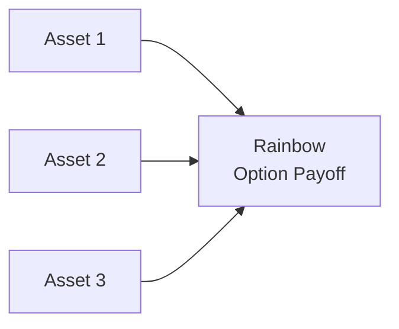

## Introduction

I remember, not so long ago, working with a client who was unsure whether market conditions would favor a bullish or bearish trade on a particular commodity. They said, “I wish I could just wait and see whether I want a call or a put!” Well, that’s exactly where a Chooser Option can come in. And if you’ve got more than one variable in the mix—say, multiple commodities or currencies with correlated movements—Rainbow Options might make that scenario even more interesting.

Chooser Options let you pick, at a predetermined time, whether your derivative payoff will effectively be a call or a put. They’re sometimes described as “flexibility in a box” because you can wait for more market information before deciding which payoff you want. Meanwhile, Rainbow Options, which are sensitive to multiple underlying assets, get their name from the “many colors” of possible outcomes and payoffs. They’re common in multi-commodity strategies, currency hedges with correlation considerations, or equity baskets that combine correlated assets. Both types of exotic options expand the realm of possibilities for risk management, speculation, or structured products.

Below, we’ll dig deeper into the mechanics, payoffs, and typical uses of these two interesting instruments. We’ll also talk about practical considerations—like pricing and correlation—and wrap up with some best practices to keep in mind if you find yourself structuring or analyzing these exotics. Let’s jump in.

## Chooser Options: Concept and Mechanics

A Chooser Option is a derivative that allows the holder to decide at a future “choice date” whether they want a call option or a put option on a specified underlying. Usually, at the inception, the holder pays a premium for this flexibility. The benefits become clear if you’re, well, a bit uncertain about the future direction of the underlying. Let’s break it down:

• At inception (t=0): You pay the premium for a Chooser Option. You don’t know whether you’ll eventually want a call or a put.  
• At the choice date (t=1): You look at market conditions—spot price, interest rates, volatility, or anything else that matters—and then decide: do you want the call or the put?  
• At expiry (t=2): After having chosen call or put, you end up with the payoff from whichever option you picked.

### Payoff Overview

The payoff profile for a Chooser Option is not complicated to interpret once you break it down. At the choice date, you effectively “become long” whichever standard vanilla option (call or put) you have selected. The final payoff at expiration is thus:

• If you chose a call, payoff at maturity = max(S(T) – K, 0).  
• If you chose a put, payoff at maturity = max(K – S(T), 0).  

Here, S(T) is the underlying’s price at maturity T, and K is the strike. Before you make your decision, you basically hold a single contract that can turn into either. It’s like having a rainy-day jacket that can transform into a sun hat if the weather changes.

### Informal Pricing Intuition

From a pricing standpoint, a Chooser Option can be viewed as a combination of two embedded vanilla options plus the flexibility embedded in the “choice.” One intuitive approach is:

1. Consider the cost of a call and the cost of a put on the same underlying, with the same expiration.  
2. Recognize that there’s extra value from being able to wait and see—this has an associated time value of optionality.  

A more formal approach uses risk-neutral valuation, where you might model separate scenarios for volatility and direction, then discount the expected payoff to present value. More advanced texts often show how Black–Scholes–Merton assumptions can be adapted to handle the switch at the choice date. If you’ve done some reading on advanced exotic options or studied up on Martingale approaches, you’ll see that the math is a close cousin of standard call/put pricing, just with an added dimension of “postponed” decision-making.

### Practical Uses

• Uncertain Outlooks: Companies uncertain about future directions of interest rates or commodity prices might use a Chooser Option to hedge.  
• Earnings Management: If your hedging horizon extends but you aren’t sure whether a bull or bear market will prevail, a Chooser protects you without fully committing.  
• Speculative Trading: Traders who expect significant volatility but are unsure of the direction may find a Chooser beneficial if the premium cost is acceptable.

## Real-World Anecdote: Chooser Option in Currency Hedging

I once saw a mid-sized import/export business lock in a Chooser Option position on an emerging markets currency. They had a big invoice in three months and weren’t sure if they’d prefer a call or put based on the direction of the local currency. At the choice date, they selected the put, locking in the right to sell the currency at a favorable exchange rate—ensuring sufficient coverage for their invoice. If exchange rates had gone the other way, that same option would have morphed into a call, giving them the right to buy at a favorable rate. It was a neat solution to their forecasting uncertainty—though not cheap, the risk coverage was well worth it.

## Rainbow Options: Concept and Mechanics

Rainbow Options are exotic options where the payoff depends on multiple underlying assets. The name “rainbow” highlights the idea that you have more than one “color” of underlying, such as multiple stocks, multiple commodities, or multiple currencies. The payoffs often depend on one of the following:

• The best performer among the underlying assets (a best-of option).  
• The worst performer among the underlying assets (a worst-of option).  
• Some average or combination of them.

### Payoff Structures

Let’s suppose we have two assets, S₁ and S₂, each with its own price at time T. A “best-of” call might have a payoff:

max( max(S₁(T), S₂(T)) – K, 0 ).

Meanwhile, a “worst-of” put might pay:

max(K – min(S₁(T), S₂(T)), 0 ).

There are many variations, including best-of puts, worst-of calls, spreads between the best and worst, or even advanced multi-asset correlation structures. Understanding correlation is critical; the more correlated assets are, the more predictable the payoff pattern might be. But if you have truly de-correlated or negatively correlated assets, the payoff distribution for a rainbow can become trickier—requiring multifactor models or simulation to price accurately.

## Visualizing a Rainbow Option

Below is a quick diagram showing three underlying assets feeding into a single Rainbow Option payoff function. The payoff might be “best-of” or “worst-of” or even something more exotic:



In practice, the model must incorporate each asset’s price path and the correlation structure among them to evaluate how it might impact the final payoff.

## Pricing Rainbow Options

### Correlation Matters

Rainbow Options are multi-dimensional by nature. Pricing them analytically becomes complex because closed-form solutions (like Black–Scholes–Merton for single-underlying calls and puts) do not easily generalize to many correlated assets. Instead, practitioners often rely on:

• Multi-dimensional binomial trees (though they grow exponentially in complexity when you have multiple underlying assets).  
• Monte Carlo simulations, which allow for flexible correlation modeling and path-dependent features.

Monte Carlo is particularly helpful for capturing real-world complexity. You can simulate correlated price paths for each underlying across thousands (or millions) of scenarios, compute the payoff each time, and discount the average payoff back to the present. Then you might layer on approximations or variance-reduction techniques to make it computationally more efficient.

### Example: Simple Python Pseudocode

Imagine you have two assets, each with a volatility and correlation, and you want to price a best-of call with strike K. The following snippet shows a (highly simplified) approach:

```python
import numpy as np

num_sims = 100000
S1_0 = 100.0    # current price of asset 1
S2_0 = 200.0    # current price of asset 2
sigma1 = 0.20
sigma2 = 0.25
rho = 0.30
r = 0.02        # risk-free rate
T = 1.0         # time in years
K = 150.0

cov_matrix = np.array([[sigma1**2, rho*sigma1*sigma2],
                       [rho*sigma1*sigma2, sigma2**2]])
L = np.linalg.cholesky(cov_matrix)

rand_norm = np.random.normal(size=(2, num_sims))
correlated_draws = L @ rand_norm

S1_T = S1_0 * np.exp((r - 0.5*sigma1**2)*T + correlated_draws[0,:]*np.sqrt(T))
S2_T = S2_0 * np.exp((r - 0.5*sigma2**2)*T + correlated_draws[1,:]*np.sqrt(T))

payoffs = np.maximum(np.maximum(S1_T, S2_T) - K, 0)

price = np.exp(-r*T) * np.mean(payoffs)
print("Estimated price of the best-of call: ", round(price, 4))
```

Of course, for a Rainbow Option with more assets or more complex payoff definitions, you’d expand the correlation matrix and replicate the logic. This is just a taste of how to handle multi-asset pricing in a simulation setting.

## Uses for Rainbow Options

• Multi-Commodity Hedging: Energy companies often use rainbow structures to cover exposure to multiple correlated commodities, like crude oil, natural gas, and refined products.  
• Currency Baskets: Global exporters or importers might hedge multiple exchange rates simultaneously.  
• Equity Baskets: Investors wanting a payoff tied to top performers in a group of stocks can use best-of calls to focus on winners (or worst-of puts to protect from big laggards).

## Best Practices and Pitfalls

### Chooser Options

• Watch the premium: The flexibility can be expensive. You’re basically buying two types of optionality.  
• Timing clarity: Make sure you know exactly when the “choice” date is. Missing it can negate the benefit of the structure.  
• Accounting and tax treatment: Depending on your region’s regulations, the accounting treatment for exotic instruments can be complicated. It’s smart to align with the CFA Institute Code and Standards that emphasize clarity and full disclosure.

### Rainbow Options

• Model correlation carefully: Correlation can shift over time. Stress-test your assumptions about how correlated (or uncorrelated) your underlyings might be.  
• Liquidity: Exotic options might be thinly traded or purely over-the-counter (OTC). That can create wide bid–ask spreads.  
• Regulatory compliance: Many regulators require higher capital charges or margin for multi-asset exotics. Keep an eye on how new rules, such as margin requirements for uncleared derivatives, affect your positions.

## Strategies to Overcome Challenges

1. Use robust simulations when closed-form solutions are elusive.  
2. Incorporate scenario analysis and stress tests to see how changes in correlation, volatility, or interest rates might affect the payoff.  
3. Partner with a reputable counterparty for OTC Rainbow Options, ensuring you have legal documentation that carefully outlines each step of unwinding or early termination.  
4. Emphasize thorough risk management in line with professional standards—particularly the CFA Institute Standards of Practice that require appropriate diligence and loyalty to the client’s interest.

## Common Exam Applications

Chooser and Rainbow Options can appear in exam contexts that test your understanding of:

• How exotic options can be dissected into simpler components or replicated.  
• The role of correlation in multi-asset derivative pricing.  
• Practical risk management scenarios where the candidate must evaluate whether to use a single underlying hedge or a multi-asset approach.  
• Scenario-based questions requiring you to explain the rationale for using a Chooser Option or a Rainbow Option for a particular hedging or speculative scenario.

You may see item sets where a firm is uncertain about interest rate movements and could choose a Chooser Option. Or perhaps a portfolio manager wants to capture the outperformance among a few correlated equities without multiple separate calls, so they consider a best-of Rainbow Call. Be prepared to analyze the pros, cons, and potential payoffs in a structured, methodical way—accompanied by a solid grasp of risk exposures.

## Final Notes

Chooser and Rainbow Options underscore how creative the derivatives market can be. By combining or rearranging payoffs from standard calls and puts—and weaving in correlation or a decision “pause”—you get entirely new risk-return profiles. That can be super handy when faced with uncertain or correlated environments. Just bear in mind the cost, complexity, and sometimes limited liquidity or OTC-based structures. For exam success, practice decomposing these payoffs and remember how you would simulate or approximate their values in real-world scenarios.

## References

• Musiela, M., and M. Rutkowski. “Martingale Methods in Financial Modelling.” Springer.  
• Various articles on multi-asset exotic options in Quantitative Finance journals.  
• Official CFA Institute Curriculum on Derivatives, which provides insight on exotic options and advanced hedging strategies.  

Remember always to reconcile these with the latest regulatory standards and professional guidelines outlined in the CFA Code of Ethics and Standards of Professional Conduct.

## Exam Tips

• Familiarize yourself with multi-asset payoff diagrams and correlation concepts.  
• Practice scenario questions in which you must identify which derivative is best suited to a complex hedging objective.  
• Review the time value of optionality in Chooser structures—be ready to show either a binomial or risk-neutral approach to explain final value.  

Good luck, and remember: these instruments can be powerful but require thorough knowledge and clear rationale!

---

## Test Your Knowledge: Chooser and Rainbow Options



### Which best describes a key advantage of a Chooser Option compared to a standard call or put?

- [ ] Its premium is typically lower than a standard call or put.  
- [x] It provides the flexibility to decide on a call or put at a later date.  
- [ ] It eliminates credit risk by being automatically settled through a clearinghouse.  
- [ ] It allows the holder to swap payoffs with another party mid-contract.  

> **Explanation:** Chooser Options let the holder wait until a future “choice date” to decide if the derivative will become a call or a put, giving more flexibility than a standard single-direction option.

### In a best-of Rainbow Option, what does the payoff typically depend on?

- [ ] The minimum price among all underlying assets.  
- [x] The highest price among all underlying assets.  
- [ ] The average price of all underlying assets.  
- [ ] A fixed index unrelated to the assets.  

> **Explanation:** A best-of Rainbow Option pays off based on the best-performing (highest-priced) asset relative to the strike at expiry.

### What is one of the biggest challenges in pricing Rainbow Options?

- [ ] Processing fees on exchange-traded rainbow contracts.  
- [x] Modeling correlation among multiple underlying assets.  
- [ ] The inability to use binomial trees or Monte Carlo simulations.  
- [ ] Regulatory restrictions that prevent dynamic hedging.  

> **Explanation:** Pricing Rainbow Options requires careful treatment of the correlations among all underlyings. This is often approached with multi-dimensional binomial or Monte Carlo simulations.

### At the “choice date” for a Chooser Option, what is the holder’s primary consideration?

- [ ] Selecting a new underlying asset.  
- [x] Deciding whether the option will be a call or a put.  
- [ ] Reducing the option’s nominal strike price.  
- [ ] Resetting the maturity to a longer date.  

> **Explanation:** The main feature of a Chooser Option is that the holder chooses call or put at the predetermined choice date.

### In practice, what is the most common approach for pricing Rainbow Options?

- [ ] A purely analytical approach with no numerical methods.  
- [x] Monte Carlo simulation that accounts for correlated price paths.  
- [ ] Lattice models that use fixed correlation structures at each node.  
- [ ] A single-factor Black–Scholes approach ignoring correlation.  

> **Explanation:** Rainbow Options generally require more complex modeling, and Monte Carlo simulation is a flexible go-to method for capturing correlation across multiple assets.

### For a worst-of Rainbow Put, which asset price is used in the payoff formula?

- [ ] The average asset price among the basket.  
- [ ] The highest asset price in the basket.  
- [ ] 100% of the sum of asset prices.  
- [x] The lowest asset price in the basket.  

> **Explanation:** A worst-of put uses the minimum asset price in the final payoff calculation.

### Why might a corporation use a Rainbow Option covering multiple energy commodities?

- [x] It can hedge correlated exposures in a single contract.  
- [ ] It reduces the need for margin completely.  
- [x] It allows some flexibility if one commodity spikes while another does not.  
- [ ] It always eliminates basis risk.  

> **Explanation:** A Rainbow Option can hedge several correlated commodities in a single product, and if the payoff is structured properly (like best-of), the company can benefit if one commodity's price spikes even if others do not. However, it does not necessarily eliminate basis risk entirely.

### Which of the following risk factors is generally more critical for Rainbow Options than single-asset options?

- [ ] Delta risk.  
- [ ] Time decay risk.  
- [x] Correlation risk.  
- [ ] Open interest changes.  

> **Explanation:** Rainbow Options are multi-asset derivatives whose value depends significantly on how the assets move relative to each other, i.e., correlation.

### Which statement is most accurate regarding Chooser Option pricing?

- [ ] It can be replicated by only selling a put and buying a call.  
- [ ] There is no closed-form solution for Chooser Options under any assumptions.  
- [x] The cost generally exceeds the cost of a comparable single call or put due to the extra flexibility.  
- [ ] It is always cheaper than a straddle.  

> **Explanation:** Because a Chooser Option offers more timing flexibility (i.e., you can pick call or put in the future), it generally costs more than a single vanilla call or put option.

### A Chooser Option provides the holder with the right to select a call or put payoff at a later date. True or False?

- [x] True  
- [ ] False  

> **Explanation:** By definition, a Chooser Option gives the holder the right to exit their uncertainty about direction down the road, choosing either a call or a put based on market conditions.


