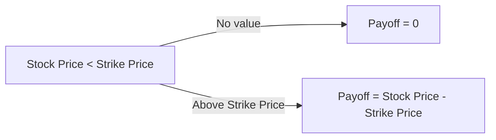

## Overview

Well, let’s dive into employee stock options (ESOs). Ever bump into someone bragging about how they scored a small fortune by exercising a bunch of options when their employer’s share price skyrocketed? It’s easy to get starry-eyed about the upside potential, right? But there’s more to ESOs than just the home-run stories. ESOs are structured as (usually) call options that give employees the right (not the obligation) to buy a specific number of shares of their company’s stock at a set strike price. They come with unique quirks like vesting schedules, transfer restrictions, and significant implications for both the company’s financial statements and the employees’ personal portfolios.

If you recall from earlier sections in this chapter (particularly 4.1, where we covered standard call and put options), you’ll see that ESOs share many pay-off characteristics with call options. However, ESOs also carry some unique constraints: they’re deeply tied to employment duration and performance, and the exercise price is often pegged to the stock price on the grant date (or even set at a discount). Let’s detail these elements, examine the employee perspective, check out the corporate angle, walk through the key accounting requirements, and see how they might show up on the CFA® exam.

## Structure and Vesting

Unlike exchange-traded call options, ESOs are typically non-transferable and come with vesting schedules. During vesting, employees gradually “earn” the right to exercise a certain portion of their total granted options over time. This structure incentivizes talent retention—if employees leave the company before the vesting date, they usually forfeit any unvested portion.

• Vesting Period: Maybe it’s 25% per year for four years, or some other pattern. Typically, once you reach the end of each vesting milestone, you can exercise those vested options for the remainder of the option term.  
• Expiration: ESOs often expire after a fixed term—say, 10 years from the grant date. If you haven’t exercised by then (and the stock price is above your strike price), you lose out.  
• Restrictions: You can’t just sell the option to someone else. You exercise it or forfeit it. That lack of transferability differentiates ESOs from standard exchange-traded calls.

Here’s a simple flow diagram illustrating a hypothetical vesting schedule and exercise window:


This diagram shows the timeline from the initial grant of ESOs to the point where they fully vest and can be exercised.

## Valuation for Accounting Purposes

Even though we might have some informal or personal conversation about these ESOs, the accounting for them is quite structured. Under both US GAAP (ASC Topic 718) and IFRS 2 (Share-Based Payment), companies must record compensation expense over the vesting term based on the options’ fair value at the grant date. This is a big deal—because historically, companies liked to argue that these options had “no cost” since there was no immediate cash outlay. However, standard-setters concluded that issuing ESOs (instead of paying cash) indeed represents compensation expense.

### Common Valuation Models

• Black–Scholes: Many companies rely on the Black–Scholes–Merton model to estimate the fair value of ESOs at grant date. Hopefully, from Sections 4.5 and 10.7, you remember the assumptions: volatility, risk-free rate, time to expiration, and anticipated dividends, among others.  
• Binomial Models: Some prefer binomial models because they can incorporate vesting schedules, potential early exercise behavior, and more flexible assumptions.  

Either way, the final fair value is recognized as compensation expense across the vesting horizon.

### Basic Illustration of an ESO Valuation

Let’s do a very small demonstration (just a snippet) using Python for a single-option Black–Scholes estimate:

```python
import math
from math import log, sqrt, exp
from statistics import NormalDist

def black_scholes_call(S, K, T, r, sigma):
    # S: Spot price, K: Strike, T: Time in years, r: risk-free rate, sigma: volatility
    d1 = (math.log(S/K) + (r + 0.5*sigma**2)*T) / (sigma*math.sqrt(T))
    d2 = d1 - sigma*math.sqrt(T)
    N = NormalDist(0,1)
    call_price = S*N.cdf(d1) - K*math.exp(-r*T)*N.cdf(d2)
    return call_price

S = 50.00   # Current stock price
K = 50.00   # Strike price
T = 3.0     # 3 years
r = 0.02    # 2% risk-free rate
sigma = 0.30 # 30% annual volatility

value_per_option = black_scholes_call(S, K, T, r, sigma)
print(f"Estimated Value per Option: {value_per_option:.2f}")
```

In practice, you’d have to refine it for an ESO—especially for vesting terms and potential early exercises—but that’s the basic idea. The result helps the company figure out how much compensation expense to allocate over the vesting period.

## The Employee’s Perspective

Many employees feel a burst of excitement when they’re hired, and they see, “Oh wow, I’m getting stock options.” But a few pitfalls are worth noting.

• Concentration Risk: For employees, being paid by the company and also investing heavily in that same company’s equity can be a huge concentration risk. If the firm goes bankrupt, you lose your job and your investment.  
• Vesting Uncertainty: If you leave (or are terminated) before vesting, you might lose unvested portions. That might lock you into staying longer than you otherwise would.  
• Timing the Exercise: Employees often wonder about the perfect time to exercise. Wait too long, and you might face an expiring option with no value if the share price falls. Exercise too early, and you could miss further upside.  
• Taxes: Depending on the jurisdiction, there could be major tax consequences. In certain places, employee stock options get taxed at exercise or at sale. Understanding tax rules is crucial.  

I remember once hearing from a friend who got in super early at a startup, held onto his options because he believed in the firm, and ended up with a heart-pounding windfall once they went public. But many others exercised too late or let them expire worthless. It can go either way.

## Corporate Perspective and Financial Statement Impact

On the corporate side, ESOs can be both a retention tool and a cost to the shareholders. When the company issues stock to an exercising employee, it dilutes existing shareholders. Also, the fair value of ESOs must be recognized as a compensation expense on the income statement. 

### Expense Recognition

• Under ASC 718 (US GAAP), the grant date fair value of options is determined (using a recognized option-pricing model), then spread out over the vesting period.  
• IFRS 2 is conceptually similar: fair value is recognized as an expense over the vesting schedule.  
• If the employee forfeits unvested options (e.g., resigns earlier than planned), the corporation can reverse the associated unrecognized expense for those forfeited instruments.

### Dilution and Shareholder Equity

It’s important to remember that the creation of new shares ultimately dilutes the existing shareholders. Management, therefore, has to weigh the benefits of incentivizing employees via ESOs with the potential for increased share count and depressed earnings per share (EPS). 

Furthermore, many companies publish a “fully diluted” EPS figure that accounts for potential ESO exercises, so investors get a clearer picture of the potential future share base.

## Illustrative Payoff Diagram

Although employees approach an ESO with a personal perspective, the payoff itself resembles a standard call option’s payoff (see 4.1 Call and Put Options for more detail). Here’s a quick payoff view:



Essentially, if the market price of the stock is below the ESO’s strike, employees have no real incentive to exercise.

## Practical Examples

1) Let’s say you’re hired at a company called GlacierTech at a time when its shares trade at USD 20. You get 10,000 ESOs with a strike also at USD 20, vesting over four years. If the share price soars to USD 50 by year four, your intrinsic value upon vesting is USD 30 per share (50 – 20). That’s a ton of potential gain—USD 300,000 if you choose to exercise and immediately sell. Beware the tax implications, though!

2) Alternatively, if GlacierTech’s share price slides to USD 15 after four years, your ESOs are out of the money. Unless you believe that the price will rebound in the near future—before your options expire—exercising would make no sense.

## Risk Management and Best Practices

• Diversification: Employees with large ESO grants often face an unhealthy concentration in one stock. Selling some shares (once exercised) can reduce that risk.  
• Setting Exercise Targets: A popular strategy is to plan in advance, maybe exercising in phases. For example, you might decide that if the share price hits a certain target, you’ll exercise a portion of your vested options.  
• Monitoring Tax Triggers: The question of whether (and when) to do a cashless exercise or early exercise can hinge on local tax law. Some employees prefer to exercise and hold shares, aiming for capital-gains treatment rather than income tax rates.

## Common Pitfalls

• Underestimating Volatility: If you assume the stock price will keep going up, you might postpone exercising well past a realistic window.  
• Ignoring the Clock: ESOs often expire after 10 years (or less). It’s surprisingly easy to forget about that deadline, especially if you’re not actively checking your brokerage statements.  
• Overconfidence: TTL (Terminal TechLuck) syndrome. Sure, your company might become the next tech unicorn, but that’s not guaranteed. Overconfidence leads people to ignore prudent risk management.  

## Final Exam Tips

If you’re prepping for the CFA® exam, expect ESOs to appear in item sets that blend option valuation with corporate finance or compensation expense treatments. They might test your knowledge on:

• Calculating the fair value of ESOs under a simplified Black–Scholes assumption.  
• Understanding how vesting schedules affect compensation expense recognition.  
• Explaining the difference between the employee’s perspective (limited exercise windows, non-transferable) versus the investor’s perspective (dilution, expense recognition).  
• Analyzing concentration risk and diversification strategies from a portfolio management angle.

The constructed-response portion might ask you to discuss how a company accounts for and discloses ESOs or how an employee should manage them in their personal investment portfolio. You could be asked to break down the advantages and disadvantages of using ESOs as compensation, or to articulate the difference between IFRS 2 and ASC 718 in conceptual terms.

## References and Further Reading

• FASB Accounting Standards Codification (ASC) 718: Stock Compensation (US GAAP)  
• IFRS 2: Share-Based Payment  
• “Managing Your Stock Options,” various whitepapers published by accounting firms and HR consultants  
• Chapter 4.1 of this volume: Basics of Call and Put Options  
• Chapter 10: Pricing and Valuation of Options (especially Black–Scholes–Merton discussion)

## Test Your Knowledge: Employee Stock Options Essentials



### Which of the following features most distinguishes an employee stock option from a standard exchange-traded call option?

- [ ] The ability to profit when the share price rises above the strike price
- [ ] The time decay that reduces option value as expiration nears
- [x] Non-transferability and vesting schedules that require ongoing employment
- [ ] Coverage by clearinghouses to reduce counterparty risk

> **Explanation:** Employee stock options typically have vesting schedules and cannot be sold or transferred, linking them closely to the holder’s employment. By contrast, exchange-traded options usually can be bought or sold freely.


### In accounting under US GAAP (ASC 718), the fair value of ESOs must be:

- [ ] Recorded as an asset on the company's balance sheet
- [x] Recognized as a compensation expense over the vesting period
- [ ] Expensed immediately at expiration
- [ ] Disclosed only in the footnotes with no impact on earnings

> **Explanation:** Under ASC 718, the total fair value of stock options granted is recognized as compensation expense over the service period (i.e., the vesting period).


### Which aspect of ESOs typically incentivizes employee retention?

- [ ] High intrinsic value
- [ ] Lower strike prices compared to market calls
- [ ] Transferability in secondary markets
- [x] Gradual vesting schedules requiring continued service

> **Explanation:** Gradual vesting schedules mean employees must remain at the company for certain periods or performance conditions to earn their options, motivating them to stay.


### If an employee leaves the firm before their options have vested, what generally happens to the unvested portion?

- [ ] It can be sold back to the company
- [ ] It is automatically exercised using a standard market rate
- [x] It is forfeited
- [ ] It remains outstanding until expiration

> **Explanation:** In most plans, unvested options are forfeited when an employee leaves, reinforcing the concept that ESOs are a retention tool.


### Under IFRS 2, share-based payment accounting for employee stock options:

- [ ] Is recorded only when the option is exercised
- [ ] Permits no fair-value models for measurement
- [ ] Differs significantly from US GAAP with respect to mandatory valuation
- [x] Similarly requires recognition of the fair value of options over the vesting period

> **Explanation:** IFRS 2 and ASC 718 are aligned in principle: measure and expense ESOs based on their fair value at grant, recognized over the vesting period.


### Which statement describes a potential risk for employees who rely heavily on ESOs?

- [x] Concentration in a single asset (the employer’s stock)
- [ ] The fixed strike price can suddenly double
- [ ] Guaranteed returns if the company remains solvent
- [ ] Encouragement to short the employer's stock

> **Explanation:** Relying heavily on one company’s shares (especially your employer) poses concentration risk. If the stock price falls or the company runs into trouble, both job security and investment value suffer.


### A key difference in valuing ESOs vs. exchange-traded calls is:

- [x] The possibility of early exercise or forfeiture due to employee turnover
- [ ] The reliance on spot price at settlement
- [ ] The need to obtain daily margin from the employee
- [ ] The presence of a futures-style “mark to market” rule

> **Explanation:** ESOs are often valued using models that incorporate early exercise and turnover probabilities, a nuance not typical in standard call option pricing on an exchange.


### When a company issues new shares for employees to exercise their stock options, the resulting effect is:

- [ ] An immediate increase in net income
- [ ] A decrease in the book value of equity
- [x] Dilution of existing shareholders
- [ ] A neutral effect on stock price or EPS

> **Explanation:** Exercise typically involves creating new shares, which can dilute existing shareholders and lower the firm’s earnings per share unless offset by share repurchases.


### An employee holds ESOs that are deep in-the-money, but the expiration date is approaching. Failure to exercise would result in:

- [x] Loss of the in-the-money value
- [ ] Automatic conversion to a put option
- [ ] A forced exercise through the exchange
- [ ] Immediate rounding up of shares

> **Explanation:** If ESOs expire unexercised, any intrinsic value is lost. There’s typically no automatic exercise feature (unlike some exchange-broker programs).


### True or False: ESOs are typically protected by central clearing counterparties, ensuring that employees face minimal counterparty risk.

- [x] True
- [ ] False

> **Explanation:** Actually, this statement is tricky. ESOs are an agreement between an employer and employee, not traded on an exchange, so there’s no role for a central clearinghouse. However, from the employee’s perspective, there’s no “counterparty risk” in the same sense as an OTC derivative with a third party, because the “counterparty” is the employer. If the employer is solvent enough to issue stock, the employee normally doesn’t have to worry about receiving those shares. As a result, some might interpret minimal “counterparty risk.” But keep in mind: if the employer goes bankrupt, the stock may be worthless anyway.  


