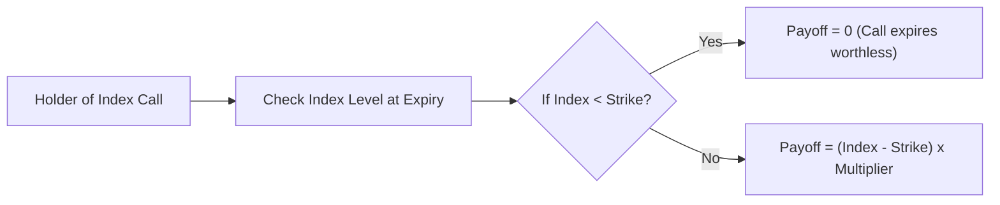
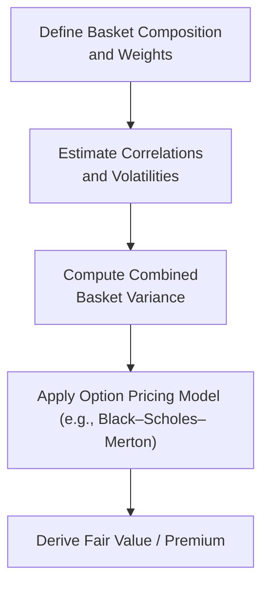

## Introduction

Index options and basket options are powerful derivatives that appeal to a broad range of market participants. On one hand, large institutional investors often rely on index options to hedge systematic risk or simply speculate on an entire market's trajectory. On the other hand, basket options enable both institutions and smaller players to customize exposure to a group of assets—like a set of technology stocks, a combination of stocks and bonds, or even multi-region portfolios.

Anyway, let’s not make them sound too mysterious: if you’ve ever considered buying a put on the S&P 500 to protect a broad equity portfolio, you’ve already dabbled in index options. If you’ve thought about targeting a narrow group of technology stocks but didn’t want to buy 10 different single-name equity options, well, that’s basically where basket options enter the game.

This section explores how index and basket options work, from payoff mechanics down to practical hedging applications. We’ll also describe best practices, common pitfalls, and strategies for analyzing (and hopefully avoiding) big mistakes.

## Key Features and Terminology

Index Option. An index option references a formally recognized equity index (e.g., S&P 500, NASDAQ 100) or any other broad-based index. When you buy an index call option, you typically receive a cash payoff if the index settles above the strike price at expiration. There’s no physical delivery of underlying stocks—just a money transfer. Neat, right?

Basket Option. A basket option is similar to an index option in payoff structure, but it references a custom group (or “basket”) of assets. Could be a smaller sector index. Could be a cross-asset combination. In short, if there’s a group of underlying instruments that you want to track collectively, a basket option might do the trick.

Cash Settlement. For most index and basket options, the settlement is almost always in cash. If you hold a call that expires in the money, you get the difference between the final index level (or basket value) and your strike price—times a contract multiplier.

Systematic Risk. Index (and many basket) options inherently capture systematic or market-wide risk. A single equity option might reflect a company’s idiosyncratic risk, but an index option’s payoff is driven by broad market movements (unless the index is extremely narrow). You can’t diversify away this systematic risk by adding more stocks from the same market, so folks often hedge it with index options.

## Why Use Index and Basket Options?

• Hedging Market Exposure: Let’s say you hold a diversified equity portfolio. Instead of buying 50 separate put options on each component stock, you can buy a single index put option that references a comparable index. Much simpler.  
• Speculation on Market Direction: If you think the overall market might tank, you could buy a put option on a broad-based index. Or if you’re bullish, you might sell puts or buy calls on that index.  
• Customized Exposure: Basket options let you tailor which assets you’re exposed to. If you’re only concerned about volatility in technology stocks, you can define a basket of, say, five key tech giants and buy a basket put.  
• Lower Transaction Costs: Instead of paying multiple commissions on many smaller options, you only pay for one instrument that references a collection of underlyings.  

If you recall from section 4.1 (Call and Put Options: Definitions), the payoff structure of a call is max(0, Underlying Price – Strike Price) at expiration, and for a put it’s max(0, Strike Price – Underlying Price). With an index or basket option, “Underlying Price” becomes “Settlement Value of the Index or Basket,” which is typically some standardized measure or weighted average of the assets inside the basket.

## Typical Index Option Payoffs

Let’s illustrate the payoff for a cash-settled index call, expiring at time T, with strike \\(K\\), and let \\(I_T\\) be the index level at expiration:


\text{Payoff}_{\text{call}} = \max(0, I_T - K) \times \text{Contract Multiplier}


For many broad-based equity indexes (like the S&P 500), the contract multiplier is 100. So if the index is 2,000 points at expiration, and your strike is 1,950, the call payoff is \\( (2,000 - 1,950) \times 100 = 5,000.\\)

Similarly, the index put option payoff is:


\text{Payoff}_{\text{put}} = \max(0, K - I_T) \times \text{Contract Multiplier}


Basket options follow the same style of payoff calculation, except \\(I_T\\) is replaced by the weighted sum of the basket’s components.

## Quick Mermaid Diagram of Index Option Mechanics

Below is a simple mermaid flow diagram illustrating how index call options settle in cash at expiration:



At expiration, you compare the final index price to your strike. If the index is below the strike, the call is out of the money (and worthless). If above, you get paid the difference times a multiplier.

## Basket Options in Practice

Basket options might reference, for example, a group of five stocks allocated by specific weights. Suppose you’re a portfolio manager wanting exposure to the “FAANG” stocks (Facebook/Meta, Amazon, Apple, Netflix, Google). You could structure a basket call option that references a custom index combining these five names in certain proportions (maybe weighted by market cap). That’s a lot more convenient than managing five separate single-stock options.

From a risk management perspective, a basket option can simplify your life if your portfolio is heavily tilted toward those same assets. You can systematically hedge your largest exposures with one instrument.

## Basics of Pricing and Valuation

Valuing index options or basket options relies on the same pricing fundamentals as single-stock options—think Black–Scholes–Merton (BSM), binomial trees, or risk-neutral valuation. However, a few nuances often come into play:

1. Correlation (Basket Options). With multiple assets in the basket, you have to incorporate correlations among them. The combined variance of the basket’s returns is not just the sum of individual variances, but also depends on each pairwise correlation. Miss that aspect, and your pricing might be off.  
2. Dividends (Equity Index). If the basket or index includes dividend-paying stocks, you need to incorporate the dividend yield or even discrete dividend amounts. In practice, broad indexes often have an implied dividend yield.  
3. Volatility Model. Some index option models incorporate implied volatility “smiles” or “surfaces.” When pricing basket options, you need a multivariate volatility model or an assumption about how each stock’s volatility co-moves with the others.  

## Example Calculation with Correlation Emphasis

Imagine you have a basket option on just two stocks, A and B. The basket has 50% weight in each. Let the returns be \\( R_A \\) and \\( R_B \\). The basket’s return, \\( R_B^{(basket)} \\), is:


R_B^{(basket)} = w_A R_A + w_B R_B


with \\( w_A = w_B = 0.5 \\). The variance of the basket is:


\text{Var}(R_B^{(basket)}) = w_A^2 \sigma_A^2 + w_B^2 \sigma_B^2 + 2 w_A w_B \rho_{A,B} \sigma_A \sigma_B


where \\(\rho_{A,B}\\) is the correlation between A and B. For a multi-asset basket, you expand on that formula. Then you might feed that basket volatility into a standard option pricing framework, or use some specialized multifactor approach. The details can get complicated, but the principle remains the same: we’re looking at the combined risk of multiple assets.

## How People Actually Use Them

1. Hedging Systematic Risk: If you manage a large portfolio with broad equity market exposure, you can buy put options on a relevant equity index to protect yourself against large downside moves. That might spare you the headache of buying separate coverage on each name.  
2. Sector or Thematic Bets: Suppose you love the cannabis industry or the EV (electric vehicle) theme, but you’re not sure which stock will outperform. You could create a basket call option on a few key players. If the entire theme does well, you profit from the basket.  
3. Enhancing Returns: Some investors write (sell) calls on an index or custom basket they own to generate extra income—similar to a covered call strategy.  
4. Custom Hedge Solutions: If you’re an institution that has a big chunk of your portfolio in, say, US technology and European pharma, you might want a single basket put option that references just those holdings.

## Little Personal Story

I remember the first time I encountered a basket option. A friend of mine was building a hedge for a complicated cross-border portfolio. She had exposure to Canadian energy stocks, plus US tech, plus a handful of European consumer goods names. Instead of trading a half-dozen single-stock puts in each region, she engaged a structuring desk to create one option on the combined portfolio weighting. It was more seamless, even though pricing the correlation piece got a bit tricky. But in the end, it served as an elegant solution: no complex set of trades, no confusion with different countries’ market rules.

## Potential Pitfalls

• Complex Correlations: With basket options, incorrectly modeling correlations can lead to serious pricing or hedging errors.  
• Liquidity: Index options are typically liquid (especially for large indexes like the S&P 500). Basket options can get illiquid or might not even trade on an exchange, meaning you might have to negotiate over the counter (OTC).  
• Basis Risk: If you hedge your portfolio with an index or basket that doesn’t perfectly match your holdings, you may still face some residual risk.  
• Costly Premiums in Volatile Markets: Market-wide volatility spikes can make index or basket options quite expensive. Yes, that’s when you really want the protection, but you’ll pay a pretty penny for it.

## Best Practices

• Match Underlying Index/Basket to Your Actual Exposure. Minimizes basis risk.  
• Check Correlations and Weights. If your real holdings are 70% technology and 30% consumer staples, a 50/50 basket might not do the trick.  
• Monitor Volatility and Implied Volatility. Overpaying for implied volatility can eat into your returns, so always shop around or compare implied vol to historical vol.  
• Understand Strikes and Maturities. For broad hedging, out-of-the-money puts are common; for more direct speculation, at-the-money calls might be more interesting.  

## Mermaid Diagram: Flow of Basket Option Valuation

Here’s a simplified diagram showing the conceptual steps in valuing a basket option:



## Cash Settlement and Expiration Nuances

Most index and basket options are European style, meaning they can be exercised only at expiration. That’s simpler from a pricing standpoint (for American-style, you must consider early exercise). Upon expiration:

1. The index (or basket) is observed (often the official close or a special settlement price).  
2. Compare that settlement value to the strike.  
3. Calculate payoff in cash (if any).  

In rare cases, you might see a physically settled basket option, but that’s more common with small baskets of easily deliverable assets. For large or broad-based indexes, physical settlement is impractical.

## Simple Python Example for Index Call Payoff

Below is a small Python snippet you might use to calculate an index call payoff at maturity for a list of possible final index prices:

```python
import numpy as np

def index_call_payoff(final_prices, strike, multiplier=100):
    """
    final_prices : array-like of possible index values at expiry
    strike : strike price of the index call
    multiplier : typically 100 for many equity index options
    Returns array of payoffs
    """
    final_prices = np.array(final_prices)
    payoff = np.maximum(final_prices - strike, 0) * multiplier
    return payoff

possible_index_prices = [1800, 1900, 1950, 2000, 2100]
strike_price = 1950
call_payoffs = index_call_payoff(possible_index_prices, strike_price)
print("Payoffs:", call_payoffs)
```

This code, while basic, underscores how the payoff is simply the difference between final index value and strike, times a multiplier, but floored at zero.

## Risk Management Considerations

As mentioned in section 4.9 on Greek-Based Hedging Strategies, you’ll need to think about the “Greeks” for index or basket options. Because basket options are correlated portfolios, the “delta” for each component can create some interesting complexity. For example, if your basket is half tech stocks and half energy stocks, a big surge in energy prices shifts the risk weighting. The correlation between the assets also affects the net gamma, vega, and so forth. If you’re an investor writing basket options, you must manage these Greeks daily.

Also, remember that index put options are a classic way to reduce downside systematic risk. However, they only remain cost-effective if you buy them when implied volatility is relatively low—otherwise, you might be paying through the nose for that insurance.

## Exam Tips and Key Takeaways

• Recognize the difference between index and basket options: indexes are typically well-defined, widely followed, and exchange-traded, while baskets might be more flexible and custom (often OTC).  
• Understand the payoff formulas: they’re basically call/put payoffs, but the underlying is an index level or a basket value. Often multiplied by a contract size.  
• Identify uses: portfolio hedging, sector bets, or speculation on broad market moves.  
• Correlation matters for basket options: Wrong correlation inputs can make your hedge or speculation misaligned.  
• Look for day-of-expiration settlement mechanisms: some index options follow special open or special close settlement, leading to potential surprises if you’re not paying attention.  
• Time your learning: Index and basket options can appear in scenario-based exam questions, especially around portfolio risk management—so be prepared to show how you would adjust a portfolio’s exposure to reduce systematic risk or to capture a sectoral move.

## References and Further Reading

• Lawrence G. McMillan, “Options as a Strategic Investment.”  
• Chicago Board Options Exchange (CBOE) Website (www.cboe.com) for specifications on popular index options like SPX, NDX, RUT, etc.  
• Eurex Exchange Website (www.eurex.com) for European index option contracts.  
• Section 4.1 (Call and Put Options: Definitions) and Section 4.9 (Greek-Based Hedging Strategies) from this Volume.

## Mastering Index and Basket Options: 10-Question Quiz



### A portfolio manager wants to hedge her large-cap US equity portfolio without buying multiple single-stock puts. Which instrument would she most likely use?

- [ ] A put on each stock in the portfolio
- [x] A put option on a broad-based equity index
- [ ] A basket of single-stock calls
- [ ] Long futures contracts on a broad-based equity index

> **Explanation:** A single broad-based index put is a classic solution for systematic risk hedging. It’s cheaper and simpler than multiple single-security options.

### Which of the following best describes a basket option?

- [ ] An option referencing a single, widely recognized stock index
- [x] An option on a custom or specialized group of underlying assets
- [ ] A futures contract that trades multiple assets separately
- [ ] A standard WTI crude oil option with variable strike

> **Explanation:** Basket options are customized derivatives on a curated set of assets, as opposed to a standard, broad-based index.

### In pricing a multi-asset basket option, which factor is most critical to get right?

- [ ] The risk-free interest rate
- [x] The correlation between the assets in the basket
- [ ] The dividend yield of the underlying
- [ ] The cost of carry for a single commodity

> **Explanation:** While all these factors matter, correlation is paramount in multi-asset basket pricing. A mismatch in assumed vs. actual correlation can lead to significant mispricing.

### A call option on the S&P 500 has a contract multiplier of 100. If the index is at 4,000 at expiration and the strike is 3,975, what is the payoff?

- [ ] $0
- [ ] $25
- [ ] $2,500
- [x] $2,500 ( (4,000−3,975)×100 )

> **Explanation:** The payoff formula is (Index – Strike) × Multiplier, which is (4,000 – 3,975) × 100 = 25 × 100 = $2,500.

### Why are index options typically cash-settled rather than physically settled?

- [x] Because delivering the actual component stocks is operationally difficult
- [ ] Because physical settlement is illegal in most markets
- [ ] Because no one wants to own actual index shares
- [ ] Because regulators prefer unrealized settlements

> **Explanation:** A broad-based index contains many stocks, making physical settlement cumbersome. Cash settlement is simpler.

### An investor believes that the technology sector will outperform but does not want to select individual winners. Which derivative might best suit their needs?

- [ ] A put option on the S&P 500
- [x] A call option on a basket of leading tech stocks
- [ ] A call option on gold futures
- [ ] A put option on a single energy stock

> **Explanation:** A basket call option on tech stocks allows the investor to gain broad tech sector exposure without picking individual names.

### If an investor sells a basket call option on correlated assets, what risk do they face if correlations unexpectedly increase?

- [x] Potentially higher net delta and gamma exposures than anticipated
- [ ] The correlation has no impact on multi-asset option risk
- [ ] Lower vega exposure
- [ ] No difference in risk, correlations are irrelevant

> **Explanation:** Higher correlations can amplify the basket’s aggregated movements, increasing the net risk exposures for the option seller.

### Index options are widely used to manage:

- [x] Systematic market risk
- [ ] Company-specific risk only
- [ ] Sector risk with no correlation
- [ ] Illiquidity risk exclusively

> **Explanation:** Index options hedge or expose you to systematic risk, which is the risk inherent to the broad market that can’t be diversified away by holding additional stocks from that same market.

### One of the main advantages of basket options over single-asset options is:

- [x] Consolidated hedging of multiple assets in one contract
- [ ] Lower correlation among assets in the basket
- [ ] Guarantee of higher returns
- [ ] They trade on every major exchange worldwide

> **Explanation:** Basket options offer a single, consolidated way to hedge or gain exposure to multiple assets, simplifying transaction costs and management.

### Using index puts to hedge a benchmarked portfolio is:

- [x] True
- [ ] False

> **Explanation:** True. Index puts are a recognized hedge against falling prices for portfolios benchmarked to that index.


