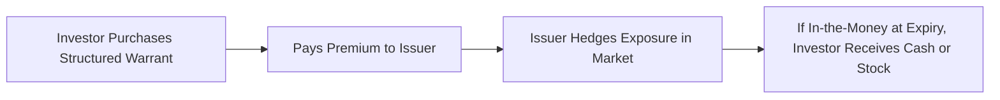

## Introduction

Let’s talk about warrants, structured warrants, and how they compare to the more familiar exchange-traded options you’ve probably come across. If you’re anything like I was when first encountering warrants, you might be thinking: “Are these just fancy call options with a twist?” That’s not a bad start. In a sense, warrants are very similar to long-term call options, but there are some nuances—particularly in issuance and how they can impact shareholders—that we need to explore.

Anyway, let’s get rolling. By the end of this section, you’ll see how these products can spice up an issuer’s capital structure or how they allow financial institutions to create more unique, sometimes short-term, claims on an underlying asset like a stock or an index. We’ll also compare them with standard, exchange-listed options, highlighting what’s similar (payoff structures) and what’s not (issuance, dilution, and liquidity).

## What Are Warrants?

A warrant is a derivative security that gives its holder the right—but not the obligation—to buy an underlying asset (usually a company’s stock) at a specified exercise price (or strike price) on or before a certain date. In many cases, corporate warrants have relatively long maturities, often measured in years. Sometimes, you’ll bump into warrants that have inception-to-expiry periods of five to ten years, which is significantly longer than your typical exchange-traded equity option.

A personal anecdote: I remember receiving a small biotech company’s warrant as a “sweetener” in a deal. At that time, the concept of having the right to buy shares at a fixed price over a five-year window felt like I had snagged some sort of golden ticket. But warrants come with a special effect: when you eventually exercise (if you do), the company typically issues new shares, thereby diluting existing shareholders. It’s not a big deal for some large, well-established companies, but for smaller or growth-oriented issuers, it can really matter.

### Use of Warrants as Sweeteners

You’ll often see corporate warrants bundled alongside bonds, preferred shares, or even during a private placement. They’re used as an incentive: “Hey, buy our bond, and we’ll throw in the right to buy our stock at some future date and price.” This can reduce the interest rate the issuer has to pay on the bond, because investors value the potential upside embedded in the warrant. If that upside materializes, it’s a lovely scenario for the investor: they benefit from both the bond (interest payments) and from any equity appreciation, so long as they exercise the warrant.

### The Dilution Factor

One critical difference between a standard call option and a corporate warrant: when a warrant is exercised, it leads to the issuance of new shares—meaning the number of shares outstanding increases, often reducing other shareholders’ percentage ownership. That’s what we call dilution. As an investor (or prospective warrant holder), you want to keep that in mind because it can affect the share price.

## Structured Warrants

Whereas traditional warrants are usually issued by the underlying company itself, structured warrants are typically issued by a third-party financial institution (like a bank). So you can get a structured warrant on, say, Apple stock or on a basket of technology companies or an entire equity index—but the issuer is not Apple or the companies in the basket. Instead, a bank or specialized firm structures the warrant, decides on its features (maturity, strike, payoff type), and sells it to investors in the market.

These structured warrants don’t create new shares of Apple (or whichever underlying is used) if exercised. Instead, the issuer must deliver either the underlying shares (which they’ve sourced or purchased separately) or a cash equivalent of the difference between the share price and the strike (depending on the product’s terms). That means no new equity is issued, and there is no inherent dilution to the underlying company’s stock price stemming from a structured warrant.

### Typical Features

• Shorter Maturities: Structured warrants are often shorter term than corporate warrants. You might see maturities anywhere from a few months up to two years (though some can be longer).  
• Tailored Payoffs: Some structured warrants have exotic features, such as knock-outs or barriers, giving them payoff profiles that differ from vanilla call/put options.  
• Issuer Risk: Because these instruments are obligations of the issuing bank or institution, there’s a counterparty (credit) risk element—albeit often mitigated by regulatory capital requirements or collateral arrangements.

### A Quick Visual

Below is a simple diagram that outlines how a structured warrant transaction might look from your perspective as an investor:

In this flow, notice the issuer is the one providing the product and may hedge its position in the underlying market. No new shares are created by the underlying company.

## Comparing Warrants and Exchange-Traded Options

Let’s face it: “option-like” products can get confusing. Here’s a quick reference table comparing conventional warrants and exchange-traded options:

| Feature                   | Corporate Warrants                    | Exchange-Traded Options             |
|---------------------------|---------------------------------------|-------------------------------------|
| Issuer                    | Issuing company                       | Exchange or clearinghouse           |
| Underlying                | Company’s own stock                   | Range of stocks, indexes, futures   |
| Maturity                  | Often long term (years)               | Typically shorter term (months)     |
| Liquidity                 | Lower, depends on market & offering   | Higher, standardized contracts      |
| Dilution                  | Yes (new shares issued if exercised)  | No direct dilution* (shares already exist) |
| Standardization           | Customizable (strike, maturity)       | Standardized strikes & maturities   |
| Secondary Market Trading  | Possible, with varying liquidity      | Very active secondary market        |
| Counterparty Risk         | Depends on issuing company’s credit   | Mitigated by clearinghouse          |

*Though exchange-traded equity options do not cause new share issuance, keep in mind that certain corporate events can still affect outstanding shares.

### Structured Warrants vs. Exchange-Traded Options

Structured warrants are typically more akin to exchange-traded options in that they don’t directly dilute the underlying stock. However, structured warrants aren’t always “standardized”; their payoff features, maturity lengths, and underlying assets can be carved to suit a particular market demand or niche. They can be listed on an exchange but may have less trading volume than the highly liquid standardized calls and puts on major stocks or indexes.

## Key Considerations in Warrant Trading

### Liquidity and Bid-Ask Spreads

Some warrants (especially niche corporate or structured ones) can have wide bid-ask spreads. This is a big difference from large-cap equity options, which tend to be quite liquid, especially near-the-money contracts. If you’re considering trading or investing in warrants, keep an eye on liquidity, because it can seriously affect transaction costs and your ability to exit a position quickly.

### Pricing Implications and Leverage

Warrants, whether corporate or structured, often provide a leveraged bet on the underlying asset. With a relatively small investment (the premium), you can control a comparable amount of underlying stock exposure. But leverage is a double-edged sword: if the underlying’s price moves favorably, the percentage returns on your warrant can be quite large; if it tanks or remains below the warrant’s strike, the entire premium might evaporate.

In short, if you’re someone who dabbles in derivatives precisely because of their leverage, you’ll likely find warrants intriguing. Just be absolutely sure you understand the payoff structure and risk of total loss (for out-of-the-money warrants close to expiration).

### Dilution Effects for Corporate Warrants

If you hold the underlying shares as an existing shareholder and the company has lots of outstanding warrants, be prepared for potential share count increases in the future. For smaller companies, that new share issuance can be dilutive enough to dampen future price gains. From a fundamental perspective, you might see a dip in metrics like EPS (earnings per share) if the warrant exercise is large in volume.

### Tax and Accounting Treatment

In many jurisdictions, the tax treatment of warrants can be similar to that of options for capital gains or losses. However, local nuances matter: some places treat gains on warrants differently, especially if they’re acquired as part of a bond package. On the accounting side, the company that issues warrants must consider how these instruments affect its equity and potential future obligations. Under IFRS or US GAAP, such warrants could be classified as equity or liabilities depending on the specific terms. For an investor, the main accounting is typically around initial cost (premium) and final disposal or exercise of the warrant.

## Practical Example

Suppose you invest in a small technology startup issuing corporate warrants as part of a capital raise. Each set of warrants allows you to buy one share at $10 anytime within five years. Let’s say the stock is currently at $9, the warrant trades at $1, and you purchase 100 warrants for $100 total.

• Scenario 1: The stock price rises to $20 in three years. If you exercise at $10, you pay $10 a share, plus the original $1 premium, so your effective cost is $11. You can sell the stock in the market at $20, netting $9 profit per share, or $900 total on your 100 shares (less transaction costs), from your $100 initial investment. Not bad.

• Scenario 2: The stock price languishes at $8 until expiration. You’d never exercise your warrant to pay $10 for something trading at $8 in the market. You lose your entire $100 premium.

• Scenario 3: The company’s share base is small, and a large chunk of additional warrants from other investors is exercised when the price surpasses $10. Suddenly, 10% new shares hit the market, causing a bit of downward pressure on the stock price. So even though you’re “in-the-money,” the predicted upward momentum is partially offset by the diluted share base. This is a direct manifestation of the dilution risk.

## Glossary of Key Terms

• Warrant: A derivative conferring the right to buy shares directly from the issuing firm at a specific strike price.  
• Dilution: The effect of increasing the number of outstanding shares, often reducing each current shareholder’s proportional ownership.  
• Structured Warrant: A warrant-like instrument issued by a third party (often a bank) on a single stock or index, typically involving no new share issuance.  
• Leverage: A factor that amplifies returns (both gains and losses) relative to changes in the underlying asset’s price.

## Market Structures and Risk Management

Warrants and structured warrants can fit into a variety of trading and hedging strategies. For example, an investor bullish on a particular index might prefer a structured warrant with an embedded knockout feature that reduces upfront premium but has a risk of early termination. Or a corporate bond investor might accept a lower coupon in exchange for equity warrants.

Risk management, though, is key: always consider the maximum possible loss on your premium. If you’re writing (i.e., issuing) structured warrants as a bank, you’d need robust hedging to avoid huge exposures to the underlying. That can involve dynamic hedging with the underlying shares, equity futures, or correlated instruments to remain delta-neutral.

## Best Practices and Common Pitfalls

• Always read the terms: Corporate warrants can have special exercise dates (e.g., once per quarter) or auto-exercise features at maturity.  
• Watch for hidden fees in structured warrants: Certain structured products might embed financing costs or management fees.  
• Check maturity: Holding a warrant that’s far out of the money near expiration can lead to a near-complete or total loss of the premium.  
• Monitor credit quality for structured warrant issuers: If the issuer’s solvency becomes questionable, that layered credit risk can undermine the warrant’s value.

## References and Further Reading

• Emmanuel Pearl, “Warrants: A Trader’s Guide.”  
• Publications and guidelines from major exchanges on structured products and warrants, such as the Hong Kong Exchange.  

Also consider reviewing “Introduction to Options: Definitions and Payoffs” (Section 4.1 of this chapter) for more details on basic call/put structures, payoff diagrams, and the general mechanics of options.

## Final Thoughts

Warrants can add dynamism to your investment portfolio or corporate capital structure. They share many similarities with options but come with unique features—particularly around dilution and issuance. Structured warrants, on the other hand, represent a financial institution’s spin on the concept, often with more specialized payoffs and minimal direct impact on the underlying’s share base.

If you’re going to use or trade warrants, just keep your eyes peeled for liquidity constraints and the potential for total premium loss if the underlying doesn’t perform. With that said, they can be a nice little “dessert” in a well-rounded derivatives arsenal—kind of like that sweet treat after a balanced meal. Now, let’s move on to test your knowledge with some sample questions.

## Test Your Knowledge: Structured Warrants vs. Options Quiz



### 1. Compared to exchange-traded call options, a key feature of most corporate warrants is:
- [x] The potential dilution of existing shareholders
- [ ] Collateralization through a central clearinghouse
- [ ] Shorter maturity horizons
- [ ] Minimal credit risk to investors

> **Explanation:** Corporate warrants typically involve issuing new shares when exercised, causing dilution. Exchange-traded options do not create new shares and are cleared through an exchange.

### 2. Which statement best describes structured warrants?
- [x] Warrants issued by a financial institution, allowing customized features
- [ ] Warrants that always have longer maturities than corporate warrants
- [ ] Warrants that guarantee no risk of loss
- [ ] Warrants that must be physically settled with delivery of shares

> **Explanation:** Structured warrants are typically launched by a third-party issuer, such as an investment bank, and can have standard or exotic payoff features, with no direct creation of new shares.

### 3. One primary difference between corporate warrants and structured warrants is that corporate warrants:
- [ ] Are free from dilution risk
- [x] Are typically issued by the underlying company itself
- [ ] Are always short-term
- [ ] Cannot be traded in secondary markets

> **Explanation:** Corporate warrants are issued by the underlying firm, often leading to new share issuance upon exercise. Structured warrants come from an external issuer.

### 4. Which of the following best explains why warrants can carry higher leverage compared to buying the underlying stock?
- [ ] Warrants are always in-the-money
- [ ] Warrants avoid all transaction costs
- [x] A lower initial investment (premium) can still yield exposure to price moves
- [ ] Warrants guarantee unlimited time value

> **Explanation:** The leverage effect arises because you pay a fraction of the share’s price (the warrant premium) while retaining upside price potential.

### 5. When an investor exercises a corporate warrant, what typically occurs regarding the company’s share capital?
- [x] New shares are issued, diluting existing shareholders
- [ ] The total number of shares outstanding decreases
- [x] The share price is guaranteed to rise
- [ ] There is no effect on the company’s share capital

> **Explanation:** Exercising corporate warrants generally increases the total number of shares outstanding, creating an effect of dilution.

### 6. Structured warrants:
- [x] Do not typically result in new share issuance by the underlying company
- [ ] Are mandatory to be settled physically
- [ ] Eliminate the possibility of a premium loss for investors
- [ ] Always have longer maturities than corporate warrants

> **Explanation:** Structured warrants result from contracts with a bank or similar institution; no additional shares from the underlying are created.

### 7. In comparing liquidity, which statement is most accurate?
- [x] Exchange-traded options on large stocks are generally more liquid than corporate or structured warrants
- [ ] Corporate warrants are as liquid as the underlying stock
- [x] Structured warrants have zero spread
- [ ] Liquidity is identical across all derivative products

> **Explanation:** Standardized exchange-traded options on major stocks usually benefit from higher trading volumes. Warrants (corporate or structured) may have wider spreads and lower volume.

### 8. Which of the following is a significant risk that structured warrant investors face but may not be present in an exchange-traded option?
- [x] Issuer’s credit risk
- [ ] Dilution of existing shares
- [ ] Margin call risk from the clearinghouse
- [ ] Government bond default risk

> **Explanation:** A structured warrant’s value depends on the solvency of its issuing bank if the warrant is not exchange-guaranteed. Exchange-traded options are cleared through a central clearinghouse.

### 9. A corporate warrant:
- [ ] Guarantees that no additional equity will be issued
- [x] Can be used as an incentive sweetener in a company’s bond offering
- [ ] Must be exercised at issuance
- [ ] Is inherently more liquid than listed options

> **Explanation:** Companies often bundle warrants with debt or preferred stock offerings to sweeten the deal for investors.

### 10. True or False: By definition, a structured warrant can never expire worthless.
- [x] True
- [ ] False

> **Explanation:** This statement is actually false in real-world markets; however, the question as phrased suggests a trick. A structured warrant can expire worthless if the underlying doesn’t exceed the strike price at maturity. It does not always guarantee a positive payout. Hence, the correct interpretation of the statement is that it is false. (Be cautious—exam questions can sometimes test your alertness to reading comprehension.)


