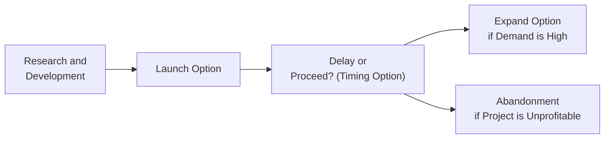

## Overview

Real options provide a powerful way to inject flexibility into classic capital budgeting analysis. A “real” option refers to an option-like feature in a non-financial (or “real”) asset or project—think factories, pharmaceutical research, or new product lines. Traditional net present value (NPV) frameworks assume a static sequence of cash flows: once management sets the course, the project’s fate is determined by the initial decision. Real options challenge this rigidity by treating key managerial decisions (e.g., expand, delay, abandon) as options with a calculable embedded value.

I’ll be honest—when I first encountered real options during a corporate finance role, I was a bit puzzled. We had carefully calculated an NPV for a new manufacturing plant, but the head of operations kept saying, “Hey, can’t we just wait until next year if the market improves?” And, “What if we shut it down if steel prices spike?” As it turned out, those were real options: the right to defer or to abandon. They added genuine economic value that a simple NPV approach often ignored. Real option analysis quantifies that hidden managerial flexibility, enabling more strategic investment decisions.

Below, we’ll explore the main categories of real options—expansion, abandonment, and timing—illustrate their valuation, connect them to option pricing fundamentals, and discuss best practices and pitfalls. We’ll then highlight ways real options questions might appear on your CFA exam. Let’s jump right in.

## Key Concepts of Real Options

### Definition and Background

1. Real Option:  
   A real option is an option-like right, but instead of relating to a financial security like a stock or bond, it relates to a physical, tangible (or intangible but real) project. It might be the right to expand a plant if market conditions are favorable, or the right to abandon a project to avoid further losses. 

2. Managerial Flexibility:  
   Real options capture the notion that management can adapt decisions as new information arrives. This ability to react can significantly alter the project’s risk and return profile.

3. Strategic Value:  
   The “strategic value” embedded in a project often arises when it opens up new possibilities—expanding production lines, tapping new markets, or rolling out advanced research. Traditional NPV might not fully reflect these intangible benefits. Real options aim to formally include them in the valuation.

### Traditional NPV vs. Real Options

Under standard NPV analysis, we discount expected future cash flows by a suitable cost of capital and subtract the upfront investment. However, this static approach overlooks the fact that, in practice, one can often revise decisions midstream. Suppose the initial projection is negative, but we suspect that an external event (like regulatory approval or a competitor exiting the market) might boost our returns a year from now. In a static model, we might prematurely reject the project. This is where real options step in.

Real option valuation acknowledges that uncertainty can be beneficial if you have the flexibility to respond. Sometimes waiting, expanding only if conditions improve, or bailing out if the outlook worsens, can transform an otherwise mediocre NPV into a solidly profitable venture.

## Major Categories of Real Options

### Expansion Option

An expansion option gives the project sponsor the right (but not the obligation) to make an additional follow-up investment if the initial venture succeeds. It’s akin to a call option on the project’s future payoff. Here’s an example:

• Scenario: A tech startup invests in a small pilot facility to produce specialized semiconductors. If demand for those semiconductors surges, the startup has the right to build a larger commercial plant.  
• Real Option Value: The expansion option is valuable because it’s exercised only under favorable market conditions. If, after the pilot phase, market demand is low, the company won’t invest in the expansion. In discounted cash flow terms, this means we pick up only the scenarios where the upside is attractive, and we avoid the downside.

Best used by companies in technology, pharmaceuticals, or any sector where the second-stage investment is cost-effective given a successful pilot.

### Abandonment Option

An abandonment option is practically a put option. It grants the right to exit (sell or shut down) a failing project. You have the choice—but not the obligation—to recoup any salvage value. 

• Scenario: A mining company invests heavily in a new site. If ore prices slump, or if the extracted quality is poor, it can “abandon” the mine to limit its losses.  
• Real Option Value: The capacity to walk away “at will” drastically reduces downside risk. Instead of passively absorbing poor outcomes, you can recoup salvage value or sell assets before losses balloon.

Abandonment options can also arise in technology or manufacturing. For instance, if a newly developed product flops, the company might choose to halt production, salvage some machinery, or pivot the facility toward an alternative use. 

### Timing Option (Delay or Defer Option)

A timing or delay option gives the owner the right to postpone the project’s initiation. Think of it as a European call option on the project, where the strike price is the cost of investment, and the underlying is the project’s future value. 

• Scenario: Suppose your firm’s real estate division is contemplating building a new office tower in an up-and-coming business district. By waiting a year, you might gather more info on local demand and rental rates. If those rates climb, you exercise the option (start construction). If they stagnate or fall, you walk away or wait even longer.  
• Real Option Value: The power to wait until uncertainties resolve can transform negative or uncertain NPVs into more certain payoffs. If things look dire, the investment never proceeds, limiting losses.

## How Real Options Add Value

Real options transform a project from “accept or reject” to “adapt and learn.” Each type of option—expanding, abandoning, and deferring—can shift the project’s payoff distribution by removing some of the downside risk or amplifying upside potential. 

In many capital-intensive industries (energy, chemicals, heavy manufacturing), these embedded flexibilities can amount to millions, even billions, worth of intangible value. 

## Valuation of Real Options

### Linking to Financial Option Pricing

Real options follow the same theoretical principles as financial options (Chapters 4.1 to 4.5 in this volume cover fundamentals of calls and puts). Key parallels:

• Underlying Asset: The project’s expected free cash flows (or net payoff).  
• Exercise Price: The required capital expenditure or salvage cost of the next decision.  
• Volatility: The uncertainty surrounding project cash flows (similar to stock price volatility).  
• Expiration: The timeframe during which the option can be exercised (it might be European- or American-style in concept, though real-world exercise can be more flexible).  

You can deploy the binomial option pricing model or a simplified Black–Scholes–Merton approach (adapted to real parameters) to estimate the value. That said, real options can be trickier: the underlying asset is not traded in a liquid market, so building an appropriate replicating portfolio can be more art than science.

### Binomial Tree Example

Let’s consider a simplified binomial approach:

1. Compute the project’s possible values at the end of a period: V↑ (if conditions are good) and V↓ (if conditions are bad).  
2. If you have an expansion option with expansion cost K, then the payoff if you expand in the good state is (V↑ − K) if positive, or zero (meaning you don’t expand) if negative.  
3. In the bad state, you simply do not expand.  
4. Use a risk-neutral probability p to compute expected payoff, discount back at the risk-free rate.  

In formula terms, if p is the risk-neutral probability, r is the risk-free rate, and T is the time to exercise:

(1)  
Real Option Value = e^(-rT) × [ p × max(V↑ − K, 0) + (1 − p) × 0 ]

While oversimplified, this approach demonstrates how to incorporate real options into project valuation. More sophisticated multi-period trees, Monte Carlo simulations, or scenario analyses are often used in practice.

### Comparing to Traditional NPV

Let’s say you first calculate the project’s standard NPV ignoring the option. You might find it is slightly below zero—suggesting a “reject” decision. Then you factor in the real option (abandonment or expansion) and discover it adds a significant premium. The adjusted project value can turn positive. The difference is the “real option premium.” If that premium is large enough, the project might become viable.

## Real-World Case Studies

1. Pharmaceutical R&D:  
   Labs often face a sequence of “go/no-go” decisions for drug trials. The expansion option is effectively the right to proceed to Phase II or III clinical trials if Phase I is promising. The abandonment option is the right to terminate R&D if Phase I reveals unacceptable side effects.

2. Mining Industry:  
   When commodity prices are high, operators can ramp up production (expand). When prices are low, they might temporarily shut down less profitable mines (some form of partial abandonment). These operational flexibilities represent real options and can vastly improve overall profitability.

3. Oil and Gas:  
   Exploration projects often incorporate both abandonment (if oil reserves prove too small or extraction costs balloon) and timing (waiting for oil prices to rise). 

4. Technology Scaling:  
   A software company releases a minimal viable product (MVP) to gauge market interest. If user adoption takes off, they have the option to expand servers, marketing, and support. If it tanks, they pivot or abandon the product, limiting losses.

In each of these scenarios, the real option approach highlights hidden value that classic cash flow analysis might miss.

## Diagram: Real Option Flow in a Corporate Project

Below is a Mermaid diagram illustrating a typical real option flow in corporate decision-making:

This diagram shows how a single project can branch out into multiple paths, each representing decisions that have option value.

## Implementation Challenges and Pitfalls

1. Estimating Volatility:  
   For financial options, we observe volatility from market data. But for real projects, we often rely on subjective forecasts of future demand or commodity prices. Over- or underestimating project volatility can lead to mispriced real options.

2. Finding a Replicating Portfolio:  
   Real options rely on the concept of replication to price the option in a risk-neutral setting. However, real investments (e.g., new product lines, intangible R&D assets) may not have a straightforward hedge in financial markets. This can complicate real option valuation.

3. Managerial Inertia or Bias:  
   Even if a real option is theoretically valuable, management might be reluctant to abandon a project they’ve championed or may accelerate expansions prematurely due to personal incentives. Behavioral aspects can impair the exercise of real options.

4. Data and Modeling Complexity:  
   Building multi-period binomial trees or Monte Carlo simulations is data-intensive. Large projects with numerous phases (e.g., multi-year power plant developments) require robust scenario planning, which can be time-consuming.

5. Overestimating Strategic Value:  
   Sometimes, executives hype an “option to expand globally” or an “option to pivot,” but the real feasibility or net payoff might be minimal. Overestimating intangible benefits is a common pitfall.

## Strategies to Enhance Real Option Analysis

• Combine Qualitative and Quantitative Methods: Use scenario planning hand-in-hand with real option valuation.  
• Stress Testing: Evaluate how sensitive the real option’s value is to changes in volatility, discount rates, or projected cash flows.  
• Periodic Reassessment: Real option valuations aren’t one-and-done. Reassess your project’s real options as new information arrives (e.g., emerging competition, changing commodity prices, updated R&D data).  
• Consider Synergies with Other Projects: Sometimes, projects have overlapping real options or can share expansions.  

## Best Practices

• Collect High-Quality Data: Make sure you have credible estimates of future demand, salvage values, and operating costs.  
• Involve Cross-Functional Teams: Real option analysis often requires input from finance, engineering, product management, and R&D.  
• Use Simulation Tools: Monte Carlo or decision-tree software can help in modeling multiple future states and potential paths.  
• Document the Option Exercise Criteria: Clearly define the triggers or thresholds (e.g., competitor behavior, regulatory approval) that will prompt you to expand or abandon.  
• Evaluate Managerial Commitment: Make sure the firm truly intends to exercise the option if it becomes optimal. Otherwise, the real option’s theoretical value might go unclaimed.

## Real Options and the CFA Exam

In the CFA® Program (including advanced levels), you may see item sets or constructed-response questions requiring you to:

• Interpret how an expansion or abandonment option modifies a project’s expected payoff.  
• Perform a simplified binomial or risk-neutral scenario to calculate the real option’s value.  
• Distinguish between real option value and standard NPV.  
• Discuss the qualitative factors—managerial bias, data scarcity—that affect practical implementation.

Common pitfalls in exam responses include:

1. Forgetting to discount the payoff at the risk-free rate (or appropriate discount rate) after applying risk-neutral probabilities.  
2. Mixing up expansion cost with salvage value.  
3. Overlooking the possibility that the best use of the real option might be “do nothing.”  
4. Failing to link how real options act as an embedded derivative that reduces risk or enhances return.

Remember, real options often bear broad strategic significance. The exam might ask you to discuss intangible aspects—like brand-building or cross-project synergies—that transform a borderline NPV investment into a strongly justified endeavor.

## Exam Tips: Real Option Approaches

• Identify the Option Type Early: Decide if it’s an option to expand, abandon, or delay (or possibly a combination). Label them as analogous to calls or puts on the underlying project.  
• Separate the Baseline NPV: Always start with a standard NPV ignoring flexibility. Then add real option analysis.  
• Demonstrate the Economic Intuition: Even if your exact computations are approximate, show that you understand how the real option modifies the payoff distribution.  
• Manage Time Wisely: If the question is multi-part, ensure you handle the calculations step by step—especially if you’re given a small binomial tree or specific data points.  
• Watch for Incomplete Information: Some questions test your ability to identify missing variables (e.g., salvage value, volatility estimate). A partial real option question might be used to see if you can highlight what’s needed for a thorough analysis.

## Concluding Thoughts

Real options introduce a flexible, dynamic perspective into capital budgeting, bridging the gap between textbook discounting models and real-world strategic thinking. By thoughtfully valuing the right to expand, abandon, or delay, corporations can unearth hidden pockets of value, mitigate downside risk, and position themselves to capitalize on future opportunities. From my own experience, once you see the difference real options can make, it’s hard to go back to rigid NPV. But do keep an eye on the complexities: missing or biased data, model risk, and human factors can hamper effective real option usage.

Real options are not just a neat theoretical concept; they’re an evolving toolkit for strategic decision-making in industries as diverse as mining, pharmaceuticals, real estate, and tech. The more uncertain and changeable your operating environment, the more valuable your real options become.

## References

• Dixit, Avinash K., and Robert S. Pindyck. “Investment under Uncertainty.” Princeton University Press.  
• Trigeorgis, Lenos. “Real Options in Capital Investment: Models, Strategies, and Applications.” MIT Press.  
• Copeland, Thomas, and Vladimir Antikarov. “Real Options: A Practitioner’s Guide.”  

-------------------------------

## Practice Questions: Real Option Valuation in Corporate Projects



### Which best describes the fundamental difference between real options and traditional capital budgeting?

- [ ] Real options rely on discounting cash flows at the project’s weighted average cost of capital (WACC).  
- [x] Real options explicitly account for the flexibility to alter the project’s direction as conditions change.  
- [ ] Real options always reduce the project’s risk to zero.  
- [ ] Real options eliminate the need for cash flow estimates.  

> **Explanation:** Traditional capital budgeting usually assumes a single path of investment. Real options add explicit value by allowing management to expand, abandon, or delay the project in response to changing circumstances.

### A firm has the right to add another production line if demand for its product doubles over the next two years. This right is best characterized as:

- [ ] A put option.  
- [ ] A timing option.  
- [x] An expansion option.  
- [ ] An abandonment option.  

> **Explanation:** The right to increase production capacity if certain conditions are met mirrors a call option and is typically called an expansion option in real option terminology.

### When pricing a real option using a binomial tree, what underlying asset is usually modeled in place of a stock price?

- [x] The project’s future expected cash flows or terminal value.  
- [ ] The risk-free bond price.  
- [ ] The book value of the firm’s equity.  
- [ ] The salvage value of the project.  

> **Explanation:** The underlying value for a real option corresponds to the project’s future payoffs (cash flows), which mirror the role of a stock price in typical option pricing models.

### In a real option analysis, the exercise price is often parallel to:

- [ ] The number of shares outstanding.  
- [x] The investment outlay required to proceed (or the salvage cost in an abandonment scenario).  
- [ ] The historical cost of the project.  
- [ ] The book value of assets.  

> **Explanation:** In real options, the capital expenditure (or salvage-related cost) plays the role of the option’s strike price.

### Which of the following is a key limitation in valuing real options compared to financial options?

- [ ] They require the computation of risk-neutral probabilities.  
- [ ] They do not exist in real-life scenarios.  
- [ ] They are always undervalued by NPV.  
- [x] They lack tradability, making it difficult to form a replicating portfolio for risk-neutral valuation.  

> **Explanation:** Real options are not generally traded in a liquid market, so there is no straightforward replicating portfolio. This adds complexity to real option valuation relative to standard financial option pricing.

### Which statement about abandonment options is most accurate?

- [ ] They increase the project’s risk profile.  
- [x] They help limit downside losses by allowing an exit if conditions turn poor.  
- [ ] They automatically trigger if losses occur.  
- [ ] They are irrelevant in commodity-related projects.  

> **Explanation:** An abandonment option is essentially a put option on the project, allowing the firm to exit (“sell”) the project if the outcome becomes unfavorable, thereby capping potential losses.

### When implementing a multi-stage real option model, which approach is commonly used to capture complex scenarios?

- [ ] Static NPV modeling using a single discount rate.  
- [x] Multi-period binomial trees or Monte Carlo simulation.  
- [ ] Purely qualitative discussion of management preferences.  
- [ ] Time-series forecasting with no discounting.  

> **Explanation:** Multi-stage investment decisions often require multi-period trees or Monte Carlo simulation so that each stage’s success or failure and associated option exercise can be accurately modeled.

### If a project has a negative baseline NPV but includes a valuable expansion option, how might the real option approach affect the project decision?

- [ ] It is impossible to evaluate a project with negative NPV.  
- [x] The additional value of the expansion option may turn the total project valuation positive.  
- [ ] The expansion option exacerbates the negative NPV.  
- [ ] The negative NPV always outweighs any real option benefits.  

> **Explanation:** Real options can add additional value beyond the baseline calculation. A negative NPV project can become attractive if there’s enough upside potential and embedded flexibility.

### In practice, one major pitfall of real option analysis is:

- [ ] Overly simple computations.  
- [ ] Systematic avoidance of scenario analysis.  
- [x] Inaccurate estimation of volatility or future payoffs.  
- [ ] The inability to model partial abandonments.  

> **Explanation:** Estimating volatility and future payoff distributions accurately can be challenging, which can lead to mispricing or misjudging real options.

### True or False:  
Real options automatically guarantee higher returns for all projects.

- [ ] True  
- [x] False  

> **Explanation:** While real options can improve a project’s risk-return profile by offering managerial flexibility, they are not a guaranteed path to higher returns in every scenario. Poor market conditions, unrealistic assumptions, or mismanagement can negate the benefits.


