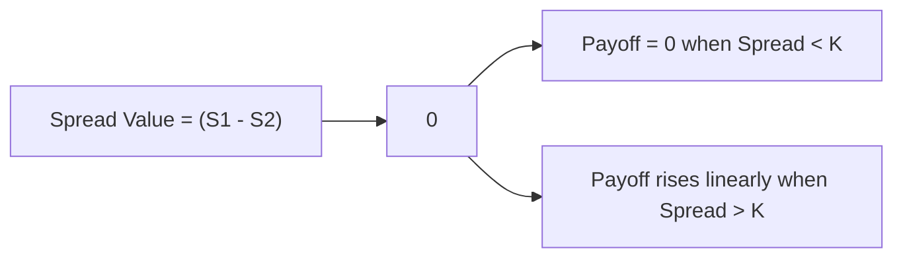

## Overview and Motivation

Well, the first time I ever dealt with a spread option—some time ago, if I recall correctly—I was honestly a bit confused about why you’d want an option on the difference between two prices rather than the price of a single asset. But after a few experiences in the oil and natural gas markets, it all started to click. Spread options let you hedge or speculate on the price relationship between two (or more) assets, helping you tackle those times when the difference matters more than the absolute price level.

In simpler terms, a spread option’s payoff is driven by the difference between two prices, often referred to as leg A and leg B. This difference, or “spread,” fluctuates based on how those two underlying assets move—and crucially, how they move relative to each other. If you’re refining crude oil into gasoline, for example, your profits hinge on the spread between crude input prices and gasoline output prices. So, a spread option can be super handy to manage that risk or take a position on the future direction of that refining margin.

Below, we’ll dive into what spread options on commodity price differences are, how they’re structured, how they’re used, and how they’re valued. We’ll also walk through examples, best practices, challenges, and some real-life stories so that these concepts become second nature by the time you’re done reading.

## Background on Spread Options

A spread option is a contingent claim that depends on the difference \\( X = S_1 - S_2 \\) between two underlying prices \\( S_1 \\) and \\( S_2 \\). You might find spread options in equity markets, bond markets, or commodity markets. However, in commodities, spread options are especially popular. That’s because many commodity businesses operate on a margin (like the “crack spread” in refining) or a two-sided operation (like “crush spread” for soybeans crushed into meal and oil), meaning the relationship between input and output prices drives profitability more than each price in isolation.

### Terminology

• Spread Option: An option whose payoff depends on the difference between two underlying prices or rates.  
• Crack Spread: The difference between refined petroleum product prices (e.g., gasoline or diesel) and crude oil.  
• Crush Spread: The difference between soy meal/oil and the raw soybeans from which they are produced.  
• Inter-Commodity Spread: A spread between different commodities, such as natural gas vs. electricity in power generation.  
• Correlation Risk: Risk arising from uncertain co-movements or correlation between the two underlying assets.

## Common Commodity Spread Options

### Crack Spreads (Oil Refining)

Crack spread options are probably the most famous example in the energy world. Let’s say you’re operating an oil refinery, transforming crude oil into refined fuels like gasoline or diesel. Your profit margin hinges on how refined product prices compare to your cost of raw crude oil. If the difference narrows (crude becomes more expensive relative to finished products), your profit shrinks. If it widens, you stand to benefit.

A crack spread option allows you to lock in or speculate on that margin. You might buy a call spread option if you think the margin will increase (products’ prices will rise or crude prices will fall) or buy a put spread option if you’re worried that margin is going to collapse.

### Crush Spreads (Agricultural)

For those dealing with agricultural commodities, the crush spread refers to the difference between the price of a primary raw commodity, say soybeans, and the products derived from it (soybean oil and soybean meal). A soybean processor’s profit depends on how prices for oil and meal compare to the cost of beans. A spread option on that crush margin can hedge the risk that input costs rise faster than output prices (or vice versa).

### Spark Spreads (Electricity Generation)

Power plants that burn natural gas to produce electricity look at the spark spread: the difference between the market price of electricity and the cost of the natural gas used to generate it. In many markets, electricity prices don’t move in lockstep with natural gas. So, an operator exposed to electricity sales and gas feedstock costs might want a spread option to manage that variability.

### Inter-Commodity Spreads

You might also encounter spread options that reference two related but different commodities. For instance, a shipping company might buy or sell a spread option on marine fuel and diesel. A metals fabricator might look at the spread between iron ore and steel product indices. Ultimately, if the difference between two commodity prices matters to your operations, a spread option might be on the table.

## Payoff Structure

The payoff of a spread call option on two underlying assets \\( S_1 \\) and \\( S_2 \\) with strike \\( K \\) at maturity \\( T \\) is commonly expressed as:

\max\bigl((S_1(T) - S_2(T)) - K, 0 \bigr).

For a spread put option, it’s:

\max\bigl(K - (S_1(T) - S_2(T)), 0 \bigr).

In many real-world cases (like crack spreads), \\( K \\) often equals 0, so the payoff is simply:

\max(S_1(T) - S_2(T), 0)

for a call or

\max(-(S_1(T) - S_2(T)), 0)

for a put—essentially, you’re taking a position on whether the spread will be positive or negative.

## Why Use Spread Options?

### Hedging

Producers, processors, and consumers use spread options to manage the margin between inputs and outputs. If you’re a refiner worried about your profits eroding if crude oil prices shoot up faster than gasoline prices, a spread option that pays if the crack spread narrows can be a lifesaver. Similarly, a soybean crushing facility might want to lock in profits by ensuring the crush margin doesn’t fall below a certain level.

### Speculation

Traders (and sometimes advanced asset managers) who have a view on how two commodity prices will move relative to each other can express that view via spread options. Maybe you think crude is undervalued relative to diesel, or you anticipate electricity prices rising much faster than natural gas. A spread option gives you leverage on that relative movement.

### Arbitrage and Relative Value

When mispricings occur in the market, traders may set up spread trades using spread options to arbitrage price differences between correlated assets. Though opportunities might be fleeting, spread options can capture a structural or short-term divergence in correlated assets.

## Valuation Approaches

Valuing spread options is more complex than valuing single-asset options like standard calls and puts. Because the payoff depends on two underlying asset prices, we generally need a two-factor (or multi-factor) pricing model that captures both:

1. The individual price dynamics of each asset.  
2. The correlation (or covariance) between these assets.

### Black–Scholes Extensions

One concept is an extension of the Black–Scholes–Merton framework into multiple dimensions—often called a “Rainbow Option” approach. We define each asset \\( S_i \\) with its own drift and volatility, then incorporate the correlation coefficient \\( \rho \\) between the two assets.

The multi-variate underlying price process might look like:

dS_1 = \mu_1 S_1 dt + \sigma_1 S_1 dW_1


dS_2 = \mu_2 S_2 dt + \sigma_2 S_2 dW_2

where

dW_1 dW_2 = \rho dt.

Finding a closed-form solution is trickier than with a single asset, though special cases exist.

### Monte Carlo Simulation

In practice, many market participants rely on Monte Carlo methods to value spread options, especially when you need to incorporate time-varying or more complex correlation structures. If you have a model for how \\( S_1 \\) and \\( S_2 \\) evolve jointly (for example, a bivariate lognormal distribution), you can simulate many possible future paths and discount the expected payoff.

A simplified Python snippet for a bivariate simulation approach might look like this (just to show the concept vaguely):

```python
import numpy as np

def simulate_spread_option_payoff(S1_0, S2_0, vol1, vol2, rho, K, r, T, n_sims=100000):
    np.random.seed(42)
    dt = T
    mean = [0, 0]
    cov = [[1, rho],
           [rho, 1]]
    payoffs = []

    for _ in range(n_sims):
        z = np.random.multivariate_normal(mean, cov)
        ST1 = S1_0 * np.exp(( - 0.5 * vol1**2 ) * dt + vol1 * np.sqrt(dt)*z[0])
        ST2 = S2_0 * np.exp(( - 0.5 * vol2**2 ) * dt + vol2 * np.sqrt(dt)*z[1])
        
        payoff = max((ST1 - ST2) - K, 0)
        payoffs.append(payoff)
    
    option_price = np.exp(-r * T) * np.mean(payoffs)
    return option_price

call_spread_value = simulate_spread_option_payoff(S1_0=50, S2_0=48, vol1=0.2, vol2=0.25, rho=0.3, K=0, r=0.02, T=1)
print("Estimated Call Spread Option Value:", call_spread_value)
```

Of course, for an actual production environment, you’d refine the simulation to handle realistic drifts, multi-period rebalancing, forward curves, and possibly incorporate more advanced correlation structures.

### Analytical Approximation Methods

For practitioners dealing with large volumes of trades, real-time pricing can’t rely solely on computationally intense Monte Carlo. So, banks and commodity trading firms sometimes use approximation methods (e.g., Kirk’s approximation) which provide a simpler closed-form estimate for certain spread options. Kirk’s formula is a commonly cited approach when \\( S_2 \\) is not too large relative to \\( S_1 \\).

## Correlation Risk

One of the biggest challenges with spread options is correlation risk. Even if each underlying commodity has a well-defined volatility, your final payoff can be heavily impacted by how those commodities move relative to each other. A correlation shift can significantly alter the spread’s distribution. If the assets become more positively correlated than expected, the spread might narrow or widen in unexpected ways.

Think about a refiner: if gasoline and crude oil become more tightly correlated (both prices moving up and down together), the difference might remain stable. But if that correlation breaks (crude starts rising independently of gasoline), the refiner’s margin can get slammed. That’s exactly the risk being hedged or speculated upon in a spread option.

## Practical Examples and Case Studies

### Refinery Hedging with Crack Spreads

A small local refinery worried about volatile margins might purchase a put spread option on the crack spread, ensuring that if the refining margin (gasoline minus crude) drops below a certain level, it will receive a payout. This can be cheaper than doing a 1:1 hedge on each product because it directly hedges the margin rather than the absolute price level of each commodity.

### Power Generation with Spark Spreads

A natural gas-fired power plant might buy a spread call option that pays off if electricity prices significantly exceed the cost of natural gas. Suppose the power plant has flexible operations and wants to ensure that if electricity soars relative to gas, they can reap the benefit. The correlation between natural gas and electricity can behave in unexpected ways—particularly during sudden weather changes or grid disruptions—so the spread option can be especially valuable.

### Transportation Fuel Spreads

Shipping lines sometimes pay close attention to spreads between different fuels (like marine gasoil and heavy fuel oil). If regulations shift (like the introduction of newer emissions standards), the spread between “cleaner” fuel and “dirtier” fuel can move dramatically. Owning a spread option can help shipping companies manage the cost risk from that differential.

## Best Practices and Pitfalls

• Model Risk: Using an overly simplistic correlation assumption or ignoring the possibility of correlation breakdown can lead to big hedging mistakes.  
• Liquidity: Spread options on certain commodity pairs might be less liquid than single-asset options. A fancy model won’t help if you can’t trade effectively.  
• Strike Selection: Setting the strike at zero is common, but some trades might want a more complex payoff structure. Understand your breakeven spread levels carefully.  
• Market Data: Make sure you’re getting reliable forward curves for each leg of the spread. Misaligned or stale data on one of the legs can create huge mispricing.  
• Operational Complexities: Some spread options might require physical delivery or reference settlement indices. Double-check the settlement procedures to avoid confusion at expiry.

## Diagram: Payoff of a Spread Call vs. Spread Value

Below is a small Mermaid diagram illustrating a simplified payoff of a spread call on the difference (S1 - S2). The horizontal axis is the value of the spread (S1 - S2) at maturity:



In a typical spread call with strike = K, the payoff remains zero when (S1 - S2) < K, and grows linearly beyond that, just like a regular call but with the underlying replaced by the spread.

## Application to Interest Rate Spreads

While we’re focusing mainly on commodities, it’s worth noting that spread options also show up in fixed income—especially for yield spread call and put options when dealing with two different interest rates or bond yields. The logic is the same: you’re taking a position on the difference rather than on the absolute level. In Chapter 5 on credit derivatives, you’ll see that some credit spread instruments have option-like payoffs as well.

## Regulatory and Accounting Perspectives

For commodity-based producers and users, spread options can be designated as hedging instruments under IFRS or US GAAP if they meet certain hedge accounting criteria. Proper documentation, correlation analysis, and effectiveness testing are crucial. Regulators often scrutinize complex hedging strategies involving correlation assumptions. So, it’s wise to keep thorough records of your risk management rationale.

## Final Exam Tips

• Understand the basics first: If you’re still fuzzy on how standard calls and puts work, revisit Section 4.1. Spread options may look similar, but the underlying is “S1 - S2” rather than “S.”  
• Correlation is King: On the CFA exam, they might present a question about how changes in correlation or volatilities affect spread option values. Be ready to reason through the sensitivity.  
• Overlay with Risk Management: Spread options are typically used in conjunction with a firm’s main business, so you might see synergy with operational hedging.  
• Pricing Approaches: Don’t be thrown by advanced formulas. Understand the concept of multi-factor modeling and how Monte Carlo or approximations might be used in practice.  
• Practice with Real Cases: The exam might include a mini-case on refining margins, soybean crush spreads, or electricity generation. The logic is consistent across them all, so practice.

## References

• Eydeland, Alexander, and Krzysztof Wolyniec. “Energy and Power Risk Management.” Wiley.  
• Platts and ICE (Intercontinental Exchange) for real-world market data and examples of spread trades.  
• Official CFA Institute Curriculum, Derivatives Section on Options and Risk Management.  

## Test Your Knowledge: Spread Options on Commodity Price Differences



### Which best describes a crack spread?

- [x] The difference between crude oil and refined product prices.
- [ ] The difference between soybean prices and currency exchange rates.
- [ ] The spread between natural gas and electricity.
- [ ] A correlation factor used in multi-asset option pricing.

> **Explanation:** Crack spreads represent the margin between crude oil (input) and refined petroleum products (output).  

---

### What is the primary reason valuation of spread options can be more complex than single-asset options?

- [ ] They only reference agricultural commodities.
- [ ] They require closed-form solutions only suitable for American-style options.
- [x] They involve modeling correlation between two underlying prices.
- [ ] They must always use Kirk’s formula.

> **Explanation:** Spread option valuation is more complex because the payoff depends on two assets whose correlation must be accurately modeled.  

---

### Consider a spark spread option where electricity (S1) is priced at $60/MWh and natural gas (S2) is $3.50/MMBtu (converted to $35/MWh). How is the spread defined if you assume no strike (K=0)?

- [ ] $3.50
- [ ] $30
- [x] $25
- [ ] $0

> **Explanation:** The spark spread is $60 (electricity) – $35 (gas) = $25.  

---

### A power plant operator uses a spread call option with a zero strike between natural gas input and electricity output. Which choice best describes the payoff at expiration?

- [ ] max(electricity price – gas price – strike, 0)
- [x] max(electricity price – gas price, 0)
- [ ] (electricity price – gas price)
- [ ] max(0, strike – (electricity price – gas price))

> **Explanation:** A spread call with zero strike pays if the difference (electricity – gas) is above 0, so the payoff is max(S1 – S2, 0).  

---

### Which of the following is a key risk factor specifically relevant to spread options (compared to single-asset options)?

- [x] Correlation risk between the two underlying assets.
- [ ] Exchange rate fluctuations between currencies.
- [ ] Risk-free rate changes.
- [x] Market sentiment regarding stock indices.

> **Explanation:** For a spread option, correlation between the assets drives the distribution of the spread.  

---

### Which statement about crack spread options is true?

- [ ] They only exist for natural gas markets.
- [x] They hedge the margin between crude oil and refined products.
- [ ] They are only used by financial speculators.
- [ ] They have zero correlation risk.

> **Explanation:** Crack spread options hedge the refinery margin, i.e., the difference between crude oil input and refined product output prices.  

---

### Why is Monte Carlo simulation often favored for pricing complex spread options?

- [ ] It requires no assumptions on volatility or correlation. 
- [ ] It only works for single-asset derivatives. 
- [x] It can handle multiple stochastic factors and complex correlations more flexibly.
- [ ] It provides a guaranteed closed-form solution.

> **Explanation:** Monte Carlo can incorporate multi-factor models and different correlation structures, making it suitable for complicated spread option pricing.  

---

### Which best describes Kirk’s approximation in spread option valuation?

- [ ] A new IFRS accounting standard for spread options.
- [ ] A method to simulate single-factor models faster.
- [x] A closed-form approximation used for certain spread options.
- [ ] An advanced correlation breakdown test.

> **Explanation:** Kirk’s approximation is a known closed-form formula for approximating the spread option value under certain constraints.  

---

### If correlation between two underlying commodities increases unexpectedly, what might happen to the value of a spread option?

- [x] It may decrease because the spread variability might shrink.
- [ ] It can only increase as correlation rises.
- [ ] It remains unchanged.
- [ ] It forces the strike to be updated.

> **Explanation:** Higher positive correlation can reduce the volatility of the difference (S1 – S2), often lowering the value of spread options.  

---

### True or False: Spread options are only suitable for hedging and have no speculative uses.

- [ ] True
- [x] False

> **Explanation:** Spread options can be used by hedgers (e.g., refiners, power producers) and speculators who have a directional view on the spread between two assets.  


