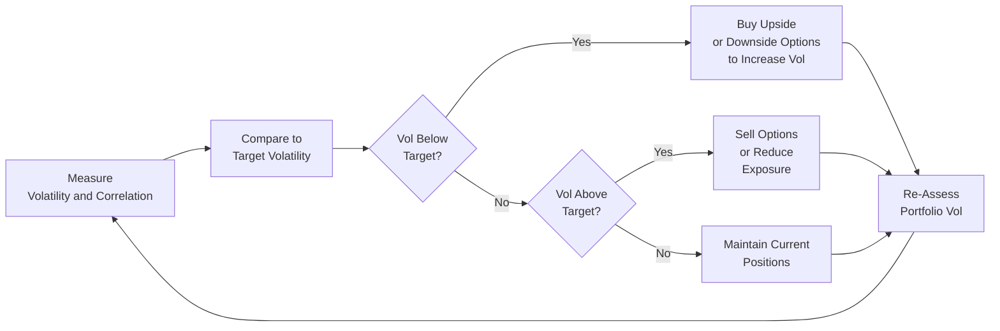
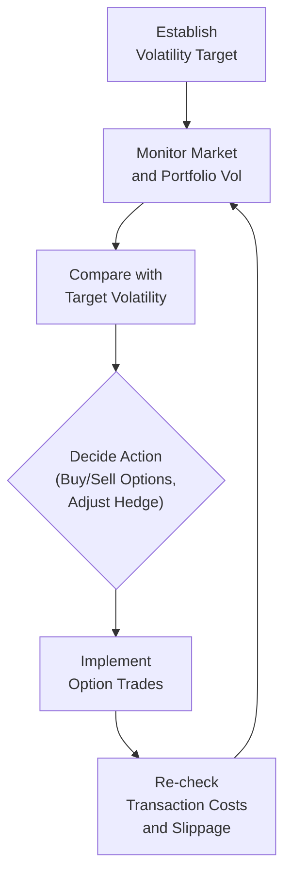

## Overview and Motivation

Volatility targeting has grown tremendously popular among portfolio managers and traders who want to maintain a stable risk profile. Essentially, the idea is simple: you decide on a “target” volatility—for example, 10% annualized—and systematically adjust your positions to keep your portfolio’s actual volatility close to that desired level. This might mean leveraging up in calm markets or de-risking in tumultuous markets.

Options play a big role in such strategies because they allow you to buy or sell volatility in a fairly direct manner. When implied volatility is low (maybe the market is too complacent?), you might consider purchasing long option positions to push your overall portfolio risk back up. On the flip side, if realized volatility spikes above your comfort zone, you might sell premium or close out option exposures to bring your volatility back in line. In short, options form a highly flexible toolkit for controlling the risk profile of your portfolio.

I remember the very first time I tried a volatility-targeting strategy on my own. I was fascinated by the notion that you could systematically dial your exposure up or down—like turning a volume knob—based on how turbulent the market felt. However, it quickly struck me that adjusting positions too frequently could mean high transaction costs, making a thoughtful approach to rebalancing absolutely essential.

In this section, we’ll explore the key considerations of volatility targeting with options, from basic definitions to advanced considerations like skew dynamics and portfolio correlation effects. We’ll look at real-world examples, typical pitfalls, and lessons learned.

## Key Concepts and Definitions

### Volatility Targeting
Volatility targeting is the process of dynamically adjusting portfolio exposures—often by scaling position sizes—to maintain a desired volatility level. In many strategies (such as risk parity portfolios), the main objective is to allocate capital in proportion to risk rather than nominal amounts of money. If volatility is below the target, the portfolio might increase exposure to risk assets. Conversely, if volatility is above target, it reduces exposure.

### Implied vs. Realized Volatility
• Implied Volatility (IV): This is the market’s expectation of how volatile the underlying asset will be over the life of the option. It is extracted from option prices using models such as Black–Scholes–Merton.  
• Realized Volatility: The actual statistical volatility observed in the underlying’s price returns over a given period.  

Volatility-targeting strategies rely heavily on comparing these two. If implied volatility is significantly higher than recent realized volatility, some strategies see it as an opportunity to sell expensive options (which can, ironically, reduce overall portfolio volatility if carefully hedged). On the other hand, if implied volatility is cheap compared to realized volatility, it might be an attractive chance to buy options.

### Variance Swaps
A variance swap allows investors to effectively trade the realized variance of an asset over a specific period. Instead of paying a premium up front like in a standard option, the payoff at expiration is determined by the difference between realized variance and a pre-agreed “strike” variance, multiplied by a notional amount. Variance swaps thus isolate volatility exposure without directly involving the option’s delta or gamma complexities. However, liquidity can be an issue, and pricing them accurately requires advanced knowledge of volatility surfaces.

### Tail-Risk Hedging
Tail-risk hedging strategies protect a portfolio from extreme downside scenarios. Common approaches include buying deep out-of-the-money put options on broad market indexes, or sometimes employing other structural trades like ratio puts. Tail-risk hedging can be integrated within a volatility-targeting framework so that the manager keeps average volatility at a set level but also has “insurance” for rare yet catastrophic market events.

### Risk Parity
In a risk-parity approach, you seek to balance the contribution to overall risk from each asset class. For instance, if you decide all asset classes should contribute equal amounts of volatility to the portfolio, you might leverage up certain “lower-volatility” asset classes (e.g., government bonds) while holding smaller positions in “higher-volatility” ones (e.g., equities). Options can be a tool for fine-tuning these exposures or ensuring that total volatility does not climb too high, especially in a crisis.

## Where Options Fit Into Volatility Targeting

Options are special because their payoff structure includes non-linear risk profiles. Compared to linear instruments like futures or swaps, options allow you to go long or short volatility in a direct, gamma-sensitive manner. Here are some ways practitioners integrate options into volatility-targeting strategies:

• Buying Calls or Puts to Increase Volatility Exposure. Let’s say a fund notices that overall realized volatility for the past month has been lower than anticipated. If the manager wants to stay around 10% vol but the portfolio is only humming at 7%, they might buy calls or puts to increase the portfolio’s gamma and vega.  

• Writing Options to Decrease Volatility Exposure. If the market is getting rowdy and realized volatility surges above target, a manager might reduce volatility exposure by writing calls or puts, collecting premium and effectively “selling” volatility, so the overall portfolio has a more stable profile.

• Rotating Between Option Strategies. Volatility-targeting strategies can involve rotating between straddles, strangles, or spreads. For instance, if implied volatility is cheap but you expect a directional move, you might favor a call spread or put spread. If you expect a big jump in realized volatility but don’t have a strong directional bias, you might choose a straddle (long call + long put).

## Mechanisms of Volatility Control

### 1. Position Sizing and Rebalancing
Most volatility-targeting strategies revolve around adjusting the size of existing positions. Typically, if your portfolio’s volatility is running below the target, you increase the nominal size of your positions—sometimes that means buying more underlying, or perhaps buying more calls and puts. If your volatility is running too high, you scale down your size.

Unfortunately, you can’t do these adjustments too often without incurring major transaction costs or slippage. It’s a dilemma: you want to keep your portfolio on target, but you also don’t want to churn your positions. A common solution is to schedule rebalancing at fixed intervals (e.g., monthly or quarterly), or only rebalance after volatility deviates from its target by a certain threshold (like plus or minus 2%).

### 2. Monitoring the Implied Volatility Surface
Because volatility changes with strikes and maturities, managers watch the implied volatility surface to see if certain strikes become overpriced or underpriced. A “volatility smile” or “volatility skew” can indicate that out-of-the-money puts are trading at much higher implied volatilities relative to at-the-money options, often reflecting market fears. By systematically analyzing these surfaces, you can develop rules (like “buy out-of-the-money puts if skew steepness is below historical averages”) or something along those lines to keep your hedge cost more consistent.

### 3. Adjusting Delta Hedging Frequency
When implementing an options overlay, you also need to consider delta hedging frequency. If you’re long gamma (e.g., through a net long option position), you might get to “buy low and sell high” as volatility materializes. The more frequently you rebalance your hedge, the more you can capture the realized volatility, although at higher trading costs. Many managers run a dynamic hedging engine that tries to specify a threshold for re-hedging (maybe every time the underlying moves by 1.0% from the last hedge).

### 4. Use of Protective / Cash Secured Puts
If you want to keep the portfolio’s risk in check but also benefit from equity upside, you might choose a protective put structure. For example, you hold a broad equity index plus a long put option. This positions you to trim overall volatility because the put absorbs severe downside. If the market is stable or rising, realized volatility might be below your target, so you can even dynamically sell some of that put premium (or perhaps shift to a put spread) to bring your risk up. This toggling can maintain your portfolio near a designated vol level.

## Practical Implementation Example

Let’s imagine a small CTA (Commodity Trading Advisor) fund named MapleTree Capital, which has decided to adopt a 12% annualized volatility target. The fund invests in a basket of global equity futures, bond futures, gold, and oil. Over time, MapleTree runs daily measurements of realized volatility and notices that risk has fallen to around 8%—too low for their tastes. The manager decides to:

1. Buy straddles on a broad equity index (assuming these straddles aren’t too expensive based on implied–realized volatility comparisons). This introduces more gamma and vega into the portfolio.
2. Reduce short volatility positions they had sold earlier (e.g., short puts on oil) because that position had been dampening overall volatility.  
3. Monitor the correlation across assets. If correlations remain low, the resulting portfolio might still not reach 12% vol, so they might add additional exposures or buy call options on gold—a typical “safe-haven” asset that can add diversification.

Alternatively, if MapleTree sees realized volatility spike to 15% or 16%, they might implement the reverse:

1. Sell calls or puts to collect premium, effectively shorting volatility. This makes the portfolio less sensitive to sudden price swings.  
2. Possibly close or roll long option strategies that have become ‘in the money’ and are now adding more volatility than desired.  
3. Check correlation movements, because if everything starts moving in lockstep, they might cut the overall position sizes across the board.

## Benefits and Drawbacks

### Benefits
• Smooth Risk Profile: Volatility targeting aims to reduce big drawdowns during times of market stress, helping managers “stay in the game.”  
• Potentially Improved Sharpe Ratios: By maintaining consistent volatility, you can sometimes produce steadier returns with lower tail risk.  
• Flexibility: Options let you fine-tune exposures in ways that linear instruments can’t. Normally, to ramp up risk, you might borrow or buy more futures, but with options, you can do so in a more optionality-driven manner.

### Drawbacks
• Transaction Costs: Buying and selling premiums and constant rebalancing can erode profits if not carefully planned.  
• Model Risk: You rely on estimates of volatility (both implied and realized), correlation, and so forth. If your model assumptions are wrong, your strategy might produce suboptimal results.  
• Skew and Smile Effects: Implied vol can differ across strikes, so your trades might not pan out as you expect if the market environment changes or if the implied volatility surface shifts dramatically.  
• Left-Tail Vulnerability: Although tail-risk hedging is a subset of volatility management, naive volatility-targeting approaches might inadvertently sell too much volatility if they rely purely on short vol strategies. This can be disastrous if markets gap down.

## Correlation and Cross-Asset Considerations

When implementing volatility targeting in a multi-asset portfolio, you need to measure not just the volatility of a single asset but the entire portfolio’s volatility. That includes how different assets move relative to one another. If all your assets are strongly correlated (like during a market crisis), your portfolio volatility can spike well above the target—no matter what each individual position’s volatility is. This is one key reason advanced volatility-targeting strategies incorporate dynamic correlation estimates. 

Below is a simple flow diagram illustrating the interplay between correlation, volatility targets, and option strategies:

In other words, the manager measures daily or weekly realized volatility and correlation. Then, if volatility is too low, the manager might buy more optionality. If volatility is too high, the manager might scale back or sell optionality. The manager re-assesses continuously and repeats.

## Skew Patterns and Their Impact

Volatility skew refers to the shape of implied volatility across different strikes. A steep skew often indicates deep out-of-the-money puts trading at significantly higher implied vol. This is common in equity markets, as investors fear downside more than upside. If you are a volatility targeter, you might see undervalued upside calls or ironically cheap out-of-the-money straddles as opportunities when the skew is particularly steep. But it’s a tricky dance: you can’t just average historical skew levels and assume it will quietly revert to mean. News events, macroeconomic data, or even a single large hedge fund’s activity can move the skew significantly.

## Frequent Adjustments: A Double-Edged Sword

A big question is “How often do I adjust my option positions to maintain my volatility target?” On one hand, frequent adjustments tighten the tracking of realized volatility to your target. On the other hand, you’ll likely incur:

1. **Bid–Ask Spreads**: Wider spreads can add up, especially in less liquid option markets (e.g., certain commodity options, single-stock options on mid-cap names).  
2. **Slippage**: The market might move between the time you decide to transact and the time your trade is executed.  
3. **Opportunity Cost**: If your model for volatility is slightly lagging reality—a big risk if you’re using historical data—frequent adjustments might cause you to buy high and sell low in terms of implied vol.

An alternative is to follow a threshold-based approach where you only rebalance if your realized volatility estimate deviates from the target by, say, ±2%. This approach can reduce costs but might cause your portfolio volatility to drift for short periods.

## Combining Volatility Targeting with Tail-Risk Hedging

Tail-risk hedging fits well with volatility targeting. You can create a structure that typically targets a moderate volatility level (say, 10%) but also holds periodic out-of-the-money puts that pay off in a crisis. The downside to tail-risk hedging is the insurance cost—how do you finance it if you’re just targeting vol?

Some managers pair periodic put purchases with partial premium financing, such as:
- Selling out-of-the-money calls to offset the cost of puts (i.e., a collar strategy).  
- Selling shorter tenor options when implied volatility is high, expecting reversion.  

One must be mindful of the fact that these “cost-offset” strategies can add correlation risk if the underlying moves a lot in unexpected ways.

## Real-World Anecdote

I worked with a portfolio manager who insisted on adjusting his volatility target daily, almost on autopilot. He was absolutely determined to maintain an 8% risk level, no matter the environment. But guess what: in a single quarter, the fund racked up almost as much in transaction costs as it saved from risk management. The moral of the story is that while volatility targeting is conceptually sound, the operational details and friction costs matter immensely.

## Monitoring Performance Over Time

Some managers use rolling windows of realized volatility to measure performance. For example, they might look at 20-day realized volatility. If it’s significantly below or above the 20-day average target, they adjust. Others prefer intraday data. No matter the approach, it’s wise to keep a record not just of performance but also of how actual volatility tracked the target. Some software providers and prime brokers now offer daily “realized tracking error to target volatility,” which can be enlightening for diagnosing how well your strategy is working.

You might also incorporate drawdown analysis, ensuring that even if you target a moderate volatility, you have robust defenses in place for black swans. Stress testing with hypothetical large market shocks ensures that your “stable volatility” approach doesn’t break down at the worst possible time.

## Portfolio Margining Considerations

When dealing with options in a volatility-targeted portfolio, it is crucial to note how your clearinghouse or broker calculates margins. Some portfolio margining systems might allow you to offset margin requirements if your option positions are a partial hedge for your existing holdings. This can be a double-edged sword: on one hand, it can free up capital; on the other, it might understate the actual risk if correlations jump in a market crisis.

## Regulatory Perspective

In the wake of market upheavals, regulators often pay close attention to how leveraged strategies, such as those used in some volatility-targeting funds, might exacerbate market moves. For example, if many volatility-targeting funds and risk parity shops all decide to “de-risk” at the same time, it can amplify price declines. Recent regulatory guidance encourages risk managers to keep an eye on potential liquidity crunches and consider stress testing to demonstrate resilience.

## Diagram: Volatility Targeting at a Glance

Below is a simplified diagram that shows the basic building blocks of a volatility-targeting strategy using options. It is a cyclical process: measure volatility, compare to target, and then deploy or unwind options as needed.

## Best Practices and Pitfalls

• **Best Practices**  
  - Use robust models for volatility forecasts, including implied, historical realized, or combined measures.  
  - Establish rebalancing thresholds (e.g., ±2%) rather than frequent daily adjustments.  
  - Look at correlation effects; it’s not enough to just monitor isolated volatility of each asset.  
  - Keep an eye on liquidity conditions—especially in your chosen option markets. Thin liquidity can eat into performance or hamper your ability to adjust quickly.

• **Common Pitfalls**  
  - Ignoring transaction costs until they become too large.  
  - Over-reliance on simplistic volatility forecasts without considering regime changes (e.g., from calm markets to crisis).  
  - Mistimed scaling. If you wait too long to adjust your position, you might buy high and sell low in terms of implied volatility.  
  - Overconfidence in normal distribution assumptions. Remember, real markets frequently have fat tails.

## Conclusion and Exam Tips

As you head toward more advanced derivative strategies, keep in mind that volatility targeting is not a silver bullet. It’s a disciplined approach that tries to maintain a stable level of risk over time—but it can come undone if you don’t pay attention to transaction costs, correlation spikes, and the corners of implied volatility surfaces. From a CFA exam perspective, it’s helpful to:

• Demonstrate knowledge of how (and why) managers use options for volatility control.  
• Be ready to identify the differences between realized and implied volatility and how that affects an option’s relative value.  
• Show that you understand how frequently rebalancing or adjusting your exposure can affect returns.  
• Consider the interplay of liquidity, correlation, skew, and regulatory constraints as potential exam question angles.  

On the constructed-response portion of the exam, be prepared to explain the rationale behind buying or selling particular options in order to shift portfolio volatility or to hedge tail risk. For item-set questions, you might have to calculate how an options overlay changes the overall risk profile of a portfolio. Make sure you can interpret implied volatility levels and the cost implications.

Overall, volatility-targeting strategies using options combine engineering-like precision with an artful sense of market conditions. While it’s systematic, you’ll find a lot of interpretive decisions about when to trade, which strikes to target, and how best to fund your positions. Keeping your eyes on the big picture—especially how the strategy behaves in real-life markets—will give you a strong footing for both the exam and beyond.

## References

- Andersen, Torben G., Tim Bollerslev, and Francis X. Diebold. “Parametric and Nonparametric Volatility Measurement.”  
- AQR Capital Management. Various research papers on risk parity and volatility targeting.  
- Equity Derivatives, Risk Management Publications from major primes/brokerages.  
- CFA Institute. Official Curriculum Materials on Derivatives, Risk Management, and Advanced Option Strategies.

--------------------------------------------------------------------------------

## Volatility Targeting With Options: Practice Questions



### Which statement best describes the purpose of volatility targeting?

- [x] To maintain portfolio volatility near or at a chosen level using strategies such as scaling positions.
- [ ] To eliminate all market risk via perfect hedging of all assets.
- [ ] To track the VIX as closely as possible through real-time delta-hedging.
- [ ] To maximize the gamma exposure of the portfolio at all times.

> **Explanation:** Volatility targeting ensures a systematic strategy keeps the portfolio’s actual volatility at or near a desired level. It does not eliminate all risk, nor does it necessarily track the VIX specifically.  

### A manager notices realized volatility has dropped below the target in a multi-asset portfolio. Which action might the manager take?

- [ ] Close out all outstanding long option positions.
- [x] Buy option premium (e.g., calls, puts, or straddles) to increase volatility exposure.
- [ ] Increase correlation across assets by buying correlated assets.
- [ ] Switch the entire portfolio to short volatility positions.

> **Explanation:** If volatility is below target, the manager may seek to increase volatility exposure by being net long options (buying premium). Selling options would reduce volatility exposure.  

### What is one reason for using a threshold-based rebalancing approach instead of daily rebalancing?

- [ ] To ensure the portfolio always has positive gamma exposure.
- [ ] To align with regulatory requirements on option trading.
- [ ] To maintain perfect correlation readings among assets.
- [x] To reduce transaction costs and avoid excessive trading.

> **Explanation:** Threshold-based rebalancing (e.g., only rebalance if realized volatility deviates from target by ±2%) can reduce trading frequency and costs.  

### In a tail-risk hedging context, how might out-of-the-money put options be used within a volatility-targeting strategy?

- [ ] They are rarely used, as puts automatically increase portfolio volatility permanently.
- [ ] They minimize gamma exposure but boost correlation risk.
- [ ] They only protect against small downward moves, not tail events.
- [x] They provide downside protection if severe market moves occur, helping manage extreme risks.

> **Explanation:** Out-of-the-money puts act like insurance against a sharp market drop, mitigating tail-risk in a volatility-targeted portfolio.  

### Which of the following best describes the relationship between realized and implied volatility in the context of volatility-targeting strategies?

- [ ] The manager only monitors realized volatility; implied volatility is irrelevant.
- [x] If implied volatility is significantly lower than realized, buying options may be attractive.
- [ ] If realized volatility is higher than implied, the manager must close all positions.
- [ ] Implied volatility is always identical to realized volatility, so no action is needed.

> **Explanation:** A manager looks for discrepancies between implied vs. realized. When implied is lower than realized, options can be seen as “cheap,” and vice versa.  

### Why can frequent adjustments in a volatility-targeting strategy be problematic?

- [ ] It typically eliminates the use of short positions.
- [x] Higher transaction costs may erode returns.
- [ ] It ensures zero correlation among underlying assets.
- [ ] There is no reason to be concerned about frequent adjustments.

> **Explanation:** Too many trades can rack up commissions, bid–ask spreads, and slippage, undermining the benefits of volatility targeting.  

### What is a major consequence if several large, volatility-targeting funds de-risk at the same time?

- [ ] They will reduce total market liquidity, but only in commodity markets.
- [ ] They will lock in profits automatically due to correlation gains.
- [x] They could exacerbate market declines through coordinated selling.
- [ ] They ensure volatility always stays below 5%.

> **Explanation:** If many market participants simultaneously sell risky assets to lower volatility, the move can magnify price declines and possibly spur a broader sell-off.  

### Which of the following is a common pitfall of volatility-targeting strategies?

- [ ] Excess of free risk hedges.
- [x] Over-reliance on simplistic models that fail in regime shifts.
- [ ] Permanent elimination of tail risks.
- [ ] Guarantees no correlation changes in a crisis.

> **Explanation:** Many volatility-targeting models use historical-based or simplistic volatility measures. Market regimes can shift abruptly in a crisis, rendering such models inaccurate.  

### A manager is concerned about the cost of maintaining purchased options. Which approach might help offset premium costs?

- [ ] Buying more out-of-the-money options to amplify volatility exposure.
- [ ] Closing all positions after a single day.
- [x] Implementing call spreads or put spreads to collect some premium.
- [ ] Forcibly ignoring correlation among assets.

> **Explanation:** Vertical spreads, like call spreads or put spreads, can reduce upfront premium outlay by selling one option to partially offset the costs of the other.  

### True or False: Volatility-targeting portfolios always experience lower drawdowns than portfolios without volatility targeting.

- [x] True
- [ ] False

> **Explanation:** Typically, volatility-targeting strategies aim to keep drawdowns in check by consistently adjusting exposures. While not a guarantee in every market regime, it is generally accepted that these strategies can help limit severe drawdowns relative to unmanaged exposures.  


