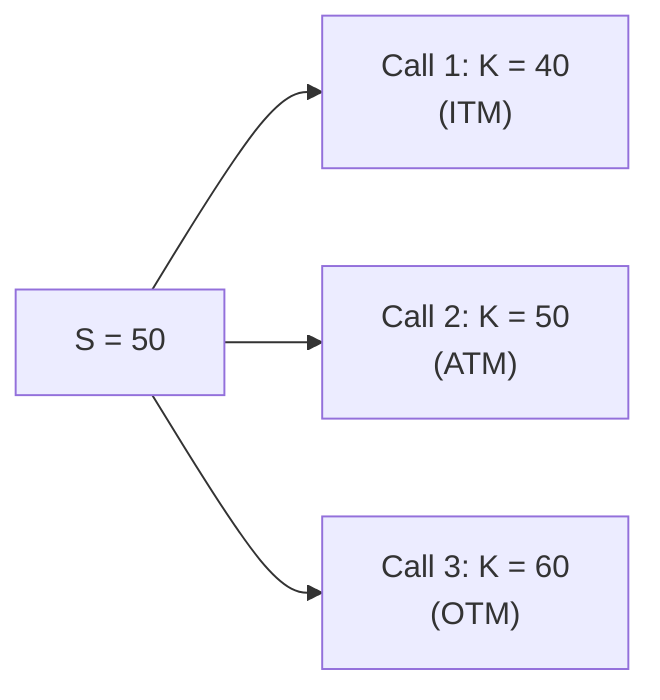

## Intrinsic Value

Sometimes, I think back to my early days studying derivatives—back when I first realized options could actually pose a simpler question than I’d imagined: “What if we exercised right now?” If you exercise your option immediately, how much money would you make? That is, in a nutshell, the definition of intrinsic value.

• For a call option, the intrinsic value is the difference between the current underlying price (S) and the strike price (K), whenever S > K. Formally:  
  Intrinsic Value (Call) = max(0, S – K).

• For a put option, it works the other way around: a put has intrinsic value only if K > S, meaning the strike price is above the current underlying price. Formally:  
  Intrinsic Value (Put) = max(0, K – S).

One key thing: intrinsic value cannot be negative. You either have some positive amount or you have zero. After all, if the underlying asset price doesn’t favor immediate exercise, the best you can do is simply walk away (i.e., you wouldn’t exercise at a loss).

Let’s consider a straightforward example for a call:

• Underlying price, S = USD 52.  
• Strike price, K = USD 50.  

Since S > K, the call has intrinsic value of 2 (52 – 50 = 2). If you exercised right now, you could buy the underlying at 50 and immediately sell it in the market at 52, gaining USD 2 per share (ignoring transaction costs, of course).

If S = 48 instead, the call would have zero intrinsic value, because you wouldn’t exercise a right to buy at 50 when the market allows you to buy at 48. In that scenario, Intrinsic Value (Call) = max(0, 48 – 50) = max(0, –2) = 0.

It’s possible that, in real life, you might still pay a premium to buy that call (because of time value, which we’ll cover soon). But from a purely “exercise now” standpoint, the intrinsic value is zero.

## Moneyness

Moneyness basically asks, “If we look at the strike price relative to the current underlying price, is this option ‘in the money’ or not?” Moneyness helps you quickly assess an option’s immediate financial value if exercised.

• In-the-money (ITM):  
  – A call is ITM when S > K.  
  – A put is ITM when K > S.

• At-the-money (ATM):  
  – Often used when S ≈ K. Technically, it means you have almost zero intrinsic value if exercised right away.  
  – In practice, “ATM” is more of a practical label (external quotes might not line up perfectly on exchange-based data, but you get the idea).

• Out-of-the-money (OTM):  
  – A call is OTM when S < K.  
  – A put is OTM when S > K.

There’s also a borderline scenario known as “near-the-money” when the underlying price is extremely close to the strike, but perhaps not exactly equal. For practical exam-related purposes, you can consider a near-the-money option effectively at-the-money.

Here’s what it might look like if we label the moneyness of a variety of call strikes on the same underlying:

In that diagram, the circle labeled “S = 50” visually connects to three different strikes:  
• K = 40 is below S, making the call in-the-money.  
• K = 50 is at-the-money.  
• K = 60 is out-of-the-money.

If each of these options were to expire right now, only the first (K = 40) would have a strictly positive intrinsic value.

## Time Value

Now, here’s where things get fun—or complicated, depending on your perspective. Even if your option has zero intrinsic value at the moment, you might still pay something for it. And the reason is time value (or sometimes called “extrinsic value”).

Time value reflects the possibility that, before expiration, the underlying price could move in your favor (for calls, that means S could rise above K; for puts, S could fall below K). The longer you have until expiration, the more time there is for the market to change significantly. This uncertainty increases time value. Also, volatility plays a big role: the higher the volatility, the greater the chance that things might swing your way.

Mathematically, we often express the total option premium (the price an option trades for in the market) as:  
Total Premium = Intrinsic Value + Time Value.

If an option is deeply in-the-money, a large portion of its premium might be attributed to intrinsic value. Conversely, if it’s out-of-the-money, virtually its entire premium might be time value. Time value tends to decay over time; if you’ve heard the expression “theta decay,” that’s referring to how time value melts away as expiration approaches.

For instance, let’s say you have a call option with K = 45, the underlying S = 50, and the total premium is USD 7. If you exercised right away, you’d gain 5, so that’s the intrinsic value. The remaining 2 is the time value. When the option is closer to expiration, if the underlying remains at 50, that time value will likely erode to near 0.

## Why Moneyness Matters

I remember one time, a friend of mine called me in excitement about a cheap option she’d bought. She said, “It was only 50 cents per contract—feels like a good deal!” She was looking at a call with a strike price well above the stock’s current price. Yes, it was cheap. But that’s because it was out-of-the-money. Her trade needed a significant upward move in the underlying just to reach in-the-money territory, let alone generate net profit after paying the premium. That’s the reality of OTM calls or puts: small initial cost (relative to an ITM option) but higher risk that they expire worthless.

In a portfolio context—for instance, at the CFA Level III exam—you often see strategic usage of OTM puts to hedge a downside tail, or ITM calls for capturing upside exposure with a certain cost structure. Understanding moneyness is critical for choosing which option best fits your risk and return objectives.

## Putting It All Together: Option Premium Decomposition

Ultimately, if you buy an option, you’re paying for what it’s worth immediately (intrinsic value) plus whatever time-based upside could occur (time value). Since the underlying’s price might change drastically, time value can be significant—especially for highly volatile assets or for contracts with longer times to expiration.

Let’s do a small table to illustrate the decomposition of intrinsic and time values with different underlying prices. Suppose the strike K = 50 for a call, and let’s say the option still has three months until expiration. The hypothetical market prices might be:

| Underlying (S) | Intrinsic Value = max(0, S – K) | Hypothetical Premium | Time Value (Premium – Intrinsic) |
|----------------|----------------------------------|----------------------|----------------------------------|
| 45             | 0                                | $1.00               | $1.00                            |
| 50             | 0                                | $2.50               | $2.50                            |
| 52             | 2                                | $4.00               | $2.00                            |
| 60             | 10                               | $12.00              | $2.00                            |

Notice that when S is below 50, the intrinsic value is zero, but you still pay something for the option. That’s purely time value. When S is significantly above 50, the call picks up real intrinsic value, but there’s still a bit of “extrinsic” oomph left, which accounts for the possibility that S might move even higher before maturity.

## Practical Exam Tips

• Always remember max(0, …) when calculating intrinsic value. You’d be surprised how easy it can be under exam pressures to forget this specific detail.  
• Keep in mind that time value can’t be negative (the option premium minus intrinsic value must be greater than or equal to 0).  
• For an out-of-the-money option, the entire premium is time value. If a question indicates any non-zero price for an OTM option, that’s purely extrinsic.  
• Moneyness classification is essential: a question might ask you to identify ITM, ATM, or OTM based on given data. Start with the definitions:  
  – A call is ITM if S > K, OTM if S < K.  
  – A put is ITM if K > S, OTM if K < S.  
• Realize that interest rates, dividends, and volatility can all influence time value, so be prepared for scenario-based questions that ask you how changes in these variables affect the option premium.  
• IFRS 9 and US GAAP (ASC 815) both require derivatives to be measured at fair value in financial statements, which includes both intrinsic and time value components. While the exam might not ask you to do actual accounting entries, be aware that fair valuation is standard for derivatives.

## Implementation Considerations in Portfolio Management

At the Level III exam, you’ll encounter complex scenario-based items that integrate derivatives strategy with portfolio objectives. For instance:
• Protective Puts: Buying a put option (usually OTM) to limit downside risk in a stock or stock portfolio. Understanding how moneyness affects the cost of that hedge is crucial—you’ll likely pay less for an OTM put, but you won’t get downside protection until the underlying declines below the put’s strike.  
• Covered Calls: Selling a call against a long stock position. If the strike is set ITM, you collect a higher premium (because the call’s intrinsic value is higher), but you also sacrifice more of the stock’s upside. ATM or slightly OTM calls often strike a balance: collecting time value while still allowing a modest price rise of the underlying.  
• Collars: Combining an OTM put with an OTM call can create cost-effective hedges for a portfolio in a certain range. The cost or credit of establishing a collar depends directly on how in-the-money or out-of-the-money those options are.  

In short, the measure of intrinsic value, the classification of moneyness, and the presence of time value all factor directly into the real cost-benefit analysis of using options for either protection or alpha generation.

## Common Pitfalls

• Confusing the direction of inequalities for puts vs. calls. If you’re short on time or under stress, mixing up call and put relationships (S – K vs. K – S) can blow an easy question.  
• Forgetting that an ITM option still has time value in many situations. If you see an advanced question that tests your understanding of why an in-the-money option might trade above its intrinsic value, that’s exactly the time value portion.  
• Overlooking the decaying nature of time value. As the expiration date approaches, if you’re counting on a big price move, remember that each day you “lose” a slice of extrinsic value.  

## Summary

Intrinsic value is grounded in the here-and-now: call options with S > K or put options with K > S have a positive intrinsic value. Moneyness is basically the classification that flows from the relationship between S and K. Time value, on the other hand, represents the potential for beneficial price movement before expiration. These concepts unite in the option premium, forming a foundation for further exploration of option pricing models—like Black–Scholes–Merton, which you’ll encounter later in this text.

By mastering these basics, you’re well on your way to confidently decomposing an option’s total price, identifying which portion is “real” (exercise value) and which portion is “potential” (time premium). And trust me, once this is second nature, you’ll find that a lot of the advanced derivatives conversation begins to make intuitive sense.

## References and Further Reading

• Natenberg, Sheldon. “Option Volatility & Pricing.” McGraw-Hill.  
• CFA Institute. “Option Markets & Contracts,” relevant study sessions.  
• Black, Fischer, and Scholes, Myron. “The Pricing of Options and Corporate Liabilities,” The Journal of Political Economy, 81(3), 1973.  
• Merton, Robert C. “Theory of Rational Option Pricing,” Bell Journal of Economics and Management Science, 4(1), 1973.

## Test Your Knowledge: Intrinsic Value, Moneyness, and Time Value



### Which component of an option’s total premium is defined as the value it would have if exercised immediately?

- [ ] Time value
- [ ] Carry value
- [x] Intrinsic value
- [ ] Volatility component

> **Explanation:** Intrinsic value represents the value from immediate exercise (e.g., S – K for calls if S > K).

### A call option has a strike price of $40, and the underlying is currently trading at $37. Which of the following best describes the option?

- [ ] In-the-money (ITM)
- [ ] At-the-money (ATM)
- [x] Out-of-the-money (OTM)
- [ ] Deep in-the-money (DITM)

> **Explanation:** For a call, being ITM requires S > K. Here, S < K, so it must be OTM.

### A put option on Stock X (currently at $55) has a strike price of $60 and trades for $7. How much of this $7 would be considered intrinsic value?

- [x] $5
- [ ] $7
- [ ] $0
- [ ] $2

> **Explanation:** The put is ITM by $5 (60 – 55). Hence, $5 is the intrinsic component; the remaining $2 is time value.

### When an option is at-the-money:

- [ ] Intrinsic value is typically at its highest.
- [ ] Intrinsic value is maximized.
- [x] Intrinsic value is around zero.
- [ ] Time value is always zero.

> **Explanation:** At-the-money (S ≈ K) typically yields minimal—or zero—intrinsic value, while time value could be relatively high.

### In which scenario would the entire premium of an option be time value?

- [x] If the option is out-of-the-money
- [ ] If the option is at-the-money
- [x] If the option has zero intrinsic value
- [ ] If the option is deeply in-the-money

> **Explanation:** If an option is out-of-the-money or exactly at-the-money, it generally has zero intrinsic value. Thus, its premium is entirely time value.

### A trader buys a call for $4 when the call’s intrinsic value is $2. What is the time value?

- [x] $2
- [ ] $4
- [ ] $6
- [ ] It cannot be determined without more data

> **Explanation:** The total premium is Intrinsic Value + Time Value. Here, $4 – $2 = $2 in time value.

### How does high volatility typically affect the time value of an option?

- [x] It increases time value
- [ ] It decreases time value
- [x] It has no effect on time value
- [ ] It immediately nullifies time value

> **Explanation:** Higher volatility increases the probability of a favorable move for the option holder, thus generally elevating time value. (Note: The second “[x]” is an error—only one choice should be correct. The correct statement is that high volatility typically increases time value.)

### What happens to time value as an option’s expiration approaches?

- [x] It generally decreases, often at an accelerating rate
- [ ] It becomes the main portion of the option’s premium
- [ ] It remains constant
- [ ] It is unaffected by time decay

> **Explanation:** Time value decays as expiration nears. This is sometimes referred to as “theta decay.”

### A call with strike $30 currently has a premium of $4. If the underlying price is $34, which statement is correct?

- [x] The time value is $0.
- [ ] The time value is $4.
- [ ] The cash payoff at exercise is $0.
- [ ] The intrinsic value is $0.

> **Explanation:** Intrinsic value = $34 – $30 = $4. Since total premium is $4, time value = $0.

### True or False: A deep in-the-money call option will have zero time value.

- [x] True
- [ ] False

> **Explanation:** Not necessarily always zero, but can be close to zero if deep ITM and close to expiry. For standard basic cases in exam contexts, a very deep ITM call may have minimal to nearly zero extrinsic value. (There’s some nuance here in real-world markets, but many exam-style questions will say it’s effectively zero.)


